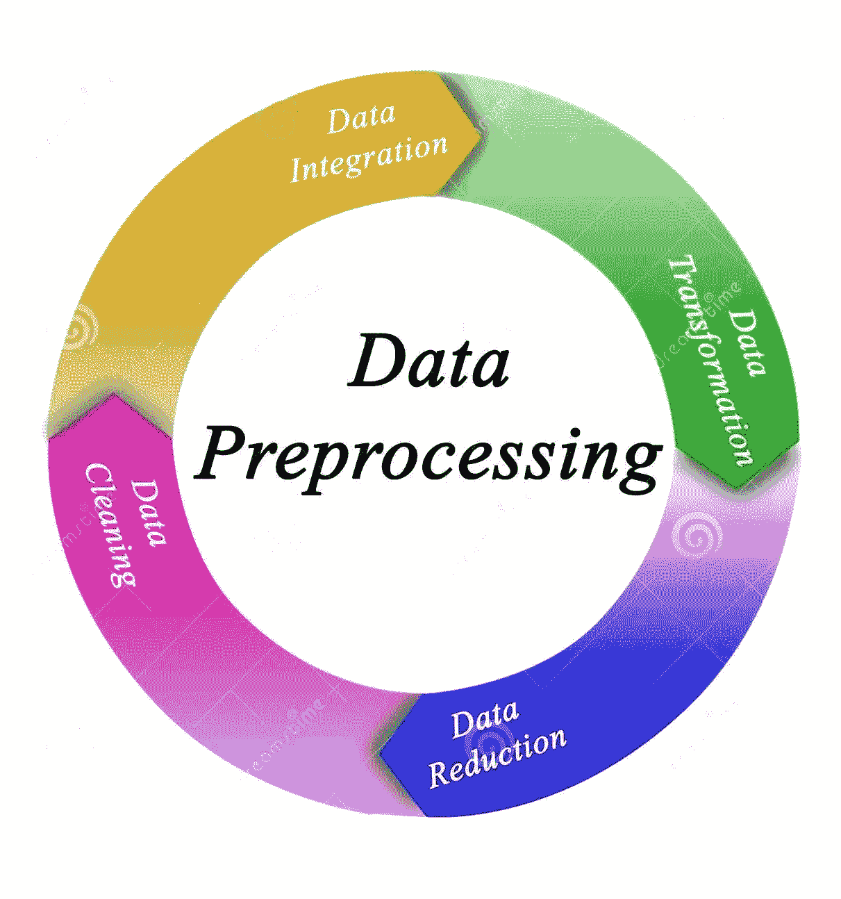

# 数据预处理的简单介绍

> 原文：<https://medium.com/analytics-vidhya/a-simple-introduction-to-data-pre-processing-4cac052df4a4?source=collection_archive---------16----------------------->

你好世界！！！这是 ***数据科学教程*** 的第二篇文章。我很高兴在这里欢迎你。写这篇文章的主要意图是解释数据科学中的核心概念。在整个教程中，我将解释数据科学中的重要概念。阅读这篇文章也会激发你学习更多关于数据科学的知识。

# 简介:

数据预处理是数据挖掘过程中的重要步骤。真实世界的数据集是不完整的、不一致的，并且缺少某些行为。因此，这种数据会导致误导性的结果。

举个例子，

*   超出范围值(年龄:-12 岁)
*   不可能的数据组合(性别:男性，是，短)
*   缺少值
*   不在适当的结构中

有些问题发生在数据收集阶段。

# 为什么要进行数据预处理？

如果存在许多不相关和冗余的信息，或者嘈杂和不可靠的数据，那么在训练阶段的知识发现就更加困难。数据准备和过滤步骤可能需要相当长的处理时间。因此，我们需要摆脱这些问题，以便在任何类型的分析中表现得更好。因此，数据预处理是解决这类问题的一种行之有效的方法。

# 数据预处理的主要步骤

1.  数据清理
2.  数据集成
3.  数据整理
4.  数据转换

# 1.数据清理

数据可能有许多不相关和缺失的部分。为了解决这个问题，我们必须确定数据集的问题，以及如何用不同的技术解决这些问题。

以下是数据集的一些常见问题。

1.  缺少值
2.  重复行
3.  极端值
4.  数据类型问题
5.  修复错别字
6.  无关数据

如果你想了解更多关于数据清理的内容，我强烈推荐你阅读我写的关于数据清理的文章— [数据清理概要](/analytics-vidhya/data-cleaning-in-nutshell-4e017dd86fb6)

# 2.数据集成

数据集成是将不同来源的数据合并到一个统一视图中的过程。集成从摄取过程开始，包括清理、ETL 映射和转换等步骤。数据集成最终使分析工具能够产生有效的、可操作的见解。

*数据集成的一些优势*

*   节省时间并提高效率
*   减少错误(和返工)
*   提供更有价值的数据

是其中的一些。

# 3.数据整理

**数据简化**技术可用于获得数据集的简化表示，其体积更小，但仍能保持原始数据的完整性。也就是说，在精简的数据集上挖掘应该更有效，同时产生相同(或几乎相同)的分析结果。

## 数据缩减策略:-

***1。数据立方体聚集***

聚集操作应用于数据立方体构造中的数据。

***2。降维***

在降维中，冗余属性被检测并移除，从而减小数据集的大小。

***3。数据压缩***

编码机制用于减少数据集的大小。

***4。线数减少***

在数量缩减中，数据被替换或估计。

***5。离散化和概念层次生成*和**

其中属性的原始数据值由范围或更高的概念级别代替。

# 4.数据转换

在数据中，转换过程数据从一种格式转换为另一种格式，更适合数据挖掘。

# 一些数据转换策略:-

***1。平滑***

平滑是从数据中去除噪声的过程。

***2。*聚合**

聚合是对数据应用汇总或聚合操作的过程。

***3。*泛化**

一般来说，通过使用概念层次结构爬升，低级数据被高级数据所替代。

***4。正常化***

规范化将属性数据缩放到一个小的指定范围内，如 0.0 到 1.0。

***5。属性构造***

在属性构造中，新属性是从给定的属性集构造的。

# **最后的想法！！！**

数据预处理是为统计分析准备原始数据的重要步骤。如本章所述，预处理原始数据涉及几个不同的步骤:清理、整合、转换和归约。在整个过程中，了解预处理步骤中所做的选择以及不同的方法如何影响研究结果的有效性和适用性非常重要。因此，使用这些小技巧来强化您的数据科学项目，并取得更好的结果。

下次见。

在此之前，请享受“数据预处理”！