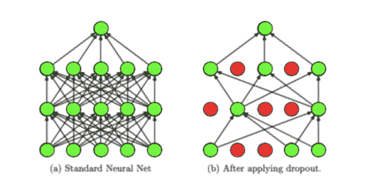
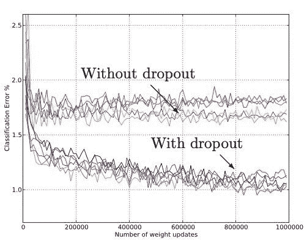
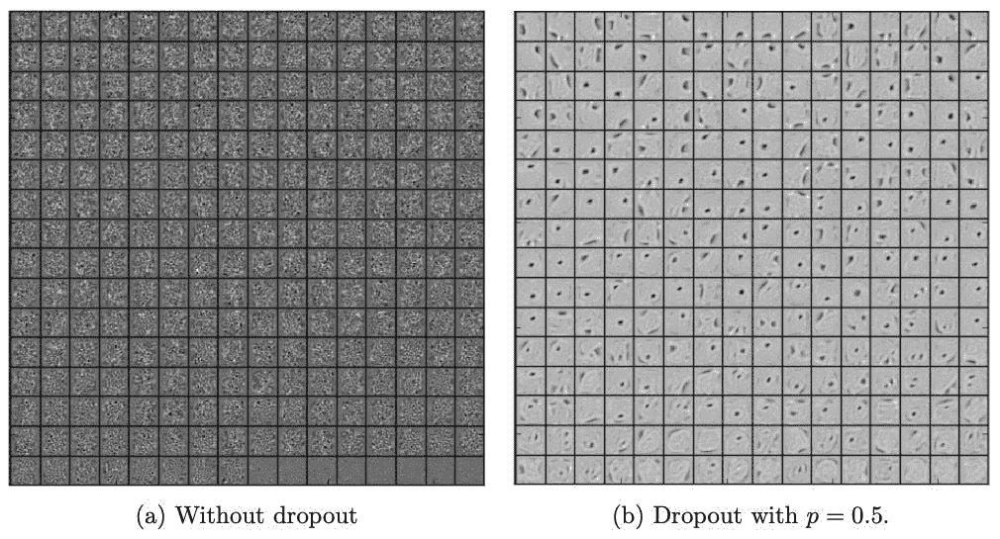
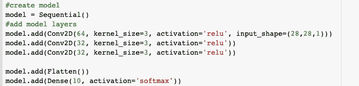
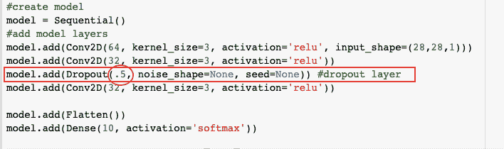
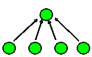
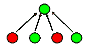
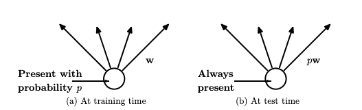

# 辍学正规化的简单介绍(附代码！)

> 原文：<https://medium.com/analytics-vidhya/a-simple-introduction-to-dropout-regularization-with-code-5279489dda1e?source=collection_archive---------0----------------------->

> 阿曼·奥贝罗伊和妮莎·麦克尼利斯

**什么是辍学？**

机器学习中的“辍学”是指在训练过程中随机忽略某一层中的某些节点的过程。

在下图中，左侧的神经网络代表了一个典型的神经网络，其中所有单元都被激活。在右边，红色单元已被从模型中删除-它们的权重值和偏差在训练中不被考虑。

改编自 Srivastava，Nitish 等人，“辍学:防止神经网络
过度拟合的简单方法”，JMLR，2014 年

Dropout 被用作一种正则化技术——它通过确保没有单元是相互依赖的来防止过度拟合(稍后将详细介绍)。

**其他常见的正则化方法**

当谈到打击过度拟合，辍学肯定不是唯一的选择。常见的正则化技术包括:

1.  [提前停止](https://machinelearningmastery.com/how-to-stop-training-deep-neural-networks-at-the-right-time-using-early-stopping/):当一个特定的绩效指标(如验证损失、准确性)停止改善时，自动停止培训
2.  [权重衰减](https://machinelearningmastery.com/introduction-to-weight-constraints-to-reduce-generalization-error-in-deep-learning/):通过向损失函数添加惩罚来激励网络使用较小的权重(这确保了权重的范数相对均匀地分布在网络中的所有权重中，从而防止少数权重严重影响网络输出)
3.  [噪声](https://towardsdatascience.com/how-to-use-noise-to-your-advantage-5301071d9dc3):通过增强允许数据中的一些随机波动(这使得网络对更大的输入分布具有鲁棒性，从而提高泛化能力)
4.  模型组合:平均单独训练的神经网络的输出(需要大量的计算能力、数据和时间)

尽管有过多的选择，辍学仍然是一个非常受欢迎的防止过度适应的保护措施，因为它的效率和效果。

**辍学是如何进行的？**

当我们将 dropout 应用于神经网络时，我们正在创建一个“稀疏”的网络，隐藏层中的单元的独特组合在训练期间的不同时间点被随机丢弃。每次更新我们模型的梯度时，我们基于概率超参数 *p* 生成一个新的稀疏神经网络，其中不同的单元被丢弃。因此，使用 dropout 训练网络可以被视为训练不同稀疏神经网络的负载，并将它们合并到一个网络中，该网络拾取每个稀疏网络的关键属性。

该过程允许放弃以减少模型对训练数据的过度拟合。

Srivastava，Nitish 等人，“辍学:防止神经网络
过度拟合的简单方法”，JMLR，2014 年

该图摘自 Srivastava 等人的论文“dropout:一种防止神经网络过度拟合的简单方法”，比较了没有 dropout 的模型与具有 Dropout 的相同模型(保持所有其他超参数不变)的分类误差的变化。所有的模型都在 MNIST 数据集上进行了训练。

观察到在任何给定的时间点，具有脱落的模型比没有脱落的相同模型具有更低的分类误差。当这些模型用于训练 vision 中的其他数据集以及语音识别和文本分析时，也观察到了类似的趋势。

较低的误差是因为下降有助于通过减少隐藏层中的每个单元对隐藏层中的其他单元的依赖来防止对训练数据的过度拟合。

Srivastava，Nitish 等人，“辍学:防止神经网络
过度拟合的简单方法”，JMLR，2014 年

这些取自同一篇论文的图表显示了 MNIST 上的自动编码器在一层 256 个单元没有丢失( *a* )的情况下学习到的特征，以及使用 p = 0.5 的丢失( *b* )的相同自动编码器学习到的特征。在图 *a* 中可以观察到，单元似乎没有拾取任何有意义的特征，而在图 *b* 中，单元似乎拾取了提供给它们的数据中的明显边缘和斑点。

这表明，退出有助于打破单元之间的协同适应，当使用退出正则化时，每个单元可以更加独立地行动。换句话说，如果没有退出，网络将永远无法捕捉到一个单元 *A* 补偿另一个单元 *B* 的缺陷。由于辍学，在某些点上单元 *A* 将被忽略，结果训练精度将降低，暴露单元 *B* 的不准确性。

**如何使用辍学**

没有退出的 CNN 可以用如下代码表示:

要添加一个 dropout 层，程序员可以添加这样一行:

第一个参数，用橙色圈起来的，是给定单元退出的概率 *p* 。在这个例子中，概率是 0.5，这意味着大约一半的给定单元将会退出。值 0.5 已经通过实验确定为接近各种模型的最佳概率，但是可以随意实验其他概率！

**在测试过程中调整重量**

由于 dropout 从层中移除了一些单元，因此具有 dropout 的网络将在每次训练运行期间加重剩余单元的权重，以补偿丢失的输入。然而，在测试时，使用训练模型在其夸大状态下的权重是不可行的，因此通过乘以超参数 *p* 来缩小每个权重。这种现象可以在下面的例子中观察到。

我们来看一个网络，一层有四个单元(图 a)。每个单元上的权重最初为= 0.25。

(图片 a)

(图片 b)

如果我们将 p = 0.5 的 dropout 应用于该层，它最终可能看起来像图像 b。因为只考虑了两个单元，所以它们的初始权重都= 0.5。然而，dropout 只用于训练，所以我们不希望这些权重在测试期间固定在这么高的数字。

为了解决这个问题，当我们进入测试阶段时，我们将权重乘以 *p* (如下图所示)，最终得到 0.5*0.5 = 0.25，这是正确的初始权重。

Srivastava，Nitish 等人，“辍学:防止神经网络
过度拟合的简单方法”，JMLR，2014 年

**退出正则化中的超参数**

已经发现，与退出正则化一起工作得很好的超参数设置包括大的衰减学习率和高动量。这是因为使用 dropout 限制我们的权重向量使我们能够使用大的学习速率，而不用担心权重爆炸。辍学产生的噪声加上我们大幅度下降的学习率帮助我们探索损失函数的不同区域，并有希望达到更好的最小值。

**辍学的坏处**

虽然辍学显然是一个非常有效的工具，但它也有一定的缺点。与标准网络相比，有中断的网络可能需要 2-3 倍的时间来训练。在不降低训练速度的情况下获得下降优势的一种方法是找到一个基本上相当于下降层的正则化子。对于线性回归，这种正则化已被证明是 L2 正则化的修改形式。对于更复杂的模型，一个等价的正则化子还有待于确定。在那之前，如果有疑问:退学。

**自己试试！**

