# 序列对序列模型的简单介绍

> 原文：<https://medium.com/analytics-vidhya/a-simple-introduction-to-sequence-to-sequence-models-b34ebdf113a5?source=collection_archive---------15----------------------->

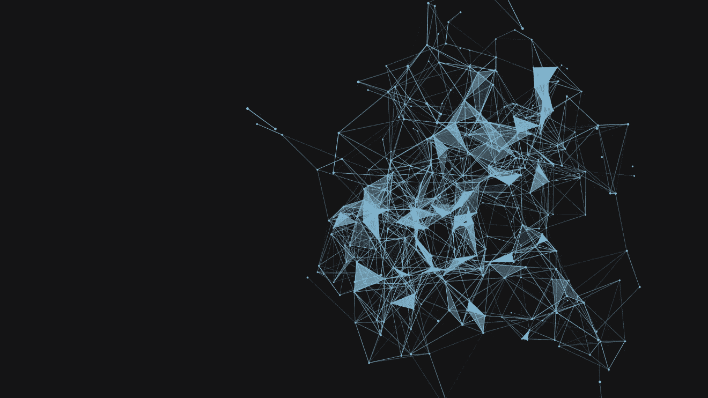

# 概观

在这篇文章中，我会给你一个序列对序列模型的概述，这种模型在不同的任务中非常流行，如机器翻译、视频字幕、图像字幕、问题回答等。

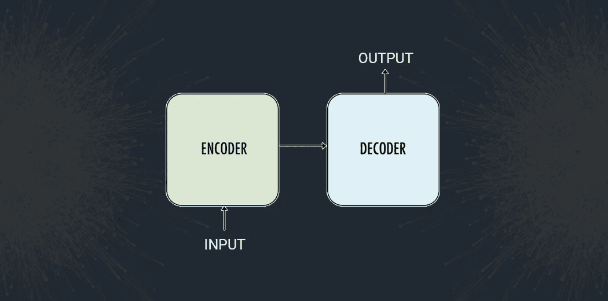

先决条件:读者应该已经熟悉神经网络，特别是递归神经网络(RNNs)。此外，了解 LSTM 或 GRU 模型更佳。如果你不熟悉 LSTM，我更希望你读读[*【LSTM】——长期短期记忆*](/analytics-vidhya/lstm-long-short-term-memory-5ac02af47606) *。*

# 简介:

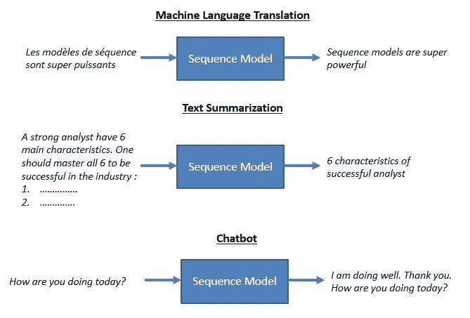

# 序列到序列模型的用例

序列对序列模型是您每天面对的众多系统的基础。例如，seq2seq 模型支持 Google Translate、语音设备和在线聊天机器人等应用。以下是一些应用:

*   *机器翻译* —谷歌 2016 年的一篇[论文](https://arxiv.org/pdf/1409.3215.pdf)展示了 seq2seq 模型的翻译质量如何“接近或超过目前所有公布的结果”。

*   *语音识别*——另一篇谷歌[论文](https://www.isca-speech.org/archive/Interspeech_2017/pdfs/0233.PDF)在语音识别任务上对比了现有的 seq2seq 模型。

这些只是 seq2seq 被视为最佳解决方案的一些应用。该模型可用作任何基于序列的问题的解决方案，尤其是输入和输出具有不同大小和类别的问题。

我们将在下面详细讨论模型结构。

# 编码器-解码器架构:

用于构建 Seq2Seq 模型的最常见架构是编码器-解码器架构。

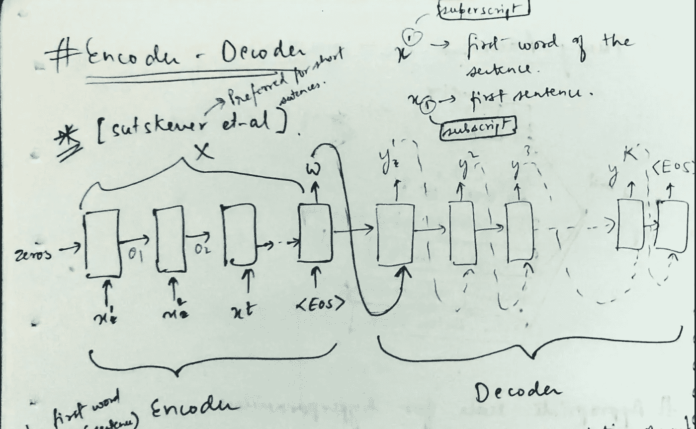

[Ilya Sutskever](https://arxiv.org/search/cs?searchtype=author&query=Sutskever%2C+I) 用神经网络进行序列对序列学习的模型

顾名思义，有两个组件——编码器和解码器。

## 编码器:

*   编码器和解码器都是 LSTM 模型(或者有时是 GRU 模型)
*   编码器读取输入序列，并在所谓的**内部状态向量**或**上下文向量**中总结信息(在 LSTM 的情况下，这些被称为隐藏状态和单元状态向量)。我们丢弃编码器的输出，只保留内部状态。该上下文向量旨在封装所有输入元素的信息，以便帮助解码器做出准确的预测。
*   使用以下公式计算隐藏状态 *h_i* :

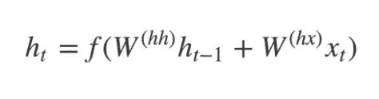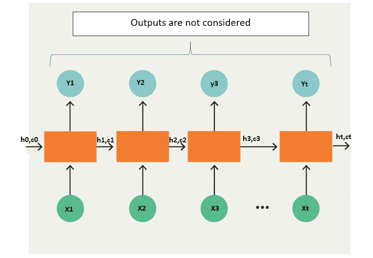

LSTM 一个接一个地读取数据。因此，如果输入是一个长度为“t”的序列，我们说 LSTM 以“t”个时间步长读取它。

1.Xi =时间步长 I 的输入序列

2.hi 和 ci = LSTM 在每个时间步长保持两种状态(“h”代表隐藏状态，“c”代表单元状态)。这些组合在一起，就是 LSTM 在时间步 I 的内部状态

3.Yi =时间步长 I 的输出序列。Yi 实际上是通过使用 softmax 激活生成的整个词汇的概率分布。因此，每个 Yi 是代表概率分布的大小为“vocab_size”的向量。

## 解码器:

*   解码器是 LSTM，其初始状态被初始化为编码器 LSTM 的最终状态，即编码器最终单元的上下文向量被输入到解码器网络的第一个单元。利用这些初始状态，解码器开始产生输出序列，并且这些输出也被考虑用于将来的输出。
*   几个 LSTM 单元的堆栈，其中每个单元在时间步长 t 预测一个输出 y_t
*   每个递归单元接受来自前一个单元的隐藏状态，并产生和输出它自己的隐藏状态。
*   使用以下公式计算任何隐藏状态 *h_i* :

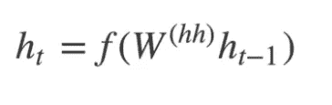

*   使用以下公式计算时间步长 *t* 的输出 *y_t* :

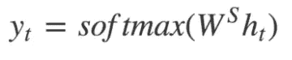

*   我们使用当前时间步长的隐藏状态以及相应的权重 W(S)来计算输出。 [Softmax](https://www.youtube.com/watch?v=LLux1SW--oM) 用于创建一个概率向量，该向量将帮助我们确定最终输出(如问答问题中的单词)。

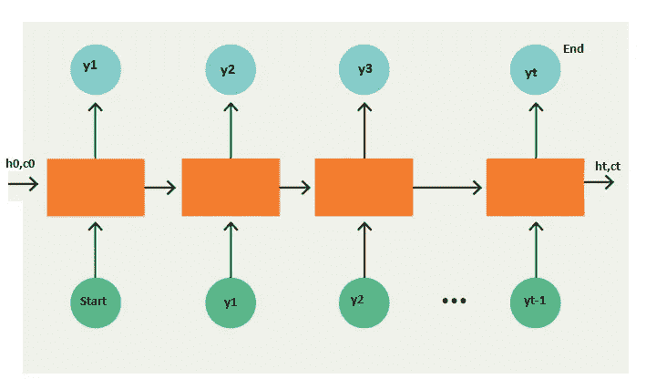

我们将在输出序列中添加两个令牌，如下所示:

## 示例:

约翰正在努力工作。

最重要的一点是，解码器的初始状态(h0，c0)被设置为编码器的最终状态。这直观地意味着解码器被训练成根据编码器编码的信息开始生成输出序列。

最后，根据每个时间步的预测输出计算损耗，误差随时间反向传播，以更新网络参数。用足够多的数据对网络进行长时间的训练会产生非常好的预测结果。

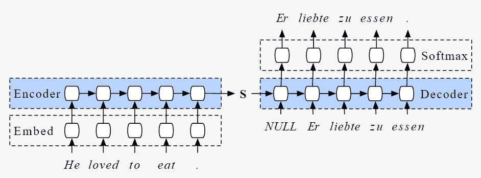

整体编码器-解码器架构

*   在推理过程中，我们一次生成一个单词。
*   解码器的初始状态被设置为编码器的最终状态。
*   解码器的初始输入总是起始令牌。
*   在每个时间步，我们保留解码器的状态，并将其设置为下一个时间步的初始状态。
*   在每个时间步，预测的输出作为下一个时间步的输入。
*   当解码器预测到结束标记时，我们中断循环。

## 编码器-解码器模型的缺点:

这种架构有两个主要缺点，都与长度有关。

1.  首先，和人类一样，这种架构的记忆非常有限。LSTM 的最后一个隐藏状态，我们称之为 **S 或 W** ，是你试图把你要翻译的整个句子塞进去的地方。 **S 或 W** 通常只有几百个单位(读作:浮点数)长——你越是试图强行进入这个固定维度的向量，神经网络就被迫损失越多。根据要求神经网络执行的“有损压缩”来考虑神经网络有时是非常有用的。
2.  第二，根据一般经验，神经网络越深，就越难训练。对于递归神经网络，序列越长，神经网络沿时间维度越深。这导致消失梯度，其中来自递归神经网络学习的目标的梯度信号在向后行进时消失。即使有专门设计的 rnn 来帮助防止渐变消失，例如 LSTM，这仍然是一个基本问题。

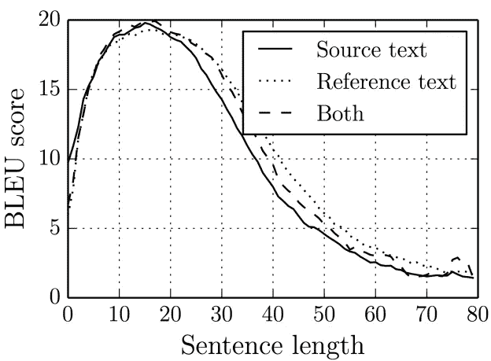

此外，对于更健壮和更长的句子，我们有像**注意力模型**和**变形金刚**这样的模型。

这里的 [***这个***](https://github.com/prasoons075/Deep-Learning-Codes/tree/master/Encoder%20Decoder%20Model) 是我的 GitHub 储存库，用于完整的单词级以及字符级编码器-解码器模型。

# 参考

1.[https://blog . keras . io/a-ten-minute-introduction-to-sequence-to-sequence-learning-in-keras . html](https://blog.keras.io/a-ten-minute-introduction-to-sequence-to-sequence-learning-in-keras.html)

2.[https://arxiv.org/abs/1409.3215](https://arxiv.org/abs/1409.3215)

3.[https://arxiv.org/abs/1406.1078](https://arxiv.org/abs/1406.1078)

4.[https://towards data science . com/word-level-English-to-Marathi-neural-machine-translation-using-seq 2 seq-encoder-decoder-lstm-model-1a 913 F2 DC 4a 7](https://towardsdatascience.com/word-level-english-to-marathi-neural-machine-translation-using-seq2seq-encoder-decoder-lstm-model-1a913f2dc4a7)

*原载于 2020 年 8 月 31 日*[*https://www.analyticsvidhya.com*](https://www.analyticsvidhya.com/blog/2020/08/a-simple-introduction-to-sequence-to-sequence-models/)*。*