# 模型的训练、验证和测试的简单介绍——第 1 部分

> 原文：<https://medium.com/analytics-vidhya/a-simple-introduction-to-validating-and-testing-a-model-part-1-2a0765deb198?source=collection_archive---------6----------------------->

解码验证和测试集对每个人的重要性。

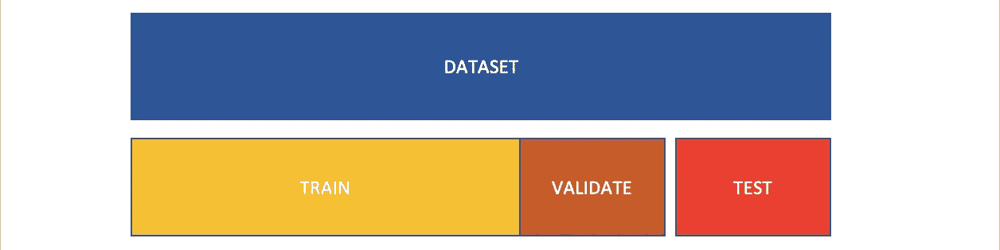

在本文中，我们将学习验证集的重要性以及用于将原始数据集分成子集的技术(训练、验证和测试)。我们将首先了解它是如何工作的，然后是更好的学习体验的代码。

有必要在看不见的数据上测试我们的模型，以检查它是否能推广到新的情况。

有两种方法可以检查数据的性能:

1.  生成模型并将其直接投入生产，这样我们可以看到它在新(看不见的)数据上的表现，但如果模型不好，用户会不高兴。
2.  另一个聪明的方法是将数据分成两部分，然后用一部分来训练模型，同时保留另一部分用于测试。测试集产生的错误率也称为泛化错误。

我们通常采用第二种方法，因为它更安全可靠。

在下图中，我们可以看到我们如何将一部分数据作为训练数据，另一部分数据作为测试数据。通常，我们将测试数据作为原始数据的 20%,但可以根据需要进行更改。

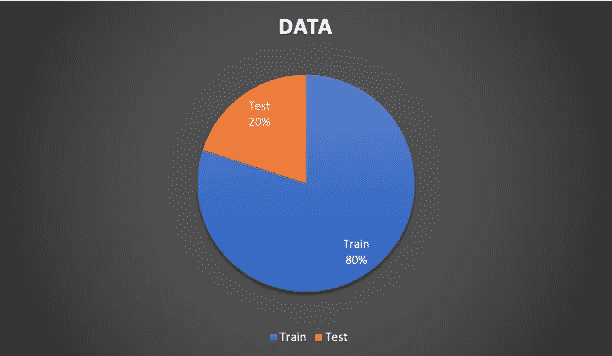

模型建立是一个迭代的过程，因此一旦我们建立了模型，我们就要不断改进它。

模型构建涉及的步骤有:

1.  假设生成
2.  数据集创建
3.  建模
4.  估价

我们在上一篇文章中已经讨论过了，这里是它的[链接](/analytics-vidhya/a-general-introduction-to-machine-learning-cea282802a15?source=friends_link&sk=009fe28bf8a47d46e965aa131cc58fe1)。

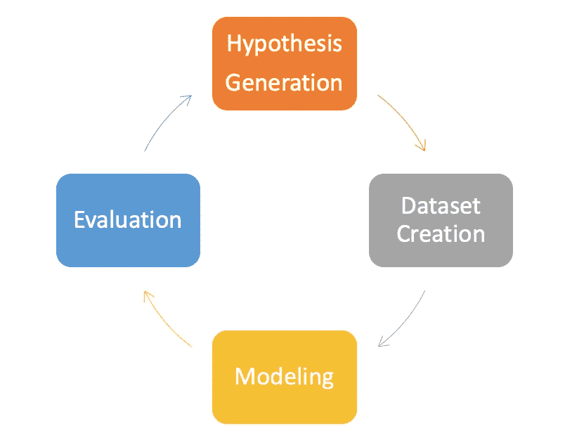

# 我们如何决定模型是否符合数据？

模型评估基于模型在测试数据上的表现。因此，在某些情况下，我们可能需要一些超参数来对我们的模型进行更改，使其性能更好。

评估指标，如泛化误差，有助于我们比较不同的模型，并决定哪一个模型更适合。

基于模型拟合，我们可以将其分为 3 个不同的类别:

1.  不适合
2.  过度配合
3.  最合适的

我们将在接下来的文章中详细讨论这些，现在，我们需要知道的是，我们想要实现一个良好的拟合，过度拟合和欠拟合都不是模型的首选。

# **与将数据集一分为二相关的问题:训练和测试**

假设我们对我们的模型做了多次修改，我们最终实现了一个较低的泛化误差(例如:5%)，然后我们启动我们的模型，它最终表现不佳。

**你认为哪里出了问题？**

当我们对模型进行多次修改以降低测试数据的泛化误差时。这表明我们没有在全新的数据(看不见的)上测试我们的模型。

这可能会导致模型不能很好地推广的状态。

# 解决方案:创建验证集

为了解决这个问题，我们将使用一个 ***验证设置*** *。*

我们可以将现有数据集分为三个部分，训练、验证和测试。

现在我们有了三个数据集，我们将使用训练集来训练模型，使用验证集来优化模型，使用测试集来检查模型对未知数据的表现。

在下图中，我们可以看到我们是如何将数据分为训练、验证和测试的。通常，我们使用这个比例，但是可以根据需要改变。

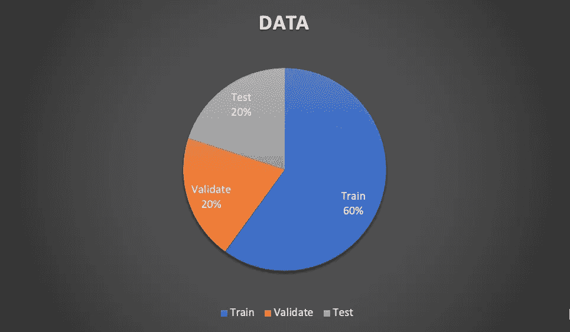

# 如何创建验证集？

用于生成验证集的技术:

*   坚持验证
*   分层拒绝验证
*   k 倍交叉验证
*   遗漏一个验证

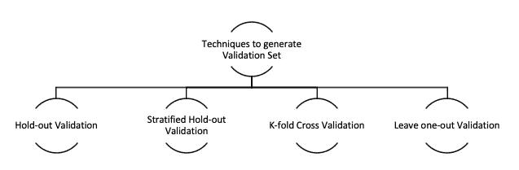

在本文中，我们将学习前两种技术，其余的将在以后的文章中学习。

# 坚持验证

实施这项技术的步骤包括:

1.  获取数据并进行洗牌(随机排列行的顺序)
2.  将数据分为训练和测试
3.  将训练数据进一步拆分为训练集和验证集

这种技术很简单，因为我们需要做的只是取出原始数据集的一些部分，并使用它进行测试和验证。使用 python(一种解释型高级通用编程语言)中的各种库，如 sklearn，可以很容易地完成数据的拆分。

## 与拒绝验证相关的问题

每个集合(训练、验证、测试)中变量的分布是不同的，因此我们的模型不能很好地概括。

# **分层拒绝验证**

这种技术解决了与拒绝验证技术相关的问题。

在这里，我们将确保每个集合都有相似的分布，这将最终帮助我们生成一个更好的模型。

***现在我们知道了这两种技术是什么，让我们来看看代码***

*我们将使用 python 3.0*

**使用的库:**

*   *熊猫*
*   *Numpy*
*   马特普罗特里布
*   *Sklearn*

我们将在这里使用预处理的 titanic 数据集来理解拒绝和分层拒绝技术是如何工作的:

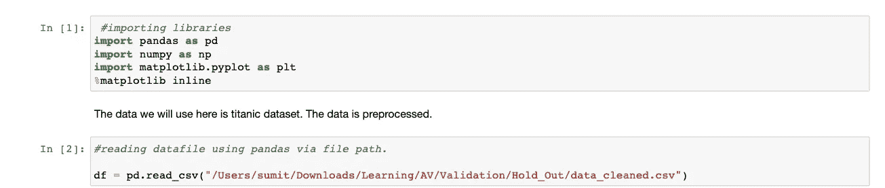

在这里，df 将拥有我们想要使用的数据集。

我们可以看到数据有 5 行 25 列，其中存活的是我们的目标(因)变量，其余的是自变量。

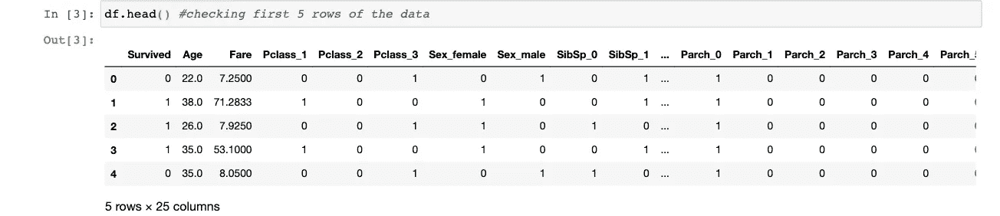

即使我们正在处理干净的数据，我们仍然会检查是否有任何丢失的值。如我们所见，我们的数据集中没有缺失值。

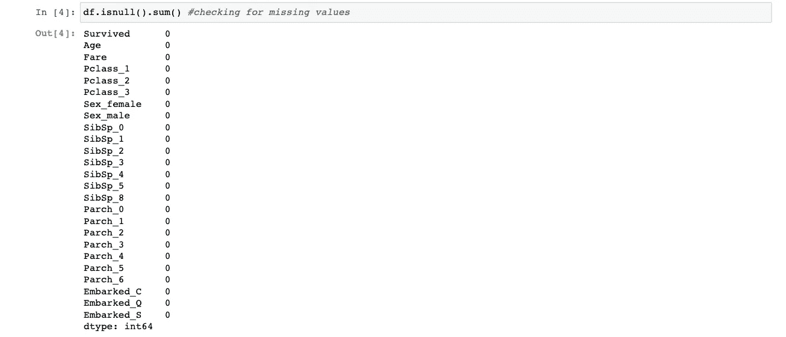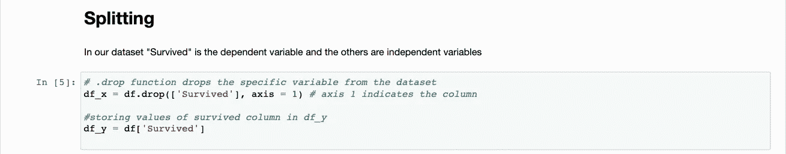

我们将因变量存储为 df_x，目标变量(独立变量)存储为 df_y。

我们现在将从 sklearn 库中导入 train_test_split 函数，因为它提供了一个非常简单的函数来拆分我们的数据。

这里，我们不会对*的保持验证使用分层。设置随机状态，这样每次运行代码时，我们都可以得到相同的分割输出。*

*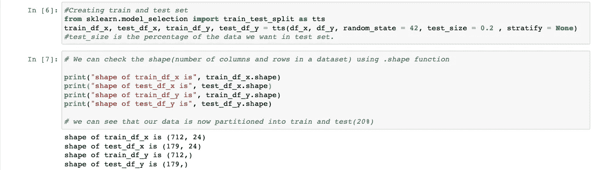*

*现在，我们将再次使用 train_test_split，但这一次我们将使用训练数据，并将其分成训练集和验证集。*

*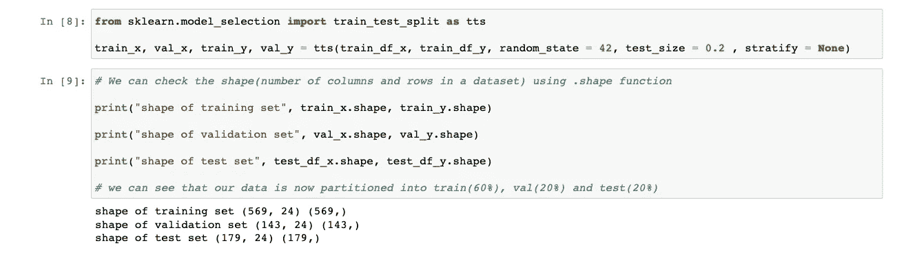*

*我们有一套训练、验证和测试工具。让我们检查一下我们的目标类在所有集合中的分布。*

*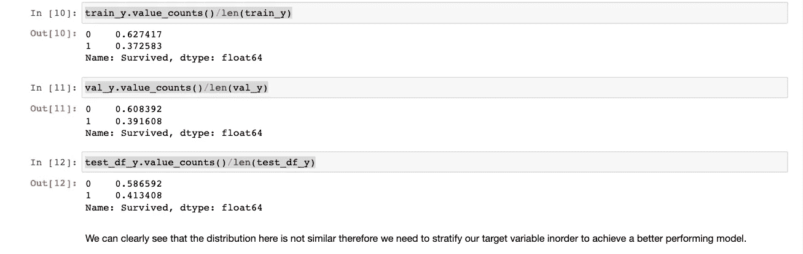*

*正如我们所看到的，每个集合中的分布并不相似，因此我们的模型不能很好地概括。*

*解决这个问题的方法是 ***分层保持验证****

*让我们看看它是如何工作的。*

*我们在这里也将使用相同的代码行。唯一的区别是我们在这里使用分层。*

*在这种情况下，我们根据目标变量对数据进行分层，因为我们可以看到 df_y 是目标类变量的数据子集。*

*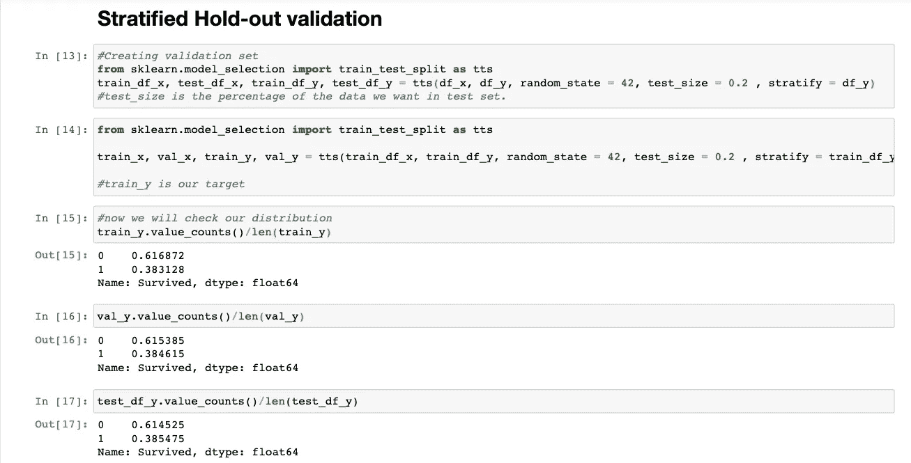*

*可以看出，目标类的分布现在是相似的，这是一件好事，因为我们的模型现在能够很好地概括。*

# *分层拒绝验证技术的问题*

*排除和分层排除验证技术的问题在于，为了生成验证集，我们采用了不能用于训练的训练集的子集。因此，我们用于训练的数据会更少，这可能是一个缺点。*

*此外，由于我们将使用一个验证集模型，可能会再次使数据过拟合。*

# *解决方案:*

*这个问题可以通过使用 K-fold 交叉验证来解决。我们将在下一篇文章中讨论 K-fold 交叉验证，并留下 One-Out 验证技术。*

# *参考*

*   **使用 Scikit-Learn 和 TensorFlow 进行机器学习:构建智能系统的概念、工具和技术，第 1 版，第 1 章，作者 Aurélien Géron。**
*   *应用机器学习课程-分析*

**恭喜恭喜！您刚刚完成了以下主题的学习:**

*   *列车试运行的重要性。*
*   *验证集的重要性*
*   *用于生成验证集的技术及其缺点。*

*如果你有任何问题，你可以在评论中发表，我会很乐意解答。*

*也可以在 [LinkedIn](https://www.linkedin.com/in/sumit-kumar-3b0a9b171) 上找到我。*

*如有任何改进建议和反馈，我们将不胜感激。*

*如果你喜欢我的工作，请考虑关注我，我会写更多关于数据科学的文章。*