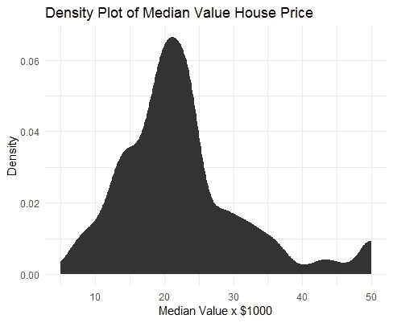
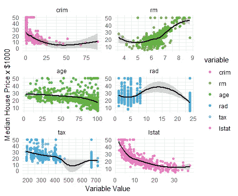
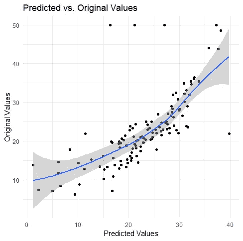

# 一个简单的 R 语言 ML 项目只需 5 分钟！

> 原文：<https://medium.com/analytics-vidhya/a-simple-ml-project-in-r-using-the-boston-dataset-e1143146ffb0?source=collection_archive---------5----------------------->


Anthony DELANOIX 在 [Unsplash](https://unsplash.com?utm_source=medium&utm_medium=referral) 上拍摄的照片

这是使用波士顿数据集和 r 中的线性回归创建一个简单的机器学习模型的简单步骤。所以让我们开始吧！

## 1.加载库

我们将使用以下库:

```
library(mlbench)  # Contains the Boston Housing Dataset
library(dplyr)    # Basic manipulation functions
library(ggplot2)  # Graphs and plots
library(reshape2) # To reshape data
library(caret)    # Creating train test sets
```

## 2.正在加载数据集

data()函数用于加载已加载库中可用的数据集。如果不带参数调用 data()，您将获得所有可用数据集的列表。

```
data() # View all available datasets# Load the Boston Housing dataset in the object named 
# 'BostonHousing'
data(“BostonHousing”)# For simplicity, lets call it 'housing'
housing = BostonHousing
```

## 3.了解结构

str()函数给出了变量(属性)类型的细节。你有必要理解这些属性的含义。你可以在这里获得关于属性[含义的更多细节。](https://www.cs.toronto.edu/~delve/data/boston/bostonDetail.html)

```
> str(housing)
'data.frame': 506 obs. of  14 variables:
 $ crim   : num  0.00632 0.02731 0.02729 0.03237 0.06905 ...
 $ zn     : num  18 0 0 0 0 0 12.5 12.5 12.5 12.5 ...
 $ indus  : num  2.31 7.07 7.07 2.18 2.18 2.18 7.87 7.87 7.87 7.87 ...
.
.
```

## 4.测绘

**房价中值密度图**

```
ggplot(housing, aes(x = medv)) +
 stat_density() +
 labs(x = “Median Value x $1000”, y = “Density”, title = “Density Plot of Median Value House Price”) +
 theme_minimal()
```



密度图给出了数值属性的分布。我们可以看到大多数房子的价格在 20000 美元到 25000 美元之间。

**属性与房价中位数**

我们现在将绘制一些与房价相关的属性。

```
selected.attributes = select(housing, c(crim, rm, age, rad, tax, lstat, medv))
melted = melt(selected.attributes,id="medv")
ggplot(melted, aes(x = value, y = medv, colour = variable)) +
  geom_point(alpha = 0.7) +
  geom_smooth(color='black') +
  facet_wrap(~variable, scales = "free", ncol = 2) +  # Divide the plots based on variable in 2 columns with a free scale that adjusts
  labs(x = "Variable Value", y = "Median House Price x $1000") +
  theme_minimal()
```

在这里，我们正在创建数据的融合版本。我们将从“住房”中选择()几个属性，并将它们融化()。melt()函数有两个参数，一个是数据，另一个是“id”。它获取“id”属性，并为所选属性重复该属性，然后创建关联的变量、值列。

> 我建议您查看“melted”数据框，了解 melt()的功能

ggplot()用指定的 x 和 y 属性创建一个图。geom_point()用于将数据绘制为点。“alpha”指定点的透明度。geom_smooth()绘制了您在下图中看到的黑色曲线。facet_wrap()用于根据变量将图分成 2 列的多个图。labs()用于标记图。



## 5.创建训练测试集

```
set.seed(387)
train.idx = createDataPartition(y = housing$medv, p = 0.75, list = FALSE)
test.idx =createDataPartition(y=housing$medv, p=0.25,list=FALSE)
train = housing[train.idx, ]
test = housing[test.idx, ]
```

createDataPartition()返回随机索引号，以便为训练集和测试集进行选择。对应于这些索引的行用于获得“训练”和“测试”集合。

## 6.构建模型

```
model = lm( medv ~ crim + rm + tax + lstat, data = train)
```

lm()函数创建一个线性模型。在第一个参数中，' ~ '左边的变量是目标变量，右边的变量是独立变量。

```
summary(model) # Obtain coefficients, Residuals and statistics
rsquare = summary(model)$r.squared # R-squared value
```

我得到的 r 平方值是 0.699。

## 7.根据模型和绘图结果进行预测

```
predictions = predict(model, newdata = test)
predicted.vs.original = data.frame(predicted = predictions, original = test$medv)   # Create a new data frame
ggplot(predicted.vs.original, aes(x = predicted, y = original)) +
 geom_point() +
 geom_smooth(color='blue') +
 labs(x = “Predicted Values”, y = “Original Values”, title = “Predicted vs. Original Values”) +
 theme_minimal()
```

在这里，我们创建了一个包含原始值和预测值的数据框，并绘制了一个图表。



## 8.结论

我们刚刚建立了一个基本的线性回归模型。您可以通过缩放、转换和标准化数据来提高模型的准确性。

感谢阅读！