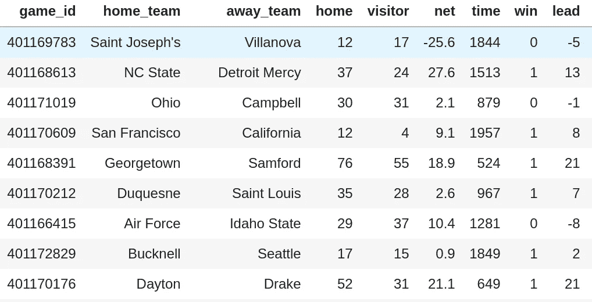
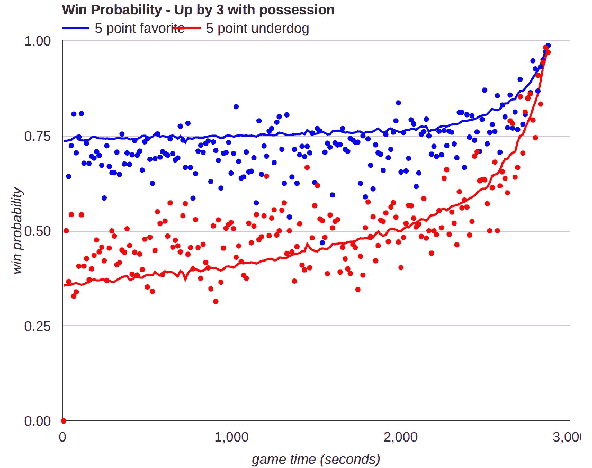
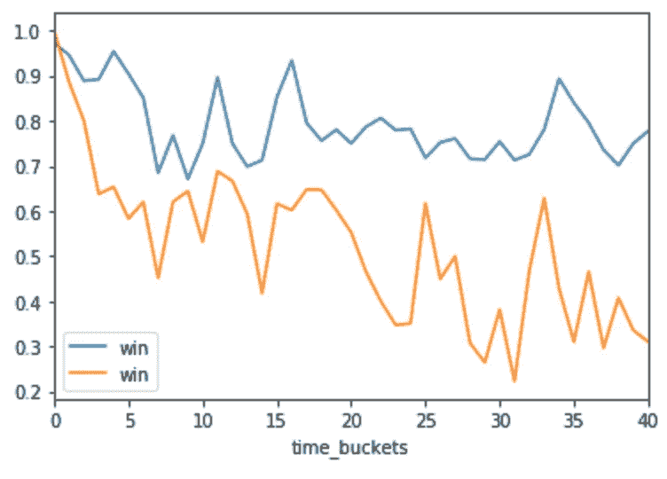
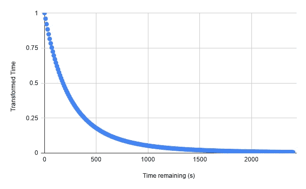
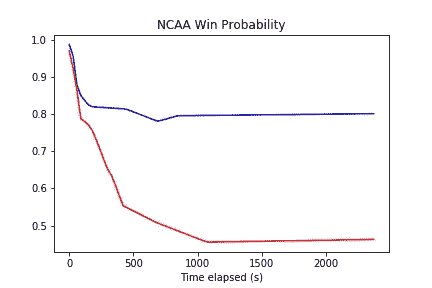
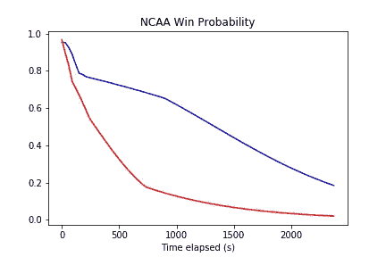

# 用于 NCAA 篮球比赛中获胜概率建模简单神经网络

> 原文：<https://medium.com/analytics-vidhya/a-simple-neural-network-for-in-game-win-probability-modeling-of-ncaa-basketball-games-58ab4e3ca0f9?source=collection_archive---------10----------------------->


弗兰基·查马基在 [Unsplash](https://unsplash.com/s/photos/artificial-intelligence?utm_source=unsplash&utm_medium=referral&utm_content=creditCopyText) 上拍摄的照片

获胜概率(WP)是获胜的概率(duh)——给定某个*上下文*(或者统计学术语中的*先验知识*)。背景就是一切。例如，投注者通常基于他们对两个队的总体优势和劣势以及手头特定游戏的背景的先验知识，对即将到来的游戏的获胜概率有所了解。是主场比赛吗？球员们是休息一天还是休息一周？明星球员受伤了吗？

游戏内获胜概率——顾名思义——还模拟了游戏过程中各个时刻因素的背景。这不仅对体育博彩有用，而且对那些希望更多地参与球队的球迷也很有用。虽然 WP 可以为任何运动建模，但在这篇文章中，我将专注于篮球运动，特别是男子 I 级大学篮球，我有一个适当的数据库，我从这个赛季开始收集这些比赛。以下是数据集的一个示例:



用于获胜概率建模数据集

这里的每一行都是 NCAA 比赛中的一个时刻，在那里发生了改变比分或时钟时间的事件——射门、抢篮板球、失误等。此处描述的模型的相关特征将是**领先**(主场得分-客队得分)、**净评分**(即两支球队(主场-客队)之间的 [kenpom](https://kenpom.com/) 评分差)以及以秒为单位的**游戏剩余时间**。目标变量——我们试图用我们的模型预测的变量——当然是结果**赢**，无论主队在比赛中是赢(1)还是输(0)。请注意，对于当前的模型，我刚刚选择了查看不以平局结束的游戏——我将最终处理平局……*T21。这只是我目前做出的一个选择，为了简化并让事情快速运转。另一个简化是忽略了控球的环境——哪支球队有球，这显然是在比赛后期随着时间的推移而知道的关键。*

篮球(据我所知，还有其他运动)中获胜概率的先前模型大多依赖于某种形式的局部逻辑回归(这里是[这里是](https://lukebenz.com/post/ncaahoopr_win_prob/)和[这里是](https://www.inpredictable.com/2013/06/nba-in-game-win-probability.html))。实际上，我试着做了纯逻辑回归，果然，那一点也不好用。当我读到人们以前走当地的逻辑回归路线时，我的一部分想，嗯，做以前做过的事情一点意思都没有！当我开始思考这个问题时，我想知道神经网络是否可以计算出同样的局部性和非线性本质上是建模获胜概率所需要的。事实证明，我认为这个问题的答案至少在某种程度上是明确的*是的*。

为了帮助指导我的旅程，我在很大程度上依赖于 Mike Beuoy 的博客文章中的一个数据(请阅读并在 Twitter 上关注他的@ [inpredict](https://twitter.com/inpredict) ),该数据显示了在比赛期间作为时间函数的领先 3 分的球队的获胜概率(对于 NBA 比赛),该球队要么是 5 分的热门球队，要么是弱队。实线代表模型，圆点代表实际游戏结果的获胜概率。



截图来自 Mike Beuoy 的 WP 帖子

我的目标基本上是建立一个可以复制这种东西的模型。然而，在此之前，让我们看看 NCAA 的数据有多相似。



对于领先 2-4 分且净评分在 5 分左右(蓝色)或-5 分左右(橙色)的团队，NCAA 获胜的可能性较大。这里的时间段是 60 秒。

从图中可以看出——如果你足够仔细地观察——原始的获胜概率实际上与 Mike 的数据没有太大差别。需要注意的一点是，时间在我的图上“倒退”——0 是游戏结束时的蜂鸣器。好了，现在来看我的模型。

我应该提到，我尝试了一些不同的东西，包括一种时间的“指数变换”，看起来像这样:



事实证明，我只需要遵循深度学习的咒语，即让神经网络学习它需要的特征。所以我放弃了时间转换，只是让我的神经网络更深一层，这似乎做到了。

在 TensorFlow 2.0 中，简单的 AF 模型实际上是这样的:

```
model = tf.keras.models.Sequential([
    tf.keras.layers.Dense(12, activation='relu', input_shape=[3,]),
    tf.keras.layers.Dense(12, activation='relu'),
    tf.keras.layers.Dense(1, activation='sigmoid')
])
model.compile(optimizer=tf.keras.optimizers.RMSprop(1e-3), loss='binary_crossentropy', metrics=['accuracy', 'AUC'])model.summary()model.fit(df[['lead','net','time']].to_numpy(),
          df['win'].to_numpy(),
          verbose=1,
          shuffle=True,
          epochs=50,
          batch_size=512)
```

就是这样，只是一个输入层，2 个隐藏层，每个隐藏层有 12 个神经元，一个输出层有 sigmoid 激活。正如您在这里看到的，这基本上适用于领先 3 分的团队，该团队在净评分方面要么是最受欢迎的 5 分，要么是最受欢迎的 5 分:

```
times = list(range(0,2400,30))
winp_favorite = [model.predict_proba(x=[[3,5,time]])[0][0] for time in times]
winp_underdog = [model.predict_proba(x=[[3,-5,time]])[0][0] for time in times]plt.plot(times, winp_favorite, 'b-')
plt.plot(times, winp_underdog, 'r-')
plt.title('NCAA Win Probability')
plt.xlabel('Time elapsed (s)')
plt.savefig('ncaa_win_prob.png')
```



模型基本管用！

顺便说一下，如果你只有一个隐藏层，你可以得到这样看起来不稳定的曲线:



看起来不可靠的模型，只有一个微不足道的隐藏层

最后，为了向您展示这些功能是如何单独发挥作用的，下面是一个净价为+5、还剩 30 秒、领先 1-5 分的团队的获胜概率:

```
model.predict_proba(x=[[1, 5, 30], [2, 5, 30], [3, 5, 30], [4, 5, 30], [5, 5, 30]])>
array([[0.7975986 ],
       [0.8999447 ],
       [0.95134   ],
       [0.978909  ],
       [0.99045944]], dtype=float32)
```

正如预期的那样，获胜的概率随着几个额外的分数而上升，因为他后面的团队在如此短的时间内获得多份财产变得非常困难。最后，我们可以看到，在比赛还剩 30 秒时领先 4 分的球队获胜的概率实际上并不太取决于净价(正如卢克·本兹所展示的那样):

```
# varying net rating from -5 to +5
model.predict_proba(x=[[4, -5, 30], [4, 0, 30], [4, 5, 30]])
>
array([[0.94858927],
       [0.97111243],
       [0.978909  ]], dtype=float32)
```

我很兴奋这能起作用，尽管我想这并不令人惊讶。但我想分享它，希望其他人也能沿着这条路走下去，增加更多的功能，改进架构，等等。正如我之前说过的，下一个明显的步骤是增加附身。好好享受吧！