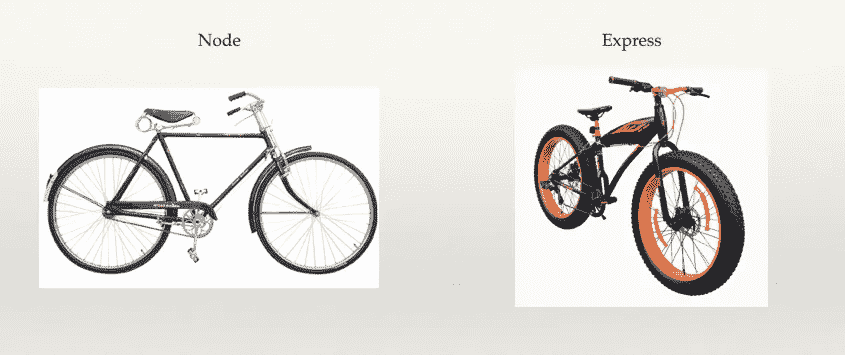
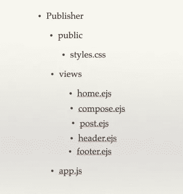
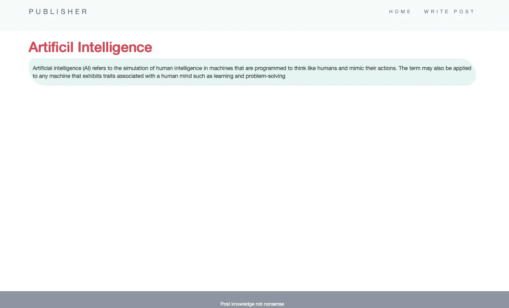
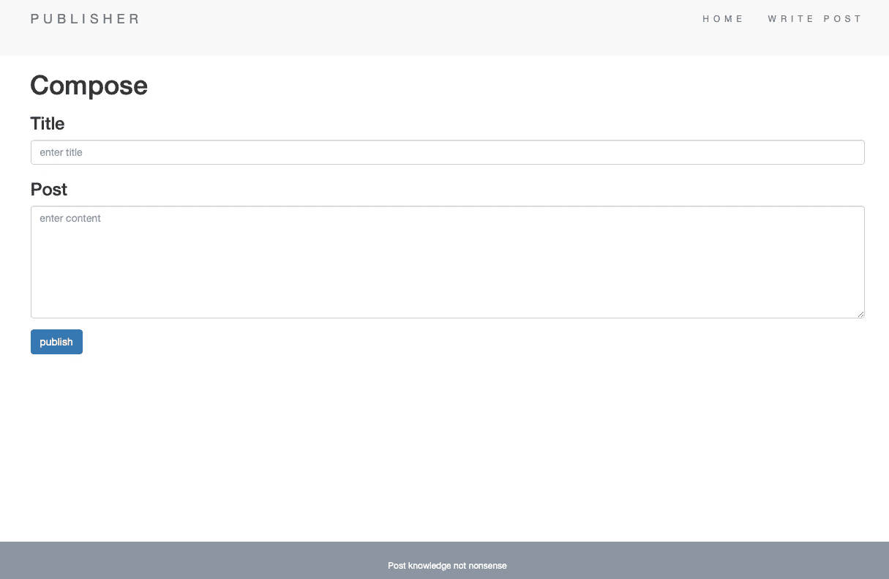
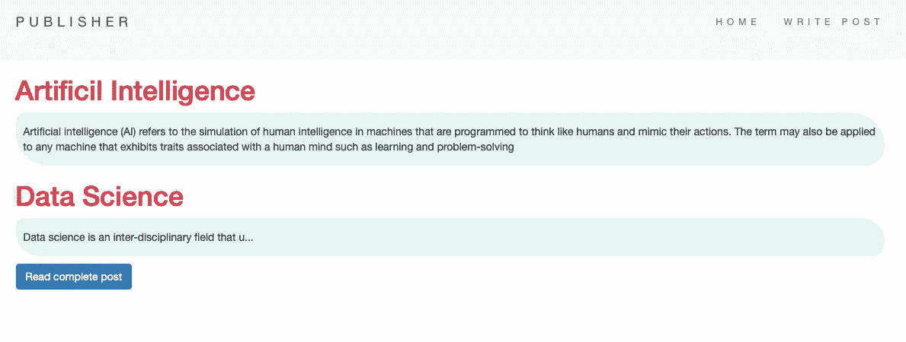
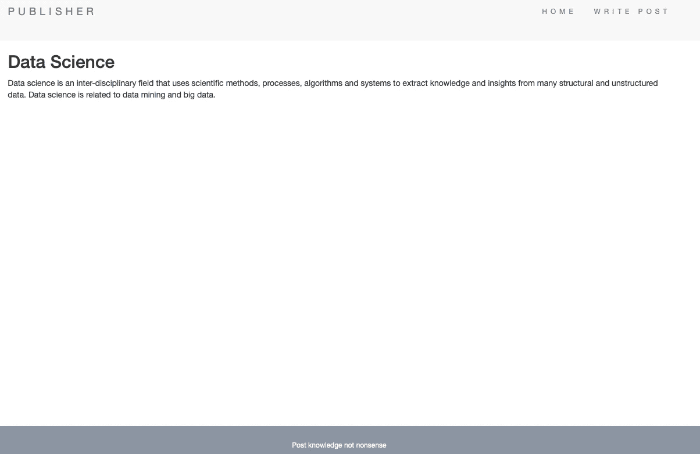

# 使用 Node.js 的简单在线发布程序

> 原文：<https://medium.com/analytics-vidhya/a-simple-online-publisher-using-node-js-81de6d8f40ee?source=collection_archive---------21----------------------->

有没有想过创建像 Medium 这样的网络发布平台？

这并不是我们不能做的。让我们使用 node 构建简单的 publisher web 应用程序。

## 为什么是 Node.js？

我们大多数人都熟悉 javascript，并在前端使用 javascript 或类似 jQuery 的框架为网站添加行为。因此，有了 node，我们也可以使用相同的 javascript 来创建后端。

它允许创建可扩展和快速运行的网站。

Node js 代码可以在服务器上运行，以处理用户查询并向用户发回文件。

我们将使用一个广泛使用的叫做 Express.js 的 node.js 框架，它可以节省大量的编码时间。Express 为 node 添加了许多功能，使其易于使用。



现在我们开始吧！！

# 初始设置

为我们的网站创建一个新目录。

```
mkdir publishercd publisher
```

创建 packages.json 以包含基本的项目信息。

```
npm init
```

安装必要的软件包。使用以下命令。

```
npm i express body-parser ejs 
```

body-parser 用于读取用户输入的信息。

ejs 是 javascript 模板库，用于在 html 文件中嵌入 javascript 代码。

我们将在视图目录中创建必要的 ejs 文件。由于我们正在制作简单的应用程序，我们只需要主页，撰写和发布页面。

```
mkdir viewscd viewstouch home.ejs compose.ejs post.ejs header.ejs footer.ejscd ..
```

创建一个自定义的 css 文件

```
mkdir public
cd public
touch styles.css
```

现在创建重要的文件 app.js

```
touch app.js
```

最后看看文件结构



安装完成！！

开始编码..

```
atom .
```

# 编码 app.js

像任何其他编程语言一样，我们将从导入库开始。

```
const express = require("express");
const bodyParser = require("body-parser");
const ejs = require("ejs");
```

设置快递和 ejs。

```
app.set('view engine', 'ejs');app.use(bodyParser.urlencoded({extended: true}));
app.use(express.static("public"));
```

最后一行是包括自定义 css。

设置端口。

```
app.listen(3000, function() {
  console.log("Server started on port 3000");
});
```

这允许我们使用 **localhost:3000** 访问我们的网站

## 处理路线…

清楚搬运路线很重要。

我们将为用户的 get 和 post 请求创建回调函数。

```
app.get(“/”,function(req,res){
             res.send("Hello world");
             }
        );
```

这是一个简单的回调函数，将 get 请求传递给主页( **localhost:3000** )。这将简单地向用户显示 hello world。

同样的，如果你想处理 **localhost:3000/compose**

```
app.get("/compose",function(req,res){....});
```

现在让我们回到我们的 web 应用程序。

# 在我们的网站中处理路线

我们将准备好 app.js 和 ejs 文件。

页眉和页脚将保留在所有主页、撰写和发布文件中。所以我们将它们分离出来，包含在剩余的文件中。

header.ejs

```
<html lang="en" dir="ltr"><head>
  <meta charset="utf-8">
  <title>PUBLISHER</title>
  <meta charset="utf-8">
  <link rel="stylesheet"     
 href="[https://maxcdn.bootstrapcdn.com/bootstrap/3.3.7/css/bootstrap.min.css](https://maxcdn.bootstrapcdn.com/bootstrap/3.3.7/css/bootstrap.min.css)">
  <link rel="stylesheet" href="/styles.css">
  <nav class="navbar navbar-default">
    <div class="container">
      <div class="navbar-header">
        <p class="navbar-brand"> PUBLISHER</p>
      </div>
        <ul class="nav navbar-nav navbar-right">
          <!-- 6 -->
          <li id="home"><a href="/">HOME</a></li> <li id="compose"><a href="/compose">WRITE POST</a></li>
        </ul>
    </div>
  </nav>
</head>
  <body>
    <div class="container">
```

页脚. ejs

```
 <div class="footer">
    <p>Post knowledge not nonsense</p>
  </div>
</div>
</body>
</html>
```

我们将从主页开始。

主页将有页眉和页脚。它将显示用户创建的帖子。



home.ejs 将接收来自 app.js 的起始内容和帖子。

我使用了自举卡布局。

标签用于显示网站内容。

标签用于包含文件。

标签用于编写 java 脚本代码。

```
<%- include("header"); -%><div class="card text-white bg-light rounded-top rounded-left border-dark "><div class="card-body">
  <h1 class="card-title">Artificil Intelligence</h1>
  <p class="card-text "><%= startingContent %></p></div>
</div><% posts.forEach(function(post){ %>
  <div class="card text-white bg-light rounded-top border-dark "><div class="card-body">
    <h1 class="card-title"> <%= post.title %></h1>
    <p class="card-text"><%= post.content.substring(0,50)+"..." %></p>
    <a href="/posts/<%= post.title %>" class="btn btn-primary">Read complete post </a>
  </div>
</div>
<% }) %><%- include("footer"); -%>
```

在 app.js 中，包含以下代码

```
const content = " Artificial intelligence (AI) refers to the simulation of human intelligence in machines that are programmed to think like humans and mimic their actions. The term may also be applied to any machine that exhibits traits associated with a human mind such as learning and problem-solving";let posts=[]app.get("/",function(req,res)
{
res.render("home",{startingContent: content, posts : posts});
}
);
```

主页已完成。

内容是静态的，文章数组仍然是空的。文章数组将被用户写的文章填充。

因此，我们接下来将构建我们的 compose.ejs。



compose.ejs 还将包含页眉和页脚。我们需要从用户这里输入，并张贴到“/撰写”

```
<%- include("header"); -%><h1>Compose</h1>
<form class="" action="/compose" method="post">
  <div class="form-group">
    <h3>Title</h3>
    <input type="text" name="title" placeholder="enter title" class="form-control" >
    <h3>Post</h3>
    <textarea name="post" rows="7" cols="60" class="form-control" placeholder="enter content"></textarea></div><button type="submit" name="button" class="btn btn-primary">publish</button></form><%- include("footer"); -%>
```

从用户那里获得输入后，我们将把它添加到 posts 数组中。

```
app.post(“/compose”,function(req,res){
let post = {
    title : req.body.title,
    postc : req.body.post
  };
  posts.push(post);res.redirect("/");});
```

也完成了我们的撰写页面。

现在，当用户点击“阅读完整文章”时，我们需要向用户显示文章



post.ejs 还将包含页眉和页脚。它将显示特定的邮件。



post.ejs 的代码是

```
<%- include("partials/header"); -%><h2> <%= title %> </h2>
  <p> <%= content %> </p><%- include("partials/footer"); -%>
```

我们需要在 app.js 中包含以下内容

```
app.get("/posts/:postname",function(req,res){
posts.forEach(function(post){
if(req.params.postname === post.title)
res.render("post",{title : post.title, postc : post.postc});
}
);
```

当用户点击主页中的“阅读完整文章”时，这个回调函数被触发。

```
<a href="/posts/<%= post.title %>" class="btn btn-primary">Read complete post </a>
```

就是这样！！！

# 下一个想法

我们有我们简单的出版商网站，显示用户写的内容。

但是这里的信息不是永久的。当用户重启服务器时，一切都将消失。因此，我们的下一个想法是包括数据库来存储用户发布的内容。

包含在下一篇[文章](/@maheshsai252/adding-mongo-db-to-a-simple-web-application-created-with-node-b50d1d41f854)中！！

# 结论

我们已经创建了简单的出版商网站，用户可以发布一些内容。

全部代码可在[这里](https://github.com/maheshsai252/publisher)获得。

感谢阅读！！！