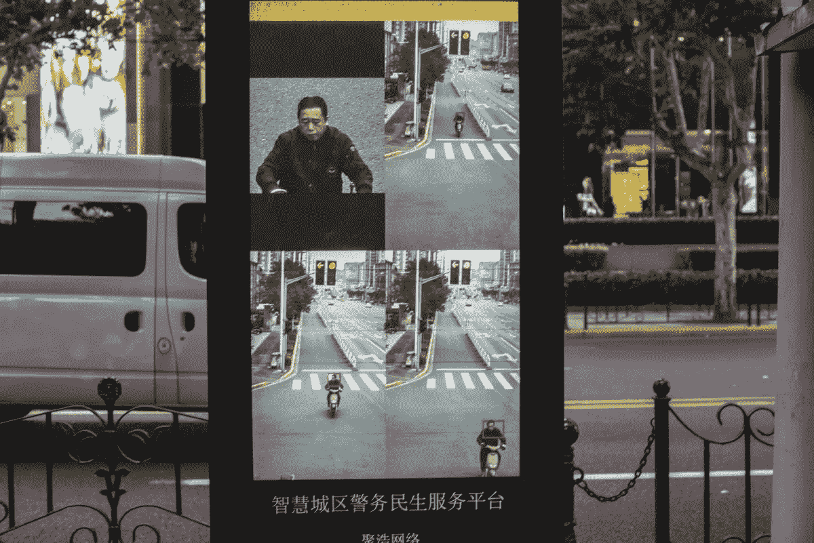
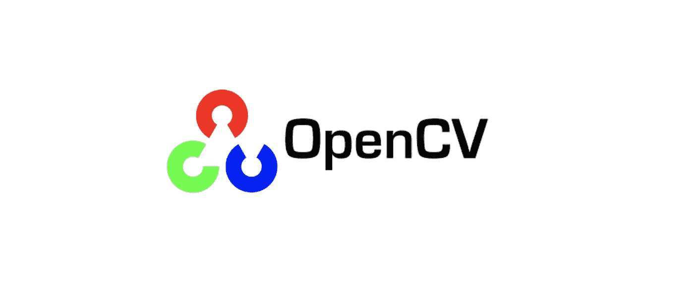
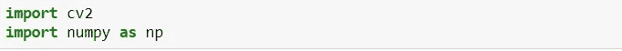
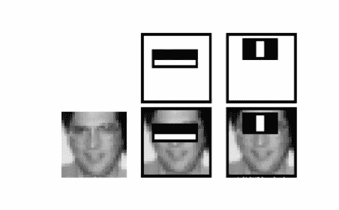
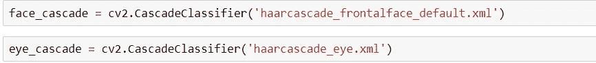
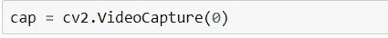
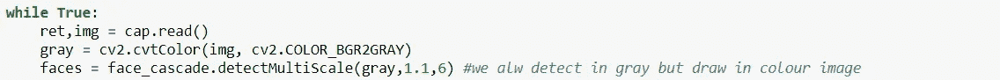
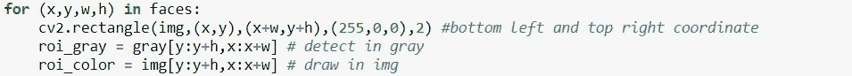
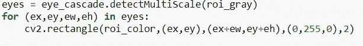
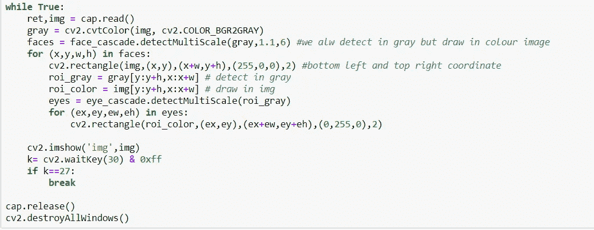

# 一个简单的 OpenCV 人脸检测演示

> 原文：<https://medium.com/analytics-vidhya/a-simple-opencv-demonstration-for-facial-face-detection-31c94e7ea05d?source=collection_archive---------2----------------------->

# **1。简介**

近年来，面部和物体检测的需求急剧增加，原因是在安全、健康等领域的使用增加，甚至是在中国捕捉乱穿马路者。

面部识别检测乱穿马路者

随着我们进入第四次工业革命，面部识别的用例将大幅增加，并演变到更多领域。

# **2。为 Python 打开 CV**

今天在这里，我不打算教你如何做面部识别，因为这可能需要一个小时的教程本身，但只是一个简单的面部识别脚本在 python 中使用自己的摄像头！

英特尔的 OpenCV 是一款用于面部和物体检测的开源软件

我们将使用英特尔的 OpenCV，这是一个开源编程函数计算机视觉！

首先，让我们先在您的计算机上安装 OpenCV！我个人是通过 anaconda 使用 jupyter 的，所以我通过 anaconda 安装了它！你可以在下面找到下载链接！

 [## Opencv :: Anaconda 云

### 编辑描述

anaconda.org](https://anaconda.org/conda-forge/opencv) 

完成后，让我们打开笔记本开始吧！首先，我们将导入 cv2 和 numpy 包

导入包

接下来，我们将下载用于人脸和眼睛检测的级联分类器

# 3.什么是瀑布？

我一直认为，你应该了解你正在应用/使用的东西，以便充分理解其工作原理并获得更好的理解，所以在这里我将试图简单地解释什么是级联！

面部瀑布的例子

**注意:**实际的叶栅比这更复杂，但这只是一个例子！

级联就像一个窗口，检测我们想要检测的对象/面部的特征。在上面的例子中，我们可以看到 2 个不同的级联特征用于检测人脸。

水平特征依赖于这样的事实，即**眼睛通常比脸的脸颊**更暗，因此它被用于检测眼睛的位置。

垂直特征依赖于这样一个事实，即**鼻梁经常与同样较暗的眼睛区域**形成对比(我们更突出的鼻子比凹陷的眼睛区域更亮)。

# 4.实现和下载级联

 [## opencv/opencv

### 开源计算机视觉库。在 GitHub 上创建一个帐户，为 opencv/opencv 开发做贡献。

github.com](https://github.com/opencv/opencv/tree/master/data/haarcascades) 

你需要为我们今天的面部检测练习下载面部和眼睛级联，链接在上面！

完成后，我们现在将为级联分类器分配一个变量！

现在，我们将使用视频捕捉来打开我们的网络摄像头！您应该将它设置为 0 来操作您的网络摄像机，除非您有一个以上的网络摄像机，在这种情况下，您可能必须使用“1”来代替

有趣的事情开始了！

我们在这里做的是，首先将我们拥有的图像(来自网络摄像头)转换成灰度。**对图像进行灰度处理可确保检测更加容易**但我们将在彩色图像/进纸上显示检测结果。

同样，在级联中，有 2 个主要因素会影响检测

1.  **比例因子**

这意味着如果存在的话，在图像中检测到该大小的面部。然而，通过重新缩放输入图像，你可以将较大的脸调整为较小的脸，使其能够被算法**检测到。或者换句话说，如果图像很大，我们倾向于增加比例因子**。通常，1.1 或 1.2 应该足够了

**2。近邻**

它是保持检测所需的相邻矩形的数量。通常 3-6 个就足够了

这里，(x，y，w，h)表示 x 和 y 坐标，w 表示宽度，h 表示高度。

cv2.rectangle 是 cv2 中的一个函数，它允许你通过传递图像、左下角坐标、右上角坐标以及矩形的颜色(255，0，0 表示红色，这是一个 RGB 像素代码)来绘制一个矩形，最后是我设置为 2 的厚度

roi_gray 稍后再次用于眼睛检测！ROI 代表图像的区域，以防有人想知道！

这是这部分的整个代码的样子。

最后几个部分只是 cv2.imshow 来显示图像，并使用一个 waitkey，这样你就可以在你的窗口上按下“esc”键来跳出记录并停止这个过程。

cap.release 还会释放网络摄像头并暂停它！

你也可以访问我的 github 获得完整的代码，它基本上是所有这些片段的组合。[https://github . com/k-choon kiat/Python-Machine-Learning-/blob/master/OpenCV % 20 video . ipynb](https://github.com/k-choonkiat/Python-Machine-Learning-/blob/master/OpenCV%20video.ipynb)

或者，你可以在 youtube 上观看 sentdex 的现场演示来解释它