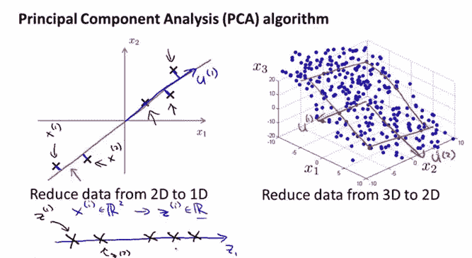
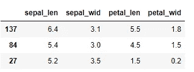
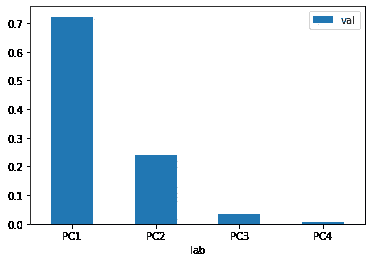
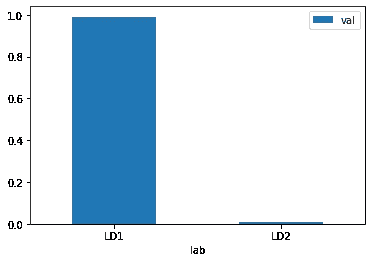
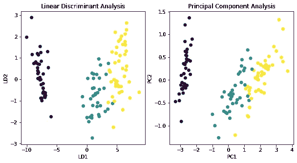
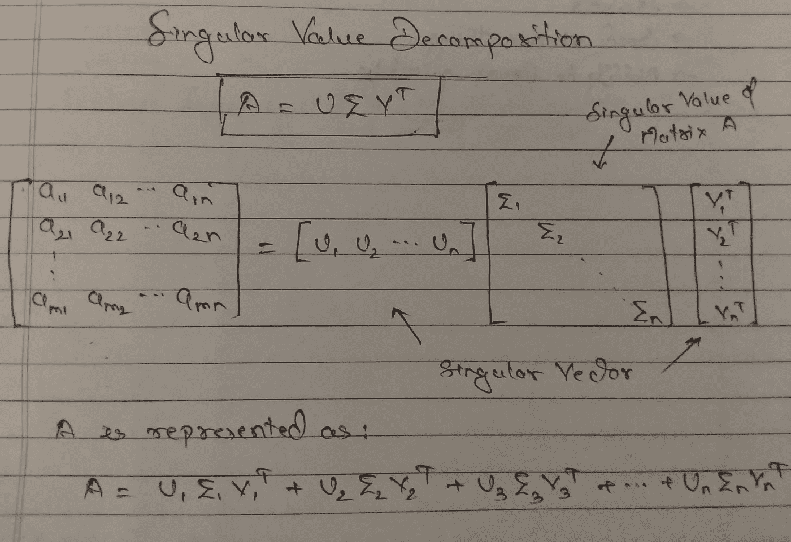
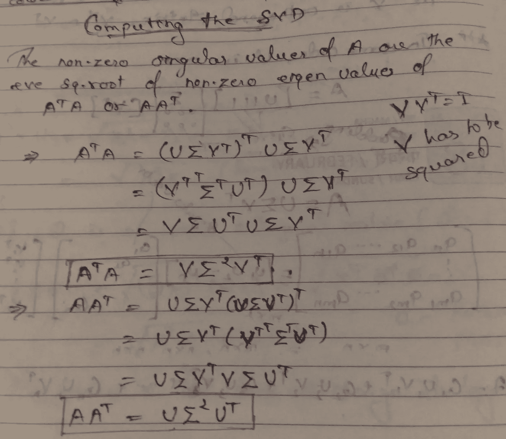
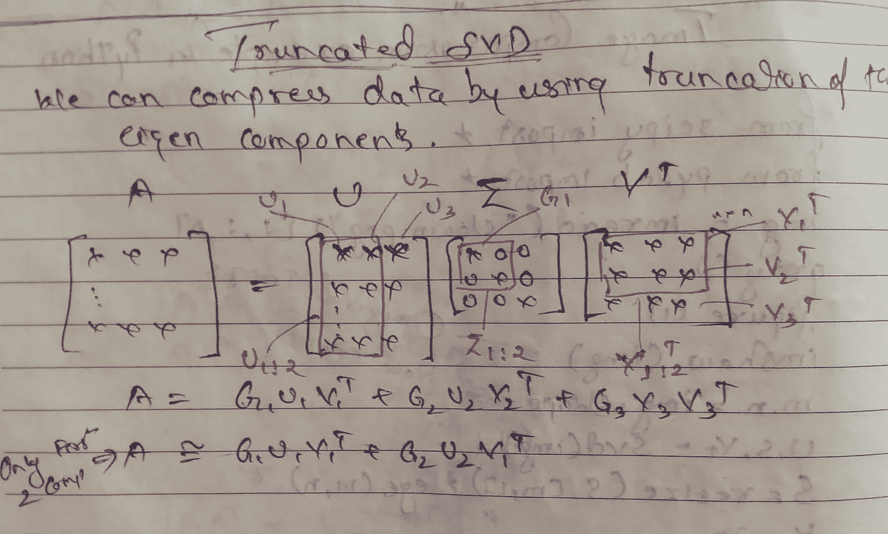
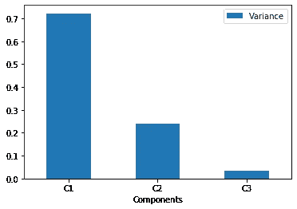

# 简单实用的特征约简基本技术介绍

> 原文：<https://medium.com/analytics-vidhya/a-simple-practical-introduction-to-essential-techniques-of-feature-reduction-db4002fd16b5?source=collection_archive---------6----------------------->


在机器学习模型中，基本目标是创建一个简单的模型，可能不太准确，但提供更快的结果。复杂模型倾向于过度拟合，导致更好的样本内误差，但高的样本外误差。特征工程、特征选择、特征减少和特征提取技术有助于创建一个简单而强大的模型，该模型根据最佳数量的特征进行训练，并能更快地进行预测。

# 为什么要减少特征？

**特征约简在机器学习流水线中起着至关重要的作用，并解决以下问题:**

*   **多重共线性** :-在多重共线性中，自变量之间是相关的，预测因变量或目标变量的基本方法是具有与目标变量相关且不相关的特征。所有的自变量都应该带有一些定义目标变量的附加信息。
*   **维数灾难/过度拟合** :-当我们有一个非常高的特征数时，目标函数将变得太复杂，同时试图从所有变量中捕捉信息，并且导出的函数可能不是平滑的曲线。这可能会导致模型过拟合。
*   计算量大 :-移除不太重要的特征不仅使模型简单，还减少了计算时间，从而节省了系统资源。
*   降低了机器学习模型的有效性。

**在高维数据集中，特征约简技术可以帮助您:**

*   移除信息量较少的特征。
*   它使计算更有效率。
*   使模型简单，不容易过度拟合。

**在这篇博客中，我们将介绍以下降维技术的基本功能及其在 python 中的实现。**

*   主成分分析
*   皱胃向左移
*   德拉贡诺夫狙击步枪（Snayperskaya Vinyovka Dragunov 的缩写）

# 主成分分析:

方差越大，信息量越大的特征是 PCA 工作的基本原理。PCA 是一种无监督的统计方法，基于协方差矩阵分析。协方差矩阵**定义了一个变量与另一个变量的关系。使用协方差矩阵，计算特征向量&的特征值。PCA 创建新的尺寸或特征，从而保留原始特征的最大变化。这个新维度是一条使特征之间的方差最大化的线，被称为**主成分**。PC 的等式可以定义如下:**

PC1 =β1*****X1+β2*****X2 其中β1&β2 称为 PCA 负荷。

最大变化的方向由特征向量确定，特征向量中的数据点被称为 **PCA 负荷**，而**特征值**代表原始特征内方差方面的信息。

*   数据集主成分的最大数量将等于数据集中可用要素的数量。
*   加载数组的维数与原始特征的数目相同，即行数和列数等于原始特征的数目。

如以上等式中所定义的，PC1，即第一分量得分，是实际缩放特征数据和第一特征向量的 PCA 负载的乘积之和。类似地，PC2 分数是特征数据和第二特征向量的 PCA 负载的乘积的和。

**对于每个分量，我们使用 PCA 得分计算方差，计算的方差也被称为主分量的特征值。**

**Explained_variance_ratio** 是每个分量的特征值与所有分量的特征值之和的比值。



**图片来源:斯坦福大学 Andrew NG 教授的机器学习讲座* *

*   如上图所示，2D 图中的数据点被映射到 1D 轴上，从而以最小的误差获得最大的方差。
*   这里的**误差**是点到轴的垂直距离的平方和。
*   类似地，在 3D 到 2D 的情况下，点被映射在平面上。

我推荐阅读法尔哈德·马利克的这篇好文章，以获得关于特征向量特征值的更详细的数学知识。

# 关于数据集:

我们将使用一个内置的虹膜数据集，它可以通过 Sklearn API 加载。**鸢尾数据集**包含 3 类鸢尾植物的数据。

现在让我们导入所需的库并加载数据集。在给定的数据集中，我们有 4 个独立的特征。

我们将首先使用 **StandardScaler API** 缩放数据集，使所有变量处于相同的比例，然后我们将对缩放后的数据应用 PCA。

```
#Importing libraries
import pandas as pd # Pandas library to create dataframe
import warnings # To ignore depreciation warning 
warnings.filterwarnings('ignore')
import numpy as np 
import matplotlib.pyplot as plt
from sklearn.preprocessing import StandardScaler # Standard Scaling Library
from sklearn.decomposition import PCA # From Sklearn.decompostion API import PCA 
from sklearn.datasets import load_iris # Loading dataset from sklearn.dataset API
# Magic Function to display plot in code cell
%matplotlib inline#loading dataset
iris = load_iris() # loading dataset in iris variable
X = pd.DataFrame(iris.data) # Create DataFrame
X.columns = ['sepal_len', 'sepal_wid', 'petal_len', 'petal_wid'] # Naming column headers
y = iris.target # Loading Dependent or target variable 
from sklearn.model_selection import train_test_split # sklearn API to create random train test subsets
X_train,X_test,y_train,y_test = train_test_split(X,y,test_size=0.2,random_state=0) # Test_size-0.2 will give create 
#subset of 80:20 ratio i.e 80% Training Set & 20% Test set
X_train.head(3)
```



```
# Scaling the dataset before applying PCA will ensure that the variation from the original components are captured equally.
scaler = StandardScaler() # Creating standard scaler object
X_train_scaled = scaler.fit_transform(X_train) # Scaling train set using fit_transform method
X_test_scaled = scaler.transform(X_test) # Transform test set using the scaler object fitted on train set.
pca = PCA(n_components=4) # Creating pca object with 4 Principal components
pca.fit_transform(X_train_scaled)
pd.DataFrame({'lab':['PC1','PC2','PC3','PC4'],'val':pca.explained_variance_ratio_}).plot.bar(x='lab',y='val',rot=0);
```



**要点记住:**

*   **解释方差比率**用于确定充分提供原始特征所含信息的主成分数量。
*   在上面的例子中，前两个主成分解释了> 90%的特征变化，因此可以去掉其余的两个主成分。
*   **n_components:** 该参数可以用来限制主成分的个数。
*   例如:在 1000 个特征的情况下，使用 n_components 参数，我们可以通过使用**explained _ variance _ ratio _**值将特征的数量限制为最佳值。
*   **此外，由于计算限制导致内存错误问题，PCA 在高维稀疏矩阵上效果不佳。在这种情况下，可以使用 TruncatedSVD。**

**PCA 的另一种变体也是可用的，KPCA 即 KernelPCA，其中内核参数作为参数传递。使用最多的核是“RBF ”,它将原始特征映射到非线性函数，这与 PCA 是线性变换相反。**

# 线性判别分析:

顾名思义，LDA 是一种有监督的线性变换技术。在将高维特征映射到低维时，它试图为因变量保留尽可能多的判别能力。PCA 和 LDA 都是线性技术，但是与 LDA 相反，PCA 不考虑类别标签，LDA 基于最大化不同类别之间的分离的方法。

首先，让我们来看二进制类问题。

*   创建一个新轴，并将数据投影到轴上，以最大化两个类之间的间隔。
*   使用新绘制的数据点计算两个类别的平均值和方差。
*   现在最大化两个类之间的分离:
*   两个等级的平均值应尽可能接近，即平均值之间的差值应最大。
*   两个类别的方差之和应该尽可能低，即方差之和的值越低，每个类别的数据点越紧凑，类别之间的间隔也越大。LDA 将这种方差最小化称为分散。
*   新创建的轴称为线性判别式，它是最适合的线，可以最大化平均值之间的距离，最小化分散。

**在多类问题的情况下，假设 3 类问题**

*   LDA 将创建两个轴来分隔 3 个类。
*   这里，它将从选择每个类的质心点开始。
*   LDA 将计算新平面或轴的特征值和特征向量。
*   本征向量将定义轴的方向性，而本征值定义它所携带的关于原始数据分布的信息量。值越低，它携带的信息越少。
*   它试图优化线性方程，使平均值之间的距离最大化，分散最小化。

**要点记住:**

*   **由于 LDA 考虑了因变量，如果数据不是正态分布，可能会给出有偏差的结果。**
*   **在 LDA 中，特征缩放不影响 LDA 的结果。因此特征缩放是可选的。**

```
# lets start with importing the required libraries
from sklearn.discriminant_analysis import LinearDiscriminantAnalysis as LDA
lda  = LDA(n_components=2)
X_new = lda.fit_transform(X_train,y_train)
pd.DataFrame({'lab':['LD1','LD2'],'val':lda.explained_variance_ratio_}).plot.bar(x='lab',y='val',rot=0);
```



**修卡**

*   这里，即使是单一的线性判别式也能解释> 95%的方差。

# 让我们看看 LDA Vs PCA

```
#Plotting PCA Plot & LDA Plot
lda_plot = pd.DataFrame(X_new) 
lda_plot[2] = y_train # Adding label column in lda_plot dataframe
plt.figure(figsize=(10,5)) # Defining figure size
plt.subplot(1,2,1) # Initiating 1st Plot
plt.scatter(lda_plot[0],lda_plot[1],c=lda_plot[2]) # Plotting scatter plot for LD1 vs LD2
plt.title('Linear Discriminant Analysis')
plt.xlabel('LD1')
plt.ylabel('LD2')pca_plot = pd.DataFrame(pca_mod[:,:2])
pca_plot[2] = y_train
plt.subplot(1,2,2)# Initiating 2nd Plot
plt.scatter(pca_plot[0],pca_plot[1],c=pca_plot[2]) # Plotting scatter plot for PC1 vs PC2
plt.title('Principal Component Analysis')
plt.xlabel('PC1')
plt.ylabel('PC2')
plt.show()
```



*   **在 PCA 图中，主成分沿方差最大的轴定义。**
*   **在 LDA 图中，线性判别式沿轴定义，以说明最大的类间方差。LD1 充分描述了最大类间方差。**

# 奇异值分解:

维基百科将 SVD 定义为实数或复数矩阵的线性代数因式分解方法。对我们来说，这是另一种帮助减少或分解高维矩阵的方法。并且 SVD 的这一特性在信号处理、图像压缩、图像恢复、特征脸等各种应用中是有用的。

**让我们看看奇异值分解是如何实现的？**

*   奇异值分解将高阶矩阵分解成 3 个矩阵:U，σ& V，其中
*   U & V 向量是正交向量。
*   σ向量是奇异值的对角矩阵。
*   现介绍如下:



# 计算奇异值分解

*   为了计算 SVD，我们需要计算矩阵 A 与其转置的**乘积的**特征值&特征向量**以及转置矩阵与矩阵 A** 的乘积，如下所示。
*   如下推导:
*   向量 U 可以用矩阵 A 与其转置矩阵乘积的特征向量来表示。
*   向量 V 可以由转置矩阵与矩阵 A 的乘积的特征向量来表示

[参考:南多·德弗雷塔斯的演讲](https://youtu.be/daHVmoOrLrI)



*   **计算出的 A 的非零奇异值为非零特征值的+ve 平方根。**
*   **σ的对角线值代表保留的方差，并且总是按降序排列。(与 PCA 中讨论的概念相似)。**
*   **回到降维，我们可以使用这些值来降维，只考虑解释最大方差的值，并截断其余的值。**



让我们用 Python 来编码它。

我们将在同一个 IRIS 数据集上使用 TruncatedSVD API 执行降维。

```
from sklearn.decomposition import TruncatedSVD # Importing TruncatedSVD API from sklearn library
svd = TruncatedSVD(n_components=3) # Defining TruncatedSVD Object
svd.fit_transform(X_train_scaled); # Calling fit_transform method on X_train_scaled Dataset
pd.DataFrame({'Components':['C1','C2','C3'],'Variance':svd.explained_variance_ratio_}).plot.bar(x='Components',y='Variance',rot=0);
```



*   在 TruncatedSVD API 中，我们可以传递 **n_components** 参数，该参数应该总是小于独立特征的数量。(在上述情况下，特征数量为 4，因此 n_components 应小于或等于 3)
*   为了确定 **n_components** 参数值，我们可以使用 scree 图并确定解释最大方差的组件数量。
*   与 PCA 相反，TruncatedSVD 对**稀疏矩阵**有效。详细解释请参考 sklearn 文档。
*   除了 TruncatedSVD，我们可以使用 sklearn 的 **randomized_svd** API，它使用随机化来近似截断奇异值分解，以加速计算。

最后，在结束之前，我将提到另一种基于奇异值分解的降维技术，称为**【LSA】**。

*   TruncatedSVD 在 NLP 中用于缩减 TF-IDF(术语频率-逆文档频率)矩阵。
*   TF-IDF 表示给定文档中单词的频率&单词在语料库中的稀有程度。
*   潜在语义分析进一步对简化的矩阵应用余弦相似性，并且基于其值使用余弦相似性来查找相似的文档(值越接近 1 表示相似性越高)。