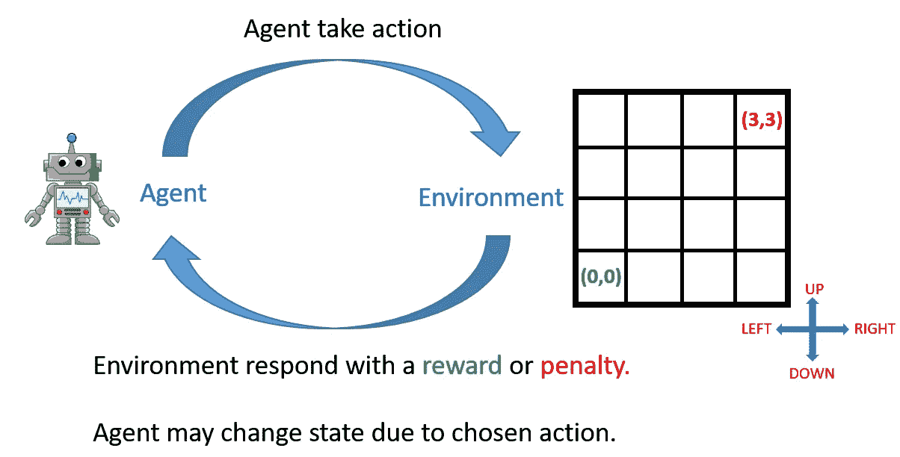

# 您的第一个强化学习环境从零开始

> 原文：<https://medium.com/analytics-vidhya/a-simple-reinforcement-learning-environment-from-scratch-72c37bb44843?source=collection_archive---------15----------------------->

e enforcement Learning(RL)是机器学习的一个强大类别，与监督学习(另一个强大类别)不同，它不需要带标签的数据来训练机器/代理做出智能决策。RL 只围绕两个元素:

*   **环境:**演员/机器(即代理)交互的(模拟)世界。
*   **代理:**演员(如机器人、计算机器等。)由 RL 算法训练以独立和智能地运行。

大多数关于强化学习的资源过多地(并且在大多数情况下是单独地)谈论了强化学习代理的训练技术(代理-环境交互)。这些资源很少或根本不关注环境的发展。这也是有意义的，因为开发 RL 算法是一天结束时的主要目标。诸如动态规划、Q 学习、SARSA、蒙特卡罗、深度 Q 学习等方法。只专注于培训代理(通常称为 RL-agent)。

一个 **RL-AGENT** 在与**环境**、交互时学会智能行为，并因其**动作**而接受**奖励**或**惩罚**。但是，如果我们没有这样的环境，我们怎么能训练一个特工呢？在大多数实际应用中，程序员可能不得不开发他们自己的培训环境。

在这个博客中，我们将学习如何开发一个简单的 RL 环境，RL 的 Hello-World，*网格世界环境*！

但是首先，让我们学习一些关于环境的基础知识。

# **RL 环境基础**

以下是 RL 环境的必需品:

*   **环境的状态/观察集**。
*   **环境对主体的奖惩**。
*   **为代理设置动作，在环境边界内**。

简而言之，RL 环境包含关于代理可以采取的所有可能的动作的信息，代理在这些动作之后可以实现的状态，以及作为交互的回报，环境给予代理的奖励或惩罚(负奖励)。

# **网格世界环境**

下面是一个网格世界环境的示例，其中一个代理(即一个机器人)从初始位置(0，0)开始，试图到达目标位置(3，3)，一次一步。



代理人与环境的相互作用

在上面的 4x4 网格世界中，机器人可以在每一步从集合{左、上、右、下}中随机选择任何动作。当代理在采取行动后从一个状态移动到另一个状态时，它得到-1 的奖励。这种负奖励(即惩罚)迫使代理以最少的步数完成旅程并到达终点状态。

如果代理想要跑出网格，它会得到-2 的惩罚。例如，如果代理从任何状态(0，0)，(0，1)，(0，2)，
(0，3)采取左动作，它会收到-2 的惩罚。

当代理从状态(2，3)，(3，2)中的任何一个移动到**终端状态** (3，3)时，它得到奖励 0。

**实施**

我们将把网格世界环境作为 Python 类来实现。下面给出了环境的框架。GridWorld_Env 类中有一个构造函数和四个方法。稍后我们将展示如何填充这些方法，并为额外的原因添加一个额外的方法。大部分代码都是不言自明的，因此我们不会添加太多的细节。但是，如果需要额外的解释或者环境可以进一步改善，请在评论区告诉我。

```
class GridWorld_Env:
    def __init__(self):
        pass
    # reset the agent when an episode begins    
    def reset(self):
        pass # Agent takes the step, i.e. take action to interact with 
      the environment
    def step(self, action):
        pass

    # Action reward given to the agent
    def get_reward(self):
        pass

    # Actual action that agent takes.
    def take_action(self):
        pass
```

就是这样！

这就是创造环境所需要的一切！

现在，让我们填充环境类。记住动作集{左，上，右，下}，奖励 0，-1，-2，状态(x，y) :(0，0) → (3，3)

```
class GridWorld_Env:''' Important paramenters
--> self.x, self.y : x,y coordinate for the grid agent. 
--> self.done : Flag variable which turns True when (i) either 
    episode ends, or (ii) maximum number of steps (200) are acheived
    in the episode.
--> self.MAX_HOR_VAL, self.MAX_VER_VAL : Maximuma Horizontal and 
    Vertical grid size of the environment. 
''' # Constructor for GridWorld_Env Object, i.e. our agent
    def __init__(self, hor, ver):
        self.actions = ["left", "up", "right", "down"] 
        self.x = 0
        self.y = 0
        self.MAX_HOR_VAL = hor-1
        self.MAX_VER_VAL = ver-1
        self.done = False
        self.episode_length = 0
        self.state_observation = [self.x, self.y] # Reset the agent at the start of each episode
    def reset(self):
        self.done = False
        self.episode_length = 0
        self.x, self.y = 0, 0
        self.state_observation = [self.x, self.y]
        return [self.x, self.y]

    # Returns the number of actions in the action set
    def action_space(self):
        return self.actions # Agent takes the step, i.e. take action to interact with 
      the environment
    def step(self, action): # If agent is at terminal state, end the episode, set 
      self.done to be True
        if self.state_observation == [self.MAX_HOR_VAL, 
           self.MAX_VER_VAL]:
            self.done = True
            return np.array(self.state_observation), self.reward,      
                   self.done, self.episode_length

        elif self.episode_length > 200:
            self.done = True
            return np.array(self.state_observation), self.reward, 
                   self.done,self.episode_length

        self.action = action
        self.reward = self.get_reward()
        self.state_observation = self.take_action()
        self.episode_length += 1

        if(self.episode_length >= 200):
            self.done = True

        return np.array(self.state_observation), self.reward, 
               self.done, self.episode_length

    def get_reward(self):
    # If agent tries to run out of the grid, penalize -2
        if (self.x == 0 and self.action == "left") or 
           (self.x == self.MAX_HOR_VAL and self.action == "right" ):
            return -2
        elif (self.y == 0 and self.action == "down") or 
             (self.y == self.MAX_VER_VAL and self.action == "up" ):
            return -2
    # If agent reached Terminal state, reward = 0 
        elif (self.x, self.y) == (self.MAX_HOR_VAL-1, 
             self.MAX_VER_VAL) and self.action == "right":
            return 0
        elif (self.x, self.y) == (self.MAX_HOR_VAL, 
             self.MAX_VER_VAL-1) and self.action == "up":
            return 0
    # For all other states, penalize agent with -1
        else:
            return -1

    # Method to take action, remain in the same box if agent tries
       to run outside the grid, otherwise move one box in the 
       direction of the action
     def take_action(self):  
        if self.x > -1 and self.x <= self.MAX_HOR_VAL:
            if (self.action == "left" and self.x == 0) or 
               (self.action == "right" and 
                self.x == self.MAX_HOR_VAL):
                self.x = self.x
            elif(self.action == "left"):
                self.x -= 1
            elif(self.action == "right"):
                self.x += 1
            else:
                self.x = self.x

        if self.y > -1 and self.y <= self.MAX_VER_VAL:
            if (self.action == "down" and self.y == 0) or 
               (self.action == "up" and self.y == self.MAX_HOR_VAL):
                self.y = self.y
            elif(self.action == "down"):
                self.y -= 1
            elif(self.action == "up"):
                self.y += 1
            else:
                self.y = self.y

        return [self.x, self.y]
```

这种环境可以用任何 RL 算法来测试。我们用 Q-Learning 进行了测试。完整的代码(带 Q 学习测试)可以在[这里](https://github.com/SRJaffry/GridWorld_Environment)找到。

然而，在下文中，我们仅仅展示了如何将代理作为 GridWorld_Env 类的对象来调用

```
# Since we have 3x3 grid, hence, we define following parameters
EPISODES = 100
MAX_HOR_LENGTH = 3
MAX_HOR_LENGTH = 3agent = GridWorld_Env(MAX_HOR_LENGTH, MAX_VER_LENGTH)
...
...for ep in EPISODES:
    # Reset the state of agent in the beginning of each episode
    current_state = agent.reset() 
    done = False
    ...
    ...
    while not done:
      ...
      ...
      # Select action using, for example Q-Learning and take step.
      next_state, reward, done, _ = agent.step(action_space[action])
      ...
```

祝你用 RL 算法训练代理人好运！如果可以做进一步的改进，请在评论中告诉我。

干杯