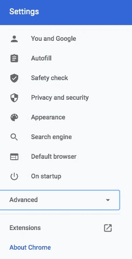
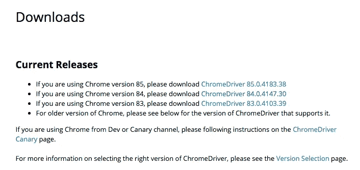
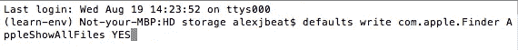
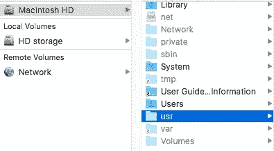
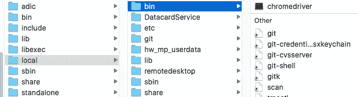
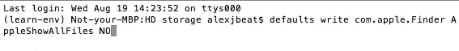
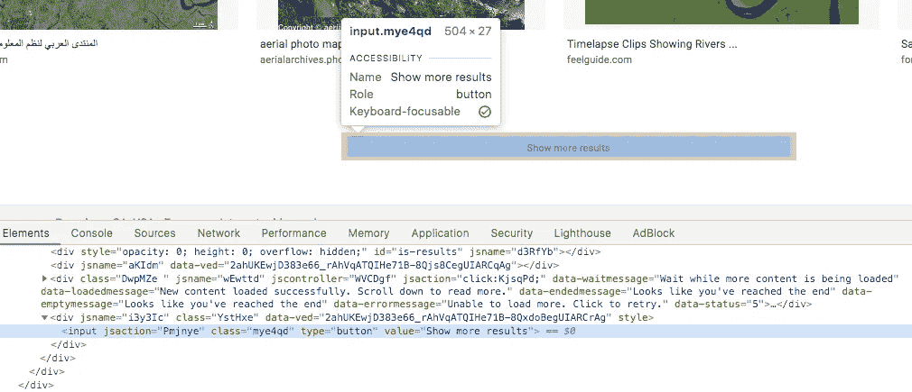
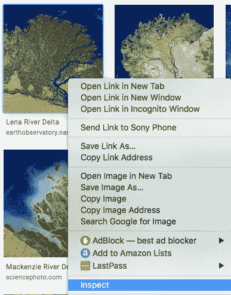
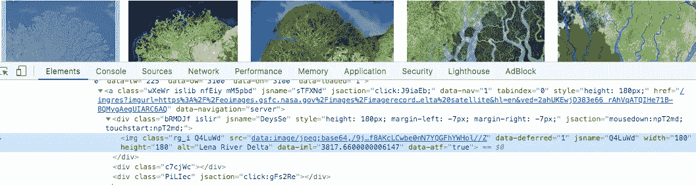

# 一个简单的 Selenium 图片来自 Mac 上的交互式 Google 图片搜索。

> 原文：<https://medium.com/analytics-vidhya/a-simple-selenium-image-scrape-from-an-interactive-google-image-search-on-mac-45d403e60d9a?source=collection_archive---------9----------------------->


照片由 [**提婆达尔山**](https://www.pexels.com/@darshan394?utm_content=attributionCopyText&utm_medium=referral&utm_source=pexels) 发自 [**派克斯**](https://www.pexels.com/photo/aerial-photo-of-gray-concrete-road-938582/?utm_content=attributionCopyText&utm_medium=referral&utm_source=pexels)

最近，我在完成毕业于 Flatiron 数据科学项目的最后一个顶点项目时，遇到了一个挑战。对于顶点，我们被要求编译我们自己的数据集。我的项目是一个图像分类模型，所以我选择刮一些图像。我第一次尝试使用 Beautiful Soup 从谷歌图片搜索中抓取图片是错误的，因为我无法让抓取的图片向下滚动页面，它只会返回一小组 10 张图片，这远远低于我训练模型所需的数量。其他网站建议我研究硒。由于不熟悉它以及它是如何工作的，我发现自己在试图让 Selenium 为我所需要的工作时遇到了一些障碍。下面是我使用 Selenium 抓取图像的一些步骤，希望它也能给你一些解决方案。这是一种简单的方法，尽管有许多其他的用例以及方法来处理这种情况，而我的方法恰好是一种非常“简单”的方法。这是我的 github 链接，我在卫星图像分类项目中使用的图像刮刀代码笔记本:[https://github . com/Alexander beat/river delta-satellite-image-class ification](https://github.com/alexanderbeat/riverdelta-satellite-image-classification)

# 1.获取 ChromeDriver。

第一步是获得你当前运行的 Chrome 版本。转到 Chrome 设置，然后点击边栏底部的“关于 Chrome”。它将显示您的当前版本。进入 [ChromeDriver](https://chromedriver.chromium.org/downloads) 链接进行下载，这是运行 Selenium 所需要的。它会根据你当前的 Chrome 版本告诉你下载哪个版本。拉开拉链，得到 chromedriver.exe。



点按 Chrome 设置边栏中的“关于 Chrome”按钮。



根据您的 Chrome 浏览器版本下载不同版本的 Chromedriver。

# 2.显示隐藏文件— usr/local/bin

下载 ChromeDriver 后，你需要将它放在一个隐藏的文件夹中。在 Finder 窗口中显示隐藏文件夹的典型方式是键入 Cmd + Shift +。(点)。我在一台装有 El Capitan 的 09 年旧 Mac 上运行这个程序，这样快捷方式就不起作用了，必须使用终端。打开“终端”,键入“默认写入 com . apple . finder appleshowlfiles YES ”,然后按 Enter 键。



命令在终端窗口中的外观。

这将允许隐藏文件出现在您的 finder 窗口中。如果他们没有出现，重新启动 Finder，然后他们应该会出现。在 Finder 中，如果你点击你的启动驱动器，会有一个名为“usr”的隐藏文件夹。转到 usr/local/bin，把 ChromeDriver 放在那里。



启动驱动器中隐藏的 usr 文件夹。您的启动驱动器可能有不同的名称。



usr 中包含的本地文件夹。

之后，您可以通过在终端中键入“defaults write com . apple . finder AppleShowAllFiles NO”并按 Enter 键来再次隐藏隐藏的文件。隐藏文件不应再出现在 Finder 中。



隐藏终端中显示的隐藏文件的命令。

# 3.在你的笔记本中使用硒。

## 设置和导入。

现在在 Jupyter 笔记本上，你可以 pip 安装 selenium，导入 webdriver，然后实例化它。

```
!pip install selenium**from** **selenium** **import** webdriver
**import** **time***#instantiate the driver* driver = webdriver.Chrome(‘chromedriver’)
```

## 设置您的 URL。

然后输入你要刮的网址。这将打开一个你的网址的 Chrome 窗口。

```
url = https://www.your_url.comdriver.get(url)
```

## 向下滚动页面。

然后，您将希望使用下面的代码让驱动程序交互式地向下滚动到页面的底部，以便您可以访问所有的图像。以前导入时间将允许您使用睡眠计数来加载页面。这里有几个关于这个主题的链接，我发现它们有助于让 scrape 发挥作用:

[](https://towardsdatascience.com/image-scraping-with-python-a96feda8af2d) [## 使用 Python 进行图像抓取

### 学习如何用 Python 从 Google 下载图片的代码指南！

towardsdatascience.com](https://towardsdatascience.com/image-scraping-with-python-a96feda8af2d) 

[*https://github . com/rmei 97/shiba _ vs _ jindo/blob/master/image _ scraper . ipynb*](https://github.com/rmei97/shiba_vs_jindo/blob/master/image_scraper.ipynb)*。*

```
page_scroll_sleep = 2

    *# Get scroll height*
    last_height = driver.execute_script("return document.body.scrollHeight")

    **while** **True**:
        *# Scroll down to bottom*
        driver.execute_script("window.scrollTo(0, document.body.scrollHeight);")

        *# Wait to load page*
        time.sleep(page_scroll_sleep)

        *# Calculate new scroll height and compare with last scroll height*
        new_height = driver.execute_script("return document.body.scrollHeight")

        **if** new_height == last_height:
        *#break #insert press load more*
            **try**:
                element = driver.find_elements_by_class_name('mye4qd') *#returns list*
                element[0].click()
            **except**:
                **break**
        last_height = new_height
```

类“mye4qd”用于页面底部出现的一个按钮，看起来就像下图所示。驱动程序代码将点击此按钮，以保持滚动到页面底部。



Inspect 中显示的“显示更多结果”按钮的“mye4qd”类。

## 获取图像类对象。

现在你已经滚动到了页面的底部，所有的图片都被加载了，这将会找到页面中所有的图片类。

```
*# gets link list of images*image_links = driver.find_elements_by_class_name(‘rg_i.Q4LuWd’)
```

## 从图像对象中提取图像链接。

下面的这些循环将从上面创建的“image_links”变量中的每个图像类中提取实际的图像源链接。有时链接是“src”链接，有时是“数据-src”链接。它有助于通过右键单击搜索页面上的一个图像，然后单击“检查”来了解我的意思。这些循环将收集这两种类型，您可以将它们组合成一个您喜欢的列表，或者分别从它们中提取图像。

```
src_links = [image_links[i].get_attribute(‘src’) **for** i **in** range(len(image_links))]data_src_links = [image_links[i].get_attribute(‘data-src’) **for** i **in** range(len(image_links))]
```



右键单击图像，然后单击进行检查。



这将显示该特定映像的“src”链接。

## 用 urllib 保存图像。

numpy 的睡眠时间列表将在不同的时间间隔从你的链接列表中随机抓取每张图片，以避免被认为你是机器人的网站屏蔽。Urllib.request 会将您的图像保存在您用于笔记本的当前工作目录中。Tqdm 是一个基本的进度条，它会在页面迭代、抓取和保存图像时向您显示进度。

```
**import** **urllib.request****import** **numpy** **as** **np****from** **tqdm** **import** tqdmsleeps = [1,0.5,1.5,0.7]
```

f 字符串将根据它在图片链接列表中的索引位置对你的图片进行编号，并且循环遍历包含你抓取的所有“src”和/或“数据-src”链接的名为“链接”的列表。最后，“driver.quit()”将关闭交互式 Chrome 窗口进程。

```
*# urllib save images into folder and renames using data_name string*
    **for** i,link **in** enumerate(tqdm(links)):

        name = data_name+f'**{i}**.jpeg'

        urllib.request.urlretrieve(link, name)
        time.sleep(np.random.choice(sleeps))

    driver.quit()
```

# 结论

如果你以不道德的方式使用图像，抓取图像可能会很麻烦，所以我不建议你为了任何金钱利益或类似的活动而窃取图像。我只是展示这一点，作为一个例子，我能够获得一组用于教育学校项目的图像。请记住这一点，因为很多谷歌图片都有版权。