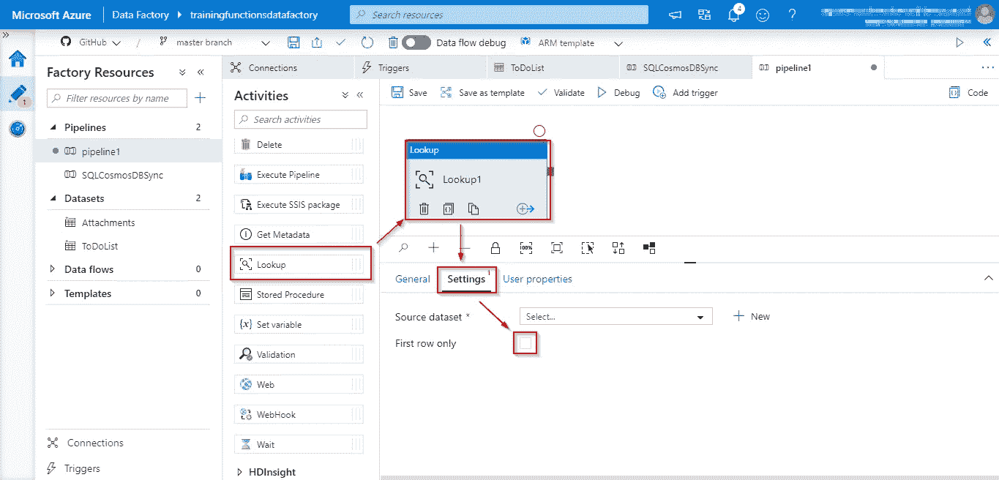
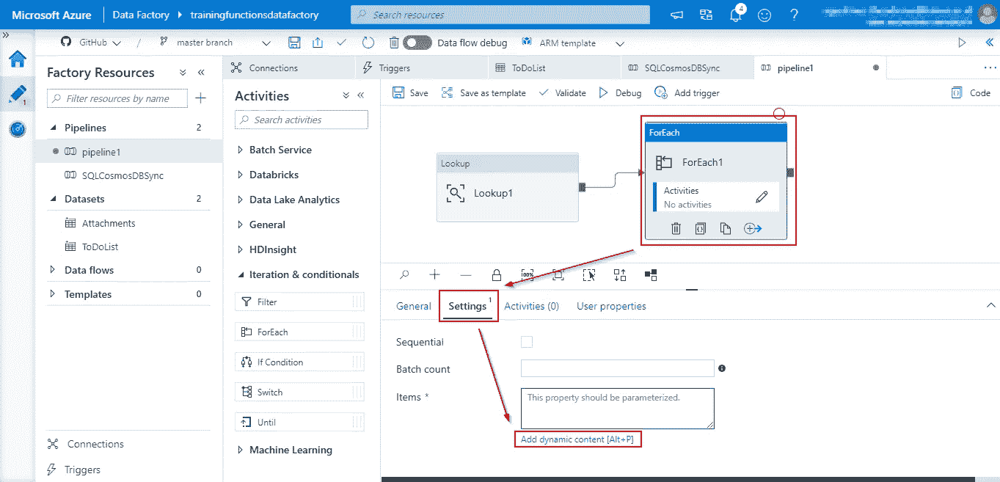

# 我在 Azure 数据工厂中学到了什么

> 原文：<https://medium.com/analytics-vidhya/a-simple-tutorial-on-azure-data-factory-e92b4a2c1b19?source=collection_archive---------14----------------------->

## 一口大小的小块将节省你一天的学习时间

Azure 函数现在可以作为一个步骤添加到 Azure 数据工厂(ADF)中。它使同步数据和创建有助于数据工程的触发函数变得更加容易。我不得不在即将到来的项目中使用这项技术，我的时间浪费在了谷歌搜索上，这就是为什么我决定与你分享我在 2 天内努力理解 ADF 后所学到的东西。该教程将涵盖**我需要实现的具体**事情。

**TL；博士**你可以 **Ctrl + F** 这个:

*   **创建 Azure 数据工厂(ADF)**
*   **ADF 中的管道**
*   **在 ADF 中添加新管道**
*   **在流水线中添加查找块**
*   **在查找中，将仅第一行响应更改为全部**
*   **将源数据集添加到查找中**
*   **在管道中添加 Azure 功能块**
*   **查找 Azure 功能最佳实践**
*   **在管道中连接 Azure 函数**
*   **在管道中添加一个 ForEach 块**
*   **连接管线块**
*   **将查找与 ForEach 连接**
*   **使用动态内容将对象添加到 ADF 中的对象内**

# 创建 Azure 数据工厂(ADF)

首先，在 portal.azure.com 上创建一个 Azure 数据工厂资源

填写这个新的数据工厂表单以生成一个:

*   填写数据工厂的名称。
*   选择资源组，如果还没有，点击**创建新的**按钮。
*   您可以将它连接到一个 GIT 存储库，但是我更喜欢以后再配置它，因此我取消了 **Enable GIT** 复选框。

# ADF 中的管道

## 在 ADF 中添加新管道

然后打开 adf.azure.com 上的 ADF 作者页面，添加一个新的管道

要添加新管道，单击 **+** 号，然后单击管道。

*瞧吧*！这是你的管道。

## 在管道中添加查找块

屏幕左侧有一个**活动**选项卡，将查找活动拖动到中央画布

在页面的底部，有 3 个选项卡。点击**设置**选项卡

## **在查找中，将仅第一行响应更改为全部**

取消勾选**仅第一行**复选框。**仅第一行**将允许我们查找第一行数据，取消选中将允许我们获得所有可用数据。

## 将源数据集添加到查找中

接下来您要做的是添加或选择一个数据集。点击**新建**按钮创建一个新的数据集源。

> 假设您已经具备在 Azure 上配置 SQL 数据库的知识。

在本教程中，为了简单起见，我们将使用一个 **Azure SQL 数据库**。点击**继续**。

管道需要处理数据集。尽管在本教程中，我们连接到 Azure SQL 数据库，但也可以连接到不同的数据库，如 Postgres、MySQL、MariaDB 等。

然后点击**新建**添加一个新的**链接服务**。**链接服务**用于将查找动作同步到数据库表。

需要 Azure 订阅。选择要使用的订阅，然后选择服务器名称。就我而言，我选择了我拥有的 Azure SQL Server 和 **TrainingFunctions** 数据库。

假设您已经填写了表格，点击**创建**连接到您选择的数据库。完成后，我们所要做的就是在**设置**选项卡中直接更改源数据集。

最后要做的事情是确定您希望您的查找执行哪种操作，在我的例子中，我希望它从一个名为 Attachments 的表中进行选择。

因此，该查询类似于上图。否则，你可以做其他复杂的事情，比如连接等等。

## 在管道中添加 Azure 功能块

添加 Azure 功能块同样简单，只需从**Activities>Azure Function**选项卡拖放到主画布即可。

## Azure 函数最佳实践的查找

不建议将整个查找输出发送给 Azure 函数。建议事先添加一个 ForEach 块。这就是我们在本教程中要做的。

## 正在管道中连接 Azure 函数

在 Azure 功能中，转到**设置**选项卡。

*   选择链接到 Azure 函数的链接服务。要添加新的链接服务，请单击**新建**链接。
*   在函数名文本框中填写 **Azure 函数名**，确保该函数名与链接服务中的相同。
*   填写所选 Azure 函数使用的方法。通常使用类似 **GET** 和 **POST** 的 HTTP 方法。

否则，要创建新的链接服务，请单击 **+新建**按钮

通过链接服务连接到 Azure 函数类似于连接到数据集。

填写链接服务表单以连接到您的 Azure 功能，选择一个订阅，然后选择所选功能。接下来的事情就是拿到你的功能键。

您可以在 portal.azure.com 的**首页>所有服务>功能 App >功能项目>功能>{功能名称} >管理**中获得您的功能键。

## 在管道中添加 ForEach 块

添加 ForEach 块就像从**活动>迭代&条件**选项卡拖放到主画布一样简单。

# 连接管道块

## 将查找与 ForEach 连接

在这个前提下，我们需要将 Lookup 块连接到 ForEach 块。将查找输出发送到 ForEach 块中进行迭代和处理。

首先，我们需要通过活动连接两个模块，有 4 种类型的活动:成功、失败、完成和跳过。当你点击查找框右下角**的 **+** 符号时，你可以看到这一点。**

在本例中，我们将使用成功活动。连接后，点击 **ForEach** 块，转到**设置**选项卡。

## 使用动态内容在 ADF 中的对象内添加对象

动态内容用于定制输入。

点击项目文本框并点击**添加动态内容**按钮。

在**添加动态内容**子页中，滚动到底部并单击查找输出表达式，这将把查找输出添加到要处理的 ForEach 输入中。

这个例子演示了如何使用 string Concat 函数将两个查找项连接在一起作为一个输入，然后将它们再次转换为 JSON，然后传递给 Azure 函数。在上面的例子中，输入将传递 5 个属性 **ID、描述、PIC、附件和 IsComplete** 。其中**附件**属性是来自先前查找的 JSON 对象列表。

# 最后的想法

Azure Data Factory 对于数据工程来说是一个很好的工具，从长远来看，它是非常有益的，当你的数据库增长到几乎无法管理的时候，ADF 可能是你的一个选择。加上 Azure 功能，潜力无穷。甚至可以连接到与微软无关的数据库！我希望这个教程对你有用。