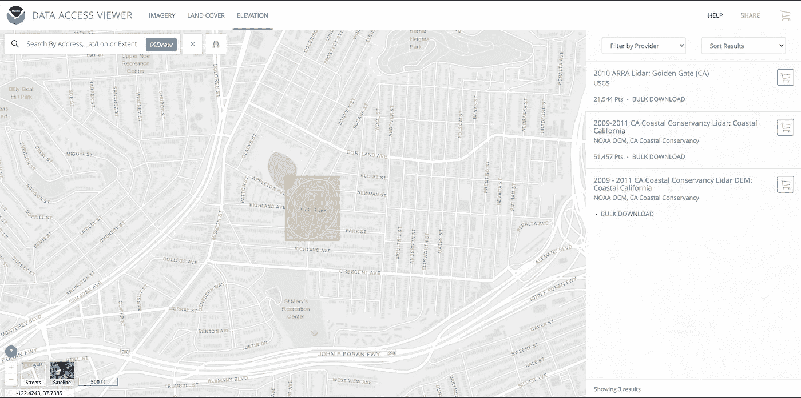
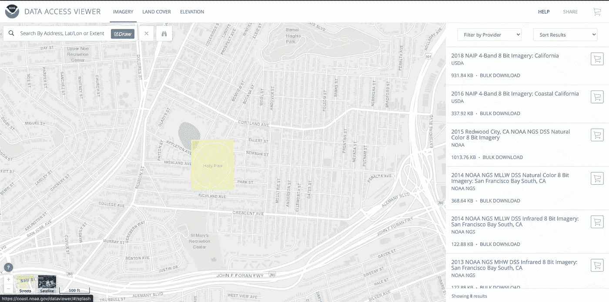
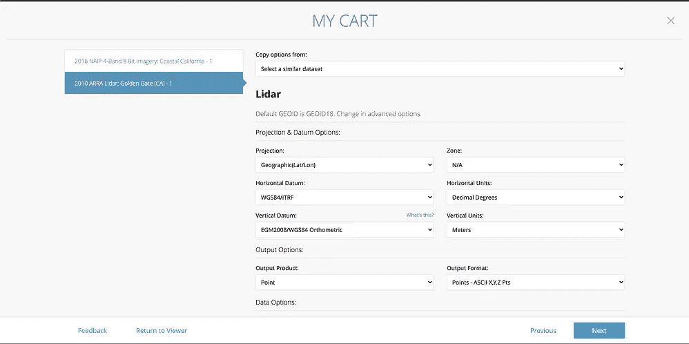
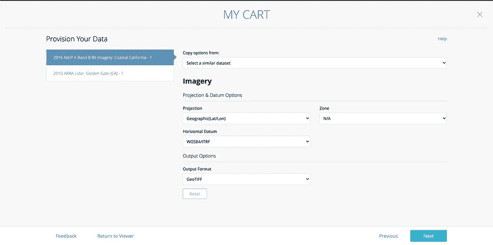
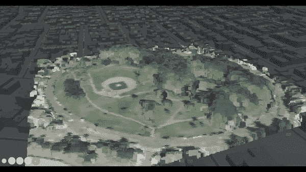

# 使用 xyzspaces 使用彩色激光雷达点云构建您自己的 3D 地图的简单方法

> 原文：<https://medium.com/analytics-vidhya/a-simple-way-to-build-your-own-3d-map-with-coloured-lidar-point-clouds-using-xyzspaces-5b3ca6e43d48?source=collection_archive---------10----------------------->


**旧金山金门大桥彩色激光雷达数据**

在分析激光雷达数据时，可视化激光雷达点云数据是一个重要的部分。用于对激光雷达数据点进行着色和可视化的大多数方法都涉及许多步骤，并且需要 QGIS 等工具的知识。因此，今天我们将看到一种简单的方法来使用 [xyzspaces](https://github.com/heremaps/xyz-spaces-python) 对激光雷达点云数据进行着色，并使用 [Harp.gl](https://github.com/heremaps/harp.gl) 以简单的方式将其可视化。

我们将使用 Python 作为本教程的编码语言。我们将需要一套 python 库，下面是包的列表，你可以用 pip 命令轻松安装它们。

*   [xyzspaces](https://pypi.org/project/xyzspaces/)
*   [拉斯特里奥](https://pypi.org/project/rasterio/)
*   [熊猫](https://pypi.org/project/pandas/)
*   [scipy](https://pypi.org/project/scipy/)
*   [geojson](https://pypi.org/project/geojson/)

以下是如何使用彩色激光雷达点构建您自己的 3D 地图。让我们为旧金山的 [**冬青公园**](https://user-images.githubusercontent.com/30625612/91130314-14ccc300-e6c9-11ea-9d43-e2e655611aaf.jpeg) **做一个吧。**

现在让我们获取一些数据，我们将使用一个奇妙的资源，那就是 NOAA 网站。我们需要 NOAA 网站上的两种数据类型，一种是高程数据(激光雷达数据)，另一种是影像数据(颜色数据)。

## [高程数据源](https://coast.noaa.gov/dataviewer/#/lidar/search/-13627862.786520233,4542209.2338303095,-13627595.462196458,4542531.609236469)

使用上面的链接到 NOAA 海拔网站，选择 **2010 ARRA 激光雷达:金门(CA)** 并将其添加到购物车。



## [影像数据源](https://coast.noaa.gov/dataviewer/#/imagery/search/-13627862.786520233,4542209.2338303095,-13627595.462196458,4542531.609236469)

使用以上链接访问 NOAA 图像网站，选择 **2016 NAIP 4 波段 8 位图像:加州海岸**并将其添加到购物车中。



现在，单击右上角的购物车，这将显示您已经添加到购物车中的数据，然后单击下一步。

接下来，在“Provision your data”屏幕中为每个数据更改一些设置，如下图所示，因为这将有助于我们稍后轻松可视化数据。



激光雷达和影像数据的“调配数据”设置

之后，点击“下一步”,输入您的电子邮件 ID 并提交订单。您将收到来自 NOAA 的两封电子邮件，其中包含激光雷达数据和影像文件的下载链接。

现在让我们开始一些编码！！！

首先，我们需要解压缩从 NOAA 获得的激光雷达数据和图像文件的 zip 文件。

## 处理影像数据

对于解压缩文件夹中的影像数据，您会看到多个文件，但我们只需要一个文件，即。tiff 文件，我们将从中提取颜色数据，这实际上是。tiff 文件以及与颜色像素相关联的纬度和经度。我们将在这里使用 rasterio 来简化事情。

```
import rasterio as rio
from affine import Affinewith rio.open('/Users/omestry/Downloads/Imagery_ISLAND_NEW/Job561243_2016_4BandImagery.tif') as imagery_data:
    T0 = imagery_data.transform
    T1 = T0 * Affine.translation(0.5, 0.5)
    pixel2coord = lambda c, r: (c, r) * T1
    width = imagery_data.width
    height = imagery_data.height
    generate_colour_data(width, height, imagery_data, pixel2coord)
```

上面的代码提取了。tiff 文件并将其传递给函数 **generate_colour_data** ,该函数将以如下格式将颜色数据填充到一个列表中

[经度，纬度，红色，绿色，蓝色，阿尔法]

以下是 generate_colour_data 函数的实现

```
colour_data = []def generate_colour_data(width, height, imagiry_data, pixel2coord):
    for i in range(1, height):
        for j in range(1, width):
            colour_data.append(
                [
                    pixel2coord(j, i)[0],
                    pixel2coord(j, i)[1],
                    imagiry_data.read([1])[0][i - 1][j - 1],
                    imagiry_data.read([2])[0][i - 1][j - 1],
                    imagiry_data.read([3])[0][i - 1][j - 1],
                    imagiry_data.read([4])[0][i - 1][j - 1],
                ]
            )
```

现在，让我们使用 [xyzspaces](https://pypi.org/project/xyzspaces/) 包将生成的颜色数据添加到 DataHub 空间，这样我们以后就可以利用 DataHub 的搜索功能。

要使用 xyzspaces，您需要一个 DataHub 令牌。以下是关于如何生成数据中心令牌的链接:-【https://www.here.xyz/api/getting-token/ 

一旦你有数据中心令牌，我们需要创建一个空间。使用以下代码创建一个数据中心空间

```
import xyzspaces as xyzxyz_token = "[YOUR-XYZ-TOKEN]"
xyz = xyz.XYZ(credentials=xyz_token)title = "LIDAR COLOR DATA"
description = "LIDAR COLOR DATA"space = xyz.spaces.new(title=title, description=description)
```

一旦我们创建了一个**空间**，我们就可以使用以下代码以优化的方式将颜色数据编写为 geojson 特性，我们将使用 python 的多处理特性来执行多线程。

```
import concurrent.futures
import time
from functools import partial
from multiprocessing import Manager, Processfrom geojson import Feature, Point
from xyzspaces.utils import groupermanager = Manager()def upload_features(features, space):
    fc = []
    try:
        for data in features:
            if data:
                lat, lng = data[1], data[0]
                f = Feature(
                    geometry=Point((lng, lat)),
                    properties={
                        "R": float(data[2]),
                        "G": float(data[3]),
                        "B": float(data[4]),
                    },
                )
                fc.append(f)
        feature_collection = dict(type="FeatureCollection", features=fc)
        space.add_features(features=feature_collection)
        time.sleep(3)
    except Exception as e:
        print(e)features_size = 1000groups = grouper(features_size, colour_data)part_func = partial(upload_features, space=space)with concurrent.futures.ProcessPoolExecutor() as executor:
    executor.map(part_func, groups, chunksize=3)
```

现在我们的图像数据已经准备好了，我们将在后面的步骤中使用生成器空间。

## 处理激光雷达数据

对于解压缩文件夹中的激光雷达数据，您会看到多个文件，但我们只需要一个文件，即。txt 文件，实际上是一个 CSV 数据文件。我们需要从文件中创建一个熊猫数据帧，如下所示

```
import pandas as pdcsv_data = pd.read_csv('/Users/omestry/Downloads/LIDAR_ISLAND_NEW/Job561242_ca2010_arra_goldengate_m5007_raw.txt')csv_data[3] = -1
csv_data[4] = -1xa = csv_data.to_numpy()
```

这里，我们还在生成的 DataFrame 中添加了两个额外的列，因为我们将使用 scipy 的 [cdist](https://docs.scipy.org/doc/scipy/reference/generated/scipy.spatial.distance.cdist.html) 函数，该函数要求数据行具有相同的大小，然后我们将它转换为 NumPy 数组。

现在我们完成了激光雷达数据，它已经准备好了！！！

## 生成地图数据

现在让我们定义一些距离函数，我们将把它传递给 scipy 的 [cdist](https://docs.scipy.org/doc/scipy/reference/generated/scipy.spatial.distance.cdist.html) 函数，该函数将使用它来确定两点之间的距离。这里我们将使用**哈弗森**距离。

```
from math import radians, cos, sin, asin, sqrt
from scipy.spatial.distance import cdistdef haversine(lon1, lat1, lon2, lat2):
    """
    Calculate the great circle distance between two points 
    on the earth (specified in decimal degrees)
    """
    # convert decimal degrees to radians 
    lon1, lat1, lon2, lat2 = map(radians, [lon1, lat1, lon2, lat2]) # haversine formula 
    dlon = lon2 - lon1 
    dlat = lat2 - lat1 
    a = sin(dlat/2)**2 + cos(lat1) * cos(lat2) * sin(dlon/2)**2
    c = 2 * asin(sqrt(a)) 
    r = 6371 # Radius of earth in kilometers. Use 3956 for miles
    return c * rdef func(p1, p2):
    return haversine(p1[0], p1[1], p2[0], p2[1])
```

现在我们将结合激光雷达数据和颜色数据。为了结合激光雷达数据和颜色数据，我们将使用**最近邻方法**。对于每个激光雷达数据点，我们将尝试找到最接近的颜色数据点，并将颜色数据与该激光雷达数据点相关联，为此，我们将使用 DataHub space 的[空间搜索功能](https://xyz.api.here.com/hub/static/swagger/#/Read%20Features/getFeaturesBySpatial)。

对于每个激光雷达点，我们将每个点视为圆心，半径为 3 米(我们需要将半径设置为尽可能小，以减少要比较的要素)。使用上述考虑因素，DataHub 空间搜索将从激光雷达点半径 3 米内的**空间**返回色点。如果存在多个点，我们将使用 scipy 的 [cdist](https://docs.scipy.org/doc/scipy/reference/generated/scipy.spatial.distance.cdist.html) 函数找到最近的一个。下面是使用上述算法生成最终数据的代码。

```
import concurrent.futures
import time
from functools import partial
from multiprocessing import Manager, Processimport numpy as np
from geojson import Feature, Point
from xyzspaces.utils import groupermanager = Manager()
final_data = manager.list()def gen_feature_color(features, space_color, func):
    try:
        for d in features:
            fl = []
            for f in space_color.spatial_search(lon=d[0], lat=d[1], radius=3):
                fl.append(
                    [
                        f["geometry"]["coordinates"][0],
                        f["geometry"]["coordinates"][1],
                        f["properties"]["R"],
                        f["properties"]["G"],
                        f["properties"]["B"],
                    ]
                )
            closest_index = cdist(
                XA=np.array([d]), XB=np.array(fl), metric=func
            ).argmin()
            rgb = fl[closest_index]
            final_data.append([d[0], d[1], d[2], rgb[2], rgb[3], rgb[4]])
            print(len(final_data))
    except Exception as e:
        print(e)features_size = 1000groups = grouper(features_size, xa)part_func = partial(gen_feature_color, space_color=space, func=func)with concurrent.futures.ProcessPoolExecutor(max_workers=60) as executor:
    executor.map(part_func, groups, chunksize=3)
```

上述代码可能需要一些时间来执行，具体取决于您的系统，因为它会为每个激光雷达数据点查找最接近的色点，大约为 1，48，913，因此请耐心等待😉并且在代码执行之前拥有一个☕️。该代码将打印它已经处理的点数。一旦执行完成，我们将准备好 **final_data** 列表中的最终数据。现在我们只需要保存它并将其可视化。

我们将把列表保存为一个 JSON 数组，因此要做到这一点，我们需要使用 pandas

```
from pandas import DataFramedf = DataFrame(list(final_data))df.to_json('FINAL_DATA.json', orient='values')
```

我们现在完成了数据处理，现在我们将进入最后也是最激动人心的部分，在地图上可视化数据。

## 可视化数据

我们将使用 Harp.gl 来可视化生成的数据，要使用 [Harp.gl](https://github.com/heremaps/harp.gl) 我们将需要一个 HERE API-KEY，您可以通过以下链接中的步骤生成它:-[https://developer . HERE . com/tutorials/getting-HERE-credentials/](https://developer.here.com/tutorials/getting-here-credentials/)

以下是可用于可视化生成的数据 3D 地图数据的代码，只需将[YOUR-API-KEY]替换为您的 HERE API-KEY 和 FINAL_DATA.json 的路径(如果它不在与代码相同的位置),瞧！！！

最终结果会是这样的🤩



**旧金山霍利公园**最终数据可视化

全部代码都呈现在这个[资源库](https://github.com/omanges/Color-LIDAR)

[xyzspaces](https://github.com/heremaps/xyz-spaces-python) 的 Github 存储库链接

如果你有任何问题，请随时联系我😉

享受快乐编码！！！

如果您觉得这很有帮助，请点赞并分享 [@omanges333](https://twitter.com/omanges333) 和