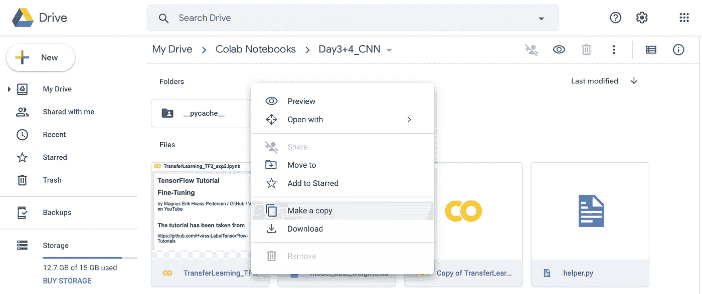
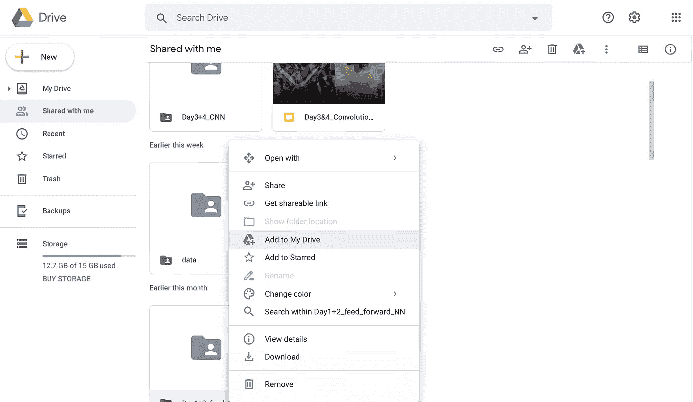
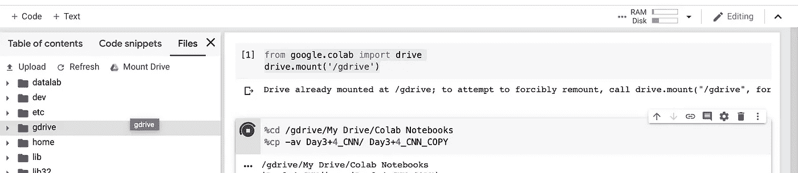
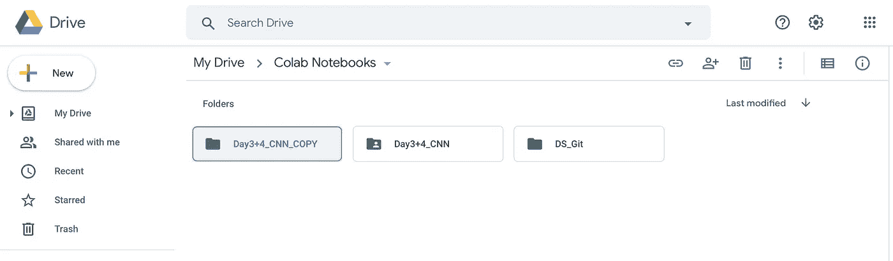

# 使用 Colab 复制 Google Drive 中整个文件夹的简单方法

> 原文：<https://medium.com/analytics-vidhya/a-simple-way-to-copy-entire-folders-in-google-drive-7eabd5426049?source=collection_archive---------0----------------------->


Google Drive 是存储文件和文档管理的绝佳平台。然而一个恼人的特点是，它只允许你复制文件，而不是目录(截至 2020 年 1 月)。



选择单个文件

选择一个单独的文件或多个文件进行复制就可以了，右键单击会出现“复制”到您的驱动器的选项。

但是当你选择文件夹作为选择的一部分时，Google Drive 没有给 ***复制文件夹*** 的选项。什么？！

## 经典问题

有人与您共享一个包含多个子文件夹和文件的文件夹，但告诉您*不要*更改原始数据。因此，您需要将该文件夹复制到您自己的驱动器上。

但是当你右击共享文件夹时，你只能选择“添加到我的驱动器”，而*不会复制文件夹；它会在你的驱动器上放置一个文件夹的快捷方式，这也没有用，因为你不想修改共享文件夹！*



将共享文件夹的快捷方式添加到 Google Drive

## 解决方案——打开一个 Google Colab 笔记本！

幸运的是，这个问题有一个简单的黑客解决方案。使用 Google Colab，您可以将您的 Google Drive 映射到 Colab notebook，然后发出 Linux 命令来操作/复制您的文件。

## 1.打开 Google Colab 笔记本

## 2.映射您的 Google Drive

```
from google.colab import drivedrive.mount('/gdrive')
```

## 3.使用 Linux 复制

```
#path that contains folder you want to copy
%cd /gdrive/My Drive/...%cp -av YOUR_FOLDER NEW_FOLDER_COPY
```



如果您想知道%是做什么用的，它只是 Google Colab 向笔记本发出运行 Linux 终端命令的信号。要帮助您找到 Google Drive 或文件夹的“路径”,请使用左侧面板——右键单击文件夹会出现“复制路径”选项。

最后，确认文件夹复制成功。



搞定了。

我很有信心，这是最简单的解决方案，有效地复制谷歌驱动器上的大文件夹。许多人尝试的一个不太有效的解决方案是下载感兴趣的文件夹，然后再次上传到他们的驱动器。

希望有帮助！