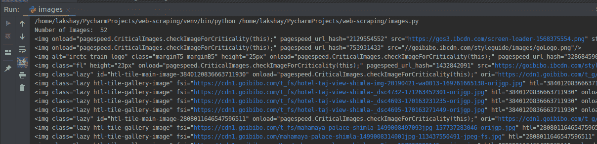
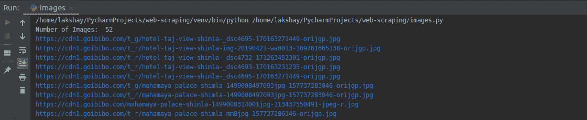
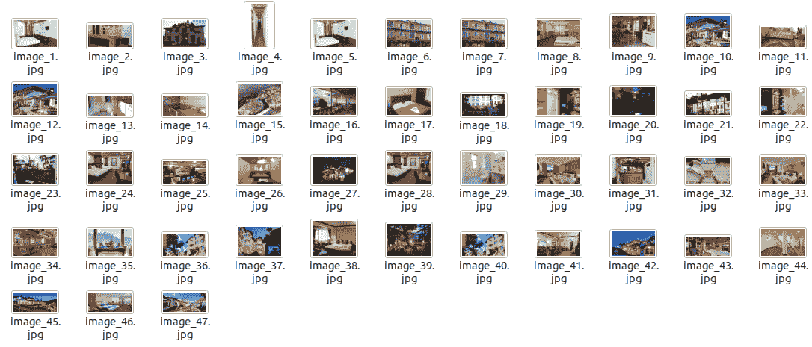

# 用 Python 抓取图像的简单方法

> 原文：<https://medium.com/analytics-vidhya/a-simple-way-to-scrape-images-in-python-4b543936c150?source=collection_archive---------3----------------------->


在本文中，我们将从同一个 *goibibo* 网页中抓取所有图片。第一步是导航到目标网站并下载源代码。接下来，我们将找到所有使用 **< img >** 标签的图片:

```
# importing required libraries
import requests
from bs4 import BeautifulSoup# target URL
url = "[https://www.goibibo.com/hotels/hotels-in-shimla-ct/](https://www.goibibo.com/hotels/hotels-in-shimla-ct/)"headers = {
    'User-Agent': "Mozilla/5.0 (X11; Linux x86_64) AppleWebKit/537.36 (KHTML, like Gecko) Chrome/77.0.3865.90 Safari/537.36"
    }response = requests.request("GET", url, headers=headers)data = BeautifulSoup(response.text, 'html.parser')# find all with the image tag
images = data.find_all('img', src=True)print('Number of Images: ', len(images))for image in images:
    print(image)
```



从所有的图像标签中，只选择 ***< src >*** 部分。另外，请注意，酒店图像可以使用 ***jpg*** 格式。因此，我们将只选择那些:

```
# select src tag
image_src = [x['src'] for x in images]# select only jp format images
image_src = [x for x in image_src if x.endswith('.jpg')]for image in image_src:
    print(image)
```



现在我们有了一个图像 URL 列表，我们所要做的就是请求图像内容并将其写入一个文件。确保你打开文件***‘WB’(***写二进制)格式:

```
image_count = 1
for image in image_src:
    with open('image_'+str(image_count)+'.jpg', 'wb') as f:
        res = requests.get(image)
        f.write(res.content)
    image_count = image_count+1
```



您还可以通过页码更新初始页面 URL，并反复请求它们收集大量数据。

图像[资源](https://www.pymnts.com/news/security-and-risk/2019/sap-software-vulnerable-hack/)

*原载于 2019 年 10 月 10 日 https://www.analyticsvidhya.com**T21*[。](https://www.analyticsvidhya.com/blog/2019/10/web-scraping-hands-on-introduction-python/)