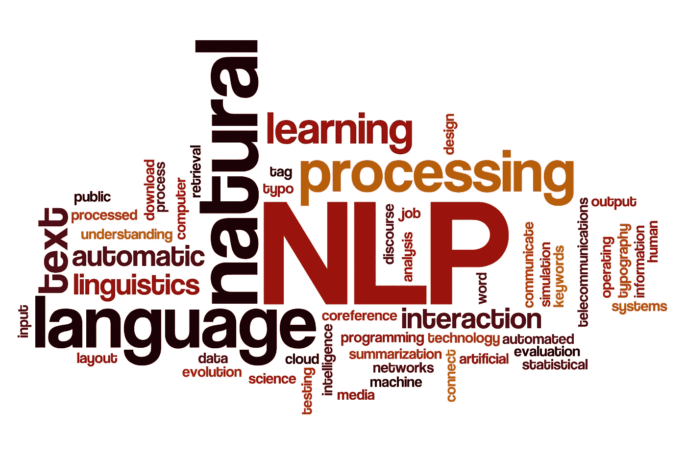
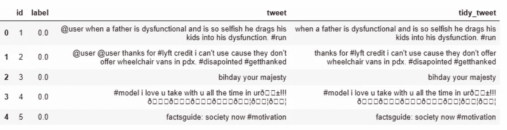
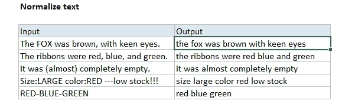
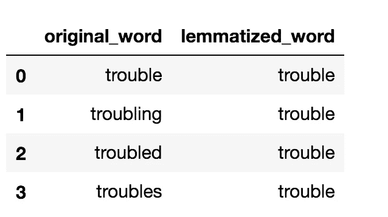

# 一种使用 NLTK 的简单而有效的文本清理方法

> 原文：<https://medium.com/analytics-vidhya/a-simple-yet-effective-way-of-text-cleaning-using-nltk-4f90a8ff21d4?source=collection_archive---------5----------------------->

一个简单的文本清理代码！



1.  **文字清理及其重要性:**

O 一旦获取了数据，就需要对其进行清理。大多数情况下，数据会包含重复条目、错误或不一致。数据预处理是应用任何机器学习模型之前的重要步骤。与文本数据一样，在对文本数据应用任何机器学习模型之前，都需要对数据进行预处理。文本的预处理意味着清除噪声，例如:去除停用词、标点符号、在文本的上下文中没有多少分量的术语等。在本文中，我们详细描述了如何使用 Python(NLTK)为机器学习算法预处理文本数据。

*事不宜迟，让我们深入研究代码*

2.**导入重要库:**

```
import reimport nltkfrom nltk.corpus import stopwordsfrom nltk.stem import WordNetLemmatizernltk.download('stopwords')nltk.download('wordnet')
```

3.**使用 For 循环一次性实现所有文本清理技术**

```
corpus = []text_data = ""for i in range(0, 1732(Number of rows)):text_data = re.sub('[^a-zA-Z]', ' ', Raw_Data['Column_With_Text'][i])text_data = text_data.lower()text_data = text_data.split()wl = WordNetLemmatizer()text_data = [wl.lemmatize(word) for word in text_data if not word in set(stopwords.words('english'))]text_data = ' '.join(text_data)corpus.append(text_data)
```

***4。现在让我们看看 for 循环实际上做了什么***

4.1.第一步，它将删除除英语单词以外的所有术语。这一步是必不可少的，因为文本数据中的其他术语，如特殊字符和数字，会给数据添加噪声，这会对机器学习模型的性能产生不利影响。在此步骤中使用正则表达式来删除所有非英语术语。



4.2.在第二步中，它将规范化文本数据。规范化文本是一个重要的步骤，因为这减少了模型中的维数问题。如果文本没有规范化，就会导致数据重复的问题。为了规范化文本，使用了 python 中的 Lower()函数。这个函数将所有的单词都转换成小写，这样就解决了问题。



4.3.在第三步中，它将对单词进行精简。单词的词汇化是一个必要的步骤，因为这消除了数据重复的问题。具有相似含义的单词(如 work、work 和 work)具有相同的含义，但在创建单词包模型时，这将被视为三个不同的单词。NLTK 库的 WordNetLemmatizer 包就是用来解决这个问题的。这个包将任何给定的单词恢复到它的原始形式。



4.4.在第四步中，它将删除所有的停用词。删除停用词是一个重要步骤，因为停用词增加了模型的维度；这个额外的维度会影响模型的性能。NLTK 库中的停用词包用于移除停用词。将语料库中的所有文本与停用词列表进行比较，如果有任何词与停用词列表匹配，则将其删除。


这篇文章是写给那些刚开始学习 NLP 并且被文本清理困扰的人的。在大多数情况下，文本清理可能会令人头痛。这段代码可以帮助你掌握最基本的文本清理技术，并且可以直接使用。

感谢您的阅读；我希望你学到了新的东西！

干杯。