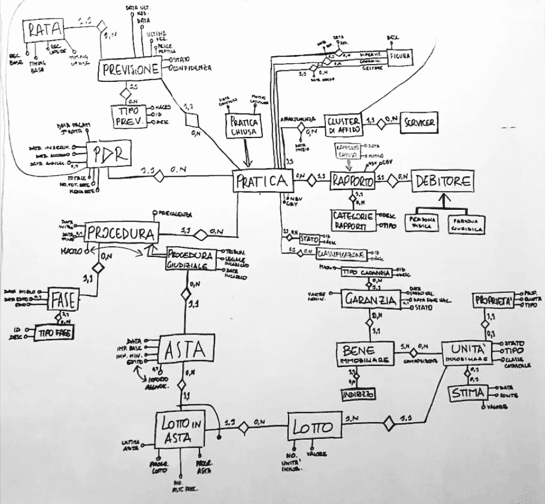
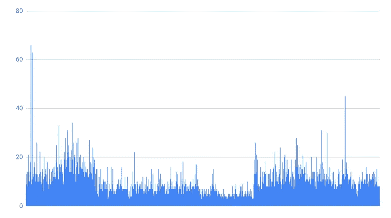

# 时间序列建模的一种智能方法

> 原文：<https://medium.com/analytics-vidhya/a-smart-approach-to-time-series-modeling-b5d47cf7c0ae?source=collection_archive---------7----------------------->

罗马夜市，由[朱莉](https://unsplash.com/photos/NyrsRivAW0Q)拍摄

去年冬天，我做了一个关于*不良贷款* (NPL)的项目，也就是说债务人已经停止定期支付的贷款。目标是根据债务人的数据和贷款管理的历史来确定**债务人达成交易的倾向**。

# 背景

在过去的几年里，意大利见证了不良贷款市场的显著增长:在欧洲中央银行的压力下，意大利的许多银行开始“清理”他们的余额，向投资者丢弃(以其初始价值的 20%-30%出售)不良贷款，这些投资者计划在银行以前失败的地方取得成功。然后，这些投资者会将贷款管理委托给专门从事债务催收的公司，即所谓的服务公司。不足为奇的是，服务者采取的第一步通常是数据丰富和数据补救:只要知道如何利用数据，**数据确实是增加该过程成功机会的唯一可用工具**。

最便宜的还款方式是与债务人达成协议。然而，只有少数债务人对交易持开放态度，而且债务人的交易倾向会随着时间的推移而降低。因此，能够提前识别那些更赞成协议的人将是非常有用的:这就是为什么这个项目被一个服务者委托的原因。

然而，在这个项目中开发的解决方案可能不仅对那些在贷款领域工作的人有用，而且对那些遇到我在这个项目中遇到的一系列问题的数据科学家也有用，这就是我写这篇文章的目的。像我现在正在写的这样的故事在我的工作中帮助了我几次，因此我觉得有义务回报你，也告诉你我的故事。

# 问题是

域的模式

乍一看，这似乎是一个简单的*二元分类问题*，这两类人是:*已达成交易的债务人和未达成交易的债务人*。但是仔细看看这些数据，你会发现事实并非如此。这个领域相当复杂，我花了近一个月的时间来分析它，并提出了它的结构大纲；总之，简单地说，它可以分为两个子集:关于债务人的数据和关于管理活动的数据。

在特征工程中，数据被组织成三个不同的特征类别:**静态特征**、**历史特征**和**动态特征**。

*   前者指的是不依赖于管理活动的数据，如债务人的年龄(可能会变化，但不取决于服务者的工作)。
*   第二类特征包含以前服务者活动的数据；其中一个特征是在过去的管理过程中设定的拍卖数量。
*   最后一个类别标识了关于当前管理的数据。与前两类不同，后者的特征取决于管理活动和*演变*，直到贷款被偿还或出售或简单关闭。

动态特性带来了这个看似简单的问题的主要问题，即**时态数据**。分类器将在已经完全进化并因此达到其数据的 100%的例子上被训练；而它将不得不对仍在进化中的例子做出预测。如果一个人忽略了时间因素，他将会在比较 100%s 进化和小于 100%s 进化时犯一个巨大的错误，并且这个分类器将会被证明是本质错误的。

# 流行的时间序列建模方法以及我为什么不使用它们

时间序列无处不在:股票市场、气象、人口统计只是时间序列的几个例子。时间序列建模的方法可以分为两类，我称之为:时间序列分析和时间序列预测。前者侧重于识别和估计一段时间内趋势的所有组成部分，以解释和理解现象。相反，后者专注于预测，忽略了特定进化的原因:因此，这些方法经常产生不容易解释的模型。

第一类大量使用统计方法；一种流行的时间序列分析方法叫做 ARIMA，如果你想了解更多，我建议你阅读这篇文章。

预测方法(至少是较新的方法)依赖于深度学习技术，准确地说是依赖于一组被称为 [LSTM](https://colah.github.io/posts/2015-08-Understanding-LSTMs/) (长短期记忆)的神经网络，它们特别适合于序列建模。

不幸的是，无论属于哪一类，所有的方法都提出了一些使用它们需要满足的要求。这些要求中的两个是:**对每个样品进行足够数量的测量**；**连续测量的时间间隔随着时间的推移保持不变**(即每天/每周/每月/每年/…)。

## 现在让我们看看我们的数据。

管理活动通过不同的特征来追踪，如随着时间的推移所做的*现金流*预测的数量，或者信贷经历某个*管理阶段*的次数。绘制每个样本的预测总数，我们得到下图。

为每个样本登记的数量或现金流预测

如您所见，大多数样本记录的事件少于 10 个。如果我们观察每个样品记录的总相数，会得到相同的结果。

每个样品记录的总相数

我们不会对相似性感到惊讶:即使携带不同的信息，所有这些特征都是高度相关的，因为它们是同一活动的不同最终产品。每次服务人员处理一个样本时，他都会留下一些痕迹，这些痕迹可能是系统中添加的新阶段，也可能是新现金流预测的发出。这些数字告诉我们的是数据的一个基本特征:**演化的稀疏性**，这是服务者工作方式的结果。

我们可以断定数据不符合第一个要求，但第二个要求呢？

可以想象，即使服务人员严格遵守时间表，也不可能让所有事件相隔相等的距离。通常，特定活动的发展甚至不由服务者决定:事实上，他可能在等待债务人或法院的答复。因此，可以随时观察样本的演变:没有精确的规则；可能发生的情况是，一笔贷款在两个月内迅速见证了两个事件，然后滞留了一年多。这些考虑导致了我们数据的第二个特征，即****时间序列的随机性**。**

**我不排除调整动态数据以适应需求的可能性，但这有点牵强。事实上，我想到了一个简单的替代方案，将数据的独特性转化为优势。**

# **找到了。**

**为了理解这种方法背后的思想，让我们重新表述一下这个问题。以前，我断言:**

> **如果一个人忽略了时间因素，他将会在比较 100%s 进化和小于 100%s 进化时犯一个巨大的错误，并且这个分类器将会被证明是本质错误的。**

**更一般地，我们可以肯定属于不同进化时刻的**样本是不可比较的**。**

**为了解决这个问题，我们需要识别样本**的管理*历史*中的**时间间隔**，在那里它们是可比较的**。但是从一个进化时刻进步到下一个进化时刻背后的原因是什么呢？管理活动。因此，**对于相似的样本，我们需要它们已经接受了等量的管理活动**。话虽如此，问题变成了:我们如何才能确定这些时期？**

**现在是时候深入了解服务人员通常的工作方式了。在他们购买了一批不良贷款后，投资者将它们收集成更小的集合，并将其分配给多家服务机构。后者然后并行管理一整套贷款，处理每个样本一次，直到他处理完所有样本，然后从头开始。我称这些循环中的每一个为工作波。**

**根据我们之前的陈述，两笔贷款都在第二波中，可以进行比较，因为*它们都通过了第一波*，即使它们来自不同的集合。但是请注意:说它们处于同一浪潮并不意味着它们处于同一进化阶段。事实上，有些贷款比其他贷款对管理活动更敏感，因此发展更快。这取决于让债务人开始遵从服务者的要求所需的压力:有时打几个电话就够了，其他时候则需要采取法律行动。**

**因此，在同一波中，一个样本可能见证了两个事件，而另一个甚至没有记录任何事件，比较它们仍然是正确的，因为它们已经被提供了相同的进化机会，更正式地说:**它们具有相同的进化潜力**。**

**总结一下，我们要找的时间间隔是波的周期。我们如何对它们建模？让我们再一次看看数据。波浪确实应该在动态特征上留下某种足迹，但是它应该是什么样子的呢？作为波方法的结果，动态特征的行为应该满足两个条件:**

**(1)在整个集合上采取的动作的音量应该逐波减小；**

**(2)在每个波的开始和结束时登记的活动量应该是最小的。**

**从这一点来看，有可能根据工作量给出波的正式定义，以自动识别每个时间间隔。**

# **如何构造阶跃函数分类器**

****

**数据到训练好的模型流。**

**现在我们有了区间，我们需要模型。为了使它的结构清晰，我通常转向简单的并列。考虑比较一组随机组合的个体；你可能会考虑他们的年龄:事实上，你可以做的一件事就是把人们分成不同的年龄组来比较。这个想法是为场景中的每个人拍一张快照，每个年龄组都有定义，然后面对照片而不是人。**

**将这一概念应用到我们最初的领域，我们将把**贷款的年龄**定义为从服务器被给予托管权起经过的*天数。我们需要的*年龄段*就是之前命名的时间区间。最后，我们得到上图所示的管道:*对于每个时间间隔，模型捕获每个样本的快照，并构建一个分类器*。但是让我们仔细看看这个图表。***

**首先，从数据中提取静态和历史特征。如前所述，这些特征不会随时间而改变，因此，它们可以立即计算出来。第二步被命名为*分配*，这是拍摄所有照片的时候:动态数据在样本经历的所有时间间隔上被分割。例如，如果一笔贷款经历了三波，其数据将分布在第一、第二和第三期。**

**对于每个时隙重复步骤 3 到 5，它们分别是:动态特征提取、特征选择和训练。一旦收集了每个周期的数据，就可以正确计算动态特征，而忽略后续间隔中记录的所有事件。**

**训练前的最后一步是特征选择。虽然这可能看起来是一个微不足道的实践，但它在决定模型的正确性方面是决定性的。果然，被选择的特征是那些携带最多信息的特征，并且比其他特征与输出变量(交易的存在)的关联更大。因此，所选特征的集合可以告诉我们许多关于它所属的波周期的信息，因此可以用于评估时隙划分的正确性。**

**例如，假设在第一波期间，服务人员的工作主要集中在电话呼叫上，而在下一波期间，他合理地集中在估计担保的价值上:所选特征的集合应该揭示管理活动中的这种转变。因此，如果这两个间隔在所选特征方面没有显著差异，则时隙可能是不正确的。**

**总之，选定的特征及其各自的重要性详细地表达了模型的功能，因此，它们构成了数据科学家手中的强大解释工具。**

**概括地说，完成流水线后，我们得到一个由 *n* 个不同分类器组成的模型，其中 *n* 代表定义的周期数。当我们要求模型分析一个新样本时，系统将首先确定它的年龄，然后将其交给相应的分类器。**

# **结论**

****

**由 [Startaê Team](https://unsplash.com/@startaeteam?utm_source=medium&utm_medium=referral) 在 [Unsplash](https://unsplash.com?utm_source=medium&utm_medium=referral) 上拍摄的照片**

**首先，我很高兴你走到了这一步。这是我的第一篇关于媒体的文章，我真的希望你喜欢读它。无论如何，我相信它可以改进，因此任何反馈都将受到高度赞赏，它不会被浪费。当然，我希望你能在你的评论上花点功夫，因为草率的评论在大多数时候是无用的，甚至在最糟糕的情况下是危险的。如果您有时间，请至少花两分钟时间阅读这篇文章。**

**关于这个项目，*老化分类器*已经顺利运行(至少到目前为止),并且已经证明能够正确识别服务人员工作的主要特征。此外，尽管数据集具有很强的不平衡性，但它仍然达到了很高的查准率和查全率。总的来说，表现很好，尽管还有一些可以改进的地方。但现在的问题是，这种方法在他的出生地之外采用时是否会产生同样好的结果；所以，如果你决定使用它，让我们知道。虽然我承认这种方法的简单性和特殊性，但我希望这个故事在某种程度上对您有用。**

**谢谢你。**