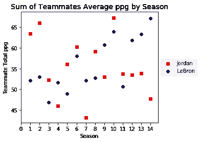
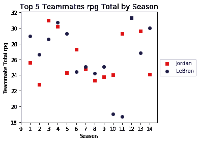
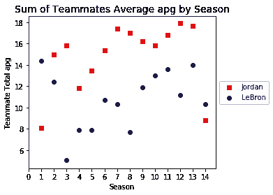

# 基于体育的熊猫和 matplotlib Python 库介绍

> 原文：<https://medium.com/analytics-vidhya/a-sports-based-intro-to-pandas-and-matplotlib-python-libraries-367469927805?source=collection_archive---------33----------------------->


这篇博客文章通过比较勒布朗和乔丹在职业生涯中的队友，介绍了如何使用 python 库——pandas 和 matplotlib。

# 介绍

*我最初写这篇文章是在 2018 年，当时我开始了我作为一名数据科学家/软件工程师的旅程，并想在几周前偶然发现它后发表它。我希望它也能帮助那些刚刚开始旅程的人。*

对于本文，我选择使用一个数据集，该数据集用于在 www.lebronvsjordan.org 的[](https://www.lebronvsjordan.org/)**上的 G.O.A.T 仪表板中生成视觉效果。该数据集由前 14 个赛季乔丹或勒布朗球队中的前 5 名队友组成。**

*****点击**[***此处***](https://lebron-vs-jordan.s3.us-east-2.amazonaws.com/L_vs_J_Teammates.csv)**下载本教程的 csv 文件。*****

****这个数据集调查的目标是基于 3 个不同的图表来看每个赛季谁有更好的队友:场均得分(ppg)、场均重新绑定(rpg)和场均助攻(apg)。****

# ****设置****

****使用 Jupyter 笔记本可以让你轻松地执行下面的代码块。如果你不熟悉它们，去 [***这里***](https://pypi.org/project/notebook/) 安装这个库，看看它是什么。****

```
**%matplotlib inline import numpy as np 
import pandas as pd 
import matplotlib.pyplot as plt 
import seaborn as sns csfont = {'fontname':'Dejavu Sans'} 
titlefont = {'size': '14'}**
```

# ****读入。csv 文件****

*   ****df 或“数据帧”是熊猫常用的结构，可以认为是表格****
*   ****在本练习中，我们将创建一个名为 **dfTeam** 的数据帧，它读入勒布朗和乔丹队友的 csv 文件****

```
**dfTeam = pd.read_csv('L_vs_J_Teammates.csv')**
```

# ****设置续****

*   ******np.infinite** 用于清除数据集的任何空白行并显示 NaN****
*   ******dfTeam.columns** 是一个快速的 pandas 命令，它在一个数据帧中显示所有的列名****
*   ******dfTeam.shape** 是一个快速的 pandas 命令，用于获取数据帧中的**行 x 列**，而 **dfTeam.head()** 显示前 5 行数据****

```
**dfTeam = dfTeam[np.isfinite(dfTeam['season'])]dfTeam.columns***** Console Output:*** Index(['teammate', 'years_season', 'season', 'm_or_l', 'position', 'games_played_per_season', 'rpg_season', 'apg_season', 'spg_season', 'bpg_season', 'turnovers_season', 'ppg_season', '3pt_attempts_per_game', '3pt_percentage_season', 'team_season', 'championship_season', 'playoffs_reached', 'playoffs_team_lost_to_won', 'eliminating_round_series', 'record', 'opponent_ppg', 'team_ppg'], dtype='object')dfTeam.shape***** Console Output:***(140, 22)dfTeam.head()***** Console Output:*** Returns first 5 rows of dataset**
```

# ****设置续****

*   ******dfTeam.set_index** 用于从 0、1、2 等改变数据帧的当前索引。每个队友的名字****
*   ******df team . season . as type(int)**将“季节”列从字符串类型更改为 int 类型****

```
**dfTeam = dfTeam.set_index(['teammate'])dfTeam['season'] = dfTeam.season.astype(int)**
```

# ****在数据帧中创建组****

****要对该数据集进行分组，需要创建两个不同的“分组”:****

*   ****第一组:把每个球员分成两大组，要么是勒布朗，要么是乔丹的队友。****
*   ****第二组:第一组应该分成 14 个小组，每个小组代表一个季节。****
*   ****总共应该有 28 组。勒布朗 14 分，乔丹 14 分。****

# ****勒布朗的分组流程****

```
**group_l = dfTeam.groupby(['m_or_l']).get_group('LeBron')group_l_season = group_l.groupby('season')group_l_season.sum().head()**
```

# ****对约旦重复分组过程****

```
**group_m = dfTeam.groupby(['m_or_l']).get_group('Jordan')group_m_season = group_m.groupby('season')group_m_season.sum().head()**
```

# ****根据季节组创建 ppg 图表****

****现在我们的数据已经正确地分组在一起，我们可以使用 matplotlib 创建数据的基本散点图，以便按赛季比较每组队友。****

****下面的代码用于创建我们的第一个可视化:****

*   ****下面代码块中的第二行用于创建绘制图形的区域。****
*   ******plot_area.scatter** 用于绘制勒布朗和乔丹的每组数据****
*   ****该块中的其余代码用于格式化图例、标题、字体大小等。****

```
**fig = plt.figure() 
plot_area = fig.add_subplot(111) plot_area.scatter(range(1,15), group_m_season.ppg_season.sum(), marker="s", label='Jordan', color='red') plot_area.scatter(range(1,15), group_l_season.ppg_season.sum(), marker="o", label='LeBron', color='#00008b') box = plot_area.get_position() plot_area.set_position([box.x0, box.y0, box.width * 0.8, box.height]) plot_area.legend(loc='center left', bbox_to_anchor=(1, 0.5)) plot_area.set_title('Sum of Teammates Average ppg by Season', **csfont, **titlefont) plot_area.set_xlabel('Season', **csfont) plot_area.set_ylabel('Teammate Total ppg', **csfont) plt.xticks(np.arange(0, 15, 1.0))**
```

********

# ****根据季节组为 rpg 创建图表****

****重复创建图表的过程，但更改数据以反映 rpg****

```
**fig = plt.figure() 
plot_area = fig.add_subplot(111) plot_area.scatter(range(1,15), group_m_season.rpg_season.sum(), marker="s", label='Jordan', color='red') plot_area.scatter(range(1,15), group_l_season.rpg_season.sum(), marker="o", label='LeBron', color='#00008b') box = plot_area.get_position() plot_area.set_position([box.x0, box.y0, box.width * 0.8, box.height]) plot_area.legend(loc='center left', bbox_to_anchor=(1, 0.5)) plot_area.set_title('Sum of Teammates Average rpg by Season', **csfont, **titlefont) plot_area.set_xlabel('Season', **csfont) plot_area.set_ylabel('Teammate Total rpg', **csfont) plt.xticks(np.arange(0, 15, 1.0))**
```

********

# ****基于季节组为 apg 创建图表****

****重复创建图表的过程，但更改数据以反映 apg****

```
**fig = plt.figure() 
plot_area = fig.add_subplot(111) plot_area.scatter(range(1,15), group_m_season.apg_season.sum(), marker="s", label='Jordan', color='red') plot_area.scatter(range(1,15), group_l_season.apg_season.sum(), marker="o", label='LeBron', color='#00008b') box = plot_area.get_position() plot_area.set_position([box.x0, box.y0, box.width * 0.8, box.height]) plot_area.legend(loc='center left', bbox_to_anchor=(1, 0.5)) plot_area.set_title('Sum of Teammates Average apg by Season', **csfont, **titlefont) plot_area.set_xlabel('Season', **csfont) plot_area.set_ylabel('Teammate Total apg', **csfont) plt.xticks(np.arange(0, 15, 1.0))**
```

********

# ****结论****

****感谢您阅读本教程，我希望它对任何初学 python 相关数据科学工具的人来说都是一个很好的介绍。想了解更多酷的项目，请随意查看我的其他博客帖子。如果你有任何问题，欢迎在下面评论！****

*****最初发表于*[T5【www.jamespcarnes.com】](https://www.jamespcarnes.com/pandas/)*。*****