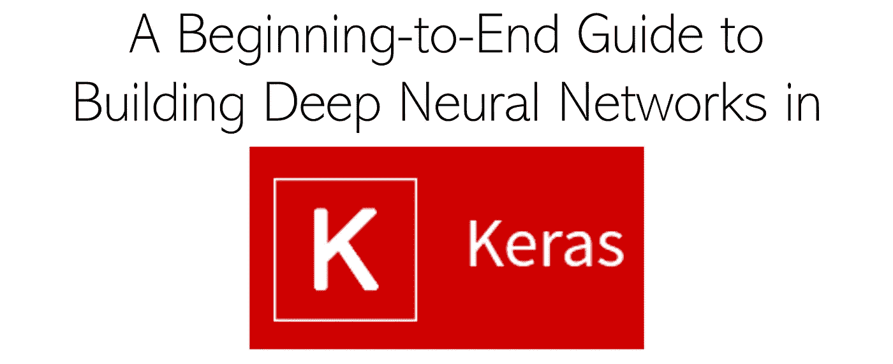

# 在 Keras 中构建深度神经网络的从头至尾指南

> 原文：<https://medium.com/analytics-vidhya/a-start-to-finish-guide-to-building-deep-neural-networks-in-keras-3d54de097a75?source=collection_archive---------0----------------------->

## 从图像增强到绘图精度的一切

学习深度学习让人望而生畏；所以像 Keras 这样使之变得简单的库是有帮助的。在本文中，我概述、解释了在 Keras 中构建图像识别深度卷积神经网络的 7 个步骤，并提供了代码。