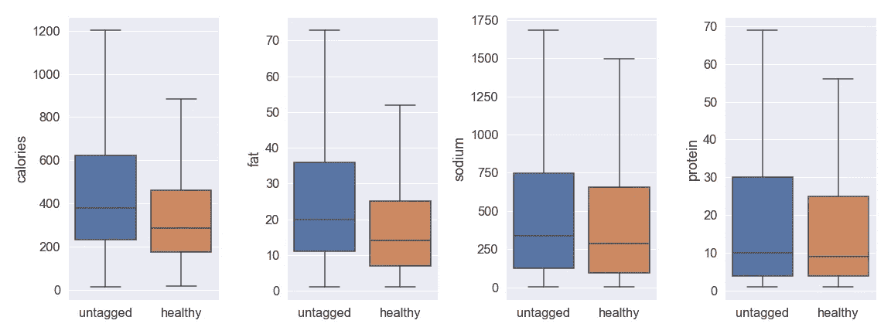
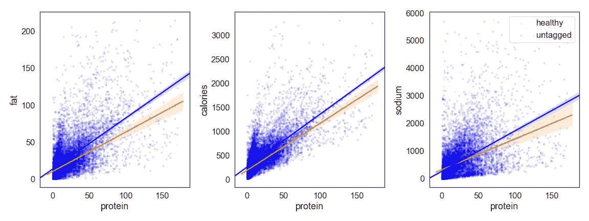
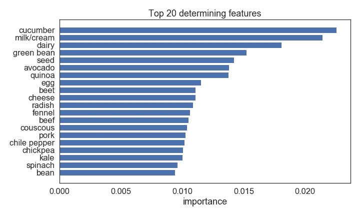

# 对美味的“健康”食谱进行统计分析和分类

> 原文：<https://medium.com/analytics-vidhya/a-statistical-analysis-and-classification-exercise-on-epicurious-healthy-recipes-d2d09eb2dee1?source=collection_archive---------9----------------------->

在决定做什么菜时，我应该只坚持标有“健康”的食谱吗？

照片由 [**突发**](https://www.pexels.com/@burst?utm_content=attributionCopyText&utm_medium=referral&utm_source=pexels) 发自 [**像素**](https://www.pexels.com/photo/variety-of-cooked-dishes-374052/?utm_content=attributionCopyText&utm_medium=referral&utm_source=pexels)

我喜欢烹饪。这不仅是一种治疗活动(至少对我来说)，你还会在事后得到一些好吃的东西。但是有时候，我会陷入决定做什么菜的困境。当我为其他人，也就是我的家人和朋友做饭时，我想确保我为他们提供美味的**和**健康的食物。

所以我去了网上——那里有来自世界各地的数百万份食谱。很长一段时间，我依靠万维网和我最喜欢的烹饪网站的过滤功能来提供我可以使用的食谱名单。我是说，谁有时间一个接一个地看几十个食谱？尤其是当你不得不一路向下滚动，越过食谱作者如何花周末时间摘苹果的故事，才能找到真正的*食谱。*

我使用的过滤器可以基于我计划烹饪的食物类型(例如晚餐、午餐、早餐)或我当时冰箱和餐具室里有什么(例如鸡胸肉、西葫芦、洋葱)。但是有一个过滤器我一直带着:“健康”。我假设通过坚持使用这个神奇的过滤器(并过积极的生活方式),我会活到 100 岁。

但我真的会吗？

谁是在食谱上贴标签并决定食谱是否“健康”的权威？Epicurious 并没有定义贴在他们网站上的食谱上的“健康”标签是什么意思。低热量？低钠？低脂？谁知道呢。

在进一步调查这个“健康”标签业务(以及“无麸质”、“低碳水化合物”、“古”等)后。)，我发现标签是食谱作者自己分配的。因此，比如说，一个人可能会贴上双层巧克力曲奇的配方，并贴上“健康”的标签，因为他们用椰子油替换了黄油。我不是说人们会那样做，只是这是可能的。那么**我可以信任这个标签吗？我决定调查一下。**

幸运的是，有人从我最喜欢的食谱网站之一 [Epicurious、](https://www.epicurious.com/)收集了大约 2 万份食谱，并发布在 [Kaggle](https://www.kaggle.com/hugodarwood/epirecipes) 上。该数据集包括食谱的标题、评级、一些营养价值(卡路里、脂肪、钠和蛋白质)、成分，以及基于各种类别分配给食谱的不同标签:特殊场合、产地等。该数据集中的总列数是 680，但是在这个练习中，我过滤掉了“额外”标签，只关注营养价值和成分——减少到大约 300 列。

提醒一句:数据集中很少有被标记为“健康”的食谱，所以请对此持保留态度(一语双关)。

好，那么我们来看数据。我绘制了营养价值的分布图——卡路里、脂肪、钠和蛋白质——包括“健康”食谱和下面没有标注的食谱。蓝色代表无标签，橙色代表“健康”食谱。

健康食谱和未标记食谱营养价值的箱线图比较

乍一看，大多数食谱似乎都有合理的营养价值——与美国食品和药物管理局推荐的每日最大摄入量相差甚远。作为参考， [FDA 指南](https://www.fda.gov/food/nutrition-education-resources-materials/how-understand-and-use-nutrition-facts-label)基于 2000 卡路里饮食的每日营养摄入值为:总脂肪 65g，钠 2400mg。

仔细观察，似乎“健康”食谱与未标注的食谱相比，所有营养组的中值都较低，尤其是卡路里和脂肪。这由每个框中间的水平线表示。

为了证实这一点，我进行了一个 [bootstrap 假设测试](https://en.wikipedia.org/wiki/Bootstrapping_(statistics)#Bootstrap_hypothesis_testing)，看看在“健康”食谱和未标注食谱中，卡路里、脂肪、钠和蛋白质的平均值是否有显著差异。不幸的是，我的测试表明没有明显的区别。嗯..，这是否意味着“健康”标签是随机分配的？

没那么快。我们知道蛋白质对我们有好处，而且是我们数据集中唯一的“好”营养。所以我用每份食谱的蛋白质值除以其他营养值:脂肪、卡路里和钠，看看是否有相关性。还有就是:随着蛋白质价值的增加，其他营养成分也会增加。有道理。

下面，让我们比较一下标有“健康”和未标有“健康”的食谱中蛋白质和其他营养成分的相关性。同样，橙色代表“健康”，蓝色代表未标记的食谱。

蛋白质/其他营养素

由于数据的噪音，我不会在这里进行回归分析。但是从视觉上看，看起来“健康”食谱中蛋白质的增加导致未标记食谱中脂肪、卡路里和钠的增加较少。我马上想到植物蛋白或者像鱼一样的瘦蛋白。也没有那么多盐。

好的，听起来很有希望，但是让我们再深入一点。我建立了一个分类模型，看看我能否预测一个食谱是否因其营养价值和成分而被贴上“健康”的标签。

我的最佳模型的准确率约为 70%，这意味着它预测一个食谱是否被贴上“健康”标签的几率为 10 分之 7。由于与贴有“健康”标签的食谱相比，有更多的食谱是没有标签的，所以我得出结论，这个模型未能在两者之间画出一条实线。我对此的直觉反应是:这并不意味着所有未标记的食谱都是不健康的。他们中的一些人实际上是健康的，只是没有被贴上标签而已。

出于好奇，我查看了数据中哪些特征(或列)对我的模型如何对食谱进行分类有更大的影响。它没有显示某个特征(在本例中是成分)的存在是否意味着某个食谱更有可能被标记为“健康”或其他。这只是表明，在做出决定时，该特征更重要。在下图中，我展示了数据集中大约 300 个特征中的前 20 个决定性特征。

这里有几个有趣观察:

*   前 20 个因素都是成分，没有一个营养价值特征(蛋白质、脂肪、钠和卡路里)上榜。这可以解释我们之前的观察，即“健康”食谱和未标记食谱之间的营养价值没有统计学上的显著差异。
*   虽然我们可以看到清单上的许多成分可以很容易地归类为“健康”，如黄瓜，鳄梨，藜麦等。，有一种成分让我大吃一惊:辣椒。显然[辣椒](https://www.webmd.com/diet/peppers-health-benefits#1)营养丰富！

# 结论:

*   “健康”标签可能是一个不错的过滤器，但不要完全依赖它。
*   可能有很多食谱没有被贴上“健康”的标签，但事实上它们配得上这个标签。

这篇文章到此结束，希望你会觉得有趣。欢迎反馈和评论！

在这个练习中使用的完整的笔记本和代码可以在[这里](https://github.com/akharina/healthy_recipes)找到。