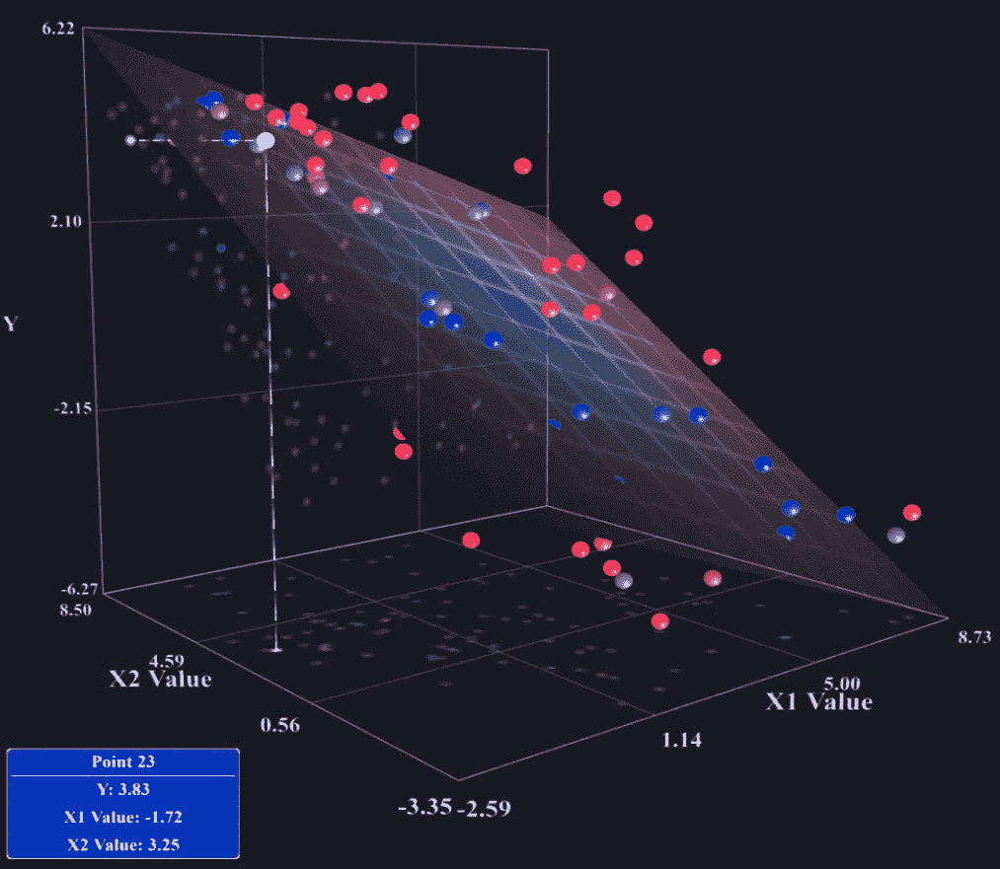
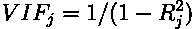

# 在 R 中运行完整的多元线性回归分析的分步指南

> 原文：<https://medium.com/analytics-vidhya/a-step-by-step-guide-for-running-a-complete-multiple-linear-regression-analysis-in-r-c08be169fe01?source=collection_archive---------0----------------------->



图片来自 https://www.miabellaai.net/regression.html

# 介绍

本指南的重点是为新数据科学家提供一种一步一步的方法来运行完整的 MLR(多元线性回归)分析，而不需要深入的统计学背景。请注意，为了充分利用这些材料，您应该熟悉 SLR(简单线性回归)的 OLS(普通最小二乘法)概念。我发现许多关于回归主题的数据科学教程的一个问题是它们的方法不完整。仅拟合模型并评估 R 是一种有问题的简化方法。如果不满足某些模型假设(稍后将详细介绍):(1)这可能导致*有偏估计值*(不会最小化方差)，结果我们将剩下一个不提供最佳可能拟合的模型(导致相对较差的预测)。(2)如果我们要对我们的回归构造置信区间或假设检验，这些可能是*无效的*。

显然，这种详细的分析超出了许多课程的范围(其中许多课程假设没有先验知识)，但他们至少应该提到还有更多*。如果你正在建立一个物质的 SLR 或 MLR 模型，可以用于真正的决策，你会想要执行一个完整的分析。我写这篇指南的目的是希望能让你在回归入门教程和关于这个主题的一整个学期的本科课程之间架起一座桥梁。在每一步，我都试着解释理论(必要时)、概念，以及你自己的数据集中可能出现的困难和痛点。我推荐使用 R 来进行 Python 上的回归分析，因为它简单(一行程序)并且易于绘制所需的图形。也就是说，同样的分析可以使用像 *statsmodels* 这样的库在 Python 中完成。我将分析分为五个独立的步骤:*

***1。** *数据的简要描述*
**2。** *检查多重共线性*
**3。** *执行残差分析*
**4。** *变量选择*
**5。** *模型验证**

*对于本指南，我使用的是一个适合回归分析的样本数据集，可从 *Kaggle* 获得，名为*房地产价格预测*([https://www . ka ggle . com/quant Bruce/Real-Estate-Price-prediction](https://www.kaggle.com/quantbruce/real-estate-price-prediction))。对于像这样的领域，我们希望预测和建立房屋价格的置信区间。*

## *数据的简要描述*

*为了更好地理解数据，您应该已经熟悉了描述性统计的过程。然而，对于回归分析，有一个非常有用的图应该包含在内。这是*对图*。*

```
*library(data.table)# First read in the data
df <- read.csv("real_estate.csv")
df$No <- NULL# Quick cleanup, rename the column headers
setnames(df, 
         old = c('X1.transaction.date',
                 'X2.house.age', 
                 'X3.distance.to.the.nearest.MRT.station', 
                 'X4.number.of.convenience.stores',
                 'X5.latitude',
                 'X6.longitude',
                 'Y.house.price.of.unit.area'), 
         new = c('Transaction',
                 'Age',
                 'Station',
                 'Stores',
                 'Latitude',
                 'Longitude',
                 'Price')
         )#Pairs plot
pairs(df[,c(2:7)])*
```

**

*配对图总结了所有变量之间的关系。如果你以前没有遇到过 pairs 图，要阅读它，你所要做的就是从对角线开始，排列任意两个变量之间的交点。你只需要看对角线一边的线对，因为另一边是镜像的。通过结对图，我们可以得到对以下内容的总体感觉:*

***1。** *预测因子*
**2 之间的任何共线性。** *关系较弱，可能在变量选择中淘汰的预测因子*
**3。** *反应与预测因子之间的一般强度关系**

*在我们的例子中，我们可以看出价格和预测值之间可能存在某种总体线性关系。商店的数量似乎具有最强的关系，因此我们可以预期它将保留在模型中，并且具有显著的线性关系。如果你得到一个数据集，显示与响应(在这种情况下是价格)没有关系，并且你正在建立一个预测模型，现在可能是一个停下来，转到一些更有用的数据的好时机。纬度(lat)、经度(lon)和站点(distance)之间有一些有趣的关系。一种可能的情况是，平均值附近的 lat 和 lon 距离 MRT 站很近，因为这些坐标位于市中心。尚不清楚这是否会给模型带来问题。但是，如果您看到任何两个预测值的数据点之间存在近似对角线的关系，那么多重共线性肯定是一个需要解决的问题。*

## **检查多重共线性**

*根据我们对 pairs 图的分析，您现在可能对线性模型中的多重共线性有所了解(但不知道它为什么不好)。更具体地说，多重共线性是模型中预测值之间的线性或近似线性相关性。线性相关意味着一个变量是另一个变量的线性组合(它们共线)，因此不会给我们任何新的信息。两个变量之间的强相关性表示共线性。在我们的 MLR 模型中，多个预测因子之间的强相关性意味着多重共线性可能存在。*

```
*library(faraway)# Construct our initial model 
model <- lm(Price ~ ., data = df)
summary(model)## Call:
## lm(formula = Price ~ ., data = df)
## 
## Residuals:
##     Min      1Q  Median      3Q     Max 
## -35.664  -5.410  -0.966   4.217  75.193 
## 
## Coefficients:
##               Estimate Std. Error t value Pr(>|t|)    
## (Intercept) -1.444e+04  6.776e+03  -2.131  0.03371 *  
## Transaction  5.146e+00  1.557e+00   3.305  0.00103 ** 
## Age         -2.697e-01  3.853e-02  -7.000 1.06e-11 ***
## Station     -4.488e-03  7.180e-04  -6.250 1.04e-09 ***
## Stores       1.133e+00  1.882e-01   6.023 3.84e-09 ***
## Latitude     2.255e+02  4.457e+01   5.059 6.38e-07 ***
## Longitude   -1.242e+01  4.858e+01  -0.256  0.79829    
## ---
## Signif. codes:  0 '***' 0.001 '**' 0.01 '*' 0.05 '.' 0.1 ' ' 1
## 
## Residual standard error: 8.858 on 407 degrees of freedom
## Multiple R-squared:  0.5824, Adjusted R-squared:  0.5762 
## F-statistic: 94.59 on 6 and 407 DF,  p-value: < 2.2e-1*
```

*多重共线性的主要症状是:*

***1。** *估计的系数中有错误的符号*(例如，如果站上的符号是正的而不是负的，这将是违反直觉的)
**2。** *估计系数的大(膨胀)标准误差和方差。*这反过来导致预测值在看起来应该显著的时候缺乏显著性(例如，我们看到距离与价格有很好的线性关系。与价格没有显著关系的距离将是一个问题)。*

*幸运的是，我们在模型中没有看到这些问题，所以多重共线性可能不是问题。为了确保这一点，我们可以使用一种称为 VIF(方差膨胀因子)的方法，计算如下:*

**

*该因子可以解释如下:第 *j* 个预测因子相对于所有其他预测因子进行回归，并计算其 R ⱼ。这就是所谓的部分回归。那么大的 R ⱼ导致预测器 *j* 的大的 VIF。您可能想知道预测值 *j* 的大 R ⱼ和回归系数的大标准误差之间的关系(即方差是如何“膨胀”的)？).在不涉及回归系数的标准误差是如何得出的具体细节的情况下，公式:*

**

**其中:**

*sᵦ =预测因子 j 系数的标准误差
sₑ =估计值的标准误差或 SSE/n
R ⱼ =预测因子 j 对所有其他预测因子的回归 r
sⱼ=预测因子 j 的方差
n =我们数据集的行数(样本大小)*

*这表明，随着 R ⱼ增加，我们的回归系数的标准误差也增加。这降低了我们对该变量有显著线性关系的可能性。此外，较大的标准误差会增加我们得到错误系数符号的可能性。如果这整个解释似乎有点太复杂，希望这种直觉是有道理的:*

**如果预测因子之间高度相关，那么就很难确定响应解释了什么样的方差。结果，系数的标准误差变大。**

```
*#Computes the VIF for every predictor
vif(model)## Transaction         Age     Station      Stores    Latitude   Longitude 
##    1.014674    1.014287    4.323019    1.617038    1.610234    2.926302*
```

*VIF 命令表明多重共线性在我们的模型中不是问题。请注意(作为一般经验法则)，VIF 为 *10 或更大*是一个值得关注的原因。为了说明我提出的一些观点，并向您展示多重共线性是如何发生的，我将添加预测值“Station2”。这里的想法是，到车站的距离以两种方式测量，从最近的入口和从最远的第二个入口。*

```
*set.seed(1)# Adding the secondary measurement for distance to station
df$Station2 <- df$Station + rnorm(nrow(df), sd=3)# Construct the new model
model <- lm(Price ~ ., data = df)
summary(model)## 
## Call:
## lm(formula = Price ~ ., data = df)
## 
## Residuals:
##     Min      1Q  Median      3Q     Max 
## -36.170  -5.341  -0.954   4.228  74.777 
## 
## Coefficients:
##               Estimate Std. Error t value Pr(>|t|)    
## (Intercept) -1.429e+04  6.760e+03  -2.115 0.035070 *  
## Transaction  5.268e+00  1.555e+00   3.388 0.000773 ***
## Age         -2.726e-01  3.848e-02  -7.085 6.17e-12 ***
## Station      2.546e-01  1.510e-01   1.686 0.092482 .  
## Stores       1.110e+00  1.882e-01   5.897 7.81e-09 ***
## Latitude     2.293e+02  4.452e+01   5.152 4.04e-07 ***
## Longitude   -1.641e+01  4.852e+01  -0.338 0.735418    
## Station2    -2.591e-01  1.510e-01  -1.716 0.086894 .  
## ---
## Signif. codes:  0 '***' 0.001 '**' 0.01 '*' 0.05 '.' 0.1 ' ' 1
## 
## Residual standard error: 8.837 on 406 degrees of freedom
## Multiple R-squared:  0.5854, Adjusted R-squared:  0.5782 
## F-statistic: 81.89 on 7 and 406 DF,  p-value: < 2.2e-16vif(model)##  Transaction          Age      Station       Stores     Latitude    Longitude 
## 1.016805e+00 1.016282e+00 1.920436e+05 1.625591e+00 1.614354e+00 2.933017e+00 
##     Station2 
## 1.921153e+05*
```

*我们现在可以看到这对我们的模型有什么影响。站上的系数是正的，而它应该是负的。它也不再具有显著的线性关系。VIF 也很大。这个问题在许多数据集中很常见，在这些数据集中，一个或多个变量本质上测量的是同一个对象。简单的解决办法是去掉多余的变量。*

## *残差分析*

*五个重要的假设需要成立，以便 OLS 回归模型可以用于假设检验、置信区间和预测。这些是:*

***1。** *响应 y 和回归之间的关系是线性的(至少是近似的)。**

**为什么？这一点相当明显。如果我们试图用一个线性模型来解释一些数据，那么为了使它有效，需要有一个线性关系。这是在 MLR 模型下进行预测所必需的。**

***2。** *误差项ε的均值为零。**

**为什么？*误差落在回归线之上和之下的概率应该相等。*

***3。** *误差项ε具有恒定方差σ。**

**为什么？*这也被称为*同方差*或*方差齐性*。当不同水平的预测值存在不相等的方差时，参数估计值和标准误差在不同样本之间将是不一致的(有偏的)。*

***4。** *误差不相关。**

**为什么？标准误差的计算依赖于统计独立性。**

***5。** *误差呈正态分布。**

**为什么？*置信区间、假设检验和估计参数都是在正态分布的假设下计算的。*

*假设 *2* 到 *5* 可以概括为*“误差为同分布正态分布，均值为零，方差恒定”*。注意 *4* 和 *5* 是假设检验和区间估计所需要的。检查这些假设是否成立的最好方法可能是绘制标准化残差，并将它们与模型中的有用元素进行比较。幸运的是，R 提供了一些简单的内置命令，允许我们轻松地绘制这些关系。总的来说，我喜欢把这个阶段看作是*调整*模型以满足这些假设。*

***当前模型残差概述***

```
*par(mfrow = c(2, 2))
plot(model)*
```

**

*最初，我们希望了解我们的模型相对于五个模型假设的位置。对我来说最突出的是，我们的误差分布有一个相当严重的右偏(见正常 Q-Q 图)。您还可以看到，这稍微影响了我们模型的拟合，在中间有一点非线性凹陷(参见残差与拟合图)。无论如何，这都不是一个坏的组合，但是可以通过*转换*进行改进。*

***转换响应变量***

*由于主要问题是误差的非正态性，应该采取的第一种方法是对响应进行转换。这还具有校正拟合关系的额外好处。请注意，如果拟合是主要问题，您可以尝试只转换预测。如果预测器和响应都是主要问题，那么您可以尝试转换两者。在很大程度上，这确实是一个反复试验的过程。对于右偏分布，最常见的变换是平方根或对数变换。*

```
*# A log transformation on the response shows the best results
model <- lm(log(Price) ~ ., data = df)
summary(model)## 
## Call:
## lm(formula = log(Price) ~ ., data = df)
## 
## Residuals:
##      Min       1Q   Median       3Q      Max 
## -1.68095 -0.11498 -0.00267  0.11540  1.04849 
## 
## Coefficients:
##               Estimate Std. Error t value Pr(>|t|)    
## (Intercept) -5.117e+02  1.695e+02  -3.018 0.002703 ** 
## Transaction  1.355e-01  3.896e-02   3.477 0.000561 ***
## Age         -6.967e-03  9.641e-04  -7.227 2.46e-12 ***
## Station     -1.455e-04  1.797e-05  -8.098 6.54e-15 ***
## Stores       2.775e-02  4.708e-03   5.894 7.94e-09 ***
## Latitude     7.925e+00  1.115e+00   7.107 5.36e-12 ***
## Longitude    3.688e-01  1.216e+00   0.303 0.761766    
## ---
## Signif. codes:  0 '***' 0.001 '**' 0.01 '*' 0.05 '.' 0.1 ' ' 1
## 
## Residual standard error: 0.2216 on 407 degrees of freedom
## Multiple R-squared:  0.6857, Adjusted R-squared:  0.6811 
## F-statistic:   148 on 6 and 407 DF,  p-value: < 2.2e-16*
```

*模型有所改进。它肯定占据了残差分布右尾的边缘，线性拟合的“下降”更少。我们可以通过查看模型摘要 R(以前为 0.58，现在为 0.68)来验证线性关系是否有所改善。您可能想知道为什么我们可以执行这样的转换，并且仍然得到“有效”的结果。原因是我们对变量应用了确定性函数，从而“重新调整”了数据。在这种情况下，要使用模型的输出进行预测，我们可以稍后应用对数的反函数(base *e* ),这是一个指数函数。*

***响应 y 和回归之间的关系是线性的***

```
*plot(model, which = 1)*
```

**

*您可以将残差与拟合图视为拟合模型的二维表示，其中记录了响应(价格)。通过拟合值的相对直线是我们在这里寻找的。如果不可能通过任何类型的转换进行适当的拟合，那么线性模型就不适合给定的数据集。*

***误差呈正态分布***

```
*plot(model, which = 2)*
```

**

*正态 Q-Q 图将模型的标准化残差与标准正态分布(对角线)进行比较。因此，偏离对角线意味着残差偏离了标准的正态分布。即使残差在这种情况下没有完美地排列(*即*没有展现出完美的对称性)，当前状态也是完全可以接受的。只要大部分点位于对角线上，这应该没问题。*

***误差项ε具有恒定方差σ***

```
*plot(model, which = 3)*
```

**

*比例位置类似于残差与拟合图，只是我们要看残差的大小。同样，我们在寻找一条穿过中心的直线，以表明残差的平均值变化不大。我们还可以粗略估计数据点的上限和下限，以确定整体可变性是否发生变化。*

***误差项ε的平均值为零***

```
*mean(resid(model))## [1] -1.435285e-17*
```

*这一点在大部分剧情中应该是显而易见的。特别是，残差与指数图很好地说明了这一点。计算残差的平均值表明它实际上为零。*

***误差不相关***

```
*plot(model$residuals)*
```

**

*残差与指数图显示 x 轴上的观察指数及其 y 轴上的残差。我们希望残差在ε=0 附近随机分布(*即*误差不相关)。*

***异常值和杠杆***

*你可能已经注意到数据集中有一些非常重要的异常值。例如，观察值 271 与变换前的平均值大约有 8 个偏差，与变换后的平均值大约有 4 个偏差。原因是该观察值相对于数据集中的其他观察值具有明显较低的价格。基本上，当处理这样的观察时，你要问自己这个问题:*这个数据点是否有效，它是否反映了我试图使用数据的目的？**

*数据集中的无效条目时有发生，应该在早期阶段(在数据清理过程中)删除。该数据集中无效数据点的一个例子是，观察值与 MRT 站之间有一段距离，这显然是不可能的。第二点有点微妙。比方说，我们发现一个离群值是由于一个未投保的家庭，一个破裂的管道造成了如此大的水损害，以至于业主只是试图出售它，而不是支付维修费用。我认为这是如此罕见的事件，它不应该以任何方式影响房地产市场的正常状态(或我们的模型)。另一方面，异常值可能是由于房屋维护不善造成的，这是住房市场正常状态的一部分，应该包括在内。*

```
*plot(model, which = 5)*
```

**

*残差与杠杆比率图使用一种叫做*库克距离*的东西来衡量观察的*影响*。异常值是一个数据点，其响应明显偏离数据的总体趋势。高杠杆数据点是指其预测值具有极值的数据点。库克的距离计算结合了这两个概念，并采取产品计算整体影响。您可以将预测值的极值视为对已经是异常值的观察值有放大影响。库克距离的一个公式是:*

**

**其中:**

*Dᵢ =用于观察的库克距离*I*t8】yⱼ*h*at =使用在完整数据集上构建的模型的用于观察的预测值*j*at =用于观察的预测值
yⱼ₍ᵢ₎ *h* at =使用在带有观察的数据集上构建的模型*j*I 移除
*p* =回归模型中的系数数量*

*重要的部分在分子中。这里，yⱼ₍ᵢ₎ *h* at 是不包括观察 *i* 的模型，yⱼ *h* at 是完整模型。每个第*个*个观测值的总差的平方就是对 Dᵢ.的贡献 OLS 是基于最小化误差平方和，我们可以看到为什么预测值有极值的残差会被放大(因为它是平方的)。总的来说，杠杆是不好的，因为高杠杆的观察从大多数观察中“拉”出最佳拟合线。*

*现在，我们可以实际检查残差与杠杆图并理解它。数据点周围的红色虚线是厨师距离的默认边界。以下规则通常可以成功检测影响点:*

***1。**大于 0.5 的 Dᵢ被视为中度影响，应进行检查。
2**。大于 1 的 Dᵢ影响很大，应该仔细检查。
**3。应检查明显大于任何其他 Dᵢ的 Dᵢ。*****

*可以看到上面的逻辑是如何体现在剧情中的。观察值 114 是显著的异常值，但是没有影响。同时，最右边的观察值(杠杆率约为 0.13)是高杠杆率的，但不是异常值。由于其高杠杆率，它只需要小得多的残差就能变得有影响力。*

***稳健回归***

*作为旁注，我想快速展示一种处理有影响的观察的方法，因为在某些情况下，我们可能没有足够的理由去除它。*

```
*# Add an influential point to the model
df <- rbind(
      data.frame(
      Transaction = 2012.667, 
      Age = 50, 
      Station= 150.8515, 
      Stores = 5, 
      Latitude = 24.92515, 
      Longitude = 121.23737, 
      Price = 60), 
      df)new_model <- lm(Price ~ ., data = df)
summary(new_model)## 
## Call:
## lm(formula = Price ~ ., data = df)
## 
## Residuals:
##     Min      1Q  Median      3Q     Max 
## -36.049  -5.396  -0.894   4.215  74.256 
## 
## Coefficients:
##               Estimate Std. Error t value Pr(>|t|)    
## (Intercept) -4.160e+03  4.229e+03  -0.984  0.32581    
## Transaction  5.125e+00  1.562e+00   3.280  0.00113 ** 
## Age         -2.657e-01  3.861e-02  -6.883 2.22e-11 ***
## Station     -5.423e-03  5.332e-04 -10.170  < 2e-16 ***
## Stores       1.118e+00  1.886e-01   5.926 6.61e-09 ***
## Latitude     2.057e+02  4.353e+01   4.726 3.16e-06 ***
## Longitude   -9.256e+01  2.556e+01  -3.622  0.00033 ***
## ---
## Signif. codes:  0 '***' 0.001 '**' 0.01 '*' 0.05 '.' 0.1 ' ' 1
## 
## Residual standard error: 8.887 on 408 degrees of freedom
## Multiple R-squared:  0.5812, Adjusted R-squared:  0.575 
## F-statistic: 94.36 on 6 and 408 DF,  p-value: < 2.2e-16plot(new_model, which = 5)*
```

**

*我不想涉及太多的细节，但基本上稳健的回归试图通过应用双指数分布来抑制违反模型假设的高影响力观测值，双指数分布是对观测值进行重新加权的基础(较大的残差权重较小)。注意 R 是如何回落到 0.57 的。*

```
*library(MASS)robust_model <- rlm(Price ~ ., data=df)
summary(robust_model)## 
## Call: rlm(formula = Price ~ ., data = df)
## Residuals:
##      Min       1Q   Median       3Q      Max 
## -35.2259  -4.6673  -0.3501   4.9302  75.3493 
## 
## Coefficients:
##             Value     Std. Error t value  
## (Intercept) -655.9934 3426.2552    -0.1915
## Transaction    3.5984    1.2659     2.8427
## Age           -0.2929    0.0313    -9.3640
## Station       -0.0052    0.0004   -11.9821
## Stores         1.1874    0.1528     7.7692
## Latitude     204.0609   35.2676     5.7861
## Longitude    -95.7766   20.7079    -4.6251
## 
## Residual standard error: 6.965 on 408 degrees of freedom*
```

*这种方法的一个问题是，检索或计算这个模型的 R 并不简单。然而，有越多有影响力的观察结果，这个模型就应该越有效。*

***如果你赶时间***

*浏览这些图可能会有点累，但我觉得对刚接触 MLR 或回归的人来说，分析这些图并获得直觉是很重要的。一旦你这样做了足够多的次数，我觉得使用 R 命令(“car”包)中可用的假设测试来验证模型假设是很好的，比如 *ncvTest* (测试同质性)或 *durbinWatsonTest* (测试误差之间的相关性)。 *gvlma* 是一个一次性测试所有模型假设的命令。不过，需要注意的是，尽管这些命令给出了是或否的答案，但它们仍然是主观的，可以有多种解释。例如，如果选择α=0.05，而 p 值最终为 0.04，则仍应尽可能调查并纠正此问题。你也不应该“挑挑拣拣”并在事后改变你的α。*

## *变量选择*

*变量选择是反复选择要添加到模型中的最重要预测值的过程。这是基于一些标准，比如 R，或者更复杂的东西(你可以研究一下 Akaike 信息标准(AIC)或者 Baysian 扩展(BIC))。有几种不同的“过程”变量用于达到最终模型，如前向选择、后向选择和逐步选择。真的，它们都是彼此非常相似的(变体)，并且会产生相似的最终模型。因为选择是任意的，我会选择向前选择。该算法采取以下步骤:*

***1。**最初所有的预测值都被添加到集合
**的“不在模型中”2 中。**迭代所有“不在模型中”的预测值，在每次迭代中用该变量重新调整模型
**3。**仅当 p 值小于α时，将 p 值最低的变量添加到集合“模型中”,并继续步骤 1。否则，如果没有这样的变量可以添加，停止。*

*R library“ol SRR”为我们实现了这一点，并使整个过程完全没有痛苦。最后重要的一点是，变量选择是使模型尽可能真实和尽可能简单之间的一条细线。作为一个例子，假设我们有 R =0.80 的*模型 A* 和 20 个预测器，以及 R =0.79 的*模型 B* 和 4 个预测器。考虑到我们只有一个数据样本，仅仅因为模型 A 在 R 中有+0.01，就选择模型 A 比 B 增加的复杂度有意义吗？我会说绝对不会。总的来说，没有“最好的”回归方程，而是有几个同样好的方程。*

```
*library('olsrr')# Run the forward selection algorithm usign a alpha of 0.05
model <- lm(Price ~ ., data = df)
FWDfit_p <- ols_step_forward_p(model, penter=0.05)
FWDfit_p## 
##                                Selection Summary                                
## -------------------------------------------------------------------------------
##         Variable                     Adj.                                          
## Step      Entered      R-Square    R-Square      C(p)         AIC        RMSE      
## -------------------------------------------------------------------------------
##    1    Station          0.4538      0.4524    122.3426    3091.0724    10.0685    
##    2    Stores           0.4966      0.4941     82.6183    3059.2813     9.6777    
##    3    Age              0.5411      0.5377     41.2558    3022.9716     9.2514    
##    4    Latitude         0.5711      0.5669     13.9493    2996.9146     8.9541    
##    5    Transaction      0.5823      0.5772      5.0654    2987.9907     8.8475    
## -------------------------------------------------------------------------------*
```

*我们可以从输出中看到，首先添加的是 Station，然后是 Stores，依此类推。没有添加经度，因为它在模型中的 p 值大于 0.05。由 *ols_step_forward_p* 方法提供的所有标准都是相互跟踪的(每次我在其他数据集上运行这种方法时都是这样)，所以没有理由偏爱其中一个。同样，我们从一开始就可以很容易地看到我们应该包括经度，但它可能不是每次都如此明确。此外，通过运行 forward selection，我们可以看到删除事务也是一个完全有效的选项。对于最终的模型，我会把它留在。*

## *模型验证*

*如果您使用模型进行预测，您将需要执行交叉验证，以确保模型在处理新数据时表现良好。尽管有许多方法来执行交叉验证，但我将只介绍最简单的方法:*

***1。**将数据拆分成训练集和测试集
和 **2。**使您的模型符合训练集
**3。**预测测试集
中的响应 **4。**评估预测的质量*

```
*# Required for R2, RMSE and MAE commands
library(caret)
# Split the data randomly into a training set and a test set.
set.seed(100)
n_train <- ceiling(0.8 * length(df$Price))
train_sample <- sample(c(1:length(df$Price)), n_train)
train_data <- df[train_sample, ]
test_data <- df[-train_sample, ]*
```

*典型的比例是 80%的训练集和 20%的测试集。基本上，它是一种平衡，即最大化我们必须适应模型的数据量，并留下足够的数据来评估模型的性能。*

```
*# Fit the model on the training data
model <- lm(Price ~ ., data = train_data)
predictions <- predict(model, test_data)# Measure performance by comparing the prediction with the data using multiple criterion
R_sq <- R2(predictions, test_data$Price)
RMSE <- RMSE(predictions, test_data$Price)
MAE <- MAE(predictions, test_data$Price)print(c(R_sq, RMSE, MAE))## [1] 0.6702118 7.5662975 5.7851557*
```

*在性能良好的模型上，均方根误差(RMSE)和平均绝对误差(MAE)应该很小。RMSE 是一个很好的标准。这意味着平均而言，我们对价格(每平方英尺美元)的预测误差为 7.57 美元。为了更好地说明这一点，我们可以通过将 RMSE 除以平均反应(本例中为价格)来计算预测误差率。*

```
*pred_error_rate <- RMSE / mean(test_data$Price)
pred_error_rate## [1] 0.2017811*
```

*预测误差率为 20%。对于房地产这样的领域来说，这还不错。然而，仅进行一次交叉验证是不够的。看看当我们把种子从 100 改成 101 时会发生什么。我们的 R 从 0.67 到 0.53。发生这种情况是因为对于像这样的小数据集，大错误很可能只被划分到训练集或测试集中。为了减少这种可能性，我们可以多次运行交叉验证，并取标准的平均值。*

```
*R_sq <- 0
RMSE <- 0
MAE <- 0# Choosing here to run the validation 20 times
for(i in 1:20){

  n_train <- ceiling(0.8 * length(df$Price))
  train_sample <- sample(c(1:length(df$Price)), n_train)
  train_data <- df[train_sample, ]
  test_data <- df[-train_sample, ]

  model <- lm(Price ~ ., data = train_data)

  predictions <- predict(model, test_data)

  R_sq <- R_sq + R2(predictions, test_data$Price)
  RMSE <- RMSE + RMSE(predictions, test_data$Price)
  MAE <- MAE + MAE(predictions, test_data$Price)

}R_sq = R_sq / 20
RMSE = RMSE / 20
MAE = MAE / 20print(c(R_sq, RMSE, MAE))## [1] 0.5787644 8.7607873 6.3204352*
```

*结果与我们拟合整个数据集的模型非常相似。这种稳定性强烈表明我们正确地执行了残差分析，并且我们满足了模型假设。*

## *最后的想法*

*希望你现在对线性分析和完成它所涉及的一些统计技术有了更好的理解。将本指南中提供的代码作为您自己的模型构建和项目的基线应该是相当容易的。显然，还有很多关于 MLR 的内容没有在本指南中介绍，所以我在下面提供了一些资源(其中一些更详细地介绍了我在这里介绍的主题)。对于下一步该学什么的自然过渡，我推荐学习逻辑回归。*

## *资源*

*   **https://online.stat.psu.edu/stat462/node/172/:*宾夕法尼亚州立大学线性回归分析的全套课程。虽然这些材料是基于 SLR 的，但是几乎所有相同的概念都可以应用于 MLR(R 命令也是如此)。*
*   *https://stats.idre.ucla.edu/r/dae/robust-regression/:更多关于加州大学洛杉矶分校稳健回归的信息。*
*   *http://www . biostat . jhsph . edu/~ iruczins/teaching/JF/ch10 . pdf:约翰·霍普斯金变量选择的更多内容。*
*   *https://www3.nd.edu/~rwilliam/stats1/x91.pdf:解释了多重共线性和回归系数的标准误差之间的关系。*

**请随意评论任何不准确的地方或建议。**