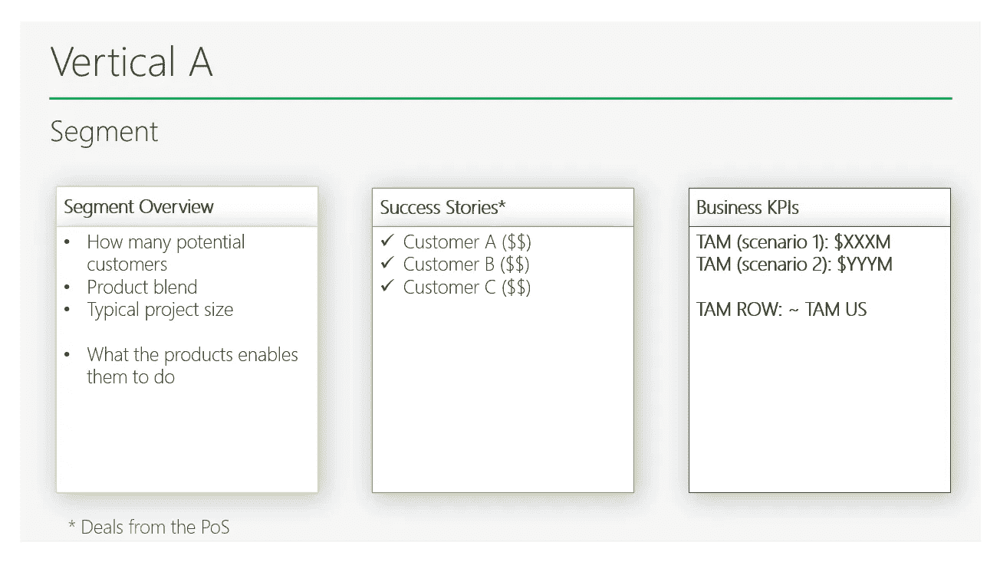
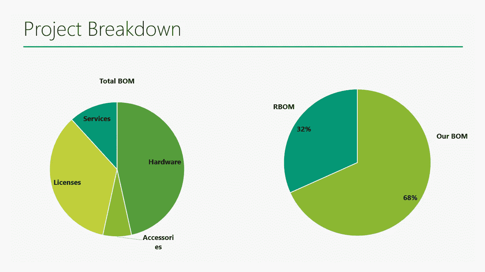
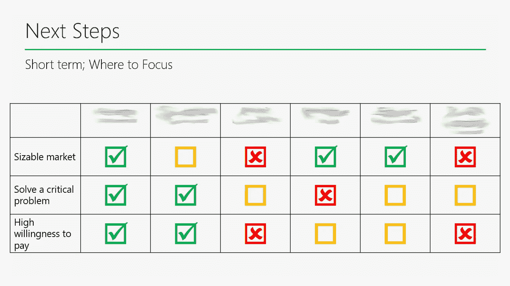

# 寻找新市场的逐步指南

> 原文：<https://medium.com/analytics-vidhya/a-step-by-step-guide-to-finding-new-markets-81e5451affd5?source=collection_archive---------14----------------------->

照片由 [ja ma](https://unsplash.com/@ja_ma?utm_source=unsplash&utm_medium=referral&utm_content=creditCopyText) 在 [Unsplash](https://unsplash.com/s/photos/boqueria?utm_source=unsplash&utm_medium=referral&utm_content=creditCopyText)

## 你错过了哪些垂直市场？

## 如何发展和扩大你公司的业务

不管你的企业是处于生存模式还是积极发展，你都需要考虑如何扩展和成长到新的垂直市场。

对于初创公司、中型公司和大型企业来说都是如此。

> 这是一份非常实用的指南，包含仪表盘、问卷和想法，可以帮助你想出一个关于如何发展和扩大现有业务的可靠策略

当我被指派领导负责寻找新的垂直市场的工作组时，我做的第一件事就是思考这个过程。互联网上有很多不同的指南，但我想要一个更简单、更可靠、更快速的过程。

30 步指南对我来说不太合适，所以我在考虑一种不同的方法…

有一天，一位数学家觉得自己厌倦了数学。所以，他走到消防队，宣布他想成为一名消防员。

消防队长说，“嗯，你看起来是个好人。我很乐意雇用你，但首先我得给你一个小小的考验。”

消防队长把数学家带到消防队后面的巷子里，那里有一个垃圾箱、一个水龙头和一根水管。局长接着说，“好吧，你走在巷子里，看到这里的垃圾箱着火了。你是做什么的？”

数学家回答说，“嗯，我把水管接到水龙头上，打开水，然后灭火。”

酋长说，“太棒了……太完美了。现在我必须再问你一个问题。如果你走在小巷里，看到垃圾箱没有着火，你会怎么做？”

数学家对这个问题困惑了一会儿，最后他说:“我把垃圾箱点着了。”

酋长喊道，“什么？太可怕了！你为什么要点燃垃圾箱？”

数学家回答说，“好吧，这样我就把问题简化成一个我已经解决的问题了。”

# 定义增长搜索流程

让我们做一会儿数学家。将这个复杂的任务分成我们知道如何处理的小部分:

1.  **了解产品在哪些用例中被真正使用** —采访面向客户的技术同事，了解产品在哪些用例中被实际使用，而不是被设计使用。换句话说，研究客户决定使用你的产品的所有现有用例及成功案例。从客户的角度来看，他们来自哪个行业？它们代表哪些垂直市场？
2.  **了解在哪些垂直领域你已经有了经过验证的适合市场的产品**——从这些访谈中，试着了解产品“按设计”用在了哪里，客户要求在哪些领域进行调整或改进。了解它是一个单一的成功故事还是有代表性的事情
3.  **选择正确的市场关注**——了解这些垂直市场有多大，你是否解决了一个关键问题，那里是否有钱。你将通过分析公司已经完成的交易和评估关键市场参数来完成
4.  **执行** —确定正确的上市方式，更新营销计划，围绕这些新的垂直市场调整公司

您还可以使用这种方法来确保您已经处理的垂直市场是正确的。根据我在“有市场吗”一节中定义的关键市场参数进行健全性检查。

你需要收集的大部分信息都在你的公司里，并且已经可以得到。你需要和正确的人说话，问正确的问题，并遵循这个方法。

最后但同样重要的是。我会假设公司的资源是有限的。特别是 R&D 和产品，因此最佳解决方案是避免对产品进行重大变更。它还能让你快速显示结果。谁不喜欢速赢呢？

# **了解产品真正在哪些用例中使用**

这是第一步。我强调真正重要的是。

> 目标是了解除了最初设计的用例之外，您的产品目前在哪里使用。与面向客户的技术人员交谈:售前/SE/客户成功

这些人更关注客户的技术方面，可能会为您提供关于产品实际使用情况的最佳答案。

以下问题会有所帮助:

1.  除了我们现有产品最初设计的用例之外，我们现有产品的其他用例是什么？
2.  这些客户是谁？
3.  我们的产品能让他们实现什么？
4.  这是一个单一的例子，还是我们有许多类似的客户？
5.  除了我们的现有产品最初设计用于的用例之外，客户还想将我们的现有产品用于哪些其他用例，但它不起作用？
6.  这些客户是谁？
7.  他们想达到什么目的？
8.  我们的解决方案中缺少哪些功能？

# 找到适合市场的产品

根据答案，你会发现几个类别。

**设计用于 X 的现有产品，显然用于 Y！。**客户 A 和 B 尝试了这种方法，并取得了成功，他们甚至愿意分享成功案例！换句话说，有产品就有适合。现在，我们需要确保有一个市场。我们将在下一节看到它是如何工作的。

很可能，这些客户按照设计的方式使用产品，但它可能处于完全不同的行业，不同的市场，不同的合作伙伴，甚至不同的支付意愿。

> 这些都是短期机会。所有艰苦的工作都已经完成——产品已经由客户开发、测试和部署。没有 R&D 的努力。这是一个完美的唾手可得的机会。速战速决！

**第二种可能是客户 A 试用了你的产品，它在一定程度上起了作用，但缺少一些功能/特性。**产品与市场的契合度还没有达到，但如果有市场的话，还是值得一试。请想一想，在没有任何重大销售或营销努力的情况下，这位客户联系了您并测试了您的产品。难道不是值得调查的事情吗？

这是您最终将看到的仪表板:

垂直分析仪表板

# 有市场吗？

在这种情况下，我在检查是否有潜在市场时会问 3 个简单的问题:

1.  **可观的市场**——确保有一个巨大的潜在市场。在这一点上，你需要研究和挖掘这些新的垂直市场。与销售人员交谈，评估典型的项目/交易规模(美元美元)。然后，通过估计此类项目的潜在数量，尝试估计此用例的可伸缩性。例如，如果新用例是在大学校园(而不是医院)部署，项目规模为 54K 美元，美国有 5300 所大学和学校，目标潜在市场为 2 . 86 亿美元。此外，值得检查您是否能够/想要进行全球扩展。
2.  **解决一个关键问题** —有一种紧迫感。该产品解决了一个重要的痛点。位于客户正在处理的问题列表的首位。
3.  **高支付意愿** —客户愿意为您的解决方案、功能和许可证付费。换句话说，用了它的人，明白你带来的价值，愿意为此买单。

你可以做的另一件事是了解这些项目的分解。例如，在学校项目中，你提供管理库存的软件(笔记本电脑、平板电脑、投影仪等)。).试着了解你是否提供端到端的解决方案。如果不是，那还有谁参与了？有哪些额外的解决方案组件，包括服务、许可证、附件等。？这是在这些新的垂直市场中实现横向和纵向整合和增长的途径。

项目价值细分

你可能想知道竞争、替代方案、进入壁垒等等。？这些都是合理的问题。然而，在我看来，它们与我们在此讨论的案例关系不大。这位客户很主动，他已经参与进来，部署了您的产品。

# **选择了正确的市场来关注**

这是您最终应该看到的控制面板:

焦点仪表板

很清楚你需要把精力集中在哪里！

# 摘要

1.  除了你的产品被设计的用例之外，看看你的产品在哪里被使用
2.  了解这些成功案例并验证市场关键参数:足够大，服务于关键问题，有足够的资金
3.  这种方法也很好地验证了你现有的市场是否值得服务
4.  分析交易规模和细分，以了解垂直市场的增长方向
5.  在各种规模的公司，包括初创公司，这应该是一个持续的过程

【linkedin.com/in/borismay*随时在领英联系我:*