# 基本对象检测算法的逐步介绍(第 1 部分)

> 原文：<https://medium.com/analytics-vidhya/a-step-by-step-introduction-to-the-basic-object-detection-algorithms-part-1-c61bebaf1038?source=collection_archive---------1----------------------->

你花了多少时间在一个又脏又乱的房子里寻找丢失的房间钥匙？它发生在我们最优秀的人身上，至今仍是一种令人难以置信的沮丧经历。但是如果一个简单的计算机算法可以在几毫秒内定位你的钥匙呢？

这就是物体检测算法的威力。虽然这是一个简单的例子，但物体检测的应用跨越多个不同的行业，从全天候监控到智能城市中的实时车辆检测。简而言之，这些都是强大的深度学习算法。

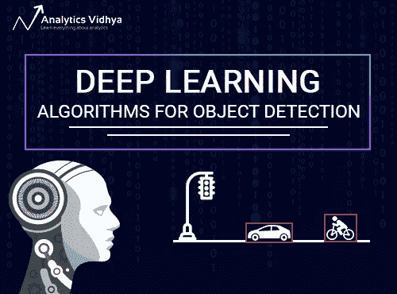

在这篇文章中，我们将更深入地研究各种可用于物体检测的算法。我们将从属于 RCNN 家族的算法开始，即 RCNN、快速 RCNN 和更快 RCNN。在本系列即将发布的文章中，我们将讨论更高级的算法，如 YOLO、SSD 等。

*我鼓励你仔细阅读这篇关于物体检测的* [*的前一篇文章*](https://www.analyticsvidhya.com/blog/2018/06/understanding-building-object-detection-model-python/) *，在这篇文章中，我们介绍了这一奇妙技术的基础知识，并向你展示了使用 OpenAI 库在 Python 中的实现。*

我们开始吧！

# 目录

1.  解决对象检测任务的简单方法(使用深度学习)
2.  了解基于区域的卷积神经网络
    1。RCNN
    2 的直觉。RCNN 的问题
3.  了解快速 RCNN
    1。快速 RCNN
    2 的直觉。快速 RCNN 的问题
4.  了解更快的 RCNN
    1。直觉更快 RCNN
    2。快速 RCNN 的问题
5.  涵盖的算法概述

# 1.解决对象检测任务的简单方法(使用深度学习)

下图是一个常见的例子，说明了对象检测算法是如何工作的。图像中的每一个物体，从一个人到一只风筝，都被精确定位和识别。

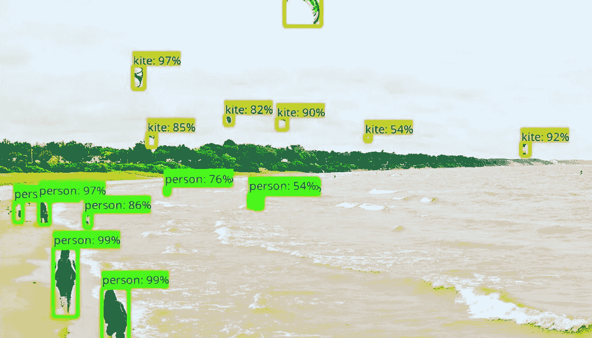

让我们从最简单的深度学习方法开始，这是一种广泛使用的方法，用于检测图像中的对象——卷积神经网络或 CNN。如果你对 CNN 的了解有点生疏，我推荐你先通读一下[这篇文章](https://www.analyticsvidhya.com/blog/2017/06/architecture-of-convolutional-neural-networks-simplified-demystified/)。

但是我将简要地为你总结一个 CNN 的内部运作。请看下图:

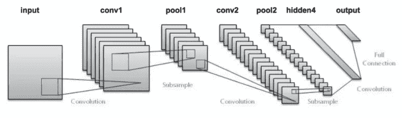

我们将图像传递到网络，然后通过各种卷积和池层发送。最后，我们以对象的类的形式得到输出。相当简单，不是吗？

对于每个输入图像，我们得到一个相应的类作为输出。我们可以使用这种技术来检测图像中的各种对象吗？是的，我们可以！让我们看看如何使用 CNN 解决一般的对象检测问题。

1.首先，我们将一幅图像作为输入:

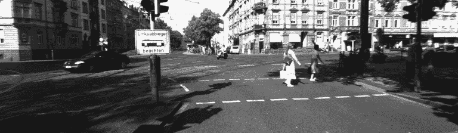

2.然后我们把图像分成不同的区域:

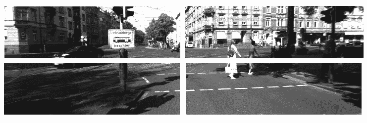

3.然后，我们将每个区域视为一个单独的图像。

4.把这些区域(图像)全部传给 CNN，分门别类。

5.一旦我们将每个区域划分到其相应的类中，我们就可以组合所有这些区域以获得具有检测到的对象的原始图像:

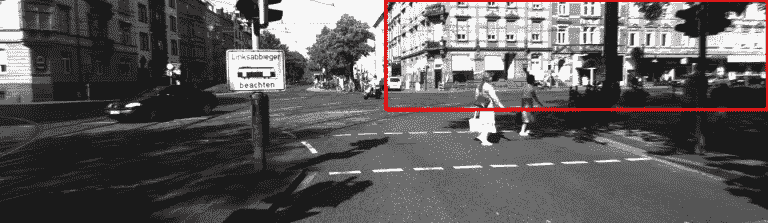

使用这种方法的问题是图像中的对象可能具有不同的纵横比和空间位置。例如，在某些情况下，对象可能覆盖图像的大部分，而在其他情况下，对象可能仅覆盖图像的一小部分。对象的形状也可能不同(这在现实生活中经常发生)。

由于这些因素，我们将需要非常大量的区域，导致大量的计算时间。因此，为了解决这个问题并减少区域的数量，我们可以使用基于区域的 CNN，它使用一种提议方法来选择区域。让我们来了解一下这个以地区为基础的 CNN 能为我们做些什么。

# 2.理解基于区域的卷积神经网络

# 2.1 RCNN 的直觉

RCNN 算法不是在大量区域上工作，而是在图像中提出一堆盒子，并检查这些盒子中是否包含任何对象。RCNN **使用选择性搜索从图像中提取这些框(这些框称为区域)。**

让我们首先了解什么是选择性搜索，以及它如何识别不同的区域。基本上有四个区域形成一个物体:不同的比例，颜色，纹理和外壳。选择性搜索识别图像中的这些模式，并基于此提出各种区域。以下是选择性搜索工作原理的简要概述:

*   它首先接受一幅图像作为输入:

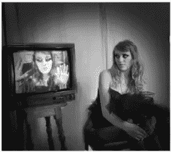

*   然后，它生成初始子分割，以便我们从该图像中获得多个区域:

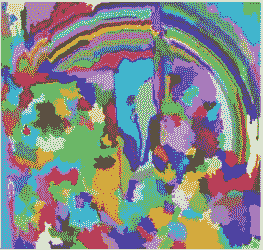

*   该技术然后组合相似的区域以形成更大的区域(基于颜色相似性、纹理相似性、尺寸相似性和形状兼容性):

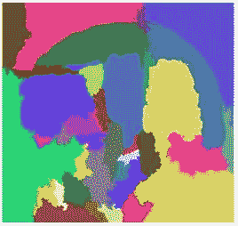

*   最后，这些区域然后产生最终的对象位置(感兴趣区域)。

下面是 RCNN 检测对象所遵循的步骤的简要总结:

1.  我们首先采用一个预先训练好的卷积神经网络。
2.  然后，这个模型被重新训练。我们根据需要检测的类别数量来训练网络的最后一层。
3.  第三步是获取每幅图像的感兴趣区域。然后，我们对所有这些区域进行整形，使它们能够匹配 CNN 的输入大小。
4.  在得到区域后，我们训练 SVM 对物体和背景进行分类。每堂课，我们训练一个二进制 SVM。
5.  最后，我们训练一个线性回归模型来为图像中每个识别的对象生成更紧密的边界框。

您可能会通过一个视觉示例*对以上步骤有更好的理解(下面所示示例的图像摘自* [*本文*](http://www.robots.ox.ac.uk/~tvg/publications/talks/fast-rcnn-slides.pdf) *)。*那我们就来一个吧！

*   首先，将一幅图像作为输入:

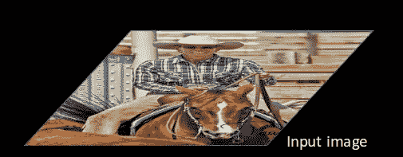

*   然后，我们使用某种提议方法(例如，如上所示的选择性搜索)来获得感兴趣区域(ROI):

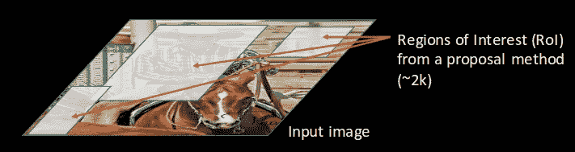

*   然后，所有这些区域都按照 CNN 的输入进行整形，并且每个区域都被传递到 ConvNet:

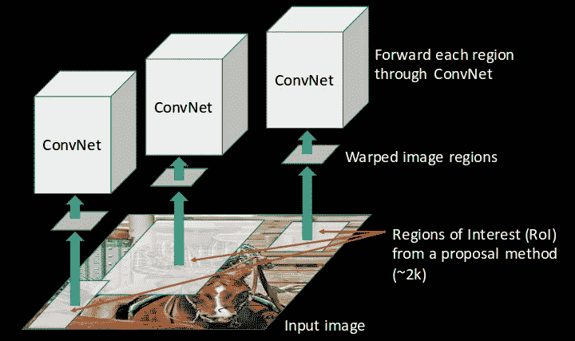

*   CNN 然后提取每个区域的特征，并且使用支持向量机将这些区域分成不同的类别:

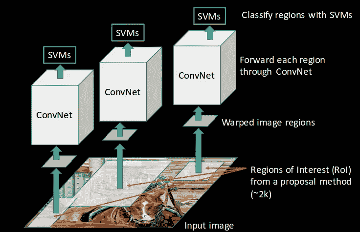

*   最后，使用边界框回归( *Bbox reg* )来预测每个识别区域的边界框:

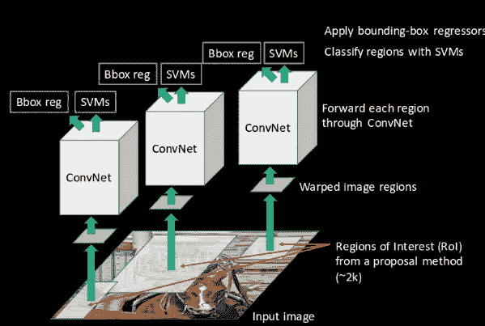

简而言之，这就是 RCNN 如何帮助我们检测物体。

# 2.2 RCNN 的问题

到目前为止，我们已经看到了 RCNN 如何有助于对象检测。但是这种技术有其自身的局限性。由于以下步骤，训练 RCNN 模型既昂贵又缓慢:

*   基于选择性搜索为每幅图像提取 2000 个区域
*   使用 CNN 提取每个图像区域的特征。假设我们有 N 个图像，那么 CNN 特征的数量将是 N * 2,000
*   使用 RCNN 的目标检测的整个过程有三个模型:
    1 .CNN 进行特征提取
    2。用于识别物体的线性 SVM 分类器
    3。收紧包围盒的回归模型。

所有这些过程结合起来使得 RCNN 非常慢。对每个新图像进行预测大约需要 40-50 秒，这基本上使得模型变得繁琐，并且在面对巨大数据集时几乎不可能构建。

这里有一个好消息，我们有另一种对象检测技术，它修复了我们在 RCNN 中看到的大多数限制。

# 3.了解快速 RCNN

# 3.1 快速 RCNN 的直觉

我们还能做什么来减少 RCNN 算法通常需要的计算时间？我们可以对每幅图像只运行一次 CNN，而不是对每幅图像运行 2000 次，并获得所有感兴趣的区域(包含一些对象的区域)。

RCNN 的作者 Ross Girshick 提出了这样一个想法，即每幅图像只运行一次 CNN，然后找到一种方法在 2000 个区域之间共享计算。在快速 RCNN 中，我们将输入图像馈送到 CNN，CNN 进而生成卷积特征图。使用这些图，提取提案的区域。然后，我们使用 RoI pooling 层将所有建议的区域重新调整为固定的大小，以便将其输入到完全连接的网络中。

让我们将它分解成几个步骤来简化概念:

1.  与前两种技术一样，我们将图像作为输入。
2.  该图像被传递到 ConvNet，conv net 进而生成感兴趣的区域。
3.  RoI pooling 层应用于所有这些区域，以根据 ConvNet 的输入对它们进行整形。然后，每个区域被传递给一个完全连接的网络。
4.  在全连接网络的顶部使用 softmax 层来输出类。除了 softmax 图层之外，线性回归图层也被并行用于输出预测类的边界框坐标。

因此，快速 RCNN 使用单个模型，而不是使用三个不同的模型(如 RCNN ),该模型从区域中提取特征，将它们分成不同的类，并同时返回已识别类的边界框。

为了进一步分解，我将把每一步都形象化，为解释增加一个实用的角度。

*   我们遵循现在众所周知的将图像作为输入的步骤:

*   该图像被传递给 ConvNet，conv net 相应地返回感兴趣的区域:

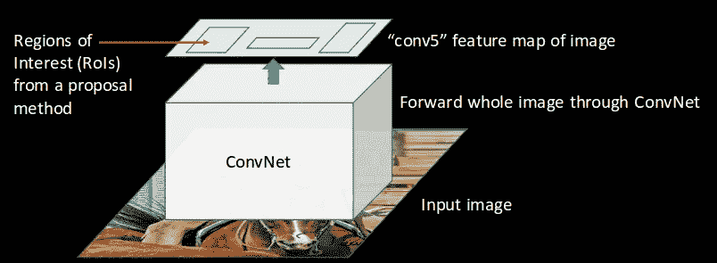

*   然后，我们对提取的感兴趣区域应用 RoI pooling 层，以确保所有区域的大小相同:

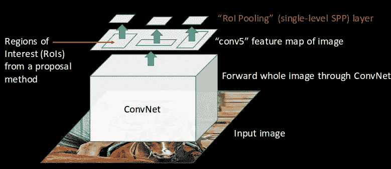

*   最后，这些区域被传递到一个完全连接的网络，该网络对它们进行分类，并同时使用 softmax 和线性回归图层返回边界框:

这就是 RCNN 解决 RCNN 的两个主要问题的速度，即，将每个图像的一个而不是 2，000 个区域传递到 ConvNet，以及使用一个而不是三个不同的模型来提取特征、分类和生成边界框。

# 3.2 快速 RCNN 的问题

但是即使快速 RCNN 也有某些问题区域。它还使用选择性搜索作为查找感兴趣区域的建议方法，这是一个缓慢且耗时的过程。每幅图像大约需要 2 秒来检测对象，这比 RCNN 好得多。但是当我们考虑大型真实数据集时，即使快速的 RCNN 看起来也不再那么快了。

但是还有另一种物体检测算法胜过快速 RCNN。我觉得你不会对它的名字感到惊讶。

# 4.了解更快的 RCNN

# 4.1.更快 RCNN 的直觉

快速 RCNN 是快速 RCNN 的修改版本。它们之间的主要区别是，快速 RCNN 使用选择性搜索来生成感兴趣的区域，而快速 RCNN 使用“区域提议网络”，也称为 RPN。RPN 将图像特征图作为输入，并生成一组对象提议，每个提议都有一个对象性分数作为输出。

在更快的 RCNN 方法中，通常遵循以下步骤:

1.  我们将一幅图像作为输入，并将其传递给 ConvNet，后者返回该图像的特征图。
2.  在这些特征图上应用区域建议网络。这将返回对象建议及其客观性分数。
3.  投资回报池层应用于这些建议，将所有建议缩小到相同的大小。
4.  最后，建议被传递到一个完全连接的层，该层在其顶部具有一个 softmax 层和一个线性回归层，以分类和输出对象的边界框。

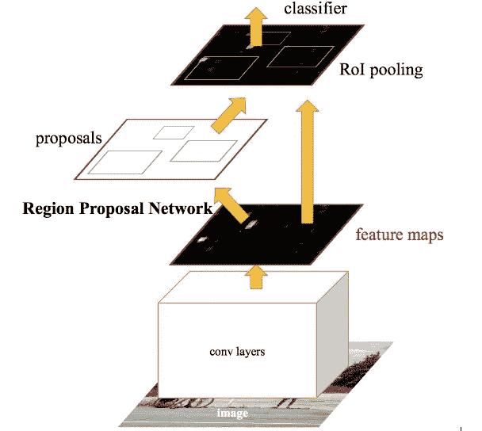

让我简单解释一下这个区域提案网络(RPN)实际上是如何工作的。

首先，快速 RCNN 从 CNN 获取特征地图，并将它们传递给区域提议网络。RPN 在这些特征图上使用滑动窗口，并且在每个窗口，它生成不同形状和大小的 *k* 锚框:

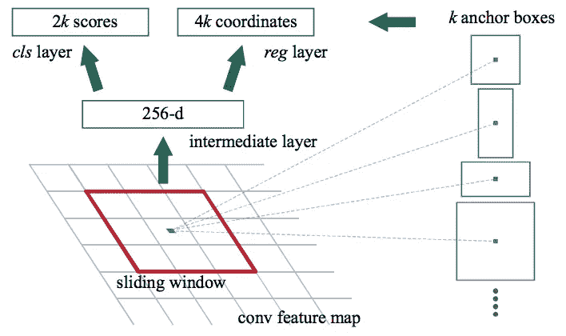

锚定框是固定大小的边界框，放置在整个图像中，具有不同的形状和大小。对于每个主播，RPN 预测两件事:

*   第一个是锚是对象的概率(它不考虑对象属于哪个类)
*   第二个是边界框回归器，用于调整锚点以更好地适应对象

我们现在有不同形状和大小的边界框，它们被传递到 RoI 合并层。现在，在 RPN 步骤之后，有可能存在没有被分配类别的提议。我们可以对每个提议进行裁剪，使每个提议都包含一个对象。这就是 RoI pooling 层的作用。它为每个锚点提取固定大小的特征图:

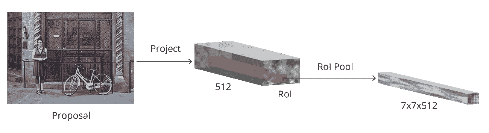

然后，这些特征地图被传递到具有 softmax 和线性回归层的全连接层。它最终对对象进行分类，并预测所识别对象的边界框。

# 4.2 更快 RCNN 的问题

到目前为止，我们讨论的所有对象检测算法都使用区域来识别对象。该网络不会一次查看完整的图像，而是依次关注图像的各个部分。这造成了两个问题:

*   该算法需要多次通过单个图像来提取所有对象
*   由于不同的系统一个接一个地工作，未来系统的性能取决于先前系统的性能

# 5.涵盖的算法概述

下表很好地总结了我们在本文中涉及的所有算法。我建议下次你在进行物体探测挑战的时候把它放在手边！

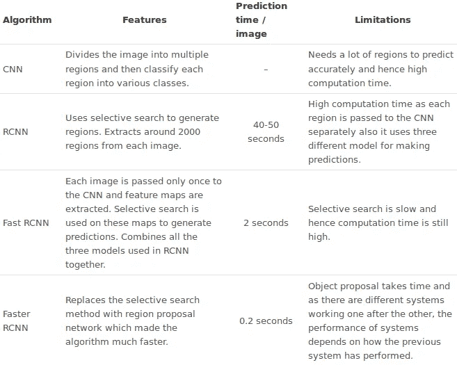

# 结束注释

物体检测是一个迷人的领域，在商业和研究应用中有着巨大的吸引力。由于现代硬件和计算资源的进步，这一领域的突破一直是快速和突破性的。

这篇文章只是我们的目标检测之旅的开始。在本系列的下一篇文章中，我们将会遇到现代的物体检测算法，比如 YOLO 和 RetinaNet。敬请关注！

我总是很感谢对我的文章的任何反馈或建议，所以请随时在下面的评论部分与我联系。

*原载于 2018 年 10 月 11 日*[*【www.analyticsvidhya.com】*](https://www.analyticsvidhya.com/blog/2018/10/a-step-by-step-introduction-to-the-basic-object-detection-algorithms-part-1/)*。*