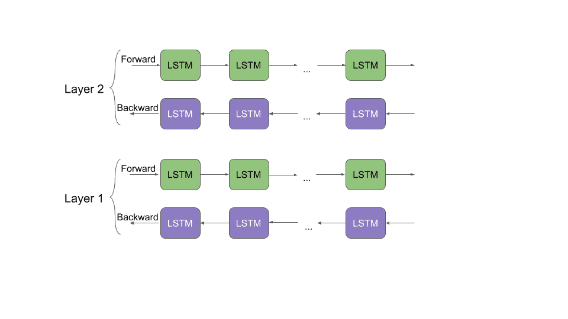

# 学习 ELMo 从文本中提取特征的分步 NLP 指南

> 原文：<https://medium.com/analytics-vidhya/a-step-by-step-nlp-guide-to-learn-elmo-for-extracting-features-from-text-de0d77e32a99?source=collection_archive---------1----------------------->

我研究不同的自然语言处理(NLP)问题(作为数据科学家的额外津贴！).每个 NLP 问题都是一个独特的挑战。这反映了人类语言是多么复杂、美丽和奇妙。

但有一件事一直是 NLP 从业者心中的一根刺，那就是(机器)无法理解句子的真正含义。是的，我说的是语境。当要求执行基本任务时，传统的 NLP 技术和框架非常有用。当我们试图给情况添加背景时，事情很快就变糟了。

在过去的 18 个月左右的时间里，NLP 的前景发生了显著的变化。像谷歌的 BERT 和 Zalando 的 Flair 这样的 NLP 框架能够解析句子，并掌握句子的上下文。


# 语言模型嵌入(ELMo)

这方面最大的突破之一要归功于 ELMo，它是 AllenNLP 开发的最先进的 NLP 框架。当你读完这篇文章的时候，你也会像我一样成为一个超级 ELMo 迷。

在本文中，我们将探索 ELMo(来自语言模型的嵌入),并使用它在真实世界的数据集上使用 Python 构建一个令人兴奋的 [NLP 模型。](https://courses.analyticsvidhya.com/bundles/nlp-combo?utm_medium=ELMoNLParticle&utm_source=blog)

*注意:本文假设你熟悉不同类型的单词嵌入和 LSTM 架构。您可以参考以下文章了解更多主题:*

*   [*对单词嵌入的直观理解*](https://www.analyticsvidhya.com/blog/2017/06/word-embeddings-count-word2veec/?utm_medium=ELMoNLParticle&utm_source=medium)
*   [*深度学习精要:长短期记忆入门*](https://www.analyticsvidhya.com/blog/2017/12/fundamentals-of-deep-learning-introduction-to-lstm/?utm_medium=ELMoNLParticle&utm_source=medium)

# 目录

1.  ELMo 是什么？
2.  了解 ELMo 的工作原理
3.  ELMo 与其他单词嵌入有何不同？
4.  实现:用于 Python 中文本分类的 ELMo
5.  我们还能拿埃尔莫怎么办？

# ELMo 是什么？

不，我们所指的 ELMo 不是芝麻街里的角色！上下文重要性的经典例子。


ELMo 是一种在向量或嵌入中表示单词的新方法。这些单词嵌入有助于在几个 NLP 任务中实现最先进的(SOTA)结果:


全球的 NLP 科学家已经开始使用 ELMo 完成各种 NLP 任务，无论是在研究领域还是在工业领域。你必须在这里查看埃尔莫的原始研究论文——https://arxiv.org/pdf/1802.05365.pdf。我通常不要求人们阅读研究论文，因为它们经常会显得沉重和复杂，但我为 ELMo 破例。这是一个非常酷的关于 ELMo 是如何设计的解释。

# 了解 ELMo 的工作原理

在用 Python 实现 ELMo 之前，让我们先直观地了解一下它是如何工作的。为什么这很重要？

想象一下。您已经成功地将 ELMo 代码从 GitHub 复制到 Python 中，并成功地在您的定制文本数据上构建了一个模型。你得到的结果一般，所以你需要改进模型。如果你不了解 ELMo 的架构，你会怎么做呢？如果你没有研究过，你会调整哪些参数？

这个思路适用于所有的机器学习算法。你不需要研究它们的推导过程，但是你应该知道足够多的知识来使用它们并改进你的模型。

现在，让我们回到 ELMo 是如何工作的。

正如我前面提到的，ELMo 单词向量是在两层双向语言模型(biLM)之上计算的。这个 biLM 模型有两层堆叠在一起。每层有两个通道—向前通道和向后通道:



*   上面的架构使用字符级卷积神经网络(CNN)将文本串的单词表示成原始单词向量
*   这些原始单词向量充当 biLM 第一层的输入
*   向前传递包含关于某个单词和该单词之前的上下文(其他单词)的信息
*   反向传递包含关于单词及其后的上下文的信息
*   来自向前和向后传递的这一对信息形成了中间单词向量
*   这些中间字向量被送入 biLM 的下一层
*   最终表示(ELMo)是原始单词向量和两个中间单词向量的加权和

由于 biLM 的输入是根据字符而不是单词计算的，因此它捕获了单词的内部结构。例如，biLM 将能够计算出像*美*和*美*这样的术语在某种程度上是相关的，甚至不需要查看它们经常出现的上下文。听起来不可思议！

# ELMo 与其他单词嵌入有何不同？

与传统的单词嵌入不同，如 [word2vec](https://www.analyticsvidhya.com/blog/2017/06/word-embeddings-count-word2veec/?utm_source=ELMoNLParticle&utm_medium=blog) 和 [GLoVe](https://nlp.stanford.edu/projects/glove/) ，分配给令牌或单词的 ELMo 向量实际上是包含该单词的整个句子的函数。因此，同一个词在不同的语境下可以有不同的词向量。

我可以想象你会问——知道这一点对我处理 NLP 问题有什么帮助？让我用一个例子来解释一下。

假设我们有几个句子:

1.  我昨天 ***读了*** 这本书。
2.  你现在能读懂这封信吗？

花点时间思考一下这两者之间的区别。第一句中的动词“read”是过去式。同一个动词在第二句中变成了现在时。这是一个多义词的例子，一个词可能有多个意思。

语言是如此奇妙复杂的东西。

传统的单词嵌入会为两个句子中的单词“read”提供相同的向量。因此，他们无法区分多义词。

ELMo word vectors 成功解决了这个问题。ELMo 单词表示将整个输入句子带入等式，用于计算单词嵌入。因此，术语“读”在不同的上下文中将具有不同的 ELMo 向量。

# 实现:用于 Python 中文本分类的 ELMo

现在，您期待已久的时刻到了——用 Python 实现 ELMo！让我们一步一步来。


## 1.理解问题陈述

应对任何[数据科学挑战](https://datahack.analyticsvidhya.com/contest/all/?utm_medium=ELMoNLParticle&utm_source=blog)的第一步是定义问题陈述。这是我们未来行动的基础。

对于本文，我们已经有了问题陈述:

情感分析仍然是自然语言处理广泛应用的关键问题之一。这一次，考虑到顾客发来的关于制造和销售手机、电脑、笔记本电脑等各种科技公司的推文。的任务是识别推文是否对这类公司或产品有负面情绪。

这显然是一个二元文本分类任务，我们必须从提取的推文中预测情感。

## 2.关于数据集

这是我们拥有的数据集的细分:

*   火车集合包含 7，920 条推文
*   测试集包含 1953 条推文

**你可以从这个** [**页面**](https://datahack.analyticsvidhya.com/contest/linguipedia-codefest-natural-language-processing-1/#data_dictionary) **下载数据集。***注意，你必须注册或登录才能这样做。*

**注意:**推文中大部分亵渎和低俗的词语已被替换为“$ & @*#”。但是，请注意，数据集可能仍然包含可能被视为亵渎、粗俗或冒犯的文本。

好了，让我们启动我们最喜欢的 Python IDE，开始编码吧！

## 3.导入库

导入我们将在笔记本中使用的库:

## 4.阅读并检查数据

```
*# read data* 
train = pd.read_csv("train_2kmZucJ.csv") 
test = pd.read_csv("test_oJQbWVk.csv") 
train.shape, test.shape
```

**输出:** ((7920，3)，(1953，2))

训练集有 7920 条推文，而测试集只有 1953 条。现在让我们检查训练集中的类分布:

```
train['label'].value_counts(normalize = True)
```

**输出:**

**0** 0.744192

1 0.255808

名称:标签，型号:float64

这里，1 代表负面推文，而 0 代表非负面推文。

让我们快速浏览一下列车组的前 5 排:

```
train.head()
```


我们有三个栏目可以使用。列“tweet”是独立变量，而列“label”是目标变量。

## 5.文本清洗和预处理

在理想世界中，我们将拥有一个干净的结构化数据集。但是在 NLP 中事情并没有那么简单。

我们需要花费大量时间清理数据，为模型构建阶段做好准备。从文本中提取特征变得容易，甚至特征包含更多的信息。数据质量越好，您将会看到模型性能的显著提高。

所以让我们清理一下给我们的文本，并探索它。

推文中似乎有不少网址链接。他们没有告诉我们太多(如果有的话)关于推文的情绪，所以让我们删除它们。

我们使用正则表达式(或 RegEx)来删除 URL。

**注:** *你可以在此* [*文章*](https://www.analyticsvidhya.com/blog/2015/06/regular-expression-python/) *中了解更多关于 Regex 的信息。*

我们现在继续做一些例行的文本清理。

我还想规范化文本，又名，执行文本规范化。这有助于把一个词简化成它的基本形式。例如，单词“生产”、“生产”和“正在生产”的基本形式是**“产品”**。经常发生的情况是，同一个单词的多种形式并不真的那么重要，我们只需要知道这个单词的基本形式。

我们将利用流行的空间库对文本进行词条化(规范化)。

对训练集和测试集中的推文进行分类:

```
train['clean_tweet'] = lemmatization(train['clean_tweet']) test['clean_tweet'] = lemmatization(test['clean_tweet'])
```

让我们快速浏览一下原始推文和经过清理的推文:

```
train.sample(10)
```


仔细看看上面的专栏。“clean_tweet”栏中的推文看起来比原始推文清晰得多。

然而，我觉得仍然有足够的空间来清理文本。我鼓励你尽可能多地探索数据，在文本中找到更多的见解或不规则之处。

## 6.TensorFlow 中心简介

等等，TensorFlow 和我们的教程有什么关系？

[TensorFlow Hub](https://www.tensorflow.org/hub) 是一个库，它通过允许使用许多机器学习模型来完成不同的任务，从而实现了[迁移学习](https://www.analyticsvidhya.com/blog/2017/06/transfer-learning-the-art-of-fine-tuning-a-pre-trained-model/?utm_medium=ELMoNLParticle&utm_source=blog)。ELMo 就是这样一个例子。这就是我们在实施中通过 TensorFlow Hub 访问 ELMo 的原因。


在我们做任何事情之前，我们需要安装 TensorFlow Hub。要使用 TensorFlow Hub，您必须将 TensorFlow 软件包安装或升级到至少 1.7 版本:

```
$ pip install "tensorflow>=1.7.0" 
$ pip install tensorflow-hub
```

## 7.准备 ELMo 载体

我们现在将导入预训练的 ELMo 模型。需要注意的是——这个模型的大小超过了 350 mb，所以下载它可能需要一段时间。

```
**import** tensorflow_hub **as** hub 
**import** tensorflow **as** tf 
elmo = hub.Module("https://tfhub.dev/google/elmo/2", trainable=**True**)
```

我将首先向你展示我们如何得到一个句子的 ELMo 向量。你所要做的就是在对象 **elmo** 中传递一个字符串列表。

**输出:** TensorShape([Dimension(1)，Dimension(8)，Dimension(1024)]

输出是形状(1，8，1024)的三维张量:

*   这个张量的第一维表示训练样本的数量。在我们的例子中是 1
*   第二维表示字符串输入列表中最长字符串的最大长度。因为我们的输入列表中只有一个字符串，所以第二维的大小等于字符串的长度— 8
*   第三维等于 ELMo 向量的长度

因此，**输入句子中的每个单词具有大小为 1024 的 ELMo 向量。**

让我们继续在训练和测试数据集中提取干净的 tweets 的 ELMo 向量。然而，为了获得整个 tweet 的向量表示，我们将采用 tweet 的组成术语或令牌的 ELMo 向量的平均值。

让我们为此定义一个函数:

如果使用上面的函数一次性提取 tweets 的嵌入，可能会耗尽计算资源(内存)。作为一种解决方法，将训练集和测试集分成每批 100 个样本。然后，将这些批处理依次传递给函数 **elmo_vectors( )** 。

我会将这些批次保存在一个列表中:

```
list_train = [train[i:i+100] **for** i **in** range(0,train.shape[0],100)] list_test = [test[i:i+100] **for** i **in** range(0,test.shape[0],100)]
```

现在，我们将遍历这些批次并提取 ELMo 向量。我警告你，这需要很长时间。

```
*# Extract ELMo embeddings* 
elmo_train = [elmo_vectors(x['clean_tweet']) **for** x **in** list_train] elmo_test = [elmo_vectors(x['clean_tweet']) **for** x **in** list_test]
```

一旦我们有了所有的向量，我们可以将它们连接成一个数组:

```
elmo_train_new = np.concatenate(elmo_train, axis = 0) 
elmo_test_new = np.concatenate(elmo_test, axis = 0)
```

我会建议你保存这些数组，因为我们花了很长时间来获得它们的 ELMo 向量。我们将把它们保存为 pickle 文件:

使用以下代码将它们加载回来:

## 8.模型建立和评估

让我们用 ELMo 建立我们的 NLP 模型！

我们将使用训练数据集的 ELMo 向量来建立分类模型。然后，我们将使用该模型对测试集进行预测。但是在这之前，将 **elmo_train_new** 分成训练和验证集，以便在测试阶段之前评估我们的模型。

由于我们的目标是设定一个基线分数，我们将使用 ELMo 向量作为特征建立一个简单的逻辑回归模型:

预测时间！首先，在验证集上:

```
preds_valid = lreg.predict(xvalid)
```

我们将通过 F1 评分标准评估我们的模型，因为这是[竞赛](https://datahack.analyticsvidhya.com/contest/linguipedia-codefest-natural-language-processing-1/)的官方评估标准。

```
f1_score(yvalid, preds_valid)
```

**输出:** 0.789976

验证集上的 F1 分数令人印象深刻。现在让我们继续对测试集进行预测:

```
*# make predictions on test set* 
preds_test = lreg.predict(elmo_test_new)
```

准备我们将上传到竞赛页面的提交文件:

这些预测在[公众排行榜](https://datahack.analyticsvidhya.com/contest/linguipedia-codefest-natural-language-processing-1/lb)上给了我们 **0.875672** 的分数。坦白地说，鉴于我们只做了相当基本的文本预处理，并且使用了一个非常简单的模型，这是非常令人印象深刻的。想象一下，如果使用更先进的技术，分数会是多少。在您的终端上试用它们，并让我知道结果！

# 我们还能拿埃尔莫怎么办？

我们刚刚亲眼目睹了 ELMo 对于文本分类的有效性。如果再加上一个更复杂的模型，它肯定会有更好的表现。ELMo 的应用不仅限于文本分类的任务。每当需要对文本数据进行矢量化时，都可以使用它。

下面是几个我们可以利用 ELMo 的 NLP 任务:

*   机器翻译
*   语言建模
*   文本摘要
*   命名实体识别
*   问答系统

# 结束注释

毫无疑问，ELMo 是 NLP 的一个重大进步，并将继续存在。鉴于自然语言处理研究的快速进展，其他新的最先进的单词嵌入技术也在过去几个月中出现，如 Google BERT 和 Falando 的 Flair。NLP 从业者的激动人心的时刻即将到来！

我强烈建议您在其他数据集上使用 ELMo，亲自体验性能提升。如果你有任何问题或者想与我和社区分享你的经验，请在下面的评论区提出。如果你是这个领域的新手，你也应该看看下面的 NLP 相关资源:

*   [**自然语言处理课程**](https://courses.analyticsvidhya.com/courses/natural-language-processing-nlp?utm_medium=ELMoNLParticle&utm_source=blog)
*   [**认证项目:自然语言处理(NLP)初学者**](https://courses.analyticsvidhya.com/bundles/nlp-combo?utm_medium=ELMoNLParticle&utm_source=blog)

*原载于 2019 年 3 月 10 日*[*www.analyticsvidhya.com*](https://www.analyticsvidhya.com/blog/2019/03/learn-to-use-elmo-to-extract-features-from-text/)*。*