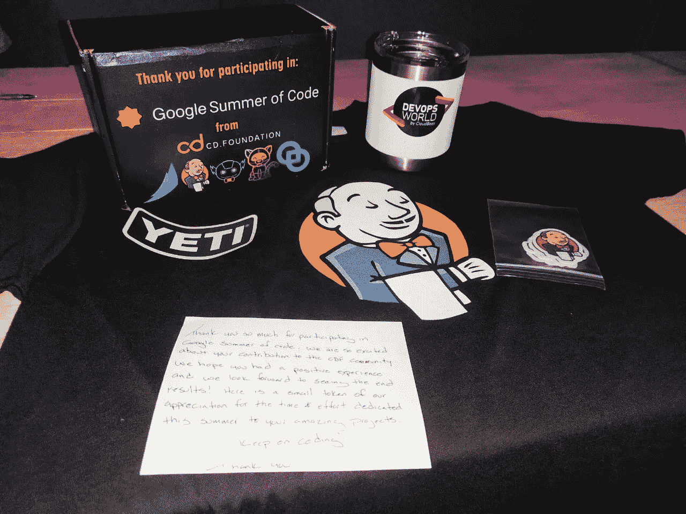

# 一个夏天的故事

> 原文：<https://medium.com/analytics-vidhya/a-story-for-g00gle-summer-of-c0de-eec6cb2bf687?source=collection_archive---------14----------------------->

大家好！

这是我关于 GSoC 2020 的故事。我很高兴与你分享我的旅程。**在文章中找到神奇之处并分享出来**😛。

来自 CDF 的赠品盒

# 介绍我自己和我出色的四位导师

我是来自斯里兰卡莫拉图瓦大学的 Loghi Perinpanayagam。我入选了詹金斯的机器学习插件 GSoC 2020。我被分配了四个导师，他们非常热情地帮助我开始这个代码之夏。

学生

*   [Loghi Perinpanayagam](https://www.jenkins.io/blog/authors/loghijiaha)

导师

*   [木下布鲁诺](https://www.jenkins.io/blog/authors/kinow)
*   约安尼斯·穆特萨斯
*   马基·杰克逊
*   [Shivay Lamba](https://www.jenkins.io/blog/authors/shivaylamba)

# 我去年的准备怎么样？

我在第二年了解到这个开源项目。但至少我去年尝试了一个不同组织的项目，该项目与数据科学的数据可视化推荐相关。但问题是我没有像今年一样贡献那么多，而且在申请过程中为时已晚。像往常一样，与其他项目相比，机器学习相关的项目有很多竞争。我准备学习机器学习中的数据可视化和现有的推荐系统模型。最后我用 ***SeqToSeq*** 模型写了一个建议书，当时对神经网络了解不多。我没有通过专用的 slack 频道进行太多的交流。这可能是失败的原因之一。但最主要的原因是我对 GSoC 2019 的潜伏期。

# 我是怎么过 GSoC 2020 的？

自从我意识到开源对社区是多么的必要和有帮助，我就一直热衷于为开源项目做贡献。在这种情况下，我于 2019 年结束了在印度班加罗尔的实习，我立即专注于参加 GSoC。这是我作为计算机科学学士的最后一年(2020 年)，我希望今年能被选中。

我们部门组织了一次指导研讨会，我了解到詹金斯已经公开了他们的项目想法。这是我 GSoC 2020 旅程的一个令人印象深刻的开始。我浏览了 Jenkins.io 页面中所有的草案和已接受的项目。由于我已经对机器学习感兴趣，并且我熟悉 Java，我选择了对我来说印象最深刻的想法，它没有初始回购。这意味着我想用我的知识来思考和研究这个项目。但我必须做出贡献，并希望了解 Jenkins 代码库的基础架构。因为这使得选择小组很容易为项目挑选学生。然后我反复寻找给詹金斯投稿。我从 git 插件和 git 客户端插件中发现了一些对我来说很容易解决的问题。我开始贡献一些关于 git 插件和 git 客户端插件的测试问题。在我清楚地了解了插件在 Jenkins 中是如何工作的之后，我开始根据项目想法页面中提供的提示进行概念验证。实际上，编码很有趣。

导师在申请过程中帮助了很多学生。我能够完成一个工作 POC，它具有完成项目任务的最低能力。最后，导师们开始提交提案。我匆忙准备了一份提案草案。在我得到导师的评论后，我开始改进这个提议。在提案提交的最后，我能够为这个项目提交一个好的提案。由于我对这个插件很好奇，我深入研究了如何将 Jupyter notebook 与这个插件集成。我发表了一篇中等文章，作为我在接受等待期间的研究结果。

# 结果发布

结果将于 5 月 4 日公布，我相信我的项目建议书和 POC，我被选中参加 2020 年 GSoC。哇哦！那是我一生中最激动人心的时刻。感觉就像`Something I achieved`。作为我努力工作的结果，这是我应得的。例如，我连续花了 7 天时间让 POC 工作，而 maven 工件之间没有任何冲突。

# 社区纽带

成绩公布后，我正在为社区联谊做准备。我和导师之间的互动比以前多了很多。我必须更新我的项目页面和我在 Jenkins.io 中的个人资料。5 月 10 日，我们怀着激动和爱意举行了第一次会议。导师和我介绍了我们自己，尽管我们彼此认识。我们讨论了 GSoC 的高级观点，我问了一些我想到的问题。由于我的插件是一个新的存储库，大部分讨论都与存储库及其名称有关。我必须为这个新插件取一个名字。我们定期就博客帖子和最后的演示进行对话。

在第二次会议中，我们讨论了在 Jenkins 中托管新插件的过程，跟踪 JIRA 的问题，博客帖子和项目的高级路线图。我建议了一些有趣的插件名称，但它们与项目的目标不匹配，导师告诉我尝试其他能完美描述项目的名称。有人建议我阅读所有的研究指南和插件命名惯例。我们讨论了如何通过 git 进行代码审查和源代码管理。这次会议后，我们的会议已转移到官方詹金斯变焦帐户。

我们的第三次会议非常认真地讨论了我们的项目规划。在开会之前，我已经在导师的帮助下准备了项目的设计文件。因此，我得到了许多评论和有用的例子，为我未来的第一阶段工作。在这一点上，我们决定了插件的名字`Machine Learning Plugin`,这个名字被所有的导师所接受，我创建了 repo 并为插件托管请求请求了一张 JIRA 票。我们计划在未来 3 天内提醒 JIRA 机票。导师希望我确保在社区期结束前更新 Jenkins GSoC 页面。关于我上周在会议前准备的设计文件，进行了很多讨论。会议记录中的一些要点如下:

*   在设计文档中定义特征
*   操作图表
*   插件如何在分布式环境中工作
*   代码编辑器库
*   第一个插件版本的要求
*   博客帖子草稿文档
*   为我做下周的工作

因此，在这次会议后，我不得不努力工作，这使我更多地参与到这个项目中。我必须尽我最大的努力来抓住这个机会。我们的团队愿意完成这个项目，并且肯定会用这个插件帮助数据科学社区。我的团队迄今为止的出色工作值得称赞！！！

这是我在 Gsoc 2020 之前的整个旅程。希望你喜欢它，也希望你知道我去年犯的错误，并在今年夏天改正。感谢你的阅读，请继续关注我，我会上传博客文章给那些想知道如何被 GSoC 选中的人。

和平✌️

附言:我是通过这种联系开始 GSoC 之旅的。过会儿谢谢我😉。

[https://www.jenkins.io/projects/gsoc/#gsoc-2021](https://www.jenkins.io/projects/gsoc/#gsoc-2021)