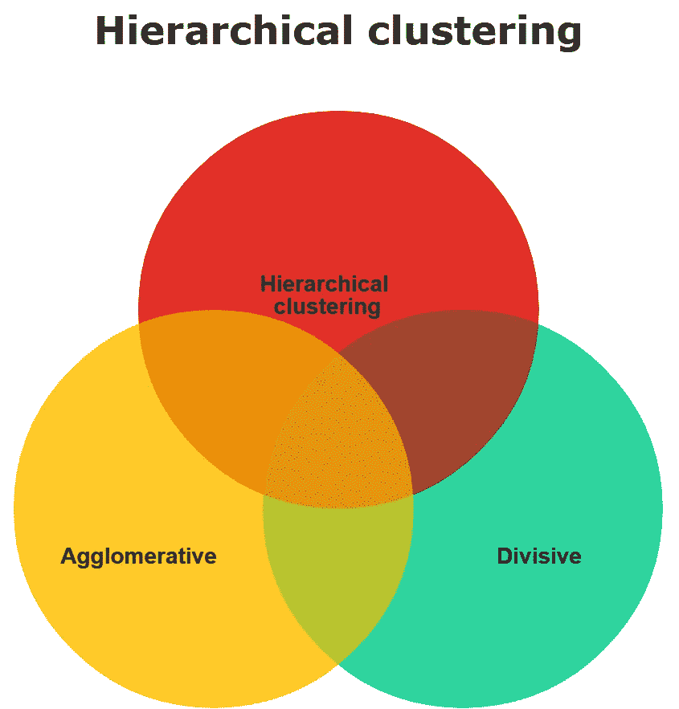
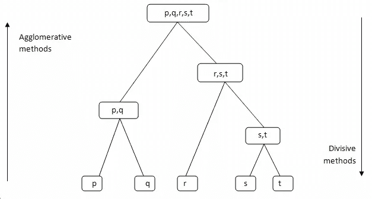
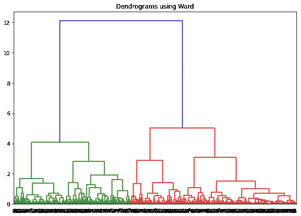
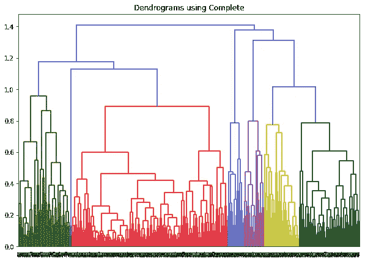
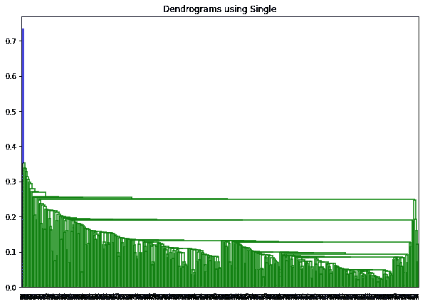
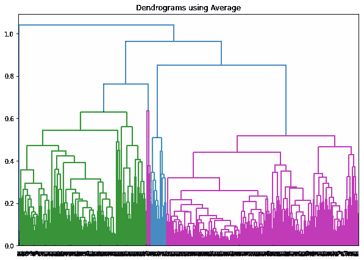
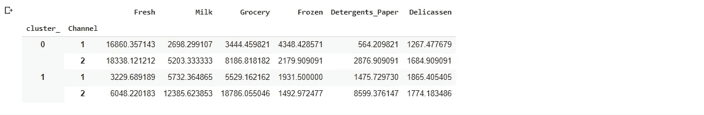

# 层次聚类研究:无监督机器学习

> 原文：<https://medium.com/analytics-vidhya/a-study-of-the-hierarchical-clustering-unsupervised-machine-learning-8d3bc172b60f?source=collection_archive---------7----------------------->


来源:https://unsplash.com/photos/OgvqXGL7XO4

另一种流行的聚类方法是层次聚类。我在 K-minus 聚类中看到过，聚类的个数是需要陈述的。分层聚类不需要这样。呈现在我们眼前的是一些长长的队伍正在相互形成群体。在层次聚类中，这样的图称为树状图。稍后我们会知道这个树状图是什么。

> **本文将讨论层次聚类的管道。让我们开始吧…**



**图 1:层次聚类的类型**

**层次聚类有两种类型，凝聚型和分裂型。详细解释和结果如下所示。**

> **divisible:**在这种方法中，完整的数据集被假设为单个聚类。然后，该聚类被不断分解，直到每个数据点都成为一个单独的聚类。它按照自上而下的方法工作。
> 
> **凝聚式:**凝聚式是除法的完全相反，也叫自底向上法。在这种方法中，每个数据点最初都被视为一个单独的聚类。然后基于这些聚类的距离，用它们形成小聚类，从而这些小聚类再次形成大聚类。参见(图 2)了解自上而下和自下而上方法的区别。



**图 2:凝聚与分裂的方法|图片来源:** [**走向数据科学**](https://towardsdatascience.com/machine-learning-algorithms-part-12-hierarchical-agglomerative-clustering-example-in-python-1e18e0075019)

**凝聚聚类可以用几种方法来完成，举例来说，完全距离、单一距离、平均距离、质心链接和单词方法。让我们来看看对这种方法的解释:**

> **完整距离** —根据最大或最长距离在数据点之间形成聚类。
> **单一距离** —根据数据点之间的最小或最短距离形成聚类。
> **平均距离** —根据数据点之间的最小或最短距离形成聚类。
> **质心距离** —根据聚类中心或质心距离形成聚类。
> **字法**——基于不同聚类内部的最小变体形成聚类组。

分层聚类的实际应用:

*   根据 DNA 序列对动物和植物进行分类。
*   各种病毒引起的流行病。

让我们在 Kaggle.com 上找到的顶级批发数据上实现特殊聚类:[https://www.kaggle.com/binovi/wholesale-customers-data-set](https://www.kaggle.com/binovi/wholesale-customers-data-set)

**让我们导入基本库:**

```
import numpy as np
import pandas as pd
import matplotlib.pyplot as plt
import matplotlib.mlab as mlab
import seaborn as sns
from sklearn.preprocessing import normalize
import scipy.cluster.hierarchy as shc
from sklearn.cluster import AgglomerativeClustering
```

**加载数据集**

```
url='df1= pd.read_csv("C:/Users/elias/Desktop/Data/Dataset/wholesale.csv")['](https://raw.githubusercontent.com/FazlyRabbiBD/Data-Science-Book/master/data-wholesale-customers.csv')
df = pd.read_csv(url)
df.head()
```

为了便于聚类，我们将归一化整个数据集。

```
data_scaled = normalize(df)
data_scaled = pd.DataFrame(data_scaled, columns=df.columns)
data_scaled.head()
```

调用数据集后，您将看到如图 3 所示的图像:


**图 3:缩放数据集**

创建归一化数据集的树状图将创建如图 4 所示的图形。我们用单词连锁法创建了这个树状图。如果我们愿意，我们可以用其他方式创建树状图。从该树状图可以理解，数据点首先形成小的聚类，然后这些小的聚类逐渐变成更大的聚类。

```
plt.figure(figsize=(10, 7))  
plt.title("Dendrograms using Ward")  
dend = shc.dendrogram(shc.linkage(data_scaled, method='ward'))
plt.show()
```



**图 4:单词连锁法的树状图**

查看图 4 的树状图，我们可以看到较小的星团正在逐渐形成较大的星团。给出了 X 轴上的数据点和 Y 轴上的聚类距离。由蓝线形成的两个最大集群的最大距离是 7(从那时起没有形成新的集群，并且距离没有增加)。为了便于我们理解，我们为这个距离画了一条线。让我们使用另一种完全连锁的方法来制作树状图:

```
plt.figure(figsize=(10, 7))plt.title("Dendrograms using Complete")dend1 = shc.dendrogram(shc.linkage(data_scaled, method='complete'))plt.show()
```



**图 5:使用完整**的树状图

让我们使用一个单一的链接来制作树状图:

```
plt.figure(figsize=(10, 7))plt.title("Dendrograms using Single")dend2 = shc.dendrogram(shc.linkage(data_scaled, method='single'))plt.show()
```



**图 6；使用单个**的树状图

现在我们将使用平均值来计算:

```
plt.figure(figsize=(10, 7))plt.title("Dendrograms using Average")dend3 = shc.dendrogram(shc.linkage(data_scaled, method='average'))plt.show()
```



**图 7:使用平均值的树状图**

我们现在将通过一个聚类的平均值来查看该组，以便我们了解在哪个聚类中平均销售哪种产品。

```
agg_wholwsales = df.groupby(['cluster_','Channel'])['Fresh','Milk','Grocery','Frozen','Detergents_Paper','Delicassen'].mean()
agg_wholwsales
```



**图 8:销售产品报告**

到总结，本文说明了层次聚类的管道和不同类型的树状图。分层聚类非常重要，本文通过在大规模数据集上实现它来展示这一点。本文用完全连锁法、单连锁法、平均连锁法和单词法等其他方法显示了树状图。

参考资料:

1.  [https://towards data science . com/machine-learning-algorithms-part-12-hierarchical-agglomerate-clustering-example-in-python-1e 18 e 0075019](https://towardsdatascience.com/machine-learning-algorithms-part-12-hierarchical-agglomerative-clustering-example-in-python-1e18e0075019)
2.  [https://www . analyticsvidhya . com/blog/2019/05/初学者-指南-分层-聚类/](https://www.analyticsvidhya.com/blog/2019/05/beginners-guide-hierarchical-clustering/)
3.  [https://towards data science . com/hierarchical-clustering-in-python-using-dendrogram-and-cophenetic-correlation-8d 41 a 08 f 7 eab](https://towardsdatascience.com/hierarchical-clustering-in-python-using-dendrogram-and-cophenetic-correlation-8d41a08f7eab)

**如果你**想要找到我最近发表的文章，你可以在 Researchgate 或 LinkedIn 上关注我。

**研究之门:**[https://www.researchgate.net/profile/Elias_Hossain7](https://www.researchgate.net/profile/Elias_Hossain7)

**领英:**[https://www.linkedin.com/in/elias-hossain-b70678160/](https://www.linkedin.com/in/elias-hossain-b70678160/)