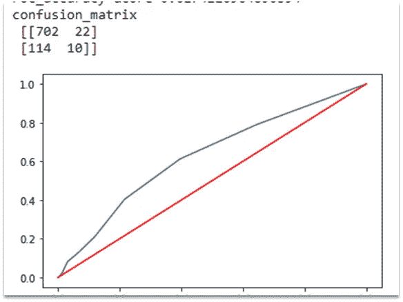

# 一项预测心脏病和导致心脏病的因素的研究”

> 原文：<https://medium.com/analytics-vidhya/a-study-to-predict-heart-diseases-and-the-factors-causing-them-838f5fbb382a?source=collection_archive---------21----------------------->

图片取自 power point

1.  **数据集概述**

**2。Python 包**

**3。处理缺失数据**

**4。数据理解和 EDA(探索性数据分析)**

**5。功能选择**

**6。建模和评估**

# **数据集**

数据集提供了患者的信息。

分类目标是预测患者是否有未来冠心病(CHD)的 10 年风险。

4238 行和 16 列。

每个属性变量都是潜在的风险因素。既有人口统计学上的，也有行为和医学上的风险因素。

资料来源:https://www.kaggle.com/

# **Python 包**

熊猫

Numpy

海生的

Matplotlib

sci kit-学习

统计模型

普洛特宁

# **处理缺失数据**

education、cigsPerDay、BPMeds、totChol、身体质量指数、心率、葡萄糖列中有缺失值。

用向前和向后填充来填充缺失值。

向前填充意味着用以前的数据填充缺失值。反向填充意味着用下一个数据点填充缺失值。

对于缺失值不使用平均值，因为存在无法取平均值的分类特征。

# **相关性**

**特征直方图:**

**年龄与心率散点图**:50 岁以上的年龄组患心脏病的人数最多。

**以男性为色调的年龄与 sysBP 散点图**:男性往往收缩压高(190 以上)。因此，男性更有可能患心脏病。

教育和吸烟习惯:男性和女性的趋势略有不同。在男性中，与女性相比，受教育程度低的吸烟者人数更多。随着教育水平的提高，吸烟者的数量减少了。

**吸烟习惯与受教育程度和男女:**

除三级教育外，几乎所有教育级别类别的男女生水平都相同。

# **功能选择:**

# **训练和测试数据集**

删除不需要的列。

选择十大重要特征。

我们按照 20:80 的比例将数据分为测试数据和训练数据。我们的训练数据集由 3390 行和 10 个最重要和最相关的特征组成，而我们的测试数据集由 848 行和最重要的特征组成。

# **建模与评估**

在对测试数据集进行预测并决定使用哪个模型之前，最好对训练数据集进行交叉验证。

通常在应用机器学习中使用，用于为给定的预测建模问题比较和选择模型。

逻辑回归比其他模型表现更好。

# **在测试数据集上比较不同的分类器:**

# **逻辑回归:**

预测心脏病准确率 85.84%。

ROC 评分为 0.71.ROC 评分接近 1 表示评分良好，否则为 0。

# **K 邻居型号:**

预测心脏病准确率 82.66%。

ROC 评分为 0.58.ROC 评分接近 1 表示评分良好，否则为 0。

# **随机森林模型:**

预测心脏病准确率 83.96%。

ROC 评分 0.62。ROC 评分接近 1 表示评分良好，否则为 0。

# 摘要

1.对于给定的数据集，逻辑回归在测试数据集上的表现优于 KNN 分类器和随机森林分类器。

2.Logistic 回归模型的准确率为 85.84 %。因此，该模型在预测患者未来 10 年是否有冠心病风险方面做得很好。

3.Logistic 回归的准确率为 85.84%，模型没有过拟合或欠拟合。