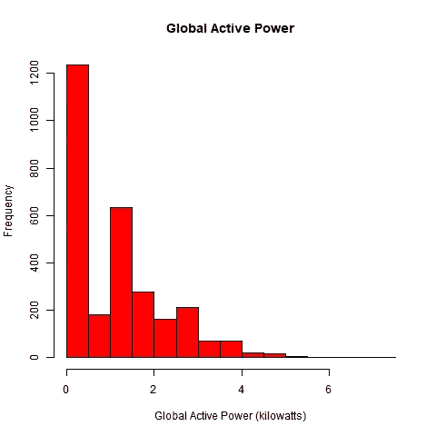
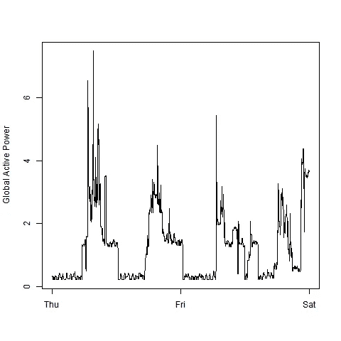
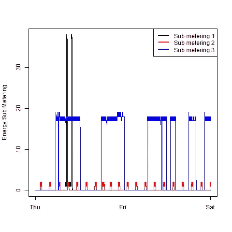
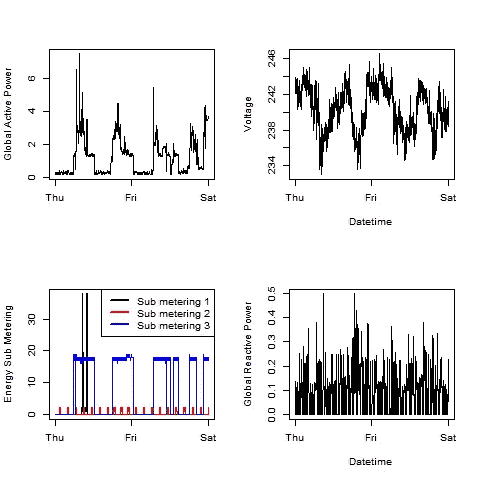

# 数据科学研究中一种微妙的探索性数据分析

> 原文：<https://medium.com/analytics-vidhya/a-subtle-exploratory-data-analysis-in-r-for-data-science-49028e1ec199?source=collection_archive---------15----------------------->

探索性数据分析是数据科学的主要组成部分。它帮助您以一种“快速而简单”的方式推断数据模式和理解数据属性。由**基础绘图系统**进行的图形分析主要分为两部分:1)图形生成(初始化绘图)和 2)图形注释(设置其属性、属性、轴等)。

本文通过一个课程项目重点介绍 EDA，该项目使用了来自**加州大学欧文分校机器学习库**(机器学习项目的报告)的“个人家庭电力消耗数据集”。我附上了下面的网址，供任何想自己实践这个项目的人使用。

```
https://archive.ics.uci.edu/ml/datasets/Individual+household+electric+power+consumption
```

该档案包含 2006 年 12 月至 2010 年 11 月(47 个月)期间在位于法国巴黎 7 公里处的 Sceaux 的一所房子中收集的 9 列和 2075259 个电力消耗测量值。

## **第一步:适当下载数据**

一旦您下载了数据并把它读入 R 中的表，您会注意到它有 1 列而不是 9 列，数据结构不正确。这是处理原始数据时经常遇到的问题。为了解决这个问题，我使用了参数 **skip** 来省略第一行(所有列名都被插入第一行，然后使用 **names()** 函数来重命名数据集中的列。

```
data <- read.csv(“household_power_consumption.txt”, skip = 1, sep = “;”, na.strings = “?”)names(data) <- c(“Date”, “Time”, “Global_active_power”, “Global_reactive_power”, “Voltage”,”Global_intensity”, “Sub_metering_1”, “Sub_metering_2”, “Sub_metering_3”)
```

**注:**我用的是 **na.strings = "？**因为该数据集中的所有 NA 值都用“？”表示默认情况下，此参数将用 NA 替换这些值。

## **第 2 步:仅设置所需数据的子集**

这个项目要求我只使用 2007 年 2 月 1 日和 2007 年 2 月 2 日的数据，所以我只需要对与这些日期相对应的行进行子集划分。我使用 r 中的 **subset()** 实现了这一点。

```
data <- subset(data, data$Date == “1/2/2007” | data$Date == “2/2/2007”)
```

## **步骤 3:绘制直方图**

我想绘制一个直方图，显示全球有功功率(千瓦)及其频率。为此，我使用了以下命令:

```
hist(as.numeric(data$Global_active_power), xlab = “Global Active Power (kilowatts)”, col = “red”, main = “Global Active Power”)
```

**注意:**通常当你下载一个数据集时，它的列不是合适的数据类型，为此，我使用 **as.numeric()** 将 Global_active_power 的数据类型改为 numeric。



情节 1

## **第四步:绘制日期时间序列**

接下来的情节有点棘手。我想使用 plot()并创建一个图表，显示三天(周五、周六和周日)内全球有功功率的分布情况。现在这可能看起来很混乱，因为我们已经提取了 2007 年 2 月 1 日和 2 日的数据。

**4.1** 然而，当你组合日期和时间列时，它也包括从星期六(同一天)开始的一些持续时间。我用下面的方法将这两列合并成一个单独的第三列。

```
data <- data %>%mutate(DateTime = paste(Date, Time, sep = “ “))
```

**4.2** 然后我用 as 改变了日期时间格式。POSIXct()，它将日期/时间值存储为自 1970 年 1 月 1 日以来的秒数。

```
data$DateTime <- as.POSIXct(data$DateTime, format = “%d/%m/%Y %H:%M:%S”)
```

**4.3** 最后，我使用 **plot()** 绘制了图形，并使用 **xlab** 和 **ylab** 设置了 x 和 y 标签。

```
plot2 <- plot(data$DateTime, data$Global_active_power, type = “l”, ylab = “Global Active Power”, xlab = “ “)
```



情节 2

## **第五步:y 轴多列绘图**

有时你需要在 y 轴上有多个列，以便用一个变量来比较它们。我想就日期时间系列比较三个分计量级别。虽然代码的其余部分与上面相同，但新版本是:

```
plot(data$DateTime, data$Sub_metering_1, ylab = “Energy Sub Metering”, type = “l”, xlab = “”)lines(data$DateTime, data$Sub_metering_2, type = “l”, , col = “red”)lines(data$DateTime, data$Sub_metering_3, type = “l”, , col = “blue”)
```

为了在右上角添加标签作为参考键，我使用了 **legend():**

```
legend(“topright”, c(“Sub metering 1”, “Sub metering 2”, “Sub metering 3”), lty=1, lwd=2.5, col=c(“black”, “red”, “blue”))
```



情节 3

## **步骤 6:在单个面板窗口上绘制多个图形**

对此，有两件事你需要知道:1) **par()** 和 2) **mfrow()/mfcol()** 。因为我想要一个 2x2 的布局，所以我使用了下面的命令。

```
par(mfrow = c(2,2))//code for plot 2 comes hereplot(data$DateTime, data$Voltage, type = “l”, ylab = “Voltage”, xlab = “Datetime”)//code for plot 3 comes hereplot(data$DateTime, data$Global_reactive_power, type = “l”, ylab = “Global Reactive Power”, xlab = “Datetime”)
```

**注:** 2 个代码同上。为了避免重复，我省略了代码。



情节 4

## **第七步:将你的绘图另存为。用于演示的 png 文件**

要将绘图包含在要发送给其他人的演示文稿或文档中，您可能需要以高质量绘制图形。png/。jpeg 和其他几种类型的文件。

为此，首先以通常的方式制作你的图表。当您对它的外观满意时，调用 **dev.copy()** ，向它传递您想要使用的驱动程序、要存储它的文件名以及任何其他适合驱动程序的参数。

例如，要从 R 显示的图形中创建名为 myplot.png 的 png 文件，请键入

```
dev.copy(png,’myplot.png’)dev.off()
```

注意: **dev.off()** 必须关闭当前文件设备才能查看您的 plot.png。

这个项目到此结束，虽然有许多其他方法可以做到这一点，但我尽量让它简单易懂。我感谢 Coursera 和约翰·霍普斯金大学为我提供了学习探索性数据分析的资源。