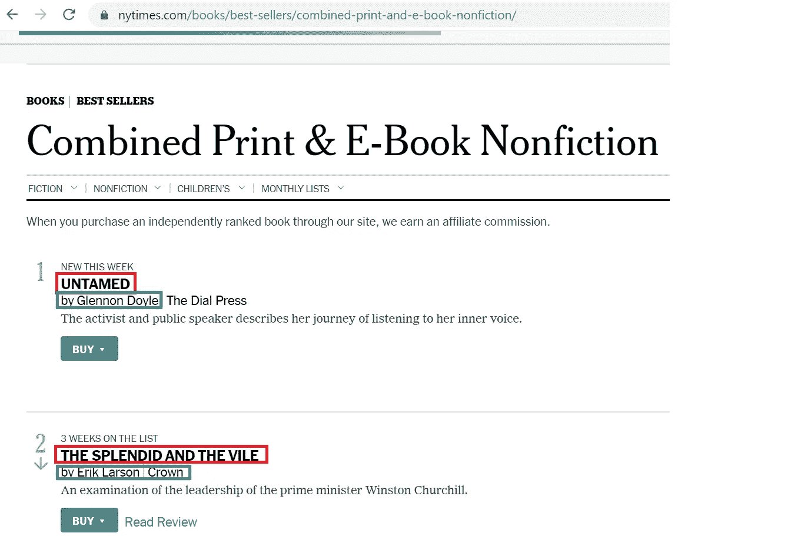
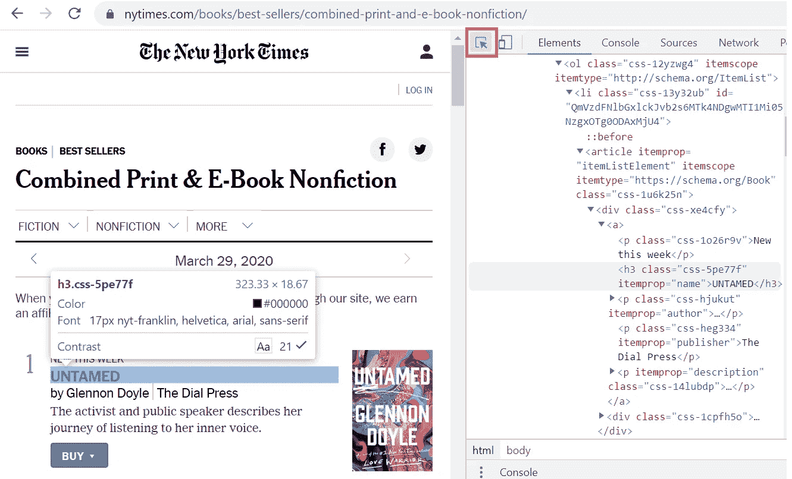
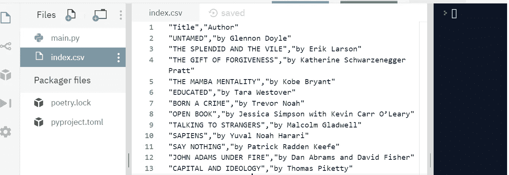

# 一个超级简单的 Python 脚本，任何人都可以使用

> 原文：<https://medium.com/analytics-vidhya/a-super-easy-python-script-for-web-scraping-that-anybody-can-use-d3bd6ab86c89?source=collection_archive---------2----------------------->

**要使用此脚本，您不需要了解 Python，甚至不需要在您的计算机上安装 Python。

有一次，我需要从网页上删除一些简单的数据。我以为互联网上有很多免费工具可以用来做这件事。不幸的是，我错了，或者说我找不到任何一个。那时，我对 Python 有一点了解，但是，我知道有一个叫做 Beautiful Soup 的 Python 包用于解析 HTML 和 XML 文档。所以，我想我可以在网上的某个地方找到一个简单的 Python 脚本，然后进行复制粘贴来完成我的工作。那次我说对了一半。是的，我发现了很多免费的 Python 脚本，但是没有一个对我来说足够简单，我可以稍加修改就使用。最后，我不得不从这里和那里收集一些零碎的东西来制作我自己的剧本。现在它为你而来。

在这篇文章中，我们的目的是从下面的网页中提取书名和作者名。



要使用这个脚本，您需要做三件事(或者两件事，如果您已经有了 Python 编译器)—

*   识别您想要删除的数据的 html 元素(在下面的例子中，我们使用 Chrome 开发工具来完成)
*   去网上那个叫 repl.it 的 IDE，打开一个新的 repl(真的很简单，去网站就行，你自己就能搞清楚)
*   复制下面提供的 Python 脚本并粘贴到 repl.it 中，并将您的 URL 和 html 元素放入脚本中

**第一步:寻找 html 元素**

在我们的例子中，我们想从下面的网页中提取书名和作者姓名。如果我们使用 Chrome 浏览器，我们可以进入开发者工具(F12)，点击“正方形内箭头”符号*选择页面中的一个元素来检查它*，然后将鼠标悬停在书名和作者姓名上。

可以看到书名是一个带有 class = 'css-5pe77f '的

### 元素。作者名是一个带有 class = 'css-hjukut '的

元素。您需要记下这一点，并将其放入本文后面的 Python 脚本中。



**第二步:回复**

如果您的计算机中没有 Python 编译器，请遵循此步骤。转到 repl.it，点击“新建 repl”，然后选择“Python”作为您的语言。复制 Python 脚本(来自步骤 3)并将其粘贴到 main.py 中

**第三步:Python 脚本**

您只需要对脚本进行两处修改。

1.  在" url = "中，提供您要从中提取数据的网页的 url。
2.  在“文本 1”和“文本 2”中提供了各自的元素名和类名。如果要提取更多的数据列，可以添加“text3，text4…”。

在你的回复中点击“运行”。您应该会在屏幕左侧看到一个名为“index.csv”的 csv 文件。您可以在这个 index.csv 文件中找到书名和作者姓名的列表。任务完成！



这是你的剧本

```
"""A Simple Script for Extracting Data from a Webpage 
This script allows the user to extract data from a webapge and then export the data to a csv file with column(s).
"""# libraries
import urllib.request
from bs4 import BeautifulSoup
import csv# Put your URL here
url = 'https://www.nytimes.com/books/best-sellers/combined-print-and-e-book-nonfiction/'# Fetching the html
request = urllib.request.Request(url)
content = urllib.request.urlopen(request)# Parsing the html 
parse = BeautifulSoup(content, 'html.parser')# Provide html elements' attributes to extract the data 
text1 = parse.find_all('h3', attrs={'class': 'css-5pe77f'})
text2 = parse.find_all('p', attrs={'class': 'css-hjukut'})# Writing extracted data in a csv file
with open('index.csv', 'a') as csv_file:
  writer = csv.writer(csv_file, delimiter=',', quotechar='"', quoting=csv.QUOTE_ALL)
  writer.writerow(['Title','Author'])
  for col1,col2 in zip(text1, text2):
    writer.writerow([col1.get_text().strip(), col2.get_text().strip()])
```

*原贴于*[*【www.zilhaz.com】*](http://www.zilhaz.com)