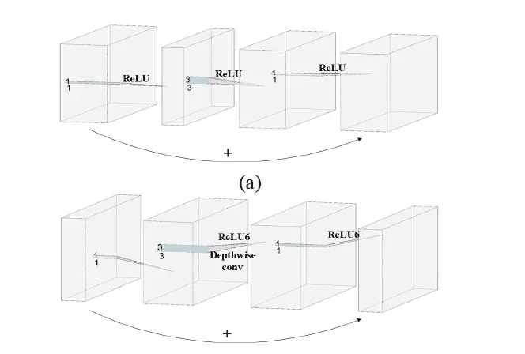

# 卷积神经网络综述

> 原文：<https://medium.com/analytics-vidhya/a-survey-of-convolutional-neural-networks-8bdf74a21a31?source=collection_archive---------12----------------------->

## 分析、应用和前景

# **CNN 简介**

卷积神经网络(CNN)是一种具有一个或多个卷积层的神经网络，主要用于图像处理、分类、分割以及其他自相关数据。CNN 已经实现了几年前不可能完成的任务，如人脸识别、自动驾驶汽车、自助超市和智能医疗。卷积本质上是在输入上滑动滤波器。与其一次查看整个图像来寻找某些特征，不如查看图像的较小部分会更有效。

# CNN 模型的组成部分

1.  *卷积:*它是特征提取的重要步骤。卷积输出*特征图*。
2.  填充:当卷积被应用时，我们丢失了边界中的信息。因此，添加填充以放大零值输入。
3.  *步距*:步距是在输入矩阵上移动的像素数。步幅越大，密度越低
4.  池化:添加它是为了减少冗余。它也被称为下树苗。最大池化和平均池化是几种池化技术。

二维 CNN 的程序

# CNN 模型的分类

*   **LeNet-5**

LeNet-5 由七个可训练层组成，包括两个卷积层、两个汇集层和三个全连接层。它结合了局部感受野、共享权重和空间或时间子采样，可以确保移位、缩放和失真不变性。这对识别手写字符很有用。然而，它没有超过支持向量机(SVM)和 boosting 算法。

Lenet-5 的架构

*   **AlexNet**

AlexNet 有八层，包含五个卷积层和三个全连接层。它使用 ReLU 作为激活函数，这有助于解决消失梯度的问题。为了避免过度拟合，在最后几个完全连接的层中使用了 dropout。Dropout 忽略了模型中的少数神经元。重叠最大池用于避免模糊结果并提高特征的丰富性。LRN 是增强模型泛化能力的一种方法。它使用两个强大的 GPU 来训练组卷积。AlexNet 在训练中采用了两种数据增强方法。首先是获得水平反射以获得更多的训练数据。此外，主成分分析(PCA)用于改变训练集的 RGB 值。在进行预测时，AlexNet 会对数据集进行扩展，然后对他们的预测进行平均，作为最终结果。

AlexNet 的体系结构

*   **VGGNets**

VGGNets 是由牛津大学视觉几何小组(VGG)提出的一系列卷积神经网络算法。由于局部响应标准化(LRN)层的效果不明显，因此将其移除。VGGNets 使用 3 × 3 卷积核，而不是 5 × 5 或 5 × 5 卷积核。

*   谷歌网

它是第一个由 Inception 模块堆叠而成的大型 CNN。它有四个版本，即。初始版本 v1、v2、v3 和 v4。

*   盗梦空间 v1

Inception v1 设置了 1 × 1、3× 3、5 × 5 卷积核来构建一个*宽的*网络。不同大小的卷积核提取不同尺度的图像特征图。这些特征地图然后被堆叠以获得更具代表性的特征地图。

初始版本 1 模块

*   盗梦空间 v2

Inception v2 利用批量标准化来解决内部协变量偏移问题。正态分布应用于每一层的输出。这增加了模型的鲁棒性，并以相对较大的学习率训练模型。Inception v2 表明，单个 5 × 5 卷积层可以由两个 3 × 3 卷积层代替。一个 n×n 卷积层可以由一个 1×n 和一个 n×1 卷积层代替。

Inception v2 模块

*   盗梦空间 v3

将 5 × 5 和 3 × 3 卷积核分解为两个一维核。这种操作加速了训练，并进一步增加了网络的深度和网络的非线性。它使用 RMSProp 作为优化器。

*   初始版本 4

这个模型是建立在 Inception v3 之上的。这种架构模块更多，更紧凑。这个模型比它的所有前辈都好。

*   **雷斯内特**

深度神经网络存在梯度消失或爆炸的问题。为了解决这个问题，ResNet 有两层由快捷连接构成的剩余块。ResNet 可以减轻梯度消失问题，而不会在深度神经网络中退化，因为梯度可以直接流经快捷连接。

ResNet 块的结构

*   **DCGAN**

GAN 包含生成模型 G 和判别模型 D。G 和 D 都可以是非线性函数。G 的目的是生成尽可能真实的数据，而 D 的目的是将 G 生成的假数据与真实数据区分开。

GAN 流程图

*   **移动网络**

他们使用深度方向的可分离卷积和几种先进的技术来构建薄的深度神经网络。这些是重量轻的型号，主要用于移动电话。

*   MobileNet v1

MobileNet v1 利用深度方向可分离卷积，将标准卷积分解为深度方向卷积和点方向卷积(1 × 1 卷积)。这种分解可以大大减少参数的数量。

MobileNet 中的深度可分卷积

*   MobileNet v2

它引入了两个改进:反向剩余块和线性瓶颈模块。首先通过 1 × 1 卷积核对反转残差块的输入进行卷积以进行信道扩展，然后通过 3 × 3 深度方向可分离卷积进行卷积，最后通过 1 × 1 卷积核进行卷积以压缩回信道数量。

(a)残差块(b) MobileNet v2 块:反向残差块

*   MobileNet v3

MobileNet v3 利用挤压和激励(se)来重新加权每一层的通道，以实现轻量级注意力模型。在反向残差块的深度方向卷积之后，添加 se 模块。首先执行全局池操作，然后在全连接层之后，通道的数量减少到 1/4。第二个全连接层用于恢复通道的数量并获得每层的权重。最后，将权重和深度方向卷积相乘以获得重新加权的特征图。

MobileNet v3 块

*   **沙狐球**

这些模型结合了逐点群卷积、通道混洗和其他一些技术，在不损失精度的情况下显著降低了计算成本。

*   ShuffleNet v1

逐点组卷积要求每个卷积运算只在相应的输入通道组上进行，这样可以降低计算复杂度。提出信道洗牌操作，帮助不同组的信息随机流向其他组。

ShuffleNet v1 中的逐点群卷积和频道混洗

*   ShuffleNet v2

发现当输入通道数等于输出通道数时，MAC 最小。改变卷积的组数对网络训练速度有影响。通过调整网络的分段结构和每个基本结构中的卷积层数，发现网络分段降低了并行度。在设计网络时，研究人员应该尽可能减少元素运算的使用。ShuffleNet v2 就是根据这些原则设计的。

*   **幽灵网**

由于现有的细胞神经网络提取大量冗余特征用于图像认知，GhostNet 被用来有效降低计算成本。在传统的被称为重影的卷积层中有许多相似的特征图。他们将传统的卷积层分为两部分。在第一部分中，较少的卷积核直接用于特征提取，这与原始卷积相同。然后，对这些特征进行线性变换，得到多个特征图。他们证明了 Ghost 模块适用于其他 CNN 模型。

幽灵模块

# 选择神经网络的经验法则

对于二元分类问题，最后一层可以驾驭 sigmoid。对于多分类问题，最后一层可以利用 Softmax。通常在隐藏层中，ReLU 或者漏 ReLU 都是不错的选择。Leaky ReLU 中的负斜率可以设置为 0.02，以加快训练速度。

1.  *损失函数*

利用损失函数或成本函数来计算预测值和实际值之间的距离。损失函数通常被用作优化问题的学习准则。常见的损失函数包括平均绝对误差(MAE)、均方误差(MSE)、交叉熵等。

*   回归损失函数

在处理回归问题时，我们很可能使用 MAE 或 MSE。MAE 比 MSE 对异常值更稳健。如果在训练集中有大量的异常值，优先选择 MAE，否则，应该考虑 MSE。

*   分类损失函数

交叉熵损失将每个类别中的预测概率与实际输出值(0 或 1)进行比较，并根据它们之间的距离计算惩罚值。对比损失扩大了不同类别之间的距离，缩小了同一类别内的距离。它可用于卷积神经网络的降维。三重损失基于三个图像。这三个图像是锚图像、正面图像和负面图像。正面图像和锚图像来自同一个人，而负面图像和锚图像来自不同的人。它试图拉近锚和积极者之间的距离，进一步拉近锚和消极者之间的距离。中心损失试图集中在同一类内分布的均匀性上。

*   选择的经验法则

使用 CNN 模型处理回归问题时，可以选择 L1 损失或 L2 损失作为损失函数。在处理分类问题时，我们可以选择其余的损失函数。交叉熵损失是最受欢迎的选择，通常出现在 CNN 模型中，最后有一个 softmax 层。

# CNN 的应用

*   **一维 CNN 的应用**

1D CNN 可用于数据的时间序列预测，如心电图时间序列、天气预报和交通流量预测。

信号识别——可应用于 ECG 信号识别、结构损伤识别和系统故障识别。

*   **二维 CNN 的应用**

图像分类是将图像分类到一个类别的任务。目标检测是基于图像分类的任务。系统不仅需要识别输入图像属于哪个类别，还需要用边界框来标记它。图像分割是将图像分成不同区域的任务。它必须标记图像中不同语义实体的边界。人脸识别是一种基于人脸特征的生物识别技术。

*   **多维 CNN 的应用**

人体动作识别是指机器自动识别视频中的人体动作。物体识别/检测。

# CNN 的安全性

对抗性攻击也是深度神经网络面临的威胁之一。首先，对于训练样本，可以利用对立的样本来增强模型的鲁棒性。第二，可以调整网络架构以忽略噪声。最后，额外的网络可以用来帮助主干网络抵御恶意攻击。

# 结论

由于卷积神经网络具有局部连接、权重共享和降采样降维等优点，因此在研究和工业项目中得到了广泛的应用。本文对 CNN 进行了详细的介绍，包括常见的构建模块、经典网络、相关功能、应用和前景。

本文是以下 IEEE 论文的概述—

https://arxiv.org/abs/2004.02806