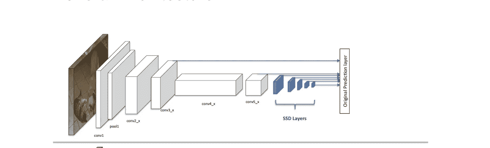

# 基于深度学习的目标检测综述

> 原文：<https://medium.com/analytics-vidhya/a-survey-of-deep-learning-based-object-detection-816204e970ac?source=collection_archive---------15----------------------->

目标检测视频

这是“深度学习的对象检测:综述”

论文:[https://arxiv.org/pdf/1807.05511.pdf](https://arxiv.org/pdf/1807.05511.pdf)

*作者:*

焦立成，【研究员】，IEEE，，，刘芳，*资深会员，IEEE，*杨淑媛，*资深会员，IEEE，*，*会员，IEEE，*冯，*会员，IEEE，*和荣曲，*资深会员，IEEE*

# **数据集**

快速介绍用于生成目标检测模型的两个数据集。

## *PASCAL VOC 数据集*

链接到数据集:[此处](http://host.robots.ox.ac.uk/pascal/VOC/)

PASCAL VOC 数据集包含 20 个对象类别(在 VOC2007 中，如人、自行车、鸟、瓶子、狗等。)传播了超过 11000 张图片。这 20 个类别可以被认为是 4 个主要分支——车辆、动物、家用物品和人。

超过 27，000 个对象实例边界框被标记，其中近 7，000 个具有详细的分割。VOC2007 数据集中存在不平衡的数据集。

**MS COCO 数据集**

链接到数据集:[此处](https://cocodataset.org/#home)

用于检测和分割在日常生活中在其自然环境中发现的对象的数据集包含 91 个常见对象类别，其中 82 个具有超过 5000 个标记实例。这些类别涵盖了 PASCAL VOC 数据集中的 20 个类别。该数据集在 328，000 幅图像中总共有 2，500，000 个标记实例。MS COCO 数据集还关注不同的视点，所有对象都在自然环境中，这给了我们丰富的上下文信息。

椰子树

还有其他各种数据集，如 ImageNet、OpenImage 等。它们是不断增长的数据集。

计算机视觉是一个科学领域，致力于使用图像或视频来解释和理解视觉世界。图像或视频是由物体组成的。图像分类通常是计算机视觉的直接应用，但识别图像中的每个对象揭示了许多无限的可能性。行人检测、盗窃检测、可疑活动检测、自动搜索结果等等。随着深度学习的快速增加，对象检测有了很大的提高。

物体检测通常有两种

1.  两级检测器
2.  一级检测器

# 两级检测器

# 美国有线电视新闻网:

R-CNN 是一个基于区域的 CNN 检测器。这包括 4 个模块。

第一个模块生成与类别无关的区域建议。第二模块从每个区域提议中提取固定长度的特征向量。第三个模块是一组特定类别的线性支持向量机，用于对一幅图像中的对象进行分类。最后一个模块是用于精确包围盒预测的包围盒回归器。

通常，建议在大型数据集上进行预训练。经过预训练后，我们可以使用该模型为特定数据集进行训练。这有助于快速收敛。

因此，R-CNN 的想法是将每张图片分成 2000 个区域，称为选择性区域，并尝试处理这些独立的区域。

关于这个主题的详细解释可以在这个[链接](https://ivi.fnwi.uva.nl/isis/publications/2013/UijlingsIJCV2013/UijlingsIJCV2013.pdf)中找到

RCNN: [来源](https://towardsdatascience.com/r-cnn-fast-r-cnn-faster-r-cnn-yolo-object-detection-algorithms-36d53571365e)

# 快速 R-CNN

R-CNN 的缺点是 Conv 网络之间没有信息共享，计算每个区域的支持向量机需要大量时间。因此引入了快速 R-CNN。

Fast R-CNN 不是生成 2000 个区域建议，而是使用最大池层生成感兴趣区域(RoI)。并且在进一步的操作中仅使用这些区域。因为我们最小化了用于分析的图像的面积，所以我们将具有更快的收敛。

快速 R-CNN 是一个单阶段的端到端训练过程，在每个标记的 RoI 上使用多任务损失来联合训练网络。此外，SVM 层被替换为 [SVD](https://jonathan-hui.medium.com/machine-learning-singular-value-decomposition-svd-principal-component-analysis-pca-1d45e885e491\) ，进一步加快了进程。

快速 R-CNN:来源:[链接](https://jonathan-hui.medium.com/machine-learning-singular-value-decomposition-svd-principal-component-analysis-pca-1d45e885e491)

# *更快的 R-CNN:*

对快速 R-CNN 感兴趣的区域是基于使用最大池层的选择性搜索，这是缓慢的。因此，在 Faster 中，R-CNN 用一种新颖的 RPN(区域建议网络)取代了区域选择方法，RPN 是一种完全卷积的网络，可以有效地预测各种规模和纵横比的区域建议。

更快 R-CNN 来源:[链接](https://towardsdatascience.com/r-cnn-fast-r-cnn-faster-r-cnn-yolo-object-detection-algorithms-36d53571365e)

# 屏蔽 R-CNN

更快的 R-CNN 表现不错，但是它有一个[实例分割问题](https://missinglink.ai/guides/neural-network-concepts/instance-segmentation-deep-learning/)。屏蔽 R-CNN 克服了这个问题。首先，它基于输入图像生成关于可能存在物体的区域的建议。其次，它预测对象的类别，细化包围盒，并基于第一阶段的提议在对象的像素级生成遮罩。

由于上述过程，它创建了一个非常高度可靠的对象检测架构。

面具 R-CNN，来源:[链接](https://arxiv.org/pdf/1703.06870.pdf)

最终分割的区域将如下所示:

蒙版图片，来源:[链接](https://arxiv.org/pdf/1703.06870.pdf)

# 一级检测器

# 你只活一次

基于流行的“你只活一次，你只看一次”的意识形态。

在这种情况下，没有区域创建，然后再在此基础上进行处理，而是有一个卷积网络来创建盒子和每个盒子的类预测。

> 我们将对象检测重新定义为一个单一的回归问题，直接从图像像素到边界框坐标和类别概率。

Yolo，来源:[链接](https://arxiv.org/pdf/1506.02640.pdf)

实验表明，YOLO 不擅长精确定位，定位误差是预测误差的主要组成部分。

# 约洛·V2

YoLo 只看了一次，但没有给出完美的结果，也有许多本地化问题。

因此，在 YoLo v2 中，架构被重新审视，变得非常快速和可靠。介绍了以下内容

1.  [批量归一化](https://towardsdatascience.com/batch-normalization-in-neural-networks-1ac91516821c)
2.  [高分辨率分类器](https://hal.archives-ouvertes.fr/hal-01660754/document)
3.  [使用锚定框作为边界框](https://www.mathworks.com/help/vision/ug/anchor-boxes-for-object-detection.html#:~:text=Anchor%20boxes%20are%20a%20set,sizes%20in%20your%20training%20datasets.)

YoLo v2:来源:[链接](https://jonathan-hui.medium.com/real-time-object-detection-with-yolo-yolov2-28b1b93e2088)

# YoLo V3

这是约洛·V2 的改良版。

这有以下更新更改:

1.  多标签分类
2.  使用特征图预测包围盒
3.  使用暗网作为最终特征提取器

详细的论文可以在这里找到

# *单发探测器(SSD)*

这种架构就像 Yolo 一样，它可以在一次拍摄中检测到物体。使用多盒进行检测。

这种架构速度更快，精度更高。

这种架构有三个重要特征

*   **单次:**这意味着物体定位和分类的任务是在网络的*单次* *前向传递*中完成的
*   **多框:**这是 Szegedy 等人开发的边界框回归技术的名称(我们将很快简要介绍)
*   **检测器:**网络是一个对象检测器，它还对那些检测到的对象进行分类

SSD，来源:[链接](https://towardsdatascience.com/review-dssd-deconvolutional-single-shot-detector-object-detection-d4821a2bbeb5)

详细的纸张可以在本 l [油墨](https://arxiv.org/pdf/1512.02325.pdf)中找到

# 去卷积单触发检测器( *DSSD)*

这是对 SSD 的改进。

DSSD 有这两个重要特征:

*   **逐步反卷积**放大特征图
*   **特征组合**来自卷积路径和反卷积路径

DSSD，来源:[链接](https://towardsdatascience.com/review-dssd-deconvolutional-single-shot-detector-object-detection-d4821a2bbeb5)

还有一些其他对象检测架构，如 RetinaNet、M2Det 和 RefineNet，这些架构变得更加复杂，需要更详细的解释才能基本理解。因此，我们将在下一篇文章中保留它们。

 [## YOLO:实时目标检测

### 你只看一次(YOLO)是一个最先进的，实时对象检测系统。在 Pascal Titan X 上，它处理…

pjreddie.com](https://pjreddie.com/darknet/yolo/)  [## PASCAL 可视对象类主页

### 为对象类别识别提供标准化的图像数据集，为访问……

主机.机器人. ox.ac.uk](http://host.robots.ox.ac.uk/pascal/VOC/)  [## COCO -上下文中的常见对象

### 编辑描述

cocodataset.org](https://cocodataset.org/#home)  [## 综述:DSSD —解卷积单次探测器(目标探测)

### 反卷积层:引入额外的大规模背景，提高小对象的准确性

towardsdatascience.com](https://towardsdatascience.com/review-dssd-deconvolutional-single-shot-detector-object-detection-d4821a2bbeb5)  [## 了解 YOLO

### 这篇文章解释了 YOLO 对象检测体系结构，从某人的角度谁想要实现…

hackernoon.com](https://hackernoon.com/understanding-yolo-f5a74bbc7967)  [## 使用 YOLO、YOLOv2 和现在的 YOLOv3 进行实时物体检测

### 你只看一次(YOLO)是一个目标为实时处理的对象检测系统。我们将介绍 YOLO…

jonathan-hui.medium.com](https://jonathan-hui.medium.com/real-time-object-detection-with-yolo-yolov2-28b1b93e2088)  [## 了解 SSD 多盒—深度学习中的实时对象检测

### 这篇文章旨在对 SSD 多框对象检测技术进行直观的解释。我试过了…

towardsdatascience.com](https://towardsdatascience.com/understanding-ssd-multibox-real-time-object-detection-in-deep-learning-495ef744fab)