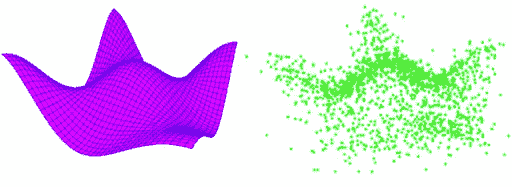
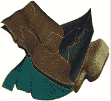

# 半监督学习算法综述(一)

> 原文：<https://medium.com/analytics-vidhya/a-survey-on-semi-supervised-learning-algorithms-part-1-ed4eb2ab9501?source=collection_archive---------6----------------------->

流形的美图(取自互联网)

我在 2013 年春天写了这篇论文，当时我正在处理一个通过肿瘤图像进行癌症检测的问题，面临着数据很少或没有数据的问题。这是大多数机器学习任务(特别是在工业中)中的一个常见问题，只有两种方法可以实现它— (1)人工创建数据(模仿结果)或(2)使用半监督学习算法，然后抱最好的希望。:)

# 介绍

本文是一篇关于半监督学习算法的文献综述，半监督学习算法是一类从有标记和无标记数据中学习的机器学习算法。本文并不声称涵盖半监督学习算法的整个领域，也不打算深入每种算法所涉及的数学细节。这是对某些类别的半监督学习算法的实际概述，其中一些算法经常超越它们的对手。

这些算法与监督学习算法(仅从标记数据学习)和非监督学习算法(仅从未标记数据学习)形成对比。半监督学习算法的发展是因为在大多数现实世界的应用中，标记数据经常以少量出现，而未标记数据则大量出现。将未标记的数据转换成标记的数据是一个昂贵且费力的过程。半监督学习试图利用已标记和大量未标记的数据在机器学习领域取得好的结果。然而，试图从少量标记数据中学习整个数据空间结构的过程并不容易。我们必须使用强假设来尝试学习 P(x)和 P (y|x)之间关系的联合概率 **P(x，y)，**，其中 x 是实例，y 是实例的标签。(朱，2008)在对算法进行更深入的分类之前，我认为有必要对一些算法使用的假设给出一个信息性的说明。

应该提到一个关于直推式学习的简短说明。直推式学习是像半监督学习一样从标记数据和未标记数据中学习，但区别在于它不能应用于看不见的例子。归纳学习可以处理看不见的例子。在这个定义下，归纳支持向量机属于半监督学习算法。

# 2.假设

## 2.a .集群假设

根据 Chapelle & Zien (2005)，几乎所有的半监督学习算法都直接或间接地利用了聚类假设。集群假设认为，决策边界(技术上是结构良好的集群之间的区域)应该位于低密度区域，并且永远不应该跨越高密度区域。为了说明，连接高密度区域的路径将包含具有相同数据标签或属于一个类别的数据点。例如，考虑一个聚类假设不成立的例子:输入点的均匀分布。那么未标记的数据将几乎不传达任何信息，并且事实上产生误算，并且最大化那些实例的裕度是无用的。这种情况实际上对算法是灾难性的，并且破坏了分类器从标记数据中学习的模型。例如，直推式 SVM(支持向量机)本质上是归纳的，因为它们被定义在整个实例空间上，它试图找到尽可能远离未标记点的超平面，从而间接地实现聚类假设。间接使用聚类假设的半监督学习算法的一个例子是流形学习算法类。流形是一个 n 维拓扑空间，其中拓扑空间上任意一点的邻域都与 n 维欧氏空间相同。直观上，流形是这样的空间，如果你放大足够多，它看起来像平坦的欧几里得空间。在流形学习中，算法试图学习沿着数据所在的流形变化很小的决策函数。

**B .流形假设**

继续我们关于流形的讨论，流形假设基本上表明不同的类位于不同的流形上。流形假设可以被认为是对聚类假设的自然扩展，因为流形假设仅仅通过陈述连接数据流形上的高密度区域的路径上的数据点可能具有相同的标签来扩展后者。然而，最常见的是，我们有数据(标记的和未标记的)，但没有关于密度或流形的信息。解决这个问题的一个方法是用图表来近似密度。

流形折叠可以表示不同维度的数据。(Vivodtzey 等人，2005 年)

**C .平滑度假设**

彼此靠近的点更有可能共享一个标签。这也是监督学习中通常假设的，并且这些将更容易解决，因为这将产生更简单的决策表面。在半监督学习的情况下，平滑度假设产生了对区域中的决策边界的偏好，其中彼此接近的点较少。

# 3.**半监督分类算法**

**3。a .低密度分色**

**3。A.1 .直推式 SVM(半监督 SVM 或 S3SVM)**

根据 Chapelle 等人(2005)，“TSVM 可能看起来是完美的半监督算法，因为它结合了支持向量机的强大正则化和聚类假设的直接实现。”通过 Vapnik(1998)的观点，该论文解释了实现聚类假设但不完全使用正则化的标记数据(通过正则化)和未标记数据中的最大限度。

给定两个联合分布的随机变量 X 和 Y，给定 X 的 Y 的条件概率分布是已知 X 为特定值时 Y 的概率分布。学习问题的区别方法是使用参数模型来表示条件分布，然后使用由对{x，c}组成的训练集来确定参数，其中 x 是实例的向量，c 是相应类别标签的向量。(主教&拉塞尔，2007 年)。然而，它们有一个不幸的盲点，即如果 P(x)和 P(c|x)不共享参数，它们会忽略参数估计环路之外的 P(x)。P(x)是一个关键的组成部分，因为它是我们从未标记的数据中得到的全部。据信，如果 P(x)和 P(y|x)不共享参数，则半监督学习的判别方法不能有所帮助。(西格，2001 年)。

然而，TSVMs 更进一步，通过不将边界放在高密度区域中，在 p(x)和判别决策边界之间建立联系。决策边界应该在未标记数据上具有最小的泛化误差界限(Vapnik，1998)。因此，我们可以推断，TSVM 让未标记数据引导产生决策边界的过程，使得它在未标记数据上具有最小的泛化误差界。然而，利用 TSVM 寻找理想的决策边界是一个 NP-hard 问题。解决该问题的有效近似算法(Bennett & Demiriz，1999 年)(Bennett & Demiriz，2000 年)(Fung & Mangasarian，1999 年)要么不能处理超过几百个未标记的例子，要么在实验中不能这样做。SVM-莱特 TSVM 实现(约阿希姆，1999)是第一个广泛使用的实现这些算法的软件。

德·比和克里斯蒂亚尼尼(德·比&克里斯蒂亚尼尼，2004；De Bie & Cristianini，2006)将直推式学习问题改造成半定规划问题(SDP)。SDP 是凸优化的一个子领域，涉及线性目标函数的优化。徐和舒尔曼(2005)也提出了类似的 SDP 公式的多类版本。SDP 的计算成本被认为是昂贵的，但对于今天的多处理器 GPU，它提出了一个开放的研究问题。

Chapelle 和 Zien (2005)提出了通过用高斯函数变换帽子损失函数(帽子损失是凸函数和凹函数之和)并执行梯度搜索来解决学习问题的∇SVM。Sindhwani 等人(2006 年)使用了一种直观的确定性退火方法，并涉及一系列凸优化问题，这些问题从一个“简单”的问题开始，并逐渐将其变形为 TSVM 目标。Chapelle，Chi & Zien (2006)使用类似的延拓方法，使用先前迭代的解来初始化下一个迭代。Collobert 等人(2006 年)通过一种称为凹凸程序(CCCP)的优化程序直接优化了硬 TSVM。CCCP 可以应用于任何优化问题(在满足某些条件之后),许多现有的算法可以用 CCCP 来解释。(Yuille & Rangarajan，2003)在替换 hat 损失函数的凹入部分之后，可以执行凸最小化来产生损失函数的上界。迭代该算法，直到达到局部最小值。尽管这种算法没有达到全局最优，但用 CCCP 训练 TSVM 明显加快了速度。然而，Chapelle，Sindhwani & Keerthi (2006)能够使用分支定界法找到小数据集的全局最优解。尽管分支定界法显示了令人兴奋的前景，并且不能用于大型数据集，但是结果提供了一些缓解，并且指出了 TSVMs 在更快地找到更好的解决方案方面的潜力。

**3。b .自我培训**

半监督学习中常用的包装算法，也称为 bootstrapping。这可能是我最喜欢的方法之一。自我训练已经被应用于几个自然语言处理任务。Yarowsky (1995)使用自我训练进行词义消歧。它也用于主观名词。最初，分类器首先由标记数据训练，然后用于估计未标记数据的标签。然后使用选择度量来决定哪些弱标记的例子被正确标记。选择度量的使用是至关重要的。最有把握分类的未标记实例连同它们的预测标记一起被添加到训练集中。然后，在这个新形成的标记数据集上重新训练分类器。然后，再次使用重新训练的分类器来估计来自未标记数据池的数据点的标记。重复该过程，直到未标记的数据集运行为空，或者直到达到最大迭代次数。该算法简单直观。通常它会产生杰出的结果。然而，如果标记的数据不能代表数据中的模式，并且不能使用区分性分类器给出好的结果，则它将无法收敛(Gan 等人，2013)。

Rosenberg 等人(2005)进行了一项实证研究，表明用大量未标记数据和少量标记数据训练的模型即使不比用大量标记数据集训练的模型更好，也能表现得一样好。它们还表明，定义独立于检测器的训练数据选择度量是重要的，因为这大大优于基于由检测器生成的检测置信度的选择度量。

(王等，2008)研究了半监督学习的使用，特别是句子级主观性分析的自我训练。朴素贝叶斯(NB)通常被选为基本分类器，因为它的类成员概率估计具有良好的排序性能。本文的第一个贡献是研究了不同基分类器的自训练性能。实验在决策树模型 C4.5、C4.4 和朴素贝叶斯树(NBTree)上进行。他们还提出了一种自适应值差度量(VDM)作为自训练中的选择度量，它不依赖于类成员概率。实验结果令人印象深刻地显示了两个重要的结果:一个是通过使用 VDM 而不是置信度来提高自我训练的性能。第二，利用 NB 树和 VDM 的自训练优于利用底层分类器和选择度量的其他组合的自训练。郭、牛和张(2010)对 26 个数据集进行了广泛的实证研究，以表明置信度选择度量并不一定优于随机选择的无标记数据实例。李和周(2005)演示了一种称为 SETRED 的方法，该方法利用每个自标记实例(使用选择度量选择的实例被称为“自标记”实例)的邻居的信息来从自标记数据中识别和移除误标记的实例。

郭等人(2011)提出了一种称为基于原始标记数据的实例选择方法(ISBOLD)的选择方法来代替置信度选择度量，以提高使用朴素贝叶斯(NB)作为基分类器时自训练和协同训练的性能。ISBOLD 考虑两个因素:一个是当前分类器对自标记数据的预测置信度，第二个因素是对原始标记数据的准确性。在 26 个 UCI 数据集上的实验表明，与 2010 年的实验结果相比，ISBOLD 显著提高了自训练和协同训练的准确率。(郭等，2010)半监督模糊 c-均值算法，一种半监督聚类算法被集成到自训练分类中，以帮助训练更好的分类器。(甘等，2013)

**3。B1。帮助培训**

一种叫做帮助训练的自我训练的改进版本已经被提出。(Adankon 等人，2011 年)。新算法通过使用生成分类器优于自训练，该生成分类器不仅仅关注类之间的边界，而是关注它们的联合概率，即实例和标签的 P(x，y ),这可以帮助训练主鉴别分类器来标记未标记数据。作者报告说，新算法的性能优于自我训练策略。

# **C .协同训练和多视角学习**

**C. 1。联合训练**

Blum & Mitchell (1998)提出了协同训练算法。共同训练算法需要满足某些假设，尽管已经提出了放宽这些条件假设的某些算法。(布鲁姆等人，1998 年)。条件独立性假设指出，数据应该由可以定义解决方案的两组独立的特征来表示。说明考虑网页分类的问题。就可用特征而言，对网页的可能描述可以分为两种视图:一种视图是通过出现在该页面上的单词。第二种观点是通过超链接到该网页的单词。因此，如果有足够的标记数据，任何一种视图都足以进行学习，但由于我们没有足够的标记数据，因此目标是将两种视图合并在一起，以允许廉价的未标记数据增加一小组标记数据，从而获得更高的分类精度。根据该论文，只要保持条件独立性，下面提到的严格假设就可以放松。

> *f1(x1 ) ≠ f2(x2)，其中 f1 和 f2 是两个独立视图的目标函数，x1、x2 是示例。*

对于所有的训练示例来说，这个假设很难实现。只要保持这些假设，Blum 等人(1989)建立了如下算法:最初用标记数据训练两个基本监督分类器。在论文中，他们使用朴素贝叶斯作为基本分类器。这里，两个分类器完全能够使用两个单独的子特征子集来定义目标函数的条件仍然被保持。然后，每个分类器对未标记的数据进行分类，然后向另一个分类器提供它认为最有把握的几个未标记的例子(以及它们相应的预测标记)(这种选择利用了选择度量)。然后，最后，每个分类器用另一个分类器给出的新形成的标记数据集重新训练，并且重复该过程。联合训练分类器优于在这种情况下由监督训练形成的其他分类器。

Nigam 等人(2000)使用生成混合模型和 EM 对协同训练进行了实证比较。他们的结果表明，如果条件独立性假设确实成立，共同训练表现良好。令人惊讶的是，他们能够显示具有人工特征分割的协同训练是一种可能的解决方案，并且它可能仍然优于不使用分割的算法，尽管性能不如利用条件独立性假设的算法优越。人工特征分割是通过将集合随机分成多个集合来完成的。这种人工分裂也可以通过开发分裂算法来执行，该分裂算法将特征集之间的条件互信息减少到零。这可以通过使用有效的近似最小割图划分算法来实现。这还没有人做过，这是一个非常有趣的研究问题。此外，联合训练表现如此之好的原因之一是因为它对其底层分类器所做的假设比分类器本身更鲁棒。Balcan，Blum & Yang(2005)提出了一个放松条件假设的合作训练的变体。

此外，最好对整个 U 进行概率标记，而不是只考虑最有把握的弱标记数据点。他们将这种范式命名为 Co-EM。Co-EM 算法正是这样做的，它使用一个学习器将标签分配给所有未标记的数据，第二个分类器从这些数据中学习。相比之下，联合训练算法一次只从单个例子中学习。根据 Nigam 等人(2000 年)的说法，这比联合训练更符合 Blum 等人(1998 年)提出的概念。

Collins 等人(1999)和 Jones (2005)实现了用于从文本中提取信息的协同训练、协同 EM 和其他相关方法。协同测试(Muslea 等人，2000 年)是一种主动学习方法，其工作方式类似于协同训练，使用两个具有冗余视图的分类器，并针对未标记的示例比较它们的输出。如果他们不同意，那么这个例子被认为是常规数据的变形，因此应该交给领域专家进行人工标注。然而，这在一些真实世界的应用中可能是一个问题，在这些应用中，未标记的数据是未标记的，因为即使是专家也无法估计它们的标记。

张(2007)进一步放宽了合作训练模式的一个主要假设。他们提出了一个双视图特征生成模型，该模型不假设两个视图可以独立地预测未知示例的标签。在该模型中，两视图特征模型类似于在共同训练中使用的模型，但是这里使用生成模型来学习用于辨别学习的 effective 参数特征表示。因此，可以从未标记的数据中构建一小组特征，从而可以将最佳预测器表示为这些特征的线性组合。

Sun 等人(2011)提出了一种基于实体的协同训练(EcT)算法，该算法考虑了隐藏在网页中的实体语义，并且不需要关于底层类别分布的先验知识，而这在用于网页分类的标准协同训练算法中是至关重要的。Jeon 等人(2012)在韵律事件检测任务的协同训练框架下提出了一种新的标记和选择方法，该方法不考虑假设。

*未完待续..*

1.  **参考文献**
2.  A.k .贾恩 M. N .默蒂和 P. J .弗林。(1999)数据聚类:综述。 *ACM 计算调查*，31(3):264–323
3.  Adankon，M. M .，Cheriet m .(2011)半监督支持向量机的帮助训练，*模式识别*44(9)2220–2230。
4.  孙，，林义鹏(2011)，基于协同训练的概念实体网络分类，*专家系统与应用*38(12)14367–14375
5.  杨国光(2005)，中国建筑学会。走向理论与实践的桥梁。在 L. K .索尔、y .韦斯和 l .博图(编辑。)、*神经信息处理系统进展 17* 。麻省剑桥:麻省理工学院出版社。
6.  s . balu ja(1998 年)。人脸方向辨别的概率模型:从有标签和无标签数据中学习。*神经信息处理系统*。
7.  Bar-Hillel，Aaron，Hertz，t .，Shental，Noam，Weinshall，Daphna，2003 年。利用等价关系学习距离函数。在:过程中。第 20 届国际电影节。糖膏剂关于机器学习，第 11-18 页。
8.  巴苏，s；班纳吉；Mooney，R. (2002)通过播种进行半监督聚类*第 19 届机器学习国际会议论文集* (ICML-2002)，第 19–26 页，澳大利亚悉尼，2002 年 7 月
9.  巴苏，s；m .比连科；穆尼，R. J. (2004)。半监督聚类的概率框架。在:过程中。第十届 KDD，第 59-68 页。
10.  Bauer，e .和 Kohavi，R. (2004)投票分类算法的经验比较:Bagging、Boosting 和变体，*机器学习*，36，105–139
11.  贝内特，k .和德米里兹，A. (1999 年)。半监督支持向量机*。神经信息处理系统的进展*，11，368–374。
12.  Bilenko，m .，Basu，s .，Mooney，R.J. (2004)在半监督聚类中集成约束和度量学习。载于:第 21 届机器学习国际会议论文集，ICML
13.  主教，C. M .和拉塞尔，J. (2007 年)。生成性还是歧视性？两全其美，*载于贝叶斯统计 8* ，Bernardo，J. M .等人编，牛津大学出版社。3–23.
14.  布卢姆和米切尔(1998 年)。用联合训练结合有标记和无标记数据。 *COLT:计算学习理论研讨会论文集*。
15.  布雷菲尔德，美国和谢弗，T. (2006 年)。结构化输出变量的半监督学习。 *ICML06，第 23 届机器学习国际会议*。美国匹兹堡。
16.  布里费尔德，u .，B . us cher，c .，和谢弗，T. (2005 年)。多视角辨别顺序学习。*欧洲机器学习会议(ECML)* 。
17.  布雷菲尔德，美国，盖尔特纳，谢弗，t .，，弗罗贝尔(2006)。有效的协正则化最小二乘回归。 *ICML06，第 23 届机器学习国际会议*。美国匹兹堡。
18.  卡斯泰利，v .，&盖，T. (1995 年)。标记样本的指数值。*模式识别字母*， *16* ，105–111。
19.  卡斯泰利，v .，&盖，T. (1996 年)。混合参数未知时模式识别中标记样本和未标记样本的相对值。 *IEEE 信息论汇刊*， *42* ，2101–2117。
20.  查佩尔·奥·兹恩(2005 年)。低密度分离半监督分类，*第十届人工智能与统计国际研讨会*，人工智能统计 2005，巴巴多斯
21.  夏佩勒，欧，迟，米，和齐恩，A. (2006 年)。半监督支持向量机的延拓方法。ICML06，*第 23 届机器学习国际会议*。美国匹兹堡。
22.  Chapelle，o .，Sindhwani，v .，和 Keerthi，S. S. (2006 年)。半监督支持向量机的分支定界。*神经信息处理系统的进展* (NIPS)。
23.  沙佩勒，o；schlkopf，b；兹恩(2006 年)(编辑。)，半监督学习，麻省理工学院出版社，剑桥，麻省
24.  柯林斯，硕士和辛格，Y. (1999)。命名实体分类的无监督模型。
25.  Collobert，r .，Weston，j .，& Bottou，L. (2006 年)。用凸性换取可伸缩性。第 23 届国际机器学习会议。美国匹兹堡。
26.  Cozman，F.G .，Cohen，I. (2002):未标记数据会降低生成分类器的分类性能。*载于:第十五届国际佛罗里达州人工智能研究学会会议记录*
27.  De Bie 和 n . Cristianini(2004 年)。换能的凸方法。在 S. Thrun，L. Saul 和 B. Sch olkopf(编辑)，神经信息处理系统进展 16。麻省剑桥:麻省理工学院出版社。
28.  De Bie 和 n . Cristianini(2006 年)。使用半定规划的半监督学习。在 O. Chapelle，B. Scho elkopf 和 A. Zien(编辑)，半监督学习。剑桥-马萨诸塞州:麻省理工学院出版社。
29.  德萨诉 R. (1993 年)。无标记数据的学习分类。*神经信息处理系统(NIPS)进展*。
30.  德米尔特区；萨拉克莱尔，m；Cemgil，A.T.,(2013)“使用混合模型实现稳健 ASR 的单通道语音-音乐分离”，*音频、语音和语言处理，IEEE 汇刊* 21(4)，725，736。
31.  Demirez 和 k . Bennett(2000 年)。半监督学习的优化方法。在 M. Ferris、O. Mangasarian 和 J. Pang(编辑)，*互补的应用和算法。*波士顿:Kluwer 学术出版社。
32.  登普斯特，a .，莱尔德，n .，，鲁宾，D. (1977)。通过 EM 算法不完全数据的最大似然。皇家统计学会杂志，b 辑。
33.  埃尔沃西博士(1994 年)。鲍姆-韦尔奇重新估算对标记者有帮助吗？*第四届应用自然语言处理会议论文集。*

EMNLP/VLC-99。

1.  Farquhar，J. D .、Hardoon，D. R .、Meng，h .、Shawe-Taylor，j .、& Szedmak，S. (2006 年)。两种观点学习:SVM-2K，理论与实践。*神经信息处理系统进展。*
2.  藤野，a .，上田，n .，，斋藤，K. (2005)。半监督分类器设计的混合生成/判别方法。 *AAAI-05。第二十届全国人工智能大会*。
3.  冯(1999 年)。用于无标签数据分类的半监督支持向量机(技术报告 99–05)。威斯康星大学麦迪逊分校数据挖掘研究所。
4.  甘，h，桑，n，黄 r，童，x，丹中(2013)，利用聚类分析改进半监督分类。*神经计算* 101，290–298
5.  甘；桑；黄；童，x；Dan，(2013)使用聚类分析改进半监督分类。*神经计算*101(2013)290–298
6.  高；梁，女；范；孙；Han，j .(2013)一种基于图的共识最大化方法，用于组合多个监督和非监督模型。 *IEEE 知识与数据汇刊*工程 25(1)15–28
7.  郭；克诺特有限公司；上，R. Y 霍夫曼，M. O。(2012)面向移动服务的上下文感知信息交付。国际模式识别和人工智能杂志。26(08).
8.  郭；张；刘；(2011)半监督学习中的实例选择，*人工智能进展，计算机科学讲义*第 6657 卷，第 158–169 页
9.  郭，牛，张，洪(2010):半监督学习的实证研究。载于:第 10 届 IEEE 数据挖掘国际会议
10.  *42。*霍尔，男；弗兰克，e。霍姆斯；普法林格湾；罗伊特曼，P. &威滕，国际卫生组织(2009 年)；WEKA 数据挖掘软件的更新:SIGKDD 探索，第 11 卷，第 1 期。
11.  基于图的半监督学习介绍。机器学习中基于图的算法实践会议，MLSS。检索自:2013 年 4 月 14 日 http://www . ml . unis aarland . de/graph demo/HeinLuxburg _ slidesmeispervisedlearning . pdf。
12.  埃尔南德斯-洛巴托博士；马丁内斯-穆尼奥斯，g .和苏亚雷斯，S. (2013)分类器的集合应该有多大？，*模式识别*，46( 5)，1323–1336
13.  埃尔南德斯-洛巴托博士；gon zalo martínez-muoz，Alberto Suárez，分类器的集合应该有多大？，模式识别，第 46 卷，第 5 期，2013 年 5 月，第 1323–1336 页，
14.  霍卢布，a .，韦林，m .，，佩罗娜，P. (2005)。利用未标记数据进行混合对象分类*。NIPS 2005 车间级间转移*
15.  霍勒布，a .，韦林，m .，，佩罗娜，P. (2008)。混合生成-判别视觉分类。国际计算机视觉杂志。77(1–3), 239–258
16.  黄，半监督学习演算法的效能比较。部分分类训练数据学习研讨会论文集，第 22 届机器学习国际会议，ICML，2005，W5，第 45–49 页，2005
17.  t .雅克科拉和 d .豪斯勒(1999 年)。利用判别分类器中的生成模型。*神经信息处理系统进展(NIPS*11，487–493)
18.  Jeon J. H，Liu Y .，(2012)，基于联合训练的自动韵律事件检测，*语音通信*，54(3)，445–458。
19.  t .约阿希姆(1999 年)。基于支持向量机的文本分类直推推理。*继续。第 16 届国际会议。关于机器学习*(第 200–209 页)。摩根考夫曼，加利福尼亚州旧金山。
20.  琼斯博士(2005 年)。学习从有标签和无标签的文本中提取实体(技术报告 CMU-LTI-05-191)。卡内基梅隆大学。博士论文。
21.  北卡罗来纳州基列娃；库兹涅佐夫公司；Bykov 公司；Tsivadze，a . y .(2013)人类乙醚相关基因通道阻断剂的计算机识别:判别与生成分类模型。*环境研究中的特区和 QSAR*24(2)，103–117
22.  从实例级约束到空间级约束:在数据聚类中充分利用先验知识。摘自:*《第 19 届机器学习国际会议论文集》(ICML)，*第 307–314 页
23.  Kuncheva，L. I. (2004)组合模式分类器:*方法和算法*。约翰·威利的儿子们。
24.  兰格 t；法学硕士；贾恩，又名:Buhmann，J.M. (2005 年)利用受约束和未标记的数据进行学习。计算机视觉和模式识别， *IEEE 计算机学会会议*，1:731–738。
25.  莱斯克斯，B. (2005 年)。协议值，一种新的 boosting 算法。*柯尔特 2005* 。
26.  李，米，周志宏，(2005):编辑自我训练。在*中:知识发现和数据挖掘进展会议录*
27.  陆，钟；岳翎，K. T. (2007)惩罚概率聚类**。** *神经计算*。，第 19 卷第 6 期(2007 年)，第 1528-1567 页
28.  乌尔里克，卢克斯堡。(2007)谱聚类教程*。统计和计算*，17(4)，395–416
29.  MacQueen，J.B. (1967)多元观测值的一些分类和分析方法。在:*第五届伯克利数理统计与概率研讨会会议录*，1，281–297 页
30.  穆斯莱亚，我，明顿，s，克诺布洛克，中央美术学院，2000 年。具有冗余视图的选择性抽样。摘自:*《第七届国际人工智能会议论文集*，第 621–626 页。
31.  尼甘，k .，麦卡勒姆，A. K .，特龙，s .，，米切尔，T. (2000)。使用 EM 从标记和未标记文档中进行文本分类。*机器学习*， *39* ，103–134
32.  拉宾纳(1989 年)。语音识别中的隐马尔可夫模型和选择应用教程。IEEE 会议录，77，257–285。
33.  Ratsaby，j .，& Venkatesh，S. (1995 年)。从带有参数边信息的标记和未标记示例的混合中学习。*第八届年会会议录*
34.  c .罗森伯格、m .赫伯特和 h .施奈德曼(2005 年)。对象检测模型的半监督自训练。*第七届 IEEE 计算机视觉应用研讨会*。
35.  j . savoy(2013)基于概率主题模型的作者归属，*信息处理&管理*，49(1)，341–354
36.  西格，M. (2001 年)。*用有标签和无标签数据学习*(技术报告)。爱丁堡大学
37.  西格，M. (2002 年)。贝叶斯生成模型的协方差核。在*神经信息处理系统(NIPS)的进展*，14，905–912)。
38.  Seni，g .和 Elder，J. (2010)数据挖掘中的集成方法:*通过组合预测提高准确性*。摩根&克莱普。
39.  席尔瓦和安图内斯(2012 年)。半监督聚类:案例研究。模式识别中的机器学习和数据挖掘，*计算机科学讲义*，7376，252–263
40.  Sindhwani，v .，Keerthi，s .，和 Chapelle，O. (2006 年)。半监督核机器的确定性退火。第 23 届国际机器学习会议。美国匹兹堡。
41.  Sindhwani，v .，Niyogi，p .，和 Belkin，M. (2005 年)。多视图半监督学习的协同正则化方法。*继续。第 22 届 ICML 多视角学习研讨会。*
42.  动词 （verb 的缩写）瓦普尼克。(1998)，统计学习理论。约翰·威利父子公司。
43.  维沃采夫；乔治-皮埃尔·博诺；Le Texier，P. (2005)具有嵌入式结构的 2D 非流形网格的拓扑保持简化。*视觉计算机*21(8–10)，679–688。图片来自:[http://Hal . archives](http://hal.archives)ouvertes.fr/docs/00/38/86/81/IMG/AbstraPG05_1.jpg，2013 年 4 月 14 日
44.  王；斯潘塞湾；凌春霞..；张，h .(2008)句子主观性分类的半监督自训练，*人工智能进展*，*计算机科学讲义*，施普林格柏林海德堡
45.  王，，陈松灿，高大奇，(2012)基于响应面技术的正则化多视角学习机，【神经计算】，97，201–213，
46.  王；陈；高，d .(2011)一种基于单视图模式的多视图学习方法，*模式识别*，44，(10–11)，2395–2413，
47.  徐，l .，，舒尔曼，D. (2005)。无监督和半监督多类支持向量机。AAAI-05 *，第二十届全国人工智能大会。*
48.  Yarowsky，D.(1995)“无监督词义消歧与监督方法的竞争”。*计算语言学协会第 33 届年会论文集*。麻省剑桥，第 189-196 页。
49.  郑；李；洪；李(2013)穿透:基于集成层次聚类的个性化新闻推荐，*专家系统与应用*，40(6)，2127–2136，
50.  周，杨，&高曼，S. (2004)。民主的共同学习。*第 16 届 IEEE 人工智能工具国际会议论文集(ICTAI 2004)* 。
51.  周志宏，李，米(2005b)。三训练:使用三个分类器开发未标记数据。 *IEEE 知识与数据工程汇刊*，17，1529–1541。
52.  朱，谢(2008)半监督学习文献综述。威斯康星大学麦迪逊分校计算机科学。检索自:[http://pages.cs.wisc.edu/~jerryzhu/pub/ssl_survey.pdf](http://pages.cs.wisc.edu/~jerryzhu/pub/ssl_survey.pdf)
53.  庄 f；Karypis，g；宁，x；何，q；石，钟(2012)。通过概率潜在语义分析的多视图学习，*信息科学* 199，20–30。