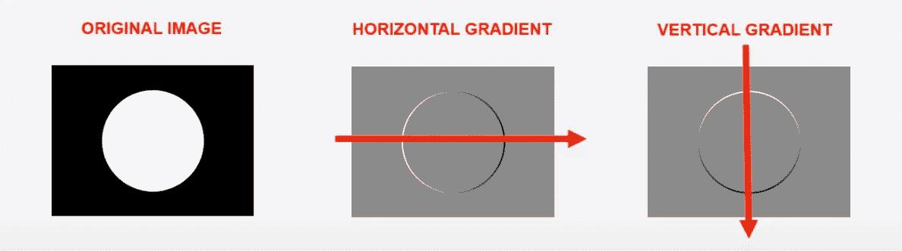

# 采用 H.O.G 特征描述符

> 原文：<https://medium.com/analytics-vidhya/a-take-on-h-o-g-feature-descriptor-e839ebba1e52?source=collection_archive---------0----------------------->

## 方向梯度直方图特征描述符的一种解释

人脸识别是机器学习领域最受欢迎的技术之一。在这样的系统中有两个阶段:人脸检测和人脸识别。

最初，使用图像上的 Haar 级联分类器结合面部的基本部分的裁剪来检测面部。利用使用 Haar 级联分类器执行的眼睛检测来形成几何人脸模型，而鼻子检测已经与眼睛一起被用作确认机制。

之后，从大量人脸图像中提取 HOG 特征，作为识别机制的一部分。然后，将这些 HOG 特征一起标记给人脸/用户，并训练支持向量机(SVM)模型来预测输入系统的人脸。

H.O.G(梯度方向直方图)是计算机视觉中使用的特征描述符，用于目标检测的图像处理。在 Navneet Dalal 和 Bill Triggs 于 2005 年发表了一篇名为 [*用于人体检测的梯度方向直方图*](https://lear.inrialpes.fr/people/triggs/pubs/Dalal-cvpr05.pdf) *的论文后，这一技术得到了发展。*在深度学习时代之前，这是进行对象检测的强大而先进的方式。猪因其在行人检测中的应用而广为人知。

# **直觉**

在了解 H.O.G 的工作原理之前，让我们先了解一下在这种情况下什么是梯度。以下面的图像为例:

图像中的渐变

当你从左到右逐个像素地步进时，你会发现在一些步骤之后，像素值会有一个突然的变化，即从黑色较低的像素数到白色较高的像素数。这种颜色的突然变化被称为渐变，从较暗的色调到较亮的色调被称为正渐变，反之亦然。从左到右给出了水平梯度，正如所料，从上到下给出了垂直梯度。

# **H . o . g .如何工作**

HOG 使用的是一种叫做积木的东西，类似于滑动窗。一个块被认为是一个像素网格，其中梯度由块内像素的强度变化的幅度和方向构成。

> 注意事项:HOG 适用于灰度图像。

1 —因此第一步是将 RGB 图像转换为灰度图像。

2 —为了更仔细地观察，让我们关注一个 8*8 大小的网格。看下图。

在 64 个像素的块中，对于每个像素，计算水平和垂直梯度。如上图所示，水平和垂直梯度计算如下:

水平坡度:120–70 = 50
垂直坡度:100–50 = 50

3-一旦我们得到梯度，我们试图为 64 个像素中的每一个计算所谓的**梯度大小**和**梯度角度**。

现在有了这 64 个梯度向量，我们试图将它们压缩到 9 个向量，试图保留最大的结构。为了做到这一点，我们试图绘制一个直方图的幅度和角度。这里 x 轴是角度，它们被分成 9 个箱，每个箱的大小为 20 度。

> 注意:创建 9 个垃圾箱是由 HOG 论文的作者决定的。所以它在任何地方都是不变的。

以上结果是针对一个 8*8 网格的，我们将表示压缩为 9 个向量。

4-当我们沿着整个图像滑动 8*8 网格并尝试解释直方图结果时，我们会得到如下结果。

通过绘制猪的特征，我们会发现物体或面部的结构保持得很好，失去了所有不重要的特征。

并且任何机器学习算法都可以利用这种输入来进行分类或回归。

这是一种至今仍在使用的非常强大的技术，无需使用 DL 的重型架构就可以实现对象检测。

获得 HOG 检测功能的最好地方是图书馆 [Dlib。](http://dlib.net/)

现在，您已经知道了一种以压缩格式表示图像并且仍然保持图像结构的便捷工具，您可以将它应用到许多计算机视觉用例中。

# **参考文献:**

[梯度方向直方图](https://www.learnopencv.com/histogram-of-oriented-gradients/) - opencv

[梯度方向直方图](https://en.wikipedia.org/wiki/Histogram_of_oriented_gradients) -维基

[方向梯度直方图](https://www.youtube.com/watch?v=0Zib1YEE4LU) — UCF