# 双城记

> 原文：<https://medium.com/analytics-vidhya/a-tale-of-two-cities-clustering-neighborhoods-of-london-and-paris-5328f69cd8b6?source=collection_archive---------12----------------------->

## 深入分析

## 使用机器学习对伦敦和巴黎的邻近区域进行聚类


cyril mazarin 在 [Unsplash](https://unsplash.com?utm_source=medium&utm_medium=referral) 上拍摄的照片

# 介绍

查尔斯·狄更斯的小说《双城记》以法国大革命时期的伦敦和巴黎为背景。这些城市同时发生在当时和现在。这些年来发生了很多变化，现在我们来看看这些城市是如何发展的。

伦敦和巴黎是世界各地人们非常喜爱的旅游和度假目的地。它们是多样的、多元文化的，提供了广受欢迎的各种体验。我们试图将伦敦和巴黎的街区分别分组，并对它们现在的样子进行深入观察。

# 商业问题

目的是帮助游客根据社区提供的体验和他们想要的东西来选择目的地。这种模式也有助于人们做出决定，是否考虑移居伦敦或巴黎，甚至是否希望在市内重新安置居民。我们的发现将有助于利益相关者做出明智的决定，并解决他们的任何问题，包括不同种类的美食、食品商店和城市所能提供的东西。

# 数据描述

我们需要伦敦和巴黎的地理位置数据。每个城市的邮政编码是一个起点。使用邮政编码，我们可以找到街区，行政区，场地和他们最受欢迎的场地类别。

## 伦敦

为了得到我们的解决方案，我们从 https://en.wikipedia.org/wiki/List_of_areas_of_London 的[搜集数据](https://en.wikipedia.org/wiki/List_of_areas_of_London)

这个维基百科页面有所有街区的信息；我们把它限制在伦敦。

1.  *区*:街区名称
2.  *城镇*:行政区的名称
3.  *邮政编码*:伦敦的邮政编码。

这个维基百科页面缺少关于地理位置的信息。为了解决这个问题，我们使用了 *ArcGIS API。*

## ArcGIS API

ArcGIS Online 使您能够使用交互式地图连接人员、位置和数据。使用智能的数据驱动型风格和直观的分析工具，提供位置智能。与世界或特定群体分享您的见解。

更具体地说，我们使用 *ArcGIS* 来获取伦敦街区的地理位置。将以下各列添加到我们的初始数据集中可以准备我们的数据。

1.  *纬度*:附近的纬度
2.  *经度*:附近的经度

## 巴黎

为了得到我们的解决方案，我们利用了位于[https://www . data . gouv . fr/fr/datasets/r/e 88 c 6 FDA-1d 09-42 A0-a069-606d 3259114 e](https://www.data.gouv.fr/fr/datasets/r/e88c6fda-1d09-42a0-a069-606d3259114e)的 JSON 数据

JSON 文件包含法国所有街区的数据；我们把它限制在巴黎。

1.  *邮政编码*:法国的邮政编码
2.  *法国的街区名称*
3.  行政区的名称，相当于法国的城镇
4.  *geo_point_2d* :包含邻域经纬度的元组。

## Foursquare API 数据

我们需要那个特定行政区不同社区的不同场馆的数据。为了获得这些信息，我们将使用“Foursquare”位置信息。Foursquare 是一个位置数据提供商，提供感兴趣区域内各种类型的地点和事件的信息。这些信息包括场地名称、位置、菜单甚至照片。因此，foursquare 定位平台将被用作唯一的数据源，因为所有声明的所需信息都可以通过 API 获得。

找到街区列表后，我们连接到 Foursquare API 来收集每个街区内的场馆信息。对于每个邻域，我们选择半径为 500 米。

从 Foursquare 检索到的数据包含了在邮政编码的经度和纬度的指定距离内的地点信息。每个场馆获得的信息如下:

1.  *街区*:街区名称
2.  *邻居纬度*:邻居的纬度
3.  *街区经度*:街区的经度
4.  *场地*:场地名称
5.  *场馆纬度*:场馆纬度
6.  *场馆经度*:场馆经度
7.  *场馆类别*:场馆类别

基于为伦敦和巴黎收集的所有信息，我们有足够的数据来建立我们的模型。我们根据相似的场地类别将社区聚集在一起。然后我们提出我们的观察和发现。利用这些数据，我们的利益相关者可以做出必要的决定。

# 方法学

我们将在 Python 的帮助下创建我们的模型，所以我们从导入所有需要的包开始。代码可以在 [GitHub](https://github.com/Thomas-George-T/A-Tale-of-Two-Cities/blob/master/Tale_of_Two_Cities_A_Data_Science_Take.ipynb) 上找到。

```
import pandas as pd
import requests
import numpy as np
import matplotlib.cm as cm
import matplotlib.colors as colors
import folium
from sklearn.cluster import KMeans
```

包装细目:

*   熊猫:收集和操作 JSON 和 HTML 中的数据，然后进行数据分析
*   请求:处理 HTTP 请求
*   *matplotlib* :详述生成的地图
*   *叶子*:生成伦敦和巴黎的地图
*   *sklearn* :导入 K 表示机器学习模型。

这里采用的方法是单独探索每个城市，绘制地图以显示所考虑的街区，然后通过将所有相似的街区聚集在一起来构建我们的模型，最后绘制具有聚集街区的新地图。我们得出见解，然后比较和讨论我们的发现。

## 数据收集

在数据收集阶段，我们从收集伦敦和巴黎城市所需的数据开始。我们需要包含每个城市的邮政编码、街区和行政区的数据。

为了使用熊猫收集伦敦的数据，我们从伦敦维基百科页面的区域列表中提取第二个表:

```
url_london = "https:/[/en.wikipedia.org/wiki/List_of_areas_of_Lo](https://colab.research.google.com/drive/11LYSVN5-SjspZvOTnz3dmOpoA7Xz4Dw6#)ndon"
wiki_london_url = requests.get(url_london)
wiki_london_data = pd.read_html(wiki_london_url.text)
wiki_london_data = wiki_london_data[1]
wiki_london_data
```

1.  *法国的居民区名称*
2.  *nom_dept* :行政区的名称，相当于法国的城镇
3.  *geo_point_2d* :包含邻域经纬度的元组。

## Foursquare API 数据

我们需要那个特定行政区不同社区的不同场馆的数据。为了获得这些信息，我们将使用“Foursquare”位置信息。Foursquare 是一个位置数据提供商，提供感兴趣区域内各种类型的地点和事件的信息。这些信息包括场地名称、位置、菜单甚至照片。因此，foursquare 定位平台将被用作唯一的数据源，因为所有声明的所需信息都可以通过 API 获得。

找到街区列表后，我们连接到 Foursquare API 来收集每个街区内的场馆信息。对于每个邻域，我们选择半径为 500 米。

从 Foursquare 检索到的数据包含了在邮政编码的经度和纬度的指定距离内的地点信息。每个场馆获得的信息如下:

1.  *街区*:街区名称
2.  *邻居纬度*:邻居的纬度
3.  *街区经度*:街区的经度
4.  *场馆*:场馆名称
5.  *场馆纬度*:场馆纬度
6.  *场馆经度*:场馆经度
7.  *场馆类别*:场馆类别

基于为伦敦和巴黎收集的所有信息，我们有足够的数据来建立我们的模型。我们根据相似的场地类别将社区聚集在一起。然后我们提出我们的观察和发现。利用这些数据，我们的利益相关者可以做出必要的决定。

# 方法学

我们将在 Python 的帮助下创建我们的模型，所以我们从导入所有需要的包开始。代码可以在 [GitHub](https://github.com/Thomas-George-T/A-Tale-of-Two-Cities/blob/master/Tale_of_Two_Cities_A_Data_Science_Take.ipynb) 上找到。

```
import pandas as pd
import requests
import numpy as np
import matplotlib.cm as cm
import matplotlib.colors as colors
import folium
from sklearn.cluster import KMeans
```

包装细目:

*   *熊猫*:收集和操作 JSON 和 HTML 中的数据，然后进行数据分析
*   *请求*:处理 HTTP 请求
*   *matplotlib* :详细描述生成的地图
*   *叶子*:生成伦敦和巴黎的地图
*   *sklearn* :导入 K 表示机器学习模型。

这里采用的方法是单独探索每个城市，绘制地图以显示正在考虑的街区，然后通过将所有相似的街区聚集在一起来构建我们的模型，最后绘制具有聚集街区的新地图。我们得出见解，然后比较和讨论我们的发现。

## 数据收集

在数据收集阶段，我们从收集伦敦和巴黎城市所需的数据开始。我们需要包含每个城市的邮政编码、街区和行政区的数据。

为了使用熊猫收集伦敦的数据，我们从伦敦维基百科页面的区域列表中提取第二个表:

```
url_london = "https:/[/en.wikipedia.org/wiki/List_of_areas_of_Lo](https://colab.research.google.com/drive/11LYSVN5-SjspZvOTnz3dmOpoA7Xz4Dw6#)ndon"
wiki_london_url = requests.get(url_london)
wiki_london_data = pd.read_html(wiki_london_url.text)
wiki_london_data = wiki_london_data[1]
wiki_london_data
```

数据看起来像这样:

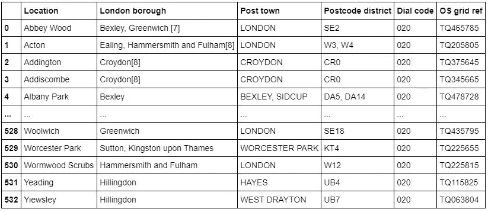

伦敦的数据从维基百科页面上删除。

为了收集巴黎的数据，我们从[https://www . data . gouv . fr/fr/datasets/r/e 88 c 6 FDA-1d 09-42 A0-a069-606d 3259114 e](https://www.data.gouv.fr/fr/datasets/r/e88c6fda-1d09-42a0-a069-606d3259114e)下载包含法国所有邮政编码的 JSON 文件

使用 Pandas，我们在读取 JSON 文件后加载该表:

```
!wget -q -O 'france-data.json' https:/[/www.data.gouv.fr/fr/datasets/r/e88c6fda](https://colab.research.google.com/drive/11LYSVN5-SjspZvOTnz3dmOpoA7Xz4Dw6#)-1d09-42a0-a069-606d3259114e
print("Data Downloaded!")
paris_raw = pd.read_json('france-data.json')
paris_raw.head()
```

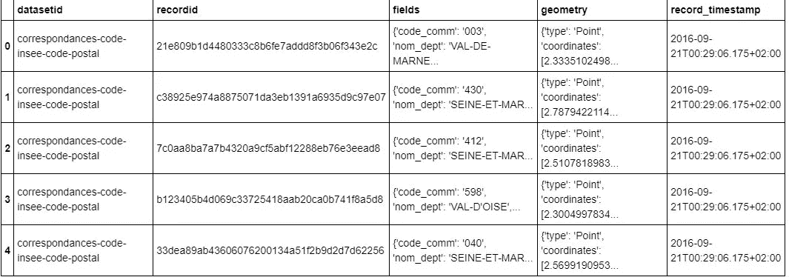

包含法国邮政编码的 JSON 数据

## 数据预处理

对于伦敦，我们用下划线替换标题中的空格。*区*列中的数字在方括号内，我们使用以下方式删除:

```
wiki_london_data.rename(columns=lambda x: x.strip().replace(" ", "_"), inplace=True)
wiki_london_data['borough'] = wiki_london_data['borough'].map(lambda x: x.rstrip(']').rstrip('0123456789').rstrip('['))
```

对于 Paris，我们分解每个嵌套字段并创建我们需要的数据帧:

```
paris_field_data = pd.DataFrame()
for f in paris_raw.fields:
    dict_new = f
    paris_field_data = paris_field_data.append(dict_new, ignore_index=True)

paris_field_data.head()
```

## 特征选择

对于我们的两个数据集，我们只需要行政区、街区、邮政编码和地理位置(纬度和经度)。因此，我们最终通过以下方式选择我们需要的列:

```
df1 = wiki_london_data.drop( [ wiki_london_data.columns[0], wiki_london_data.columns[4], wiki_london_data.columns[5] ], axis=1)

df_2 = paris_field_data[['postal_code','nom_comm','nom_dept','geo_point_2d']]
```

## 特征工程

我们的两个数据集都包含与该国所有城市相关的信息。我们可以通过只选择“伦敦”和“巴黎”的街区来缩小范围并进一步处理数据。

```
df1 = df1[df1['town'].str.contains('LONDON')]

df_paris = df_2[df_2['nom_dept'].str.contains('PARIS')].reset_index(drop=True)
```

查看我们的伦敦数据集，我们可以看到我们没有地理定位数据。我们需要为我们的邻居推断缺失的数据。我们通过利用`ArcGIS API`来实现这一点。在`ArcGIS API`的帮助下，我们可以获得伦敦街区的经纬度数据。

```
from arcgis.geocoding import geocode
from arcgis.gis import GIS
gis = GIS()
```

定义伦敦 ArcGIS *地理编码*函数以返回纬度和经度。

```
def get_x_y_uk(address1):
   lat_coords = 0
   lng_coords = 0
   g = geocode(address='{}, London, England, GBR'.format(address1))[0]
   lng_coords = g['location']['x']
   lat_coords = g['location']['y']
   return str(lat_coords) +","+ str(lng_coords)
```

传递伦敦的邮政编码以获得地理坐标

```
coordinates_latlng_uk = geo_coordinates_uk.apply(lambda x: get_x_y_uk(x))
```

我们继续将源数据与地理坐标合并，为下一阶段准备好数据集

```
london_merged = pd.concat([df1,lat_uk.astype(float), lng_uk.astype(float)], axis=1)
london_merged.columns= ['borough','town','post_code','latitude','longitude']
london_merged
```

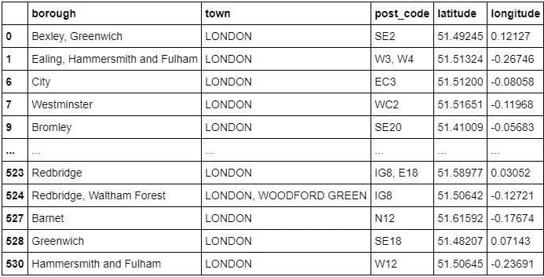

生成的要素工程伦敦数据集

至于我们的巴黎数据集，我们不需要使用外部数据源获取地理坐标或使用`ArcGIS` API 调用收集它，因为我们已经将它作为元组存储在 *geo_point_2d* 列的 *df_paris* 数据帧中。

我们只需要从列中提取纬度和经度:

```
paris_lat = paris_latlng.apply(lambda x: x.split(',')[0])
paris_lat = paris_lat.apply(lambda x: x.lstrip('['))

paris_lng = paris_latlng.apply(lambda x: x.split(',')[1])
paris_lng = paris_lng.apply(lambda x: x.rstrip(']'))

paris_geo_lat  = pd.DataFrame(paris_lat.astype(float))
paris_geo_lat.columns=['Latitude']

paris_geo_lng = pd.DataFrame(paris_lng.astype(float))
paris_geo_lng.columns=['Longitude']
```

然后，我们用所需的信息创建巴黎数据集:

```
paris_combined_data = pd.concat([df_paris.drop('geo_point_2d', axis=1), paris_geo_lat, paris_geo_lng], axis=1)
paris_combined_data
```

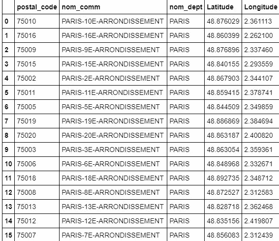

生成的巴黎要素工程数据集

*注意:两个数据集都经过了适当的处理和格式化。由于相同的步骤适用于伦敦和巴黎的数据集，为简单起见，我们将只讨论伦敦数据集的代码。*

# 想象伦敦和巴黎的街区

现在我们的数据集已经准备好了，使用`Folium`包，我们可以可视化伦敦和巴黎的地图以及我们收集的街区。

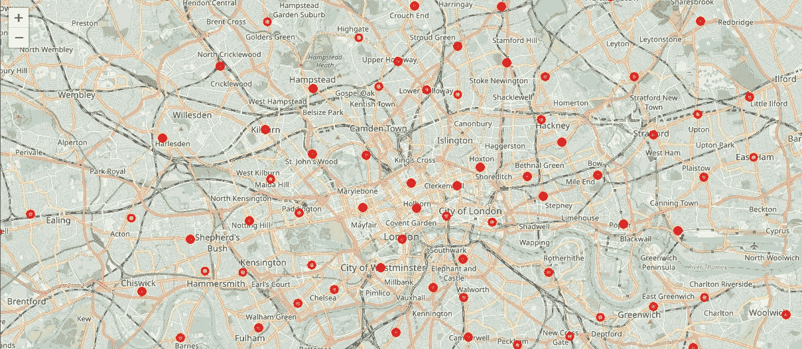

显示街区的伦敦地图

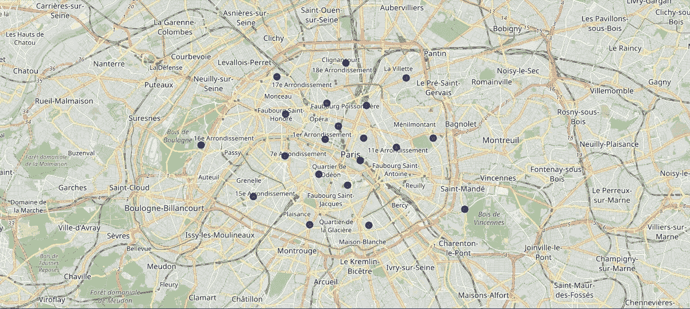

显示街区的巴黎地图

既然我们已经可视化了社区，我们需要找出每个社区是什么样的，以及在 500 米半径范围内有哪些常见的场馆和场馆类别。

这就是`Foursquare`发挥作用的地方。在`Foursquare`的帮助下，我们定义了一个函数，该函数收集与每个街区相关的信息，包括街区名称、地理坐标、场地和场地类别。

```
LIMIT=100

def getNearbyVenues(names, latitudes, longitudes, radius=500):

    venues_list=[]
    for name, lat, lng in zip(names, latitudes, longitudes):
        print(name)

        # create the API request URL
        url = 'https:/[/api.foursquare.com/v2/venues/explore](https://colab.research.google.com/drive/11LYSVN5-SjspZvOTnz3dmOpoA7Xz4Dw6#)?&client_id={}&client_secret={}&v={}&ll={},{}&radius={}&limit={}'.format(
            CLIENT_ID, 
            CLIENT_SECRET, 
            VERSION, 
            lat, 
            lng, 
            radius,
            LIMIT
            )

        # make the GET request
        results = requests.get(url).json()["response"]['groups'][0]['items']

        # return only relevant information for each nearby venue
        venues_list.append([(
            name, 
            lat, 
            lng, 
            v['venue']['name'], 
            v['venue']['categories'][0]['name']) for v in results])

    nearby_venues = pd.DataFrame([item for venue_list in venues_list for item in venue_list])
    nearby_venues.columns = ['Neighbourhood', 
                  'Neighbourhood Latitude', 
                  'Neighbourhood Longitude', 
                  'Venue', 
                  'Venue Category']

    return(nearby_venues)
```

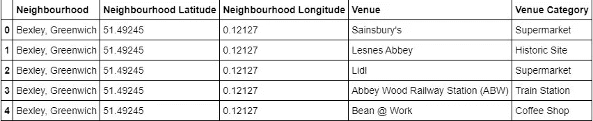

使用 Foursquare API 收集的数据

## 一个热编码

由于我们试图找出每个社区中存在的不同类型的场馆类别，然后计算前 10 个常见的场馆，以此作为我们相似性的基础，因此我们使用 One Hot 编码来处理场馆类别的分类数据类型。这有助于将分类数据转换成数字数据。

在这种情况下，我们不会使用标签编码，因为标签编码可能会导致我们的机器学习模型出现偏差或排序，这是我们试图通过使用一种热门编码来避免的。

我们执行一次性编码，然后计算每个街区的分组场地类别的平均值。

```
# One hot encoding
London_venue_cat = pd.get_dummies(venues_in_London[['Venue Category']], prefix="", prefix_sep="")

# Adding neighbourhood to the mix
London_venue_cat['Neighbourhood'] = venues_in_London['Neighbourhood'] 

# moving neighborhood column to the first column
fixed_columns = [London_venue_cat.columns[-1]] + list(London_venue_cat.columns[:-1])
London_venue_cat = London_venue_cat[fixed_columns]

# Grouping and calculating the mean
London_grouped = London_venue_cat.groupby('Neighbourhood').mean().reset_index()
```

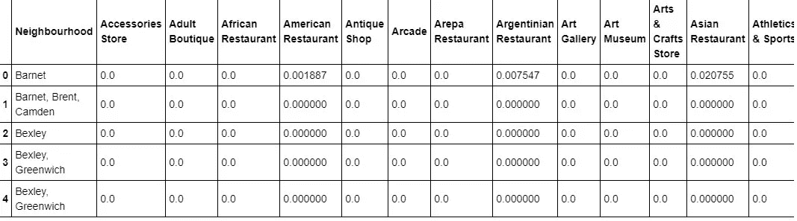

一次性编码后每个邻域的平均值数据

## 附近的顶级场馆

下一步，我们需要对我们附近的顶级场馆进行分类、排名和标记。

让我们定义一个函数来获取附近的顶级场馆类别

```
def return_most_common_venues(row, num_top_venues):
    row_categories = row.iloc[1:]
    row_categories_sorted = row_categories.sort_values(ascending=False)

    return row_categories_sorted.index.values[0:num_top_venues]
```

有许多类别，我们将考虑前 10 个类别，以避免数据倾斜。

定义一个函数来准确标记它们

```
num_top_venues = 10

indicators = ['st', 'nd', 'rd']

# create columns according to number of top venues
columns = ['Neighbourhood']
for ind in np.arange(num_top_venues):
    try:
        columns.append('{}{} Most Common Venue'.format(ind+1, indicators[ind]))
    except:
        columns.append('{}th Most Common Venue'.format(ind+1))
```

获得伦敦街区的顶级场地类别

```
# create a new dataframe for London
neighborhoods_venues_sorted_london = pd.DataFrame(columns=columns)
neighborhoods_venues_sorted_london['Neighbourhood'] = London_grouped['Neighbourhood']

for ind in np.arange(London_grouped.shape[0]):
    neighborhoods_venues_sorted_london.iloc[ind, 1:] = return_most_common_venues(London_grouped.iloc[ind, :], num_top_venues)

neighborhoods_venues_sorted_london.head()
```

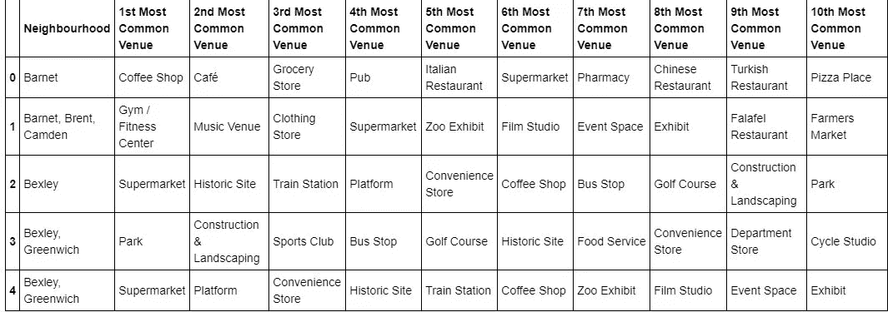

每个社区的顶级公共场所排名。

## 模型构建— K 表示

接下来是最激动人心的部分——**模型制作！**我们将使用 K 均值聚类机器学习算法将相似的社区聚类在一起。我们可以选择许多不同的群集大小，我们将群集数量设为 5，以尽可能保持优化。

```
# set number of clusters
k_num_clusters = 5

London_grouped_clustering = London_grouped.drop('Neighbourhood', 1)

# run k-means clustering
kmeans_london = KMeans(n_clusters=k_num_clusters, random_state=0).fit(London_grouped_clustering)
```

我们的模型已经标记了每个街区，我们将标签添加到我们的数据集中。

```
neighborhoods_venues_sorted_london.insert(0, 'Cluster Labels', kmeans_london.labels_ +1)
```

然后，我们将*伦敦合并的数据帧*与我们*邻居场地分类的数据帧*连接起来，为每个邻居添加纬度&经度，为可视化做准备。

```
london_data = london_merged

london_data = london_data.join(neighborhoods_venues_sorted_london.set_index('Neighbourhood'), on='borough')

london_data.head()
```

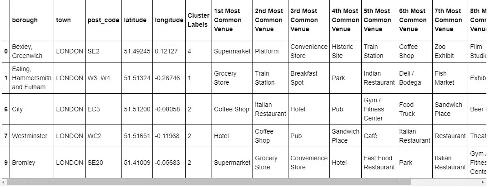

伦敦的标记聚类数据集

## 可视化聚集的邻域

我们的数据被处理，缺失的数据被收集和编辑。模型已经建立。剩下的就是在地图上看到聚集的街区。同样，我们使用`Folium`包来这样做。

我们丢弃所有 NaN(不是数字)值以防止数据倾斜

```
london_data_nonan = london_data.dropna(subset=['Cluster Labels'])
```

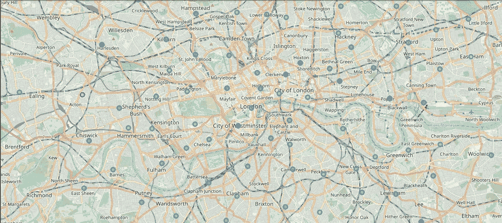

伦敦密集街区地图

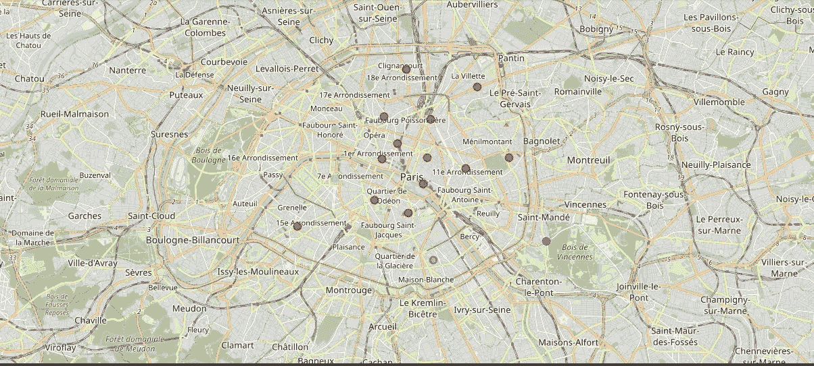

巴黎密集街区地图

## 检查我们的集群

我们可以通过使用`Cluster Labels`列扩展我们的代码来检查我们的集群:

群组 1

```
london_data_nonan.loc[london_data_nonan['Cluster Labels'] == 1, london_data_nonan.columns[[1] + list(range(5, london_data_nonan.shape[1]))]]
```

群组 2

```
london_data_nonan.loc[london_data_nonan['Cluster Labels'] == 2, london_data_nonan.columns[[1] + list(range(5, london_data_nonan.shape[1]))]]
```

第 3 组

```
london_data_nonan.loc[london_data_nonan['Cluster Labels'] == 3, london_data_nonan.columns[[1] + list(range(5, london_data_nonan.shape[1]))]]
```

第 4 组

```
london_data_nonan.loc[london_data_nonan['Cluster Labels'] == 4, london_data_nonan.columns[[1] + list(range(5, london_data_nonan.shape[1]))]]
```

第 5 组

```
london_data_nonan.loc[london_data_nonan['Cluster Labels'] == 5, london_data_nonan.columns[[1] + list(range(5, london_data_nonan.shape[1]))]]
```

# 结果和讨论

伦敦的街区非常具有多元文化。有很多不同的菜系，包括印度菜、意大利菜、土耳其菜和中国菜。伦敦似乎在这个方向上更进一步，有许多餐馆、酒吧、果汁吧、咖啡店、炸鱼薯条店和早餐点。它也有很多购物选择，有跳蚤市场、花店、鱼市、鱼店、服装店。主要的交通方式似乎是公共汽车和火车。休闲方面，居民区建有许多公园、高尔夫球场、动物园、体育馆和历史遗迹。总的来说，伦敦金融城提供了一个多元文化、多样化和娱乐性的体验。

巴黎在地理上相对较小。它有各种各样的美食和餐馆，包括法国，泰国，柬埔寨，亚洲，中国等。这里有许多休闲场所，包括许多餐馆和酒吧。巴黎有许多小酒馆。巴黎的各种公共交通工具，包括公共汽车、自行车、船或渡船。对于休闲和观光来说，这里有许多广场、小径、公园、历史遗迹、服装店、美术馆和博物馆。总的来说，巴黎似乎是一个放松的度假胜地，有湖泊、历史景点和各种美食可供尝试。

# 结论

这个项目的目的是探索伦敦和巴黎，看看它对潜在的游客和移民有多大的吸引力。我们根据这两个城市的邮政编码对它们进行了研究，然后推断出每个街区的公共场所，最后将相似的街区聚集在一起。

我们可以看到，这两个城市的每个社区都有各种各样的独特体验。文化多样性非常明显，这也给人一种包容的感觉。

巴黎和伦敦似乎都提供了一个假期或浪漫的假期，有很多地方可以探索，美丽的风景，美味的食物和各种各样的文化。总的来说，由利益相关者来决定他们更喜欢哪种体验，哪种体验更合他们的口味。

详细代码可在 [GitHub](https://github.com/Thomas-George-T/A-Tale-of-Two-Cities/blob/master/Tale_of_Two_Cities_A_Data_Science_Take.ipynb) 上获得。感谢阅读！

# 参考

1.  [邻里之战——我的伦敦视角，作者戴约·约翰](/@oludayo.oguntoyinbo/the-battle-of-neighbourhood-my-londons-perspective-d363163771e0)
2.  [邻里之战！我可以在巴黎的什么地方开始我的餐馆生意？作者扎卡里亚·布齐安](https://www.linkedin.com/pulse/battle-neighborhoods-what-best-place-where-can-i-start-bouziane/)
3.  [Foursquare API](https://foursquare.com/)
4.  [ArcGIS API](https://www.arcgis.com/index.html)