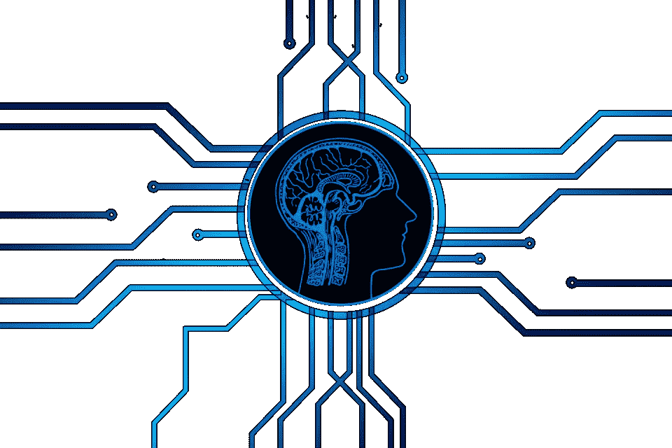
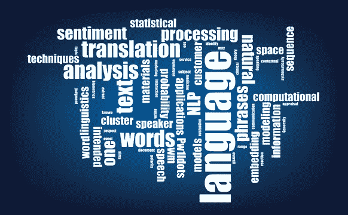
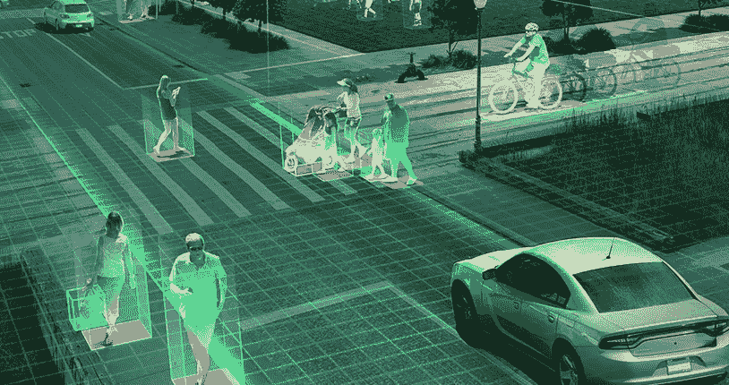
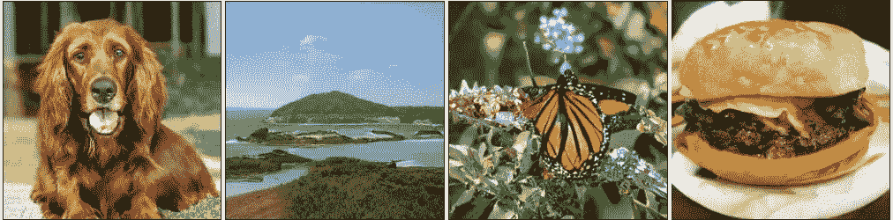
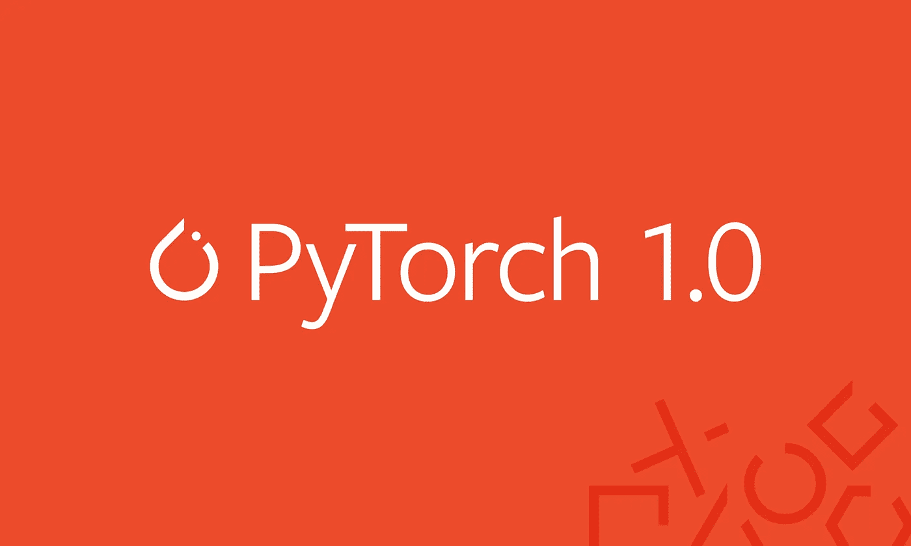
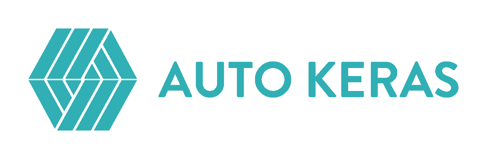

# 2018 年人工智能和人工智能(NLP，计算机视觉，强化学习)的技术概述和 2019 年的趋势

> 原文：<https://medium.com/analytics-vidhya/a-technical-overview-of-ai-ml-nlp-computer-vision-reinforcement-learning-in-2018-trends-6a24647456af?source=collection_archive---------0----------------------->

# 介绍

过去的几年对于人工智能爱好者和机器学习专业人士来说是梦幻之旅。这些技术已经从小众发展成为主流，并影响着今天数百万人的生活。各国现在都有专门的人工智能部长和预算，以确保他们在这场竞赛中保持相关性。

对于数据科学专业人员来说也是如此。几年前——如果知道一些工具和技术，你会感觉很舒服。不再是了！这个领域发生了太多的事情，有太多的事情需要跟上——有时感觉令人难以置信。

这就是为什么我想到后退一步，从数据科学从业者的角度来看待人工智能的一些关键领域的发展。这些突破是什么？2018 年发生了什么，2019 年有哪些可以期待的？阅读这篇文章，找出答案！

*附:和任何预测一样，这些是我的看法。这些都是基于我试图把这些点联系起来。如果你有不同的观点，我很想听听。一定要让我知道你认为 2019 年可能会发生什么变化。*

# 我们将在本文中涉及的领域

*   自然语言处理
*   计算机视觉
*   工具和库
*   强化学习
*   人工智能为好——走向伦理人工智能

# 自然语言处理

让机器解析单词和句子似乎一直是一个梦想。一门语言有太多的细微差别和方面，有时甚至人类都难以理解。**但是 2018 年对于 NLP** 来说确实是一个分水岭。

我们看到了一个又一个引人注目的突破——乌尔姆菲特、ELMO、OpenAI 的 Transformer 和谷歌的 BERT，仅举几例。迁移学习(能够将预先训练的模型应用于数据的艺术)在 NLP 任务中的成功应用为潜在的无限应用打开了大门。我们与 Sebastian Ruder 的播客进一步巩固了我们对他的领域在最近已经走过了多远的信念。*顺便提一下，这是所有 NLP 爱好者必听的播客。*

让我们更详细地看一下这些关键发展。如果你想学习自然语言处理的诀窍，并且正在寻找一个入门的地方，请务必参加这个“[使用 Python 的自然语言处理](https://trainings.analyticsvidhya.com/courses/course-v1:AnalyticsVidhya+NLP101+2018_T1/about)”课程。这是一个开始你文字驱动之旅的好地方！

# 乌尔菲特

由 Sebastian Ruder 和 fast.ai 的杰瑞米·霍华德设计的 ULMFiT 是第一个让 NLP 迁移学习党今年开始的框架。对于外行来说，它代表通用语言模型微调。Jeremy 和 Sebastian 真正把这个词放在了 ULMFiT 中——这个框架可以应用于几乎所有的 NLP 任务！

关于 ULMFiT 和我们很快将看到的后续框架，最好的部分是什么？不需要从零开始训练模特！这些研究人员已经为你完成了困难的部分——把他们的知识应用到你自己的项目中。在六个文本分类任务中，ULMFiT 优于最先进的方法。

你可以阅读 Prateek Joshi 的这篇优秀教程,学习如何使用 ULMFiT 解决任何文本分类问题。

# 工程与后勤管理局

想猜猜 ELMo 代表什么吗？它是语言模型嵌入的简称。很有创意，是吧？除了它的名字很像著名的芝麻街角色之外，ELMo 一发行就吸引了 ML 社区的注意。

ELMo 使用语言模型来获得每个单词的嵌入，同时还考虑单词在句子或段落中的上下文。上下文是自然语言处理的一个非常重要的方面，以前大多数人都没有理解。ELMo 使用双向 LSTMs 来创建嵌入。如果这听起来有点拗口，不要担心——查看[这篇文章](https://www.analyticsvidhya.com/blog/2017/12/fundamentals-of-deep-learning-introduction-to-lstm/),获得 LSTMs 是什么以及它们如何工作的简单概述。

像 ULMFiT 一样，ELMo 显著提高了各种 NLP 任务的性能，如情感分析和问题回答。点击阅读更多关于[的信息。](https://allennlp.org/elmo)

# 谷歌的伯特

相当多的专家声称 BERT 的发布标志着 NLP 的一个新时代。继 ULMFiT 和 ELMo 之后，BERT 凭借其出色的性能彻底击败了竞争对手。正如[原始论文](https://arxiv.org/abs/1810.04805)所说，“BERT 概念简单，经验强大”。

伯特在 11 日获得了最先进的结果(是的，11 日！)NLP 任务。查看他们在班基准上的结果:

SQuAD v1.1 排行榜(2018 年 10 月 8 日)测试 EMTest F11st 第一名合奏— BERT **87.493.2** 第二名合奏—nlnet 86 . 091 . 71 第一名单人模式— BERT **85.191.8** 第二名单人模式— nlnet83.590.1

有兴趣开始吗？你可以使用 [PyTorch 实现](https://github.com/huggingface/pytorch-pretrained-BERT)或者谷歌自己的 [TensorFlow 代码](https://github.com/google-research/bert)来尝试在你自己的机器上复制结果。

我相当肯定你想知道伯特在这一点上代表什么。

这是变压器的双向编码器表示。如果你第一次就答对了，那就是满分。

# 脸书的 PyText

脸书怎么能置身事外呢？他们开源了自己的深度学习 NLP 框架，名为 PyText。它是在本周早些时候发布的，所以我仍在对它进行实验，但早期的评论非常有希望。根据 FB 发布的研究，PyText 使对话模型的准确性提高了 10%,并减少了训练时间。

PyText 实际上是脸书自己的一些产品的幕后推手，比如 FB Messenger。因此，从事这项工作会给你自己的投资组合增加一些真实世界的价值(除了你将明显获得的无价知识之外)。

你可以从[这个 GitHub repo](https://github.com/facebookresearch/pytext) 下载代码自己试试。

# 谷歌双工

如果你还没听说过 Google Duplex，那你去过哪里？！桑德尔·皮帅凭借这个演示一举成名，从那以后它就一直是头条新闻:

由于这是谷歌的产品，他们开源其背后代码的可能性很小。但是哇！这是一个非常棒的音频处理应用程序。当然，这引发了许多伦理和隐私问题，但这将在本文后面讨论。现在，只需陶醉于近年来我们在 ML 方面取得的进步。

# 2019 年 NLP 趋势展望

谁比 Sebastian Ruder 本人更适合提供 NLP 在 2019 年走向何处的线索？以下是他的想法:

*   预训练语言模型嵌入将变得无处不在。很少会有不使用它们的最先进的模型
*   我们将看到**预训练的表示，它可以编码专门的信息**，这是对语言模型嵌入的补充。我们将能够根据任务的要求组合不同类型的预训练表示
*   我们将看到更多关于多语言应用和跨语言模型的工作。特别是，在跨语言单词嵌入的基础上，我们将看到深度预训练的跨语言表征的出现

# 计算机视觉

这无疑是目前深度学习领域最受欢迎的领域。我觉得我们已经在很大程度上摘下了计算机视觉的低挂果实，并且已经处于提炼阶段。无论是图像还是视频，我们已经看到了大量的框架和库，它们使计算机视觉任务变得轻而易举。

我们 Analytics Vidhya 今年花了很多时间致力于这些概念的民主化。点击这里查看我们的[计算机视觉特定文章，涵盖从视频和图像中的对象检测到预训练模型列表的主题，以开始您的深度学习之旅。](https://www.analyticsvidhya.com/blog/category/deep-learning/)

以下是我挑选的今年我们在 CV 上看到的最好的发展。

如果你对这个奇妙的领域(实际上很快就会成为行业内最热门的工作之一)感到好奇，那么继续前进，通过我们的“[计算机视觉使用深度学习](https://trainings.analyticsvidhya.com/courses/course-v1:AnalyticsVidhya+CVDL101+CVDL101_T1/about) g”课程开始你的旅程。

# 释放比根斯

Ian Goodfellow 在 2014 年设计了 GANs，此后这个概念衍生出了多种多样的应用。年复一年，我们看到最初的概念被调整以适应实际的用例。但有一件事一直保持到今年，那就是机器生成的图像很容易被发现。框架中总会有一些不一致的地方，这使得区别相当明显。

但最近几个月，这一界限已经开始消失。随着[比根斯](https://arxiv.org/pdf/1809.11096.pdf)的诞生，这一界限将被永久消除。看看下面用这种方法生成的图像:

除非你拿着显微镜去观察，否则你无法判断这些收藏品是否有问题。关于或令人兴奋的？我把这个问题留给你，但毫无疑问，GANs 正在改变我们感知数字图像(和视频)的方式。

对于数据科学家来说，这些模型首先在 ImageNet 数据集上进行训练，然后在 JFT-300M 数据上进行训练，以展示这些模型可以很好地从一个集合转移到另一个集合。我还会把你引向 [GAN 解剖页面](https://gandissect.csail.mit.edu/)——一种非常酷的可视化和理解 GAN 的方式。

# Fast.ai 的模型在 18 分钟内在 ImageNet 上接受训练

这是一个非常酷的发展。有一种非常普遍的观点认为，你需要大量的数据以及大量的计算资源来执行适当的深度学习任务。这包括在 ImageNet 数据集上从头开始训练模型。我理解这种看法——在 fast.ai 的几个人找到一种方法证明我们所有人都错了之前，我们大多数人都是这么想的。

他们的模型在令人印象深刻的 18 分钟内给出了 93%的准确率。他们使用的硬件，在他们的博客文章中有详细描述，包含 16 个公共 AWS 云实例，每个实例有 8 个 NVIDIA V100 GPUs。他们使用 fastai 和 PyTorch 库构建算法。

把整个事情放在一起的总成本出来只是 **$40** ！**杰瑞米已经详细描述了他们的方法，包括技巧** [**这里**](http://www.fast.ai/2018/08/10/fastai-diu-imagenet/) **。**大家都赢了！

# NVIDIA 的 vid2vid 技术

图像处理在过去的 4-5 年里突飞猛进，但是视频呢？事实证明，将方法从静态框架转换到动态框架比大多数人想象的要困难一些。能不能拍一段视频序列，预测下一帧会发生什么？之前有人对此进行过探索，但发表的研究最多也只是含糊其辞。

今年早些时候，NVIDIA 决定开源他们的方法，并获得了广泛的赞誉。他们的 vid2vid 方法的目标是从给定的输入视频中学习映射函数，以便产生以难以置信的精度描述输入视频内容的输出视频。

你可以在 GitHub 上试用他们的 PyTorch 实现。

# 2019 年预计的计算机视觉趋势

就像我之前提到的，我们可能会在 2019 年看到修改而不是发明。这可能感觉更像是一样的——自动驾驶汽车、面部识别算法、虚拟现实等。在这里，你可以不同意我的观点，也可以添加你的观点——我很想知道明年我们还能期待些什么我们还没有看到的东西。

等待政治和政府批准的无人机最终可能会在美国获得绿灯(印度远远落后于美国)。就个人而言，我希望看到大量的研究在现实世界中实施。像 CVPR 和 ICML 这样的会议描绘了这个领域的最新发展，但是这些项目离实际应用有多近呢？

视觉问答和视觉对话系统终于可以在不久的将来首次亮相了。这些系统缺乏概括的能力，但是我们期望很快会看到一个集成的多模态方法。

今年，自我监督学习走到了前台。我敢打赌，明年会有更多的研究采用这种方法。这是一条非常酷的学习路线——标签直接从我们输入的数据中确定，而不是浪费时间手动标记图像。手指交叉！

# 工具和库

这一部分将吸引所有数据科学专业人士。工具和库是数据科学家的面包和黄油。我参与了许多关于哪个工具是最好的，哪个框架取代了另一个框架，哪个库是经济计算的缩影等等的辩论。我相信你们中的很多人也会有同感。

但有一点我们都同意——我们需要掌握该领域的最新工具，否则就有被抛在后面的风险。Python 超越其他一切并成为行业领导者的速度足以说明这一点。当然，这在很大程度上归结于主观选择(您的组织使用什么工具，从当前框架转换到新框架的可行性如何，等等。)，但是如果你甚至没有考虑到最先进的技术，那么我恳求你现在就开始。

那么今年的头条是什么呢？让我们来了解一下！

# PyTorch 1.0

PyTorch 的炒作是怎么回事？我在本文中已经多次提到过它(稍后您会看到更多的实例)。我会让我的同事 Faizan Shaikh 来让你们熟悉这个框架。

这是我最喜欢的 AV 深度学习文章之一——必读！鉴于 TensorFlow 有时可能会非常慢，它为 PyTorch 在双快的时间内占领深度学习市场打开了大门。我在 GitHub 上看到的大部分开源代码都是 PyTorch 概念的实现。这不是巧合——py torch 超级灵活，最新版本(1.0 版)已经大规模支持许多脸书产品和服务，包括每天执行 60 亿次文本翻译。

PyTorch 的采用率只会在 2019 年上升，所以现在是加入的好时机。

# AutoML —自动化机器学习

在过去的几年里，自动机器学习(AutoML)已经逐渐取得进展。RapidMiner、KNIME、DataRobot 和 H2O.ai 等公司发布了优秀的产品，展示了这项服务的巨大潜力。

你能想象在一个 ML 项目中，你只需要使用拖放界面而不需要编码吗？这是一个在未来不太遥远的场景。但是除了这些公司之外，在 ML/DL 领域还有一个重要的发布——**Auto Keras**！

这是一个用于执行 AutoML 任务的开源库。其背后的想法是让深度学习对于那些可能没有 ML 背景的领域专家来说变得容易。**请务必在这里查看******。在未来几年，它将会有一个巨大的飞跃。****

# **TensorFlow.js —浏览器中的深度学习**

**自从我们进入这一行以来，我们一直在我们最喜欢的 ide 和笔记本上构建和设计机器学习和深度学习模型。走出去尝试一些不同的东西怎么样？没错，我说的就是在你的网页浏览器本身进行深度学习！**

****

**多亏了 [**TensorFlow.js**](https://js.tensorflow.org/) 的发布，现在这已经成为现实。这个链接也有一些演示，展示了这个开源概念有多酷。TensorFlow.js 主要有三个优点/功能:**

*   **用 JavaScript 开发和部署机器学习模型**
*   **在浏览器中运行预先存在的 TensorFlow 模型**
*   **重新培训现有模型**

# **预计 2019 年的汽车趋势**

**我想在这个帖子中特别关注 AutoML。为什么？因为我觉得它将在未来几年内改变数据科学领域的游戏规则。但是不要只相信我的话！以下是 H2O.ai 的 [Marios Michailidis](https://soundcloud.com/datahack-radio/episode-3-marios-michailidis) ，Kaggle 大师，他对 2019 年 AutoML 的期望:**

> **机器学习继续进军，成为未来最重要的趋势之一——世界将走向何方。这种扩张增加了该领域对技术应用的需求。鉴于其增长，自动化是尽可能利用数据科学资源的关键。应用是无限的:信贷、保险、欺诈、计算机视觉、声学、传感器、推荐器、预测、NLP——你能想到的。在这个领域工作是一种特权。将继续发挥重要作用的趋势可以定义为:**

*   **提供智能可视化和洞察力来帮助描述和理解数据**
*   **为给定数据集查找/构建/提取更好的要素**
*   **快速构建更强大/更智能的预测模型**
*   **通过机器学习可解释性(mli)弥合黑盒建模和这些模型的生产之间的差距**
*   **促进这些模型的生产**

# **强化学习**

****

**如果我必须选择一个我希望看到更多渗透的领域，那就是强化学习。除了我们偶尔看到的头条新闻，还没有一个改变游戏规则的突破。我在社区中看到的普遍看法是，它太重数学了，而且没有真正的行业应用程序可做。**

**虽然在某种程度上这是真的，但我希望明年 RL 能有更多实际的用例。在我每月的 GitHub 和 Reddit 系列文章中，我倾向于保留至少一个关于 RL 的知识库或讨论，以至少促进围绕该主题的讨论。这很可能是所有研究中的下一件大事。**

**OpenAI 已经发布了一个非常有用的工具包来帮助初学者开始这个领域，我在下面提到过。你也可以看看[这个对初学者友好的关于这个话题的介绍](https://www.analyticsvidhya.com/blog/2017/01/introduction-to-reinforcement-learning-implementation/)(它对我有超级大的帮助)。**

**如果我错过了什么，我很想听听你的想法。**

# **OpenAI 在深度强化学习中快速发展**

****

**如果说在 RL 方面的研究进展缓慢，那么围绕它的教育材料也很少(最多)。但是说到做到，OpenAI 已经公开了一些关于这个主题的很棒的材料。他们称这个项目为“在深度 RL 中旋转”,你可以在这里[阅读全部内容。](https://spinningup.openai.com/en/latest/)**

**这实际上是一个相当全面的关于 RL 的资源列表，他们试图保持代码和解释尽可能简单。有相当多的材料，包括 RL 术语，如何成长为一个 RL 研究角色，重要论文的列表，非常完善的代码库，甚至还有一些练习来帮助您开始。**

**现在不要再拖延了——如果你正计划开始学习 RL，你的时机已经到了！**

# **谷歌多巴胺**

**为了加速研究并让社区更多地参与强化学习，谷歌人工智能团队开源了多巴胺，这是一个 TensorFlow 框架，旨在通过使研究更加灵活和可重复来创建研究。**

****

**您可以找到整个训练数据以及 TensorFlow 代码(只有 15 个 Python 笔记本！)上[这个 GitHub 资源库](https://github.com/google/dopamine)。这是在可控和灵活的环境中进行简单实验的完美平台。听起来像是任何数据科学家的梦想。**

# **2019 年的强化学习趋势**

**DataHack Summit 2018 的发言人兼 ArxivInsights 频道的创始人史云光·斯廷布鲁格(Andrew Steenbrugge)是强化学习方面的专家。以下是他对 RL 现状的看法以及对 2019 年的期待:**

*   **我目前在 RL 领域看到三个主要问题:**
*   ****样本复杂度**(代理为了学习需要看到/收集的经验量)**
*   ****概括**和迁移学习(任务 A 的培训，相关任务 B 的测试)**
*   ****分层 RL** (自动子目标分解)**
*   **我相信前两个问题可以用一套类似的技术来解决，这些技术都与**无监督表示学习**有关。目前在 RL 中，我们正在训练深度神经网络，该网络使用稀疏的奖励信号(例如 Atari 游戏的分数或机器人抓取的成功)以端到端的方式(例如反向传播)从原始输入空间(例如像素)映射到动作。这里的问题是:**
*   **因为信噪比非常低，所以实际“生长”有用的特征检测器需要非常长的时间。RL 基本上从随机行为开始，直到它足够幸运地偶然发现一个奖励，然后需要弄清楚这个特定的奖励实际上是如何产生的。进一步的探索要么是硬编码的(ε-贪婪探索)，要么是鼓励使用像[好奇心驱动的探索](https://pathak22.github.io/large-scale-curiosity/)这样的技术。这是没有效率的，并且这导致了问题 1。**
*   **其次，众所周知，这些深度神经网络架构非常容易过度拟合，在 RL 中，我们通常倾向于在训练数据上测试代理——在这种范式中，过度拟合实际上是被鼓励的。**
*   **我非常感兴趣的一条可能的前进道路是利用无监督表示学习([自动编码器，VAE 的](https://youtu.be/9zKuYvjFFS8)，甘斯……)将杂乱的高维输入空间(如像素)转换为低维的“概念”空间，该空间具有某些理想的属性，如:**
*   **线性度、解纠缠度、对噪声的鲁棒性……**
*   **一旦你能把像素映射到这样一个有用的潜在空间，学习突然变得容易/快速(问题 1。)而且你也希望在这个领域学到的策略会有更强的[泛化](https://www.vicarious.com/2017/08/07/general-game-playing-with-schema-networks/)，因为上面提到的属性(问题 2。)**
*   **我不是层次问题的专家，但上面提到的一切也适用于这里:在潜在空间中解决复杂的层次任务比在原始输入空间中更容易。**

****奖励:查看** [**史云光关于在深度 RL 中克服稀疏奖励的视频**](https://www.youtube.com/watch?v=0Ey02HT_1Ho) **(上面重点提到的第一个挑战)。****

*   **由于增加了越来越多的辅助学习任务，增加了稀疏的外部奖励信号，样本的复杂性将继续提高(如好奇心驱动的探索、自动编码器风格的预训练、解开环境中的因果因素等)。这在奖励非常少的环境下尤其有效(比如最近关于蒙特祖马复仇的 [Go-explore 结果](https://eng.uber.com/go-explore/)**
*   **正因为如此，直接在物理世界中训练系统将变得越来越可行(而不是目前的应用大多是在模拟环境中训练，然后使用[域随机化](https://blog.openai.com/generalizing-from-simulation/)转移到真实世界。)我预测，2019 年将会带来第一批真正令人印象深刻的机器人演示，这些演示只有使用深度学习方法才有可能实现，并且无法硬编码/人工设计(不像我们迄今为止看到的大多数演示)**
*   **随着 Deep RL 在 AlphaGo 故事中的巨大成功(特别是最近的 [AlphaFold](https://deepmind.com/blog/alphafold/) 结果)，我相信 RL 将逐渐开始交付实际的商业应用，在学术空间之外创造现实世界的价值。这将最初限于应用，其中精确的模拟器可用于对这些代理进行大规模的虚拟培训(例如药物发现、电子芯片架构优化、车辆&包裹路由等)**
*   **正如已经开始发生的那样(见[此处](https://contest.openai.com/2018-1/)或[此处](https://blog.openai.com/quantifying-generalization-in-reinforcement-learning/))，RL 开发将会有一个总体转变，在这种转变中，根据培训数据测试代理将不再被认为是“允许的”。泛化度量将成为核心，就像监督学习方法一样**

# **人工智能为好——走向伦理人工智能**

**想象一个由算法统治的世界，这些算法决定了人类采取的每一个行动。不太乐观，是吧？人工智能中的伦理是我们 Analytics Vidhya 一直热衷于谈论的话题。当它应该与这些主题一起考虑时，它在所有技术讨论中陷入困境。**

**今年，脸书的剑桥分析公司丑闻和谷歌内部关于设计武器的谣言登上了丑闻排行榜的首位，这让不少组织颜面扫地。但所有这些都导致大型科技公司写下了它们打算遵循的章程和准则。**

**没有一个现成的解决方案或一个适合所有人的解决方案来处理人工智能的伦理方面。它需要一种细致入微的方法，结合领导层提出的结构化路径。让我们来看看今年早些时候震撼全球的几项重大举措。**

# **谷歌和微软的活动**

**看到大公司强调人工智能的这一方面令人振奋(尽管通往这一点的道路并不平坦)。我想让你们注意一下这些公司发布的指导方针和原则:**

*   **[谷歌的人工智能原则](https://www.blog.google/technology/ai/ai-principles/)**
*   **[微软的人工智能原则](https://www.microsoft.com/en-us/ai/our-approach-to-ai)**

**这些本质上都是在谈论人工智能中的公平以及何时何地划清界限。当你开始一个新的基于人工智能的项目时，参考它们总是一个好主意。**

# **GDPR 是如何改变游戏的**

**GDPR，即通用数据保护条例，无疑对构建人工智能应用程序的数据收集方式产生了影响。GDPR 开始发挥作用，以确保用户对他们的数据有更多的控制权(收集和分享关于他们的信息)。**

**那么这对人工智能有什么影响呢？好吧，如果数据科学家没有数据(或者没有足够的数据)，那么构建任何模型都是不可能的。这无疑对社交平台和其他网站过去的工作方式产生了影响。GDPR 将成为一个令人着迷的案例研究，但就目前而言，它限制了人工智能在许多平台上的用途。**

# **2019 年人工智能的伦理趋势**

**这是一个有点灰色的领域。就像我提到的，没有唯一的解决方案。我们必须作为一个社区走到一起，将伦理整合到人工智能项目中。我们如何才能做到这一点？正如 Analytics Vidhya 的创始人兼首席执行官 Kunal Jain 在 2018 年 DataHack 峰会上的讲话中强调的那样，我们需要制定一个其他人可以遵循的框架。**

**我期望看到主要处理道德人工智能的组织中增加新的角色。随着人工智能成为公司愿景的核心，公司最佳实践将需要重新构建，治理方法也需要重新制定。我还希望政府在这方面发挥更积极的作用，出台新的或修改后的政策。2019 年将会是非常有趣的一年，的确。**

# **结束注释**

**有影响力——唯一一个简洁描述 2018 年惊人发展的词。今年，我已经成为 ULMFiT 的忠实用户，我期待着尽快探索 BERT。确实是激动人心的时刻。**

**我也很想收到你的来信！你觉得哪些发展最有用？您正在使用本文中提到的框架/工具/概念进行任何项目吗？你对来年有什么预测？我期待在下面的评论区听到你的想法和主意。**

***原载于 2018 年 12 月 19 日*[*【www.analyticsvidhya.com】*](https://www.analyticsvidhya.com/blog/2018/12/key-breakthroughs-ai-ml-2018-trends-2019/)*。***