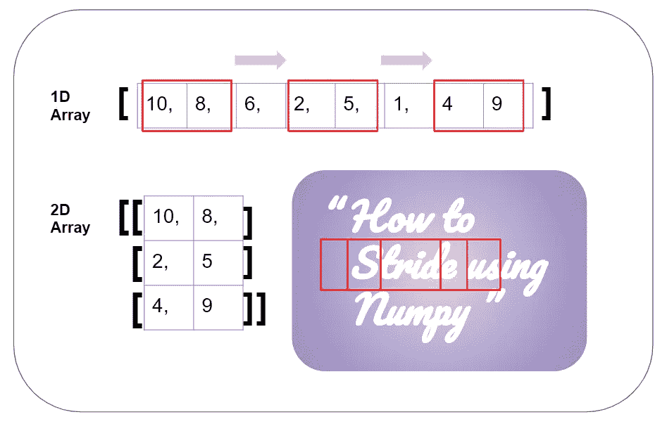
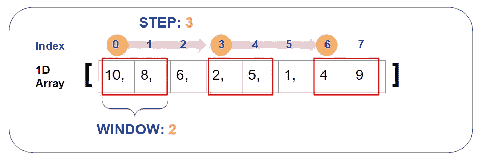
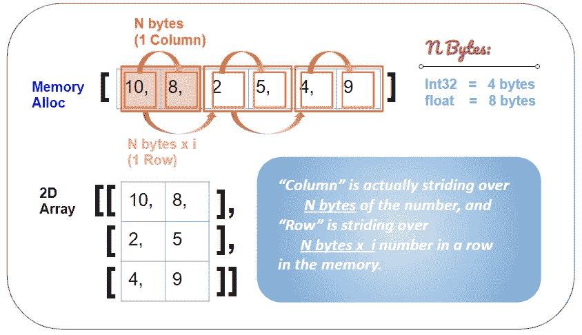
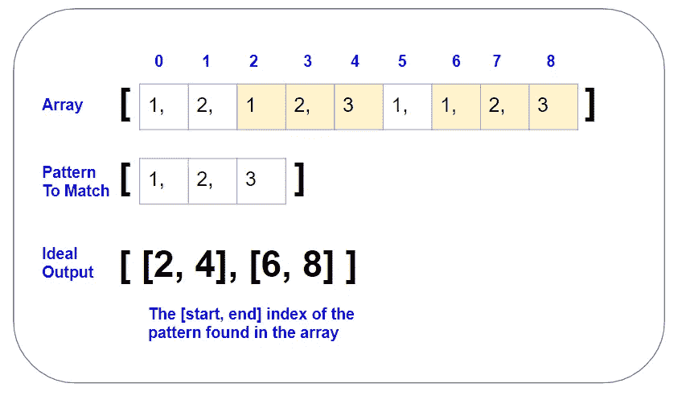

# 深入理解 Numpy 步长及其在数据处理中的应用

> 原文：<https://medium.com/analytics-vidhya/a-thorough-understanding-of-numpy-strides-and-its-application-in-data-processing-e40eab1c82fe?source=collection_archive---------5----------------------->



**大步走**就像在数据中以给定的窗口大小迈步。这是一种非常常见的技术，你会在各种数据处理任务中看到。本教程将介绍 Stride 的最基本概念，以及如何在 Numpy 中使用它，最后以一个 Pandas dataframe 数据处理用例结束。

简单地说，你将被介绍:

1.  **什么**是跨步？
2.  **一个 Numpy 2D 数组的数据结构**，就其内存分配而言
3.  **如何在 Numpy 数组上**跨步:
    “Numpy . lib . stride _ tricks . as _ strided()”的用法
4.  数据处理中一个有用的**用例**:
    *如何在一个序列中匹配一个模式，并使用 Striding 返回起始和结束索引？*

# 什么是 Stride？

打个简单的比方，大步走就像在固定大小的窗口中在数据中迈步。考虑 8 个数的 1D 数组(即[10，8，6，2，5，1，4，9])，红框每次看 2 个数( **window = 2** )，然后从当前开始位置 ***i*** 滑动到 ***i+3*** 位置( **step = 3** )。



图一。步长和窗口的基本概念

对于数组中的 N 个元素，给定窗口大小(W)和步长(S)，它将滑动多次:( **(N-W) // S) + 1** 在我们的示例中，它是((8–2)//3)+1 = 3 次。

(注意:这里的符号“//”是一个 Python 除法符号，用于将商向下舍入为整数。比如 4 // 2 是 2，5 // 2 也是 2。)

# Numpy 2D 数组的数据结构

作为人类，我们有 2D 数组的概念——我们想把 2D 数组想象成一个表状结构，它有 ***i*** 列和 ***j*** 行。然而，内存中的 2D 数组是一个连续的块，就像一维数组一样。它会一行接一行地存储，一列接一列地存储，如图所示:



图二。如何计算步幅的字节数

图中每一个' ***方块'*** 都是*中 ***1 号*** 元素所需的内存空间，其所需空间取决于你为数组初始化的数据类型。因此，对于“int32”数据类型，内存块中的平方等于 4 个字节，对于“float”数据类型，内存块中的平方等于 8 个字节，这个“单位块”将告诉机器在内存空间中为“下一个数字”(下一列)前进多少。*

*让我们看看数字 1D 阵列:*

```
*import numpy as npx = np.array([10, 8, 2, 5, 4, 9], dtype='int32')
x.shape
>> (6,)
x.strides
>> (4,)x = np.array([10, 8, 2, 5, 4, 9], dtype='float')
x.shape
>> (6,)
x.strides
>> (8,)*
```

*由于 ***x*** 是一个 1D 数组，其形状为 ***(i，)*** 其中 *i* 是数组中元素的个数，即我们例子中的 6 个元素，所以形状显示为(6，)。但是，请注意，当数组以不同的数据类型初始化时，即从“int32”到“float”，步长从(4)变为(8)，因为“int32”占用 4 个字节，而“float”占用 8 个字节。它表示对于这个数组，从内存中的第一个位置开始，它需要消耗多少字节才能到达下一个数字，所以这就是我们介绍的**大步**和**窗口**概念——其中 ***窗口*** 是一个数字的 N 字节*，每 ***步*** 它需要跳 ***N*****

**接下来，我们来看看 Numpy 数组:**

```
**x = np.array([[10, 8],[2, 5],[4, 9]], dtype='int32')x
>> array([[10,  8],
          [ 2,  5],
          [ 4,  9]])x.shape    # shape: (Num of row, Num of column)
>> (3, 2)x.strides  # stride: (Bytes per row, Bytes per column)
>> (8, 4)**
```

**这里我们初始化了一个 int32 数据类型的 2D 数组，它有 **3 行**和**两列**，即形状为(3，2)。**

*****注:******形状元组中的第一个数字*** ， ***(i，j)*** ，指的是 ***数组第一层*** 中的元素数。因此，在这个 2D 阵列中，该阵列在第一层中具有 3 个元素(即，子括号)，并且对于第二层的每个子括号，其中有 2 个元素。这样，这个 2D 阵列的**形状**就可以理解为**(#行，#列)**。然而，将 2D 数组可视化为类似表格的结构实际上只是为了便于人类理解。在计算机中，它作为一个 ***顺序块*** 存储在内存中，所以数组的维数可以嵌套，继续扩展。这样，你就可以随心所欲地拥有 N 维的 N 维数组*。***

***好了，现在我们打印`x.strides`，你会发现是 ***(8，4)*** ，这是意料之中的，因为:***

*   ****形状**读作*(****行*** *，* ***列*** *)***
*   ****大踏步**读作(#大踏步一列 ***行*** ，#大踏步一列*)***

***步幅 ***步*** 由 ***字节*** 测量。因此，要跳转到下一个 ***行*** ，就需要跳转 **1 整数(4 字节)x 2 = 8** **字节**，而要跳转到下一个 ***列*** ，就正好是 **1 整数= 4 字节**，这样我们就得到了(8，4)。***

# **如何在数字阵列中大步前进**

**好了，现在我们已经介绍了“什么是跨距”以及“数组实际上是如何在内存空间中跨越字节的”。现在我们想知道如何在 Numpy 数组中实现这一点。如果给我们一个 1-D 数组，并希望大步走向某个窗口和步骤，然后像这样构造一个新的 2-D 数组:**

****

**这里，我们将使用一个 Numpy [函数](https://numpy.org/doc/stable/reference/generated/numpy.lib.stride_tricks.as_strided.html#numpy-lib-stride-tricks-as-strided)，它将允许您访问内存块中的数组(就像一个指针)，然后允许您在内存空间中大步前进:**

> ****numpy . lib . Stride _ tricks . as _ strided(Arr，New_arr_shape，Stride_steps )****

**该函数有 3 个主要参数:**

*   ****数组:**这是你要跨步的原始数组。在我们的例子中，它是一个包含 8 个整数的一维数组。**
*   ****新数组形状:**这是输出数组的预期形状(跨步后)。在我们的示例中，它是新的二维数组的形状，该数组应该有 3 行 2 列，因此 shape 应该是(3，2)。
    (回到 ***“什么是跨步”一节图 1*** 进行图解。)**
*   ****步幅步数:**这是以字节计量的步幅大小。在我们的例子中，我们想跳过数组中的 3 个索引，每个索引都是一个整数(4 个字节)，因此对于第**行**的步幅步长来说 **3*4 = 12** 个字节。对于该列，下一个整数距离 **4 个字节**，因此**列的步幅为**。因此，在我们的例子中，步长是(12，4)。
    (回到 ***“什么是跨步”一节图 2*** 进行图解。)**

```
**x = np.array([10,8,6,2,5,1,4,9], dtype='int32')x.shape        # The shape is a 1D array of 8 'int32' numbers
>> (8,)x[0].nbytes    # Each 'int32' occupied 4 bytes   (32 bits/8=4 bytes)
>> 4y = np.lib.stride_tricks.as_strided(x,((8-2)//3+1,2),(3*4,4))y
>> array([[10,  8],
          [ 2,  5],
          [ 4,  9]])**
```

****

****！重要！**需要注意的一点是:当使用这个函数时，你需要准确地知道“你每一步跨了多少字节”，因为这个函数不检查数组的边界。因此，如果你打乱了大步走的窗口或步骤，你最终会从你的记忆中获得随机数据。举个例子，让我在 windows=2 的情况下跨越 **7** 个整数，而我的数组只有 8 个整数。**

```
**x = np.array([10,8,6,2,5,1,4,9], dtype='int32')
y = np.lib.stride_tricks.as_strided(x,(8-2)//3+1,2),(**7***4,4))y
>> array([[10, 8],
          [9,  **0**],                   # The last 3 numbers are the
          [**1599227219**, **1380275029**])  # random data in the memory**
```

****

**当然，你也不希望硬编码这些字节，一步一步地走。这只是为了演示的目的。您可以使代码更加通用。**

```
**x = np.array([10,8,6,2,5,1,4,9], dtype='int32')total_len_x = x.shape[-1]
window = 2       # The red box only looks for 2 numbers
steps = 3        # The red box jump over 3 numbers each time
new_shape_row = (total_len_x - window)//steps + 1
new_shape_col = window
new_shape = (new_shape_row, new_shape_col)n_bytes = x.strides[-1]    # Since x.strides tells you how many
                           # bytes Numpy array travels to get the  
                           # next number in the array, so it equals 
                           # to x[0].nbytes.stride_steps_row = n_bytes * steps
stride_steps_col = n_bytes
stride_steps = (stride_steps_row, stride_steps_col)y = np.lib.stride_tricks.as_strided(x, new_shape, stride_steps)**
```

# **Stride 在数组模式匹配中的应用**

**假设我们有一个这样的问题要解决:**

****

**解决这个问题的一个方法是使用`np.lib.stride_tricks.as_stride()`在步骤 1 中前进，窗口为 3(即模式的长度)，然后将每个数据块与模式进行比较。例如，stride 将返回[[1，2，1]，[2，1，2]，[1，2，3]，[2，3，1]，…]，然后我们可以将这些长度为 3 的数据单元大小与我们的目标模式进行比较。首先，让我们将上面提到的代码打包成一个函数:**

```
**def **return_striding_content**(arr, window, stride):
    new_shape_row = (arr.shape[-1] - window)//stride + 1
    new_shape_col = window
    new_shape = (new_shape_row, new_shape_col) n_bytes = x.strides[-1]
    stride_steps_row = n_bytes * stride
    stride_step_col = n_bytes
    stride_steps = (stride_steps_row, stride_step_col) return np.lib.stride_tricks.as_strided(arr, new_shape, stride_steps)# Construct the array
x = np.array([1,2,1,2,3,1,1,2,3], dtype='int32')# Construct the sliding content
return_striding_content(x, 3, 1)
>> array([[1, 2, 1],
          [2, 1, 2],
          [1, 2, 3],
          [2, 3, 1],
          [3, 1, 1],
          [1, 1, 2],
          [1, 2, 3]])**
```

**然后，我们将由`return_striding_content(x,3,1)`返回的每个跨步内容与模式`y`进行比较。**

```
**p = [1,2,3]compare = (return_striding_content(x,3,1) == p).all(axis=1)compare
>> array([False, False,  True, False, False, False,  True])**
```

**请注意，我们需要`.all()`函数来对整个数组进行比较，因此显然来自`return_striding_content()`的整个数组与`p`数组不同，也就是说，毕竟它们甚至没有相同的维度。所以，这就是为什么我们需要指定`axis`。如果 axis=0，它将比较垂直元素，如果 axis=1，它将比较水平元素[参见这个有用的[博客](https://www.sharpsightlabs.com/blog/numpy-axes-explained/#:~:text=NumPy%20axes%20are%20the%20directions,along%20the%20rows%20and%20columns.) ]。您可以看到，结果显示第 3 和第 7 个元素是我们要查找的模式，这对应于原始数组`x`中模式开始位置的起始索引。因此，给定模式的固定窗口，模式结束的结束索引将简单地是“开始索引+ 2”。**

```
**[([i, i+2]) for i in np.where(compare==True)[-1]]
>> [[2,4], [6,8]]**
```

**注意:在`np.where()`之后应用的[-1]实际上只是从返回结果的元组结构中提取数据。你可以试着打印出`np.where(compare==True)`来看看返回的结果是什么。**

# **参考**

**[1]IPython Interactive Computing and Visualization Cookbook，第二版(2018)，作者[Cyrille Rossant](http://cyrille.rossant.net/):
[https://IPython-books . github . io/46-using-stride-tricks-with-numpy/](https://ipython-books.github.io/46-using-stride-tricks-with-numpy/)**

**就是这样！希望你喜欢这篇关于如何使用 striding 的介绍以及如何使用 Numpy 的教程。如果你觉得这个帖子有用，请给这个帖子留个“拍手”吧！也欢迎你留下你的想法、评论或反馈！感谢您的阅读！**