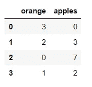
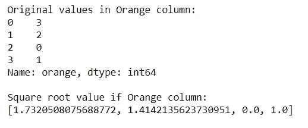
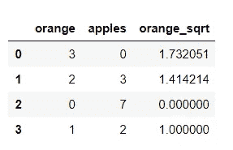
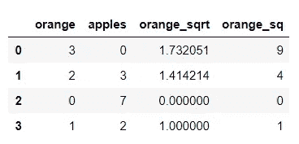

# Python 提示-熊猫应用函数

> 原文：<https://medium.com/analytics-vidhya/a-tip-a-day-python-tip-3-pandas-apply-function-dev-skrol-b71ba20468a7?source=collection_archive---------17----------------------->

> *Apply function 将一个函数作为参数，并在数据帧的所有元素中执行该函数。*

例如，如果我们要创建一个新列，它是另一列值的平方根，或者应用一个复杂函数并组合一个或多个列，或者在使用现有特征创建新特征以进行特征工程时。

> *语法:df.apply(func，axis=0，broadcast=None，raw=False，reduce=None，result_type=None，args=()，**kwds)*

熊猫系列。

func-λ函数或正常函数

轴-0-默认为行，1-列

```
import pandas as pd 
import numpy as np
```

让我们用一个例子来试试。

```
fruit = { 'orange' : [3,2,0,1], 'apples' : [0,3,7,2] } 
df = pd.DataFrame(fruit) 
df
```

输出:



例如，我们需要通过对另一列求平方根来创建一个新的序列。下面的代码可以做到这一点。

```
lst= [] 
print("Original values in Orange column:") 
print(df['orange']) 
for i in df['orange']: 
    lst.append(np.sqrt(i)) print("Square root value if Orange column:") 
print(lst)
```

输出:



# 应用功能简化了这一过程。

```
df['orange_sqrt'] = df['orange'].apply(np.sqrt) 
df
```

输出:



我们用更少的代码实现了同样的功能。

# 使用 Lambda 函数:

```
df['orange_sq'] = df['orange'].apply(lambda x: x*x) 
df
```

输出:



今天我们学习了应用函数。

希望你现在对实践我们所学的东西感到兴奋。

我们将看到 Python 中的一个新技巧。谢谢大家！👍

喜欢支持？只要点击拍手图标❤️.

编程快乐！🎈

*原载于 2020 年 10 月 17 日*[](https://devskrol.com/index.php/2020/10/17/a-tip-a-day-python-tip-3-pandas-apply-function/)**。**