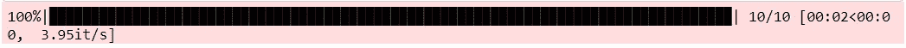
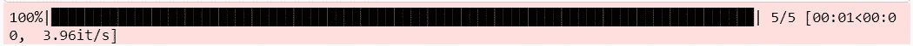
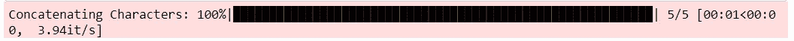

# Python 提示-使用 TQDM 显示进度条

> 原文：<https://medium.com/analytics-vidhya/a-tip-a-day-python-tip-4-show-progress-bar-using-tqdm-b8a6b997e0b6?source=collection_archive---------26----------------------->


盖尔·马塞尔在 Unsplash 上拍摄的照片

在 for 循环中执行复杂函数时，你是否希望在 Jupyter Notebook 中看到进度条？

在 Python 中是可能的。

有一个 tqdm 包允许我们显示进度条。使用起来也很简单！！！

同时使用函数 tqdm 来实现围绕 iterable 对象的 for 循环，以显示 for 循环执行的进度。

让我们看看怎么做。

由于我们将使用 range()对 10 个数字进行简单的 for 循环，所以让我们使用 sleep 方法来减慢这个过程。这样我们就可以看到进度条的使用。

```
from tqdm import tqdm 
from time import sleepsum = 0 
for i in tqdm(range(10)): 
    sum = sum + i 
    sleep(0.25)
```



列表对象的另一个例子:

```
st = '' 
for char in tqdm(['a', 'b', 'c', 'd', 'e']): 
    sleep(0.25) 
    st = st + char
```



向进度条添加描述:

```
st = '' 
for char in tqdm(['a', 'b', 'c', 'd', 'e'], desc = 'Concatenating Characters'): 
    sleep(0.25) 
    st = st + char
```



希望你喜欢学习。

关于使用 tqdm 和定制进度条的更多信息，请参考他们的文档([https://tqdm.github.io/](https://tqdm.github.io/)，[https://github.com/tqdm/tqdm](https://github.com/tqdm/tqdm))。

我们将看到 Python 中的一个新技巧。谢谢大家！👍

喜欢支持？只要点击拍手图标❤️.

编程快乐！🎈

*原载于 2020 年 10 月 17 日*[](https://devskrol.com/index.php/2020/10/18/a-tip-a-day-python-tip-4-show-progress-bar-using-tqdm/)**。**