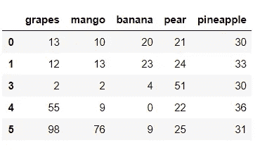
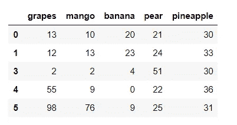

# Python 提示-熊猫连接和追加

> 原文：<https://medium.com/analytics-vidhya/a-tip-a-day-python-tip-5-pandas-concat-append-dev-skrol-18e4950cc8cc?source=collection_archive---------0----------------------->

在本文中，我们将学习 Concat & Append 以及这两个函数之间的比较。


串联与附加—按作者排列的图像

```
import pandas as pd
```

让我们拿两个水果的数据框。

```
fruit = { 'orange' : [3,2,0,1], 'apple' : [0,3,7,2], 'grapes' : [7,14,6,15] } 
df1 = pd.DataFrame(fruit) 
df1
```

输出:


作者图片

```
fruit = { 'grapes' : [13,12,10,2,55,98], 'mango' : [10,13,17,2,9,76], 'banana' : [20,23,27,4,0,9], 'pear' : [21,24,28,51,22,25], 'pineapple' : [30,33,38,30,36,31] } 
df2 = pd.DataFrame(fruit) 
df2
```

输出:


作者图片

```
df2 = df2.drop(df2.index[2]) 
df2
```

输出:



作者图片

# 串联

Concat 函数将主参数“objs”作为一组对象。

另一个关键的论点是轴。

如果两个数据帧都包含具有相同索引的行，则将保留这两个行，而不对索引进行任何更改或重置。

```
pd.concat((df1, df2), axis = 0)
```

输出:


作者图片

如果 axis = 1，则按列连接。如果没有相同索引的可用数据，则将填充 NaN。

例如，第二数据帧 df2 不包含索引为 2 的记录。因此，在串联之后，df2 的记录对于索引 2 的记录将具有 NaN，因为 df1 具有索引 2 的记录。

如果两个数据帧包含相同的列，则两个列都将被保留，而列名没有任何变化。

```
pd.concat((df1, df2), axis = 1)
```

输出:


作者图片

# 附加

Append 是 concat 的特例，它将第二个数据帧的记录连接在第一个数据帧的末尾。

Append 没有轴参数。

Append 的语法不同于 Concat。Append 将调用数据帧视为主对象，并将作为参数传递给函数的数据帧中的行添加到该数据帧中。

如果任何数据帧包含调用数据帧中不存在的新列，则它将被添加为新列

> ***语法:****data frame . append(other，ignore_index=False，verify_integrity=False，sort=False)*

```
df1
```

输出:


作者图片

```
df2
```

输出:



作者图片

```
df1.append(df2)
```

输出:


作者图片

# 性能:pandas concat 和 append 哪个更快？

嗯，两者几乎一样快。

然而，根据数据的不同，可能会有细微的变化。

1.  Append 函数将第二数据帧的行逐个迭代地添加到第一数据帧。Concat 函数将执行单个操作来完成作业，这使得它比 append()更快。
2.  由于追加将一个接一个地添加行，如果数据帧非常小，那么追加操作是好的，因为对于第二个数据帧中的行数，只进行几次追加。
3.  Append 函数将创建一个新的结果数据帧，而不是修改现有的数据帧。由于这种缓冲和创建过程，Append 操作的性能不如 concat()函数。但是，如果追加操作的次数很少，Append()就很好。如果需要多个追加操作，最好使用 concat()。

```
%%time
df = pd.DataFrame(columns=['A'])
for i in range(30):
    df = df.append({'A': i*2}, ignore_index=True)
```

墙壁时间:51.4 毫秒

```
%%time
df = pd.concat([pd.DataFrame([i*2], columns=['A']) for i in range(30)], ignore_index=True)
```

墙壁时间:9.93 毫秒

这些是 Concat & Append 函数的主要区别。

我们将看到 Python 中的一个新技巧。谢谢大家！👍

喜欢支持？只要点击拍手图标❤️.

编程快乐！🎈

*原载于 2020 年 10 月 19 日*[*【https://devskrol.com】*](https://devskrol.com/index.php/2020/10/20/a-tip-a-day-python-tip-5-pandas-concat-append/)*。*