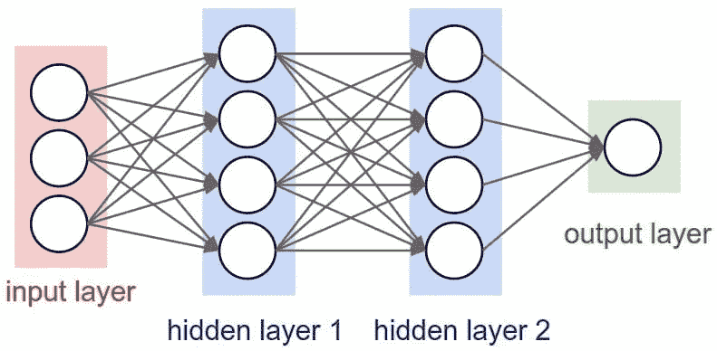
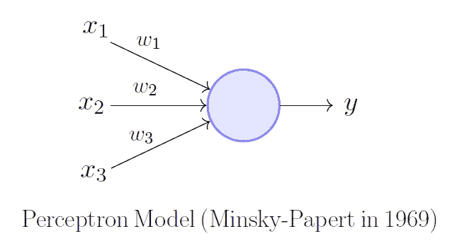
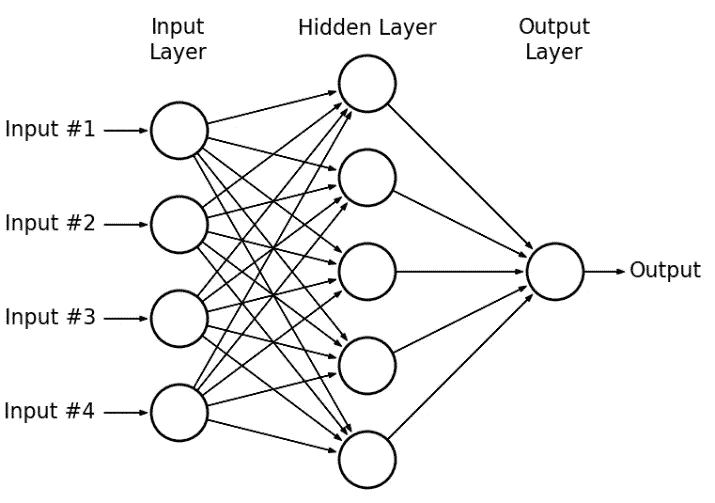
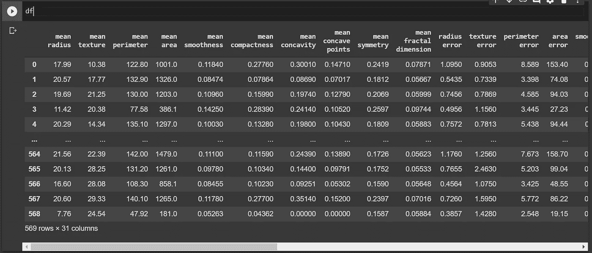
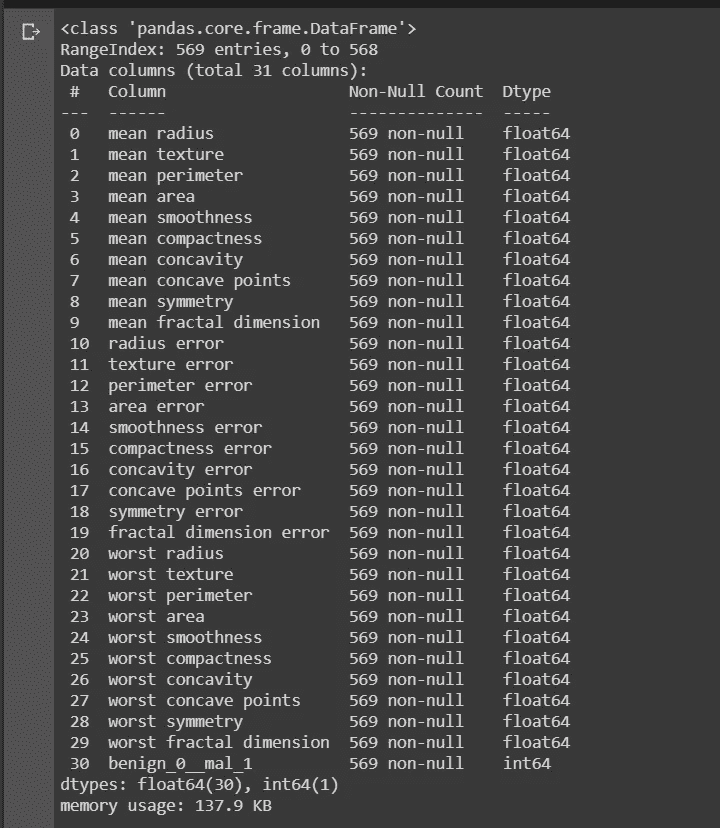
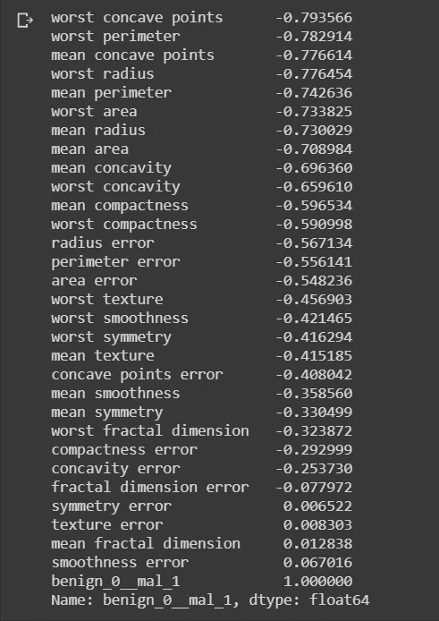
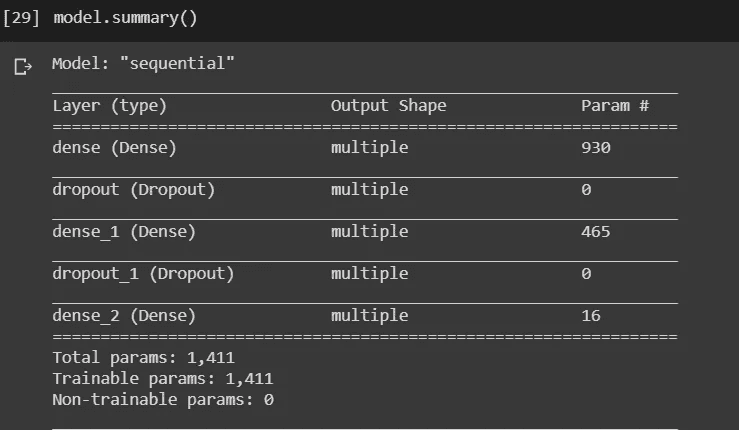

# 人工神经网络(ANN)基础知识(理论与实践)

> 原文：<https://medium.com/analytics-vidhya/a-to-z-about-artificial-neural-networks-ann-theory-n-hands-on-713c12f3351e?source=collection_archive---------7----------------------->



在这篇博客中，我将让你了解人工神经网络的一切。

我们将深入理论，并用人工神经网络模型解决一个问题。

**人工神经网络** ( **安**)是由构成动物[大脑](https://en.wikipedia.org/wiki/Brain)的[生物神经网络](https://en.wikipedia.org/wiki/Biological_neural_network)模糊启发的计算系统。这种系统通过考虑例子来“学习”执行任务，通常没有用特定于任务的规则来编程。例如，在[图像识别](https://en.wikipedia.org/wiki/Image_recognition)中，他们可能会通过分析已被手动标记为“猫”或“没有猫”的示例图像，并使用结果来识别其他图像中的猫，来学习识别包含猫的图像。

# **感知器模型**

感知器模型是 1958 年由 Frank Rosenblatt 引入的一种神经网络形式。**感知器是单层神经网络** *和* ***多层感知器*** *被称为* ***神经网络。***

感知器是一个**线性分类器**(二进制)。此外，它还用于监督学习。它有助于对给定的输入数据进行分类。



如果 f(y)只是一个和，那么 y=x1w1+x2w2+x3w3。

但是单个感知机不足以学习复杂的系统。幸运的是，我们需要扩展单个感知器，创建一个多层感知器模型。我们还将介绍激活函数的概念。

为了建立一个感知器网络，我们可以使用多层感知器模型连接多层感知器。



**输入层-** 从数据集中接收输入数据。

**输出层**(也可以不止一个)——给出输出作为模型的预测。

**隐藏层-** 输入和输出层之间的任何层。

# **激活功能**

它用于设置以下总输出值的边界:

x*w+b

我们也可以表述为:

z=x*w+b

然后将 z 传递给某个激活函数来限制它的值。请记住，您会发现变量 f(z)或 X 表示由多个值组成的张量输入。

**Sigmoid**——Sigmoid 功能适用于具有 0 或 1 的输出。

**校正线性单元(ReLu)** - ReLu 已经被发现具有非常好的性能，尤其是在处理消失梯度的问题时。它总是被用作缺省值，因为它具有总体良好的性能。

# **成本函数**

成本函数总是被称为损失函数。我们可以在培训期间跟踪我们的损失/成本，以监控网络性能。一个**成本函数**是一个**神经网络**相对于它的给定训练样本和预期输出“有多好”的度量。它还可能取决于权重和偏差等变量。一个**成本函数**是一个单值，而不是一个向量，因为它评定了**神经网络**作为一个整体做得有多好。

# 反向传播

反向传播是神经网络训练的本质。这是一种基于前一个时期(即迭代)获得的错误率微调神经网络权重的方法。通过适当调整权重，您可以降低错误率，并通过提高模型的泛化能力来提高模型的可靠性。

反向传播是“误差反向传播”的简称这是训练人工神经网络的标准方法。这种方法有助于计算损失函数相对于网络中所有权重的梯度。

# 为什么我们需要反向传播？

反向传播最突出的优点是:

*   反向传播快速、简单且易于编程
*   除了输入的数量之外，它没有要调整的参数
*   这是一种灵活的方法，因为它不需要关于网络的先验知识
*   这是一种标准方法，通常效果很好
*   不需要特别提及要学习的功能的特征。

# 脱落层

丢弃指的是在随机选择的某一组神经元的训练阶段忽略单元(即神经元)。通过“忽略”，我的意思是在特定的向前或向后传递期间不考虑这些单元。

更技术性地，在每个训练阶段，单个节点或者以概率 *1-p* 退出网络，或者以概率 *p* 保留，从而留下简化的网络；被删除节点的输入和输出边也被删除。

# 为什么我们需要辍学？

这个问题的答案用一句话来说就是数据集的**“防止过播”**。

# 密码

现在让我们转向我用人工神经网络让你们更加了解人工神经网络(ANN)及其工作的项目。

**项目名称** —使用人工神经网络的乳腺癌分类器。

**使用的数据集**-[https://archive . ics . UCI . edu/ml/datasets/Breast+Cancer+Wisconsin+(诊断)](https://archive.ics.uci.edu/ml/datasets/Breast+Cancer+Wisconsin+(Diagnostic))

**该项目的 GitHub 库—** [**点击这里**](https://github.com/Shreyakkk/Breast-Cancer)

**第一步**。导入必要的库

```
#Import necessary libraries
import pandas as pd
import numpy as np
import seaborn as sns
import matplotlib.pyplot as plt
import tensorflow as tf
from tensorflow.keras.models import Sequential
from tensorflow.keras.layers import Dense, Activation,Dropout
from tensorflow.keras.callbacks import EarlyStopping
from sklearn.model_selection import train_test_split
from sklearn.metrics import classification_report,confusion_matrix
```

**第二步**。加载你的数据集——这里我有 **CSV** 数据集。我用熊猫来装在我的可乐里。

```
df = pd.read_csv(‘cancer_classification.csv’)
df
```



**第三步**。检查数据集的**信息**。

```
df.info()
```



**第四步**。检查**相关性**

```
df.corr()['benign_0__mal_1'].sort_values(ascending = True)
```



**第五步**。将数据集分为 X 和 y

```
X = df.drop(‘benign_0__mal_1’,axis=1).values
y = df[‘benign_0__mal_1’].values
```

这里 X 拥有除了**良性 _ 0 _ _ 恶性 _1"* 之外的所有特征*

***y 有*“良性 _ 0 _ _ 恶性 _1”。****

*****第六步**。将数据集分成**训练**和**测试*****

```
***X_train, X_test, y_train, y_test = train_test_split(X,y,test_size=0.25,random_state=101)***
```

*****第七步**。应用一些**预处理**以使模型更加**精确。*****

```
***from sklearn.preprocessing import MinMaxScaler
scaler=MinMaxScaler()
scaler.fit(X_train)***
```

*****第八步**。**变换**你在 X 和 y 上分配的数据。***

```
***X_train=scaler.transform(X_train)
X_test=scaler.transform(X_test)***
```

*****第九步**。得到数据集的**形状**，这将帮助我们为密集层制作拍摄单元。***

```
***X_train.shape***
```

***这里数据集的形状是 **(426，30)*****

*****第十步**。让我们建立我们的 **ANN 模型**。这里我们分别使用 30、15 和 1 个单位的 3 个密集层。第一层是 30，因为 X_train 的形状是 30，最后一层的单位是 1。因为只有一个类分类器。***

```
***model = Sequential()model.add(Dense(units=30,activation=’relu’))model.add(Dropout(0.5))model.add(Dense(units=15,activation=’relu’))model.add(Dropout(0.5))model.add(Dense(units=1,activation=’sigmoid’))model.compile(loss=’binary_crossentropy’, optimizer=’adam’)***
```

*****车型总结。*****

******

*****第十一步**。对纪元应用提前停止。***

```
***early_stop = EarlyStopping(monitor=’val_loss’, mode=’min’, verbose=1, patience=25)***
```

*****第十二步**。**将**数据集拟合到**人工神经网络模型**。***

```
***model.fit(x=X_train,y=y_train,epochs=600,validation_data=(X_test, y_test), verbose=1,callbacks=[early_stop])***
```

*****第十三步**。从模型中取出**预测**。***

```
***predictions = model.predict_classes(X_test)***
```

*****第十四步**。得到模型的**精度**。***

```
***import sklearn.metrics as metrics
print(“Accuracy: ({0:.4f})”.format(metrics.accuracy_score(y_test,predictions)))***
```

*****精度:(0.9790)*****

***所以我们的准确率是 97.90 %，这是非常好的。您可以将其他神经网络应用于相同的数据集和**评论/响应**您的准确性和经验如下。***

***所以在这个简单的项目中，我想展示一些实际操作的人工神经网络，并告诉你它是如何工作的。***

***我希望你喜欢这个博客。订阅我的媒体账户。我发布与数据科学、机器学习、Python 和深度学习相关的博客。***

****欢迎在评论区分享你的想法，也可以和我联系:-
Linkedin—*[*https://www.linkedin.com/in/shreyak007/*](https://www.linkedin.com/in/shreyak007/) *Github—*[*https://github.com/Shreyakkk*](https://github.com/Shreyakkk) *Twitter—*[*https://twitter.com/Shreyakkkk*](https://twitter.com/Shreyakkkk) *insta gram—*[*https://www.instagram.com/shreyakkk/*](https://www.instagram.com/shreyakkk/) *snap****

***谢谢大家！***