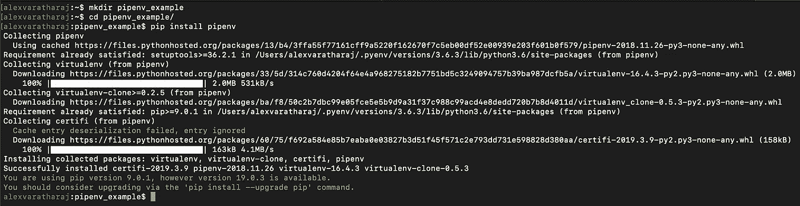
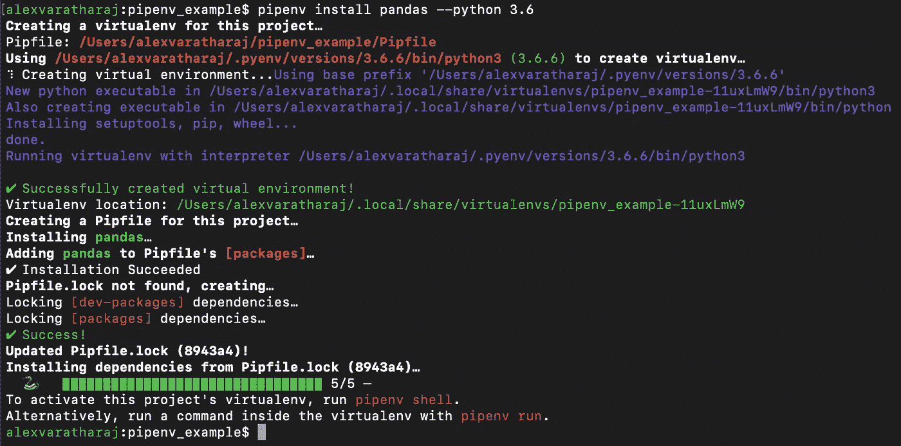
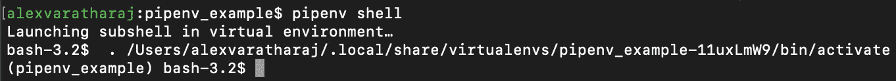
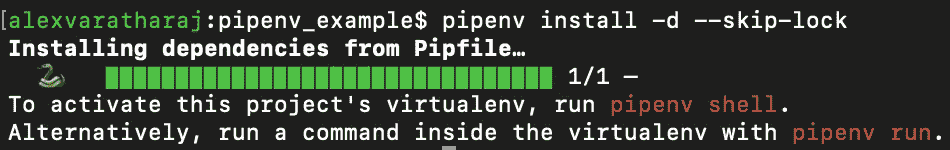
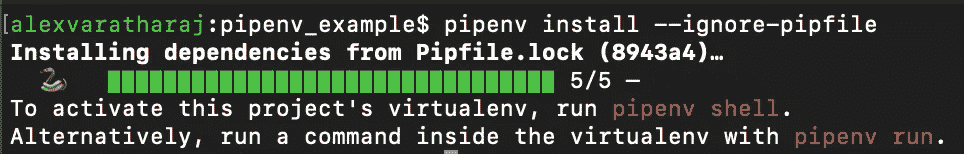
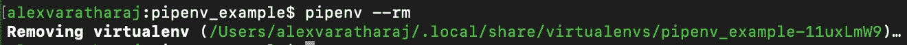

# Pipenv:所有 Python 开发人员都应该使用的工具

> 原文：<https://medium.com/analytics-vidhya/a-tool-all-python-developers-should-be-using-5d547bfb45b7?source=collection_archive---------0----------------------->

这篇文章讲述了我第一次使用 pipenv 作为包管理器，并使用其虚拟环境进行测试，从空白画布到生产就绪代码的经历。

我想先打个比方。我想让你想象你在一家餐馆当服务员，厨师说“今天我们将把这顿饭的各种成分放在单独的盘子里”。

饭菜越复杂，你要端上顾客餐桌的盘子就越多。

你听到铃声，服务开始了，但是饭菜的组成部分在不同的时间出来，以及不同的桌子点同样的饭菜。此外，你必须确保它正确地到达顾客手中，满足顾客的偏好(例如，牛排五分熟)……听起来像一场噩梦，对吗？

如果你把这顿饭的组成部分想象成 Python 包，把不同的桌子想象成虚拟环境，把偏好想象成依赖关系的特定版本，那么我们就可以开始看到这些场景有多么相似了。就算这顿饭“解决”了，你还会留小费吗？

作为 Python 开发者，我们应该专注于这一点……用 Python 开发。

Scala 有 SBT，Ruby 有 RubyGems，C#有 NuGet，不胜枚举。

当然，我们可以将 pip 与 virtualenv/pyenv 一起使用，它们是很好的工具，但是它们可能很复杂，尤其是如果你没有使用它们的经验。

如果只是将目录更改为不同的项目，并让 virtualenv 准备就绪，而不必为该项目激活正确的目录，这不是很好吗？

> “启动一个 pipenv 项目就像送走一整包 Tunnock 的焦糖薄饼一样容易”——*亚历克斯·瓦拉塔拉贾*

转到终端，为您的项目创建一个新目录:

然后做一个`pip install pipenv`然后`pipenv install pandas --python 3.6`，几秒钟内你就已经创建了一个带有 Python 3.6 虚拟环境的项目，准备开始工作了。

您可以使用`pipenv shell`直接访问您的虚拟环境:

键入“exit”以离开虚拟环境

或者您可以使用`pipenv run <your program>`在虚拟环境中运行程序

Pipenv 创建 Pipfile 和 Pipfile.lock 文件，替换 requirements.txt，这是管理依赖关系的地方。您将需要检查 Pipfile.lock 以进行确定性构建的版本控制，同时使用 Pipfile 进行抽象开发。

在虚拟环境中安装依赖项时`pipenv install -d --skip-lock`(用于本地开发)

而`pipenv install --ignore-pipefile`(制作用)会是你的朋友。

显然，根据项目的不同，您需要的不仅仅是 Pipfile 和 Pipfile.lock，因为 setup.py 仍然是包分发所必需的。

在最近一次需要快速上市的特性交付中，我的团队认为这是测试这种新方法的合适时机。

事实证明，这种风险让我们在创业和尽快获得 MVP 的过程中变得更加容易。使用这个设置，再添加一些东西，我们就有了一个婴儿骨架，可以让我们的数据科学团队开始工作了。

其中一个主要目标是有一个 cookiecutter，这样我们可以快速开始新的项目，整个团队可以从同一个点开始，具有相同的依赖关系。而不必担心处于正确的虚拟环境中，跟踪新的依赖关系，以及固定用于项目的依赖关系(与使用 requirements.txt 不同)。

Pipenv 的一个伟大之处在于它创建了一个虚拟环境，可以通过哈希来跟踪。Pipenv 还支持不同的 python 版本，如果您想在多个 Python 版本上测试您的代码，它与 Tox 兼容。

然后 Pytest 就变得很简单，只需从项目目录中键入`pipenv run pytest`，它就会在一个虚拟环境中运行您的测试，并且包含您安装的所有依赖项。

有多少次你运行一个程序让你看到一个错误`E ModuleNotFoundError: No module named '<x>’`让你检查你是否在正确的虚拟环境中或者需要安装模块等等。

时间可以被更好地利用。

也就是说，如果您决定更改项目中文件夹的名称和结构，您需要删除 virtualenv。这是因为散列是使用文件夹和命名结构创建的(因此 pipenv 总能找到项目的 virtualenv)。

为此，只需使用`pipenv –-rm`:

然后你必须再做一次`pipenv install`来创建一个新的虚拟，如果你只是想重新开始，你也可以这样做。

在生产中，您仍然希望使用固定的依赖关系，使用 Pipenv 的 Pipfile.lock `pipenv install –ignore-pipfile`。这将仅使用先前在开发过程中锁定的工作依赖项进行安装。

看到它让我们变得如此富有成效，我们已经开始将其他项目转移到 Pipenv。

事实上，pipenv 解决了我们在 pytest-cov 中遇到的一个错误，在我们的一个使用 ONZO 内部 PyPI repo 的项目中，模块之间存在依赖性解决问题。

在设置了 Pipfile 中的依赖项并创建了 Pipfile.lock 之后，转换变得相对容易，我们有了一个 Dockerfile，它在我们的 Kubernetes 容器中运行 Pipenv，还有一个 rakefile，它使用 Pipenv for Pytest 运行我们的测试，并使用 Pylint、Flake8 和 Sonar 获得报告。

我已经创建了一个 Cookiecutter(它使用 Jinja 作为模板项目)，我们将在未来的所有基于 Python 的项目中使用它。

该项目正在进行中，是一个用于开发的开源数据科学/R&D 入门套件，包括 Pipenv、Pandas，可以运行 Jupyter 笔记本。它还有一些 Postgres 测试基础设施，带有可以在测试中使用的初始测试模式和表格。

你可以在这里找到它:[https://github.com/onzo-com/python-cookie-cutter-public](https://github.com/onzo-com/python-cookie-cutter-public)