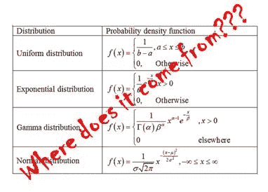
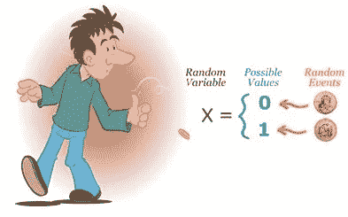
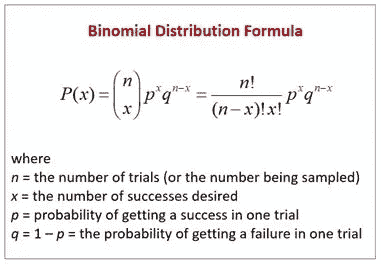
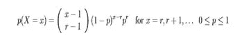
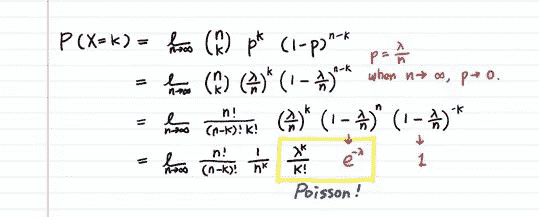
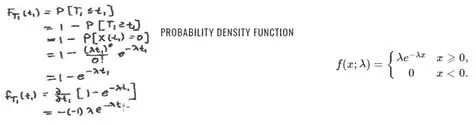
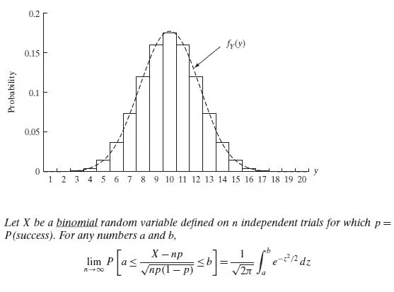
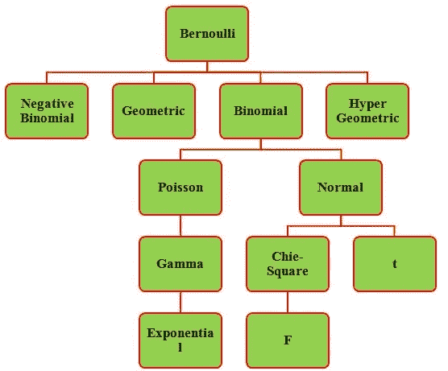

# 连接流行统计分布的旅程…

> 原文：<https://medium.com/analytics-vidhya/a-tour-to-connect-popular-statistical-distributions-cbb6465fa1d8?source=collection_archive---------12----------------------->

假设检验:你知道概率是什么。你已经见过一些发行版了。

尽管我们围绕这些分布所做的数学是相当直接的，但有时你会停下来挠头问这些方程到底是从哪里来的(还记得可怕的正态分布方程吗？)我见过的大多数标准书籍都给出了每个发行版的模块化描述。所以这里有一小部分努力是通过历史的道路把它们联系起来，这样你就可以从中获得更好的直觉。

理想情况下，在跳入分布的深处之前，你需要通过对 ***随机实验、结果、事件、样本空间、基本概率*** 等的了解来确认你的签到。我希望你能允许我跳过这一步，让我们的旅行足够短，不会让你感到疲劳。但是，我将在本文中反复强调的一句话是，**概率分布意味着你将总概率，即 1** (我们肯定会得到的一些结果)**，分布在所有可能的结果**上。现在，说所有的结果都有同等的可能性是不现实的。所以，哪个结果得到多少概率是用一个数学方程来表示的。这个等式就是我们所说的分布。我们的目标是深入了解这些方程是如何出现的。

# 为其他复杂分布设定轨迹的最简单的一个是“伯努利分布”。

让我解释一下，

1.  随机实验:一次试验
2.  **随机变量** (X):实验结果。
3.  可能的结果:{成功，失败} ~{1，0}
4.  可能结果的概率分布:{P(成功)，P(失败)或{P(X=1)，P(X=0)或{P(X=1)，1-P(X=1)}
5.  参数:这是我们在构建发行版之前定义的东西。假设每次独立试验成功的概率是 p. (0
6.  Re-writing ‘Point 4’: Probability Distribution is {p,1-p}
7.  Rewriting ‘Point 6’ in the mathematical equation:
    P(X=x) = p^x * (1-p)^(1-x)
8.  去模糊化“点-7”:P(成功)= P(X=1)..将 x==1 的值代入等式…= 1，类似地，P(故障)= 0

看起来很傻对吗？其实是**不是**。一些真实世界的现象，比如击球手是否会被淘汰出局，可以用这个来模拟。更重要的是，随着我们的展开，我们将看到真实世界的分布是多么复杂。既然基本理论如此直接，为什么这个名字听起来如此沉重？这是以著名的瑞士科学家雅各布·伯努利的名字命名的，他在微积分、统计学等方面有突破性的发现..

## 从伯努利分布我们得到下一个，可能是离散变量最常用的，二项式分布

再次，让我设置背景。

1.  随机实验:n 次独立的伯努利试验
2.  **随机变量** (X):成功次数(es)
3.  可能的结果(x):{0，1，2，…，n}
4.  可能结果的概率分布:P(X=x)，x={0，1，..，n}
5.  参数:伯努利试验的次数即 n
    T27 伯努利试验的参数即 p
6.  数学函数:这是伯努利函数与获得 x 次成功的可能方式(组合)的巧妙结合。
7.  省略数学:…
8.  最终分配:

现在，这个词听起来太数学化了。不是吗？当你展开上面的等式时，它非常接近你在+2 级数学中所做的二项式展开。仅此而已。

二项分布的应用无处不在。就像，在前面的上下文中，投球手在 60 次独立投球中获得的三柱门数量。

准备好对二项式进行微调了吗？在二项式中，我们进行了 n ' **独立**伯努利试验。为了使场景更加真实，这些试验可能不是独立的。(当然，对于一个投球手来说，连续三柱门是非常罕见的。)因此，二项式方程上的小变化产生新的分布，即**超几何**分布。它在产品审计中的**验收抽样**中非常有用。

# 从 n 次伯努利试验中，我们得到了其他分布:

1.  **随机变量**:得到 r 之前的试验次数——成功:**负二项分布**。
2.  **随机变量:**设定点 1 中 r = 1:**几何分布**

负二项式

名字背后的原因仍然是相同的数学相似性。

> **特例**:n 太高~无穷大时，p 太低~0

假设您正在审核一本书以查找拼写错误。现在，这可以被建模为二项式随机实验，其中你进行 n(书中的单词数)独立伯努利试验，即你独立检查 n 个单词，p=Prob(成功)=P(得到一个拼错的单词)。合理地说，n 约为千，p 则相反。在 17 世纪的时代，在没有计算优势的情况下，数学家们不得不尝试他们的技能来计算二项概率。因此，利用二项分布的极限定理，他们提出了一种新的分布，即泊松分布。希望你能在这里把伯努利-二项式-泊松连接起来。

我们现在不讨论极限定理，但是看到所有主要的计数事件(给定时间内道路上的事故数量、战争数量、足球比赛中的进球数量等)是令人惊讶的。)

注: **λ** 成为**参数**，表示事件的**率**，即事件/时间(或空间)的数量。

为什么同一个分布描述如此不同的随机变量？答案是，产生这两组测量值的基本物理条件几乎是相同的，尽管得到的数据表面上看起来可能有所不同。这两种现象都是被称为**泊松模型**的一组数学假设的例子。

著名的法国数学家西米恩·丹尼斯**泊松**(1781–1840)首次完成了上述极限戏法。因此名字如下…

> 泊松产生了许多所谓的复杂分布，我们将会看到。

一旦上述泊松(计数)事件发生，我们仅限于对其发生次数的概率建模。由于不止一个事件按顺序发生，遵循泊松分布，科学家们很快确定了这些事件之间的“**等待时间**”。

> 连续泊松事件之间的间隔长度…

假设一系列满足泊松模型的事件以每单位时间λ的速率发生。让**随机变量** Y 表示连续事件之间的间隔。请注意，我们现在进入了连续空间。y 可以是[0，∞)中的任意一个。所以，现在我们要做一个等式，来表示 Y 在给定范围内的概率。直接得出结论，我们得到的是，

然后呢。你刚刚做了**指数分布**！！！

为了进一步推广指数分布，如果我们将**随机变量**作为第 r 个泊松事件的**等待时间，我们得到另一个分布，称为**伽马**。我们暂时跳过数学部分。**

因此， ***伯努利—二项式—(负二项式，几何)—泊松—指数—伽玛***

> 如果，p~0.5 呢

记住，后二项式所有的分布都是在每个个体试验的 p 趋于 0 的条件下进行的。显然，我想到的下一个问题是，当 n 仍然接近∞，但 p 不在 0 附近时，会发生什么？

18 世纪初，**亚伯拉罕·德莫维尔**证明了对于 n & p~ 0.5 的高值，二项式概率(成功次数:{0，1，…。，n})可以通过“*钟形*曲线下的面积来估算，记为

f(x)=(1/(2*pie)^(0.5))*exp(-x/2)

这个特殊的方程用处不大，因为它只把 p 值限制在 0.5 左右。然而，这将是最流行的发行版的起点，你猜呢？？，是的正态分布。

法国数学家**皮埃尔·西蒙·拉普拉斯**将德谟克利特最初的想法推广到任意 p 的二项式近似，并通过将这一定理纳入他 1812 年有影响力的著作**概率分析理论**中，引起了数学界的充分注意。

数学有点麻烦。然而，要点很简单，即对于非常大的 n，p 的任何值，所需的二项式概率可以通过曲线下的面积来估计，

z = (X-np)/sqrt。(np(1-np)

这是**正态分布**！！！！

由于这是一条连续的曲线，它完美地模拟了许多现实世界的现象。如果你遇到过'**中心极限定理**，你会知道许多其他分布在一些线性变换后收敛到正态。

但是，您可能会注意到，我们还有其他一些高端发行版，如 1。**Chie-Square dis，** 2。 **t-Dist，** 3。**F-距离正态分布本身**。

用一张图概括千言万语…

关于这个或任何有趣的统计学、机器学习问题，请随时联系我。
邮箱:aniruddha.mitra.am@gmail.com
领英:[https://www.linkedin.com/in/aniruddhamitra/](https://www.linkedin.com/in/aniruddhamitra/)