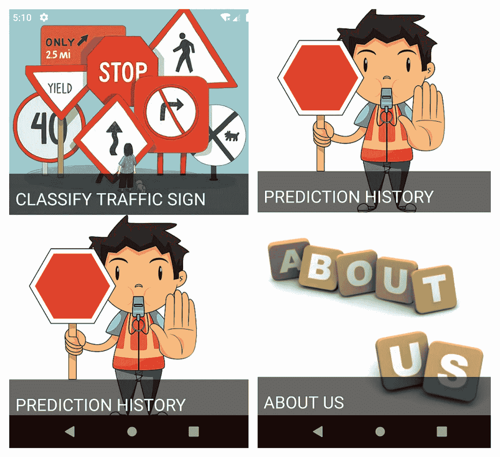

# 交通标志分类器——我的第一个端到端机器学习应用

> 原文：<https://medium.com/analytics-vidhya/a-traffic-signs-classifier-my-first-end-to-end-machine-learning-app-e1376629e05b?source=collection_archive---------9----------------------->

弗兰基·查马基在 [Unsplash](https://unsplash.com?utm_source=medium&utm_medium=referral) 上拍摄的照片

> 这里有一个简短的介绍，以防你还不认识我！(在这种情况下，请在下面留下评论，以便我们现在可以)所以嗯..这里什么都没有..我的职业是软件开发人员，我喜欢挑战自己，喜欢解决大部分的挑战(嘿，我们现在不能解决所有的问题，不是吗？)我现在已经深入研究机器学习和人工智能有一段时间了。我对计算机视觉及其应用非常着迷。如果你想去[看看](https://play.google.com/store/apps/details?id=com.helixcry.grimcry&hl=en_IN)，我确实有一个在安卓应用商店发布的虚拟现实游戏。
> 
> 哦，我还喜欢视频游戏(故事类 mmo 的 rpg 的动作冒险，你可以说出来)，和音乐(从肖邦到活结，当然还有来自视频游戏和动漫的史诗 OST)。

好吧，如果这是另一个逐步指南，它会变得相当陈旧，所以**让我们从这个故事的第一章的结尾开始吧！**

为了保持这种精神，在阅读了大量资料后，我决定开发一个应用程序。熟悉开发和发布 ML 应用程序的端到端过程。

为了让您知道您正在进入的应用程序涉及到以下内容(在后面的文章中会详细解释每个内容):
1 .Tensorflow 卷积神经网络作为对图像输出进行分类的模型(~60 个输出类别)
2。用于处理模型的基于 Flask 的 API 请求用于跨平台应用构建的 flutter 应用将 API 部署到 Heroku 以处理请求。

作为我的第一个端到端但基本的 ML 应用程序，我想创建一个移动应用程序(如果它在移动设备上工作，它应该在任何地方工作)。当我在网上搜索时，最基本的分类器要么包括著名的 MNIST 数据集，要么包括猫狗分类器。因此，经过短暂的辩论和大量的互联网搜索，我登陆了比利时交通标志数据集，并决定着手开发一个交通标志分类器，作为我的第一个应用程序。

下一个合乎逻辑的步骤是决定用于相同目的的框架。我选择了 Tensorflow，因为我以前遇到过它。然后，开始了一遍又一遍地创建和训练模型的看似永恒的过程，以通过评估集结果获得满意的结果。

在模型达到令人满意的结果(> 90%的准确率)后，我终于可以进入下一步了。为应用程序创建前端接口。为此，有很多选项可供选择—

*   一个 Android 应用程序(通过 Android SDK)
*   一个 IOS 应用程序(Swift)
*   Web 应用程序(任何基于 JavaScript 的框架)

**Web 是行不通的**,因为人们需要拍摄交通标志的照片，以便能够在最终产品中识别它们。
接下来介绍了**跨平台应用开发套件的精彩世界，如 Xamarin、React Native 等。**然而，一只科技小鸟引导我找到了一篇关于 Flutter 的文章。flutter 的一些简单而敏捷的设计吸引了我(这绝不是因为 dart 与 java 和 c#在语法上的相似性)。这使得开发过程变得如此之快和有趣！

大约两周后，基本的应用程序完成了。基本应用程序提供了一个干净的菜单和**功能，可以从设备摄像头或图库中拍照，以从 API 服务器获得预测。现在，在进一步向应用程序添加功能之前，我决定是时候将本地 flask API 带到 web 上进行测试了。**

我认为这些步骤到目前为止都很难…..但是作为一线希望，我尝试了一些免费的托管服务。我尝试过的对我有效的两个方法是

1.  PythonAnywhere
2.  赫罗库

尽管 python-anywhere 适用于几乎所有的 flask 应用程序，但这个用例没有实现，Tensorflow 依赖项超出了可用的自由空间。如果你有一个高级帐户，你可以按照网站上的教程在这里部署。Heroku 是这里的救命恩人，一旦你设置好了，它就能使部署过程变得非常简单快捷。

这里有一个应用程序的快速浏览，下面的文章将集中在不同的方面！如果你想让我先写下这个过程的某个特定部分，或者深入研究一下，请告诉我。

你可以在这里找到我的[或者在这里找到我的](https://www.linkedin.com/in/tushar-sharma118/) [github 仓库](https://github.com/Tusharsharma118)！谢谢你花时间通读完。如果你觉得这篇文章有趣，请鼓掌！