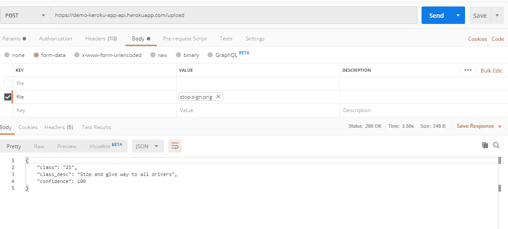

# 交通标志分类器 Flask API

> 原文：<https://medium.com/analytics-vidhya/a-traffic-signs-classifier-the-flask-api-ceb9e34ad415?source=collection_archive---------13----------------------->

最好系好安全带，我们才刚刚开始！


巴特·阿内斯廷在 [Unsplash](https://unsplash.com?utm_source=medium&utm_medium=referral) 上拍摄的照片

> 最终和完善的应用程序将为交通标志的在线和离线分类提供选项。
> 
> 离线分类器应该与 Tensorflow Lite 实现一起很好地工作，而在线部分将使用基于 Flask 的 API 来处理分类任务。

让我们先制作一个具有在线功能的最小可行产品，然后再添加离线功能。如果你想阅读[系列中这篇文章之前的文章，请点击这里](/@tushar.sharma118)。

# 安装烧瓶

既然我们已经准备好了分类模型，我们必须创建一个 API 来处理来自移动应用程序的请求。为此，让我们确保我们的环境中存在 Flask 依赖。如果没有，请使用以下命令进行设置:

```
pip install flask
```

关于安装 flask 和使用虚拟环境的深入指导(强烈推荐)，请参考[官方 flask 指南](https://flask.palletsprojects.com/en/1.1.x/installation/#installation)。

# 构建项目

确保您训练的模型与 API 文件一起出现在根目录中。
创建 API 需要注意一些事项，我们不希望每次发出请求时都要加载模型，不是吗？这将使响应速度极慢。
**那么要确保模型只被加载一次可以做些什么呢？**
我对此使用的解决方案是，一旦服务器解析了 python 文件，就加载模型。这确保了在处理任何请求之前加载模型。

# 创建 API

我们终于有了一步一步的指南，或者让我们避开它，我来解释重要的部分？这里的可以参考[代码库。它绝不是最优的，尤其是在结构上，它肯定可以通过重组来实现。
现在我们已经过了这个阶段，让我们从 API 所需的依赖项或导入开始:](https://github.com/Tusharsharma118/TrafficSignsClassifierApi)

```
import numpy as np
from flask import Flask, request, jsonify, render_template
import tensorflow as tf
import skimage
import math
```

烧瓶依赖关系如下:

*   请求—用于处理传入 API 的请求对象。我们用它来接受应用程序发送的图像文件。
*   json ify——正如所料，它用于创建 JSON 对象，作为我们的 API 对应用程序的响应。
*   Render_Template —一种从 templates 文件夹中获取 html 文件并将其渲染到视口中的方法。它用于为我们的 API 提供一个简单的主页，以防有人试图从 web 浏览器访问它。

使用的其他依赖关系有:

*   skim age——它用于预处理从应用程序接收的图像，然后将其作为预测模型的输入。
*   张量流——它用于在我们的模型中加载和预测。

如果你不熟悉 Flask，在迷失在代码中之前，通过这个简单的例子熟悉一下吧！

# 字典！

过了一会儿，我在网上搜索了一下，在我们的模型中找到了 62 个类中的 59 个，并给它们贴上了标签。结果就是您可以在代码中找到的预测字典。

嘿，如果你碰巧知道这两个类，不要回避拉请求！你可以在这里查阅我的 [kaggle 笔记本上所有课程的图片。](https://www.kaggle.com/tusharsharma118/belgian-traffic-dataset/notebook)

# 接收图像

Flask 中的每个请求对象都有一个名为“files”的属性。如果请求有一个附加文件，它将出现在这个对象数组下。**我们已经确保在发送图像时将密钥定义为“文件”。** 然后，我们可以使用 scikit-Image 的 imread 方法访问并读取图像，如下所示:

```
file = request.files['file']
predict_image = skimage.io.imread(file)
```

# 图像预处理

在开始解析图像之前，我们需要检查图像类型和尺寸。

## 步骤 1:检查不透明的文件类型

如果输入图像是 PNG，它包含一个额外的不透明通道。由于我们的模型期望输入具有三维，我们需要将接收到的图像转换为 RGB。这里 scikit-image 库就派上用场了。它包含了一个将包含不透明度的图像转换为不包含不透明度的图像的方法。你也可以通过删除图像数组的第四维来手动完成，但是为什么要重新发明航天飞机呢？

```
predict_image = skimage.color.rgba2rgb(predict_image)
```

## **第二步:变换图像**

该模型期望输入图像具有[1，128，128，3]
的尺寸，下一步是将图像调整到我们的模型所期望的大小。我们为此使用 resize 方法。

```
predict_image128x128 = skimage.transform.resize(predict_image, (128,      128))
predict_image128x128 = np.array(predict_image128x128)
```

在你开始预测之前，还有最后一步。
通过检查 predict_image128x128 的维度，您可以看到它是[128，128，3]，但该模型需要这样的图像数组作为输入，即输入维度应该是[1，128，128，3]。
因此，用一个新的尺寸填充输入图像，然后你应该准备好在模型上测试图像。

```
predict_image128x128 = np.expand_dims(predict_image128x128, axis=0)
```

# 预测！

现在我们终于可以预测这张图片是关于什么的了！下一个神奇的步骤是将图像传递给模型，并检查它会给我们什么反馈！

```
classes = model.predict(predict_image128x128)
```

output classes 数组应该包含我们模型的 62 个输出类中每一个的置信度值。在更简单的时候，人们会称这个分数代表这个孩子(图像)属于那个家庭(交通标志类)的几率。现在我们所需要的就是找到哪个家族在输出数组中的得分最高。

```
np.argmax(classes) #returns the index of the class with the highest     #                   score
```

# 反应

嘿，这应该是一个 API 吧？在我忘记之前，我们现在需要为 API 准备一个响应。我已经在“prepare_response”方法中做到了这一点。
它接受包含置信度值的“类”数组作为输入。我将响应的结构定义为:

```
{
"class": "41",
"class_desc": "Parking and stopping prohibited",
"confidence": 100
}
```

您将使用 numpy 中的 argmax 方法获得输出类索引。

```
index = np.argmax(classes)
```

**如果模特没有告诉我超人是停车标志，那就太好了，不是吗？** 为了确保模型不只是即兴发挥，确保在它给我们一个预测之前为它添加一个合适的阈值。我将它设置为 60%，通过将最高置信度值与您的阈值进行比较来实现。

```
if classes[0][np.argmax(classes)] > 0.6
```

在低置信度情况下设置响应的一个例子是

```
{
    'class': 'None',
    'class_desc': 'Traffic Sign not present',
    'confidence': math.floor(classes[0][np.argmax(classes)] * 100)
}
```

math.floor 方法使我们的置信度值保持为漂亮整洁的整数。
最后一步是使用 Flask 库中的 jsonify 方法来确保我们上面创建的字典被转换成 json 对象。

```
response = prepare_response(classes)
return jsonify(response)
```



哇，真是漫长的一天！希望你能在这里成功！如果你做了，请留下你的进展，建议或者如果你想知道更多的话！

另外，如果你想看一下代码，请点击这里。