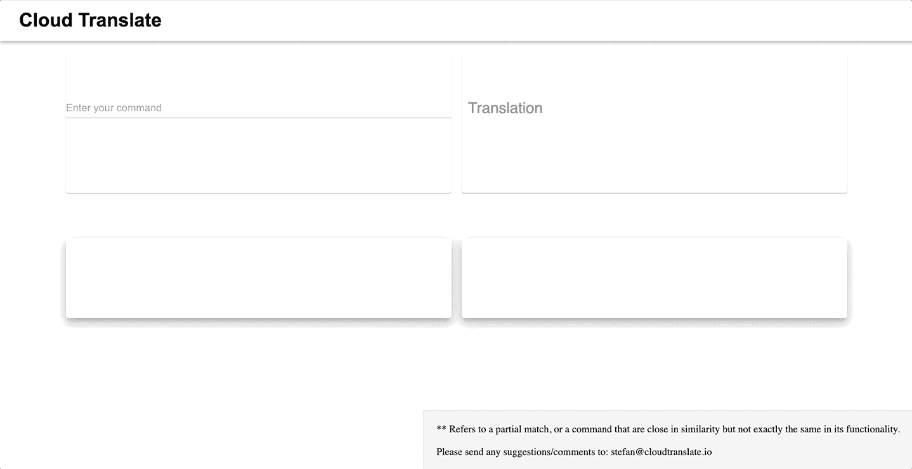

# 适用于您的云命令的翻译应用

> 原文：<https://medium.com/analytics-vidhya/a-translation-app-for-your-cloud-commands-4da3f79ee617?source=collection_archive---------18----------------------->

如今，开发人员和数据分析师通常是多云用户，在两个或更多云提供商之间切换日常任务。亚马逊网络服务(AWS)长期以来一直是行业领导者，控制着市场的很大一部分，但最近出现了向其他提供商的转变，同时也利用了几种不同的 T2 解决方案。

作为谷歌云平台(GCP)和 AWS 的用户，我决定组装一个[应用](https://cloudtranslate.io/)，它*在两个提供商的 CLI 命令之间翻译*。我经常发现自己在研究 AWS 的 GCP 命令等价物(反之亦然)，并认为在电子表格中记录这些会更容易。而现在，这已经变成了一个 [app](https://cloudtranslate.io/) 。

就像你在不同的自然语言之间翻译句子一样(法语→德语)，这个应用程序可以在 AWS 和 GCP CLI 命令之间进行类似的比较(即 gcloud 配置列表→ aws 配置列表)。

应用程序的用户界面

该应用内置于 React JS 和 Material UI 中，外观模仿谷歌自己的[翻译](https://translate.google.com/)页面。

使用应用程序翻译命令(GCP ← → AWS)

我希望这个应用程序为用户在两个云提供商之间切换提供指导，如果你有建议，请告诉我。有一个很长的 CLI 命令列表可用，我还没有得到所有的；到目前为止，添加的大多数都与云配置、计算(EC2/计算引擎)、存储(S3/GCS)、托管 Hadoop (EMR/DataProc)和网络有关。如果你想在网站上看到一个重要的命令，请随时给我发信息。下一步:添加 Azure 功能！

在以下项目的帮助下建成:

 [## Andre Gouyet -客户经理- Mapbox | LinkedIn

### 兴趣:*宣传我相信的技术*探索正念的效果*铁人三项和旅行…

www.linkedin.com](https://www.linkedin.com/in/andregouyet/)  [## Alexander Gou yet-GRAPE Ag | LinkedIn

### 在世界上最大的职业社区 LinkedIn 上查看亚历山大·古耶的个人资料。亚历山大有 8 份工作列在…

www.linkedin.com](https://www.linkedin.com/in/alexander-gouyet-15772093/) 

— —

这篇帖子于 2020 年 9 月 14 日转载于我的个人[博客](https://www.dataarchitecting.com/post/a-translation-app-for-your-cloud-commands)。