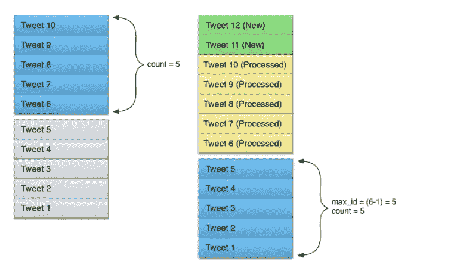

# 通过 Tweepy 获取 Twitter 数据的藏宝图

> 原文：<https://medium.com/analytics-vidhya/a-treasure-map-to-twitter-data-via-tweepy-b7e3d624d88d?source=collection_archive---------1----------------------->


安妮·斯普拉特在 [Unsplash](https://unsplash.com/s/photos/map?utm_source=unsplash&utm_medium=referral&utm_content=creditCopyText) 上的照片

你好。对于任何想要开发伟大的东西、进行数据分析、测试 SOTA 深度学习模型或学习数据科学的人来说，Twitter 数据都是一个真正的美味来源。出于上述原因，我使用 Twitter API 已经有一段时间了。在本文中，我想为那些想从 Twitter 数据入手的人提供一个全面的指南。你可能会喜欢这篇文章，即使你已经进入 twitter API，因为我也将谈论最近的政策申请 twitter 开发帐户等。

这篇文章向读者展示了这些:

1.  *在 Twitter 上创建一个开发者账户。*
2.  识别现实生活中的问题，并找到解决问题的 twitter 数据方法。
3.  *抓住流背后的逻辑，收集过往数据。*
4.  *使用代码样本从用户时间线获取数据。*

# 寻找动机

我们每天都在使用 twitter，作为技术人员，我们无法避免自己思考“如果我接触到它的最微小的一部分，会发生什么”，这里的动机是分析日常生活中的一些东西，并将你的技术技能应用到现实生活中的问题。所以让我们激励自己去解决一个问题。本文将解释的问题是，为了分析新闻标题中的名人，纽约时报将获取所有推文。当然，你可能会想出一个更有趣的问题，并产生更好的动机去解决它。


迈克尔·泽兹奇在 [Unsplash](https://unsplash.com/s/photos/treasure-hunt?utm_source=unsplash&utm_medium=referral&utm_content=creditCopyText) 上拍摄的照片

# **创建 Twitter API 开发帐户**

Twitter 提供了几个 API。它们中的每一个都是为特定的用例而构建的。简而言之， [standard](https://developer.twitter.com/en/docs/tweets/search/api-reference/get-search-tweets) API 是免费的，对于新手、想要测试 Twitter 的数据爱好者等来说很好。高级 API 更进了一步，它是为希望进行更多试验的人而设计的，高级 API 得到了进一步增强，提供了达到 30 天数据/完整归档数据的选项。高级 API 的细节可以在[这里](https://developer.twitter.com/en/docs/tweets/search/api-reference/premium-search)找到。面向企业和机构的通用企业和广告 API 高度依赖 Twitter 数据。作为开发人员，您的访问将介于标准 API 和高级 API 之间。

设置开发者账户的方法。

1.  使用您的 Twitter 帐户登录。您的帐户必须拥有有效的电话号码。
2.  去 Twitter 的开发者应用[页面](https://developer.twitter.com/en/apply-for-access)。
3.  点击**申请开发者账号**部分。
4.  在下一页选择你的主要原因。Twitter 想知道你获取其数据的野心。在这里要公开和具体。在下一部分，twitter 将会询问更多关于您的意图。对于我们这里的有趣任务，我选择了**爱好者**部分，假设我们将制作一个机器人并探索 twitter API。
5.  在下一页，您将看到您帐户的摘要，Twitter 只是想确认您是一个真实的人，如果您还没有提供这些具体细节，它可能会问一些问题，如电话号码、国家等。
6.  下一页是**预期用途**页。你可能会认为这个阶段是签证申请阶段(土耳其国民可以理解)，你需要让当局相信你是一个负责任和正派的人，你获得开发者权限的目的不会违反 Twitter 条款。在第一个文本框中，解释“你计划如何使用 Twitter 数据或 API ”,在这里尽量明确。你可以告诉他们，你将对某个特定的主题进行特定的分析，为此，你需要访问搜索 API，但数据应该是最近 1 年的，以便计算这个主题的受欢迎程度。请注意，这只是一个虚构，不要抄袭，把你自己的话放进去。
7.  在下一个文本框中，他们要求你描述如何分析 Twitter 数据(如果这是你的计划)，再次尝试具体和开放。你可以告诉他们，对于特定的政治主题，你将使用搜索 API，根据推文，你将按小时/天的细分报告推文中确切单词的用法，以查看这些是否与特定的政治事件、演讲、组织等相关。例如，对于单词“**气候变化**”，您可能想分析这个词在 Greta 在欧洲议会的演讲之后的流行程度。或者这个术语可以是“**你怎么敢**”。

8.在下一个文本框中，他们会询问您的 API 范围的用法。写下适当的选项，例如“是的，我将只使用 Tweet 功能”。

9.一些个人或组织可能会在其网站上显示其官方账户的推文。如果您计划在您的网站中添加这样的功能，您应该在“**您是否计划在 twitter** 之外显示或聚集关于 Twitter 内容的数据”部分详细说明 Twitter 数据的使用。

10.在下一部分，您将被询问是否与政府机构分享您的分析或任何基于 Twitter 数据获得的成就。用开放的心态回答这个问题。

11.在下一步的申请中，你将审查你的申请并期望阅读和接受使用条款。然后你可以发送你的申请。

如果你的回答很清楚，足以让人觉得你确实知道该如何处理 Twitter 数据，或者至少你愿意学习，Twitter 通常会在一天内批准开发者账户。如果你遵循了这篇文章中的提示，我想不出有什么理由你不会被批准。

获得批准后，您将收到一封电子邮件通知，您将能够创建一个应用程序。你将被期望为你通过 Twitter 执行的每个特定分析和任务创建一个应用程序。该应用程序将有访问令牌，您将使用它们在 Twitter API 中进行身份验证。在应用程序创建过程中，您将被询问使用意图，因此我建议您将答案复制到申请表中，这样您就不必再一次解释自己了。


照片由 [Hosein Amiri](https://unsplash.com/@hoseinamiri?utm_source=unsplash&utm_medium=referral&utm_content=creditCopyText) 在 [Unsplash](https://unsplash.com/s/photos/mountaion?utm_source=unsplash&utm_medium=referral&utm_content=creditCopyText) 上拍摄

# **流式传输和收集过去数据背后的逻辑**

我试图给你一点点使用 Twitter 数据可以实现的东西，然而，这篇文章只提到了其中的一部分。如果你觉得你可以用更多的想象力来激励自己，我强烈推荐你访问 [Twitter 文档](https://developer.twitter.com/en.html#/)了解使用案例。API 中定义了许多实用程序，您可以关注或搜索用户以及包括特定单词或短语的推文，获取关于用户的信息，如他们的关注者，管理帐户，屏蔽或阻止用户，您可以管理推文集合，从用户时间线获取推文，等等。你可以从[这里](https://developer.twitter.com/en/docs/api-reference-index)查看 Twitter API 的所有功能。实际上，我建议你在等待 API 批准的时候逛逛。

无论你希望从 Twitter 数据中获得什么，当处理大量推文时，你有两种选择:要么选择推文的时间线——这意味着你可能需要一些过去的推文，如上面 Greta 演讲的例子，要么你可以实时测量某个品牌的公众影响力，如[用例](https://developer.twitter.com/en/use-cases/analyze)中提到的情绪分析。

流媒体比搜索过去的推文更容易一些，当然，取决于你的 API，会有一些限制。例如，在使用标准 API 搜索实时推文时，你可能会丢失一些数据。要传输 twitter 数据，你只需连接一个流媒体端点，你可以把整个过程想象成从一个几乎不关的窗口持续下载。当然，有时流式 API 不得不停止响应，这可能是一个错误的功能或超出了速率限制。更多详情可以访问[这里](https://developer.twitter.com/en/docs/tweets/filter-realtime/guides/connecting)。

另一方面，收集过去的数据需要您进行历史功率跟踪或全面的档案搜索。由于 power track 和 archive search 是在 Enterprise API 中提供的，我将把这个[链接](https://developer.twitter.com/en/docs/tweets/batch-historical/overview)留给以后阅读。因为在我们的文章中，我们将采用最便宜的方式:从用户时间线获取历史推文。


布伦特·德·兰特在 [Unsplash](https://unsplash.com/s/photos/building?utm_source=unsplash&utm_medium=referral&utm_content=creditCopyText) 上拍摄的照片

# 从用户时间线获取推文

所以最后在这里谈谈这篇文章的主要吸引力。回到我们最初的问题“ ***”根据名人在《纽约时报》上的文章*** 来估计他们的受欢迎程度让我们想象一下，我们将获取纽约时报官方 twitter 的时间线推文，为了这样做，我们显然需要的是屏幕名称(帐户如何出现在 twitter 中)或帐户的 twitter id，以及获取属于该特定用户的推文的方法。让我们来一场关于方法论的头脑风暴，我们都认为我们需要一些分页来获取 tweets，但是怎么做呢？考虑到 Twitter 的流性质，页面上总是有新成员。应该怎么执行呢？此外，请注意 Twitter 的页面结构就像一个堆栈，新推文放在顶部，旧推文放在底部，即[后进先出](https://stackoverflow.com/questions/10974922/what-is-the-basic-difference-between-stack-and-queue)。因此，获取推文，无论如何，都是从上到下的阅读。下面是从[官方推特文档](https://developer.twitter.com/en/docs/tweets/timelines/guides/working-with-timelines)中截取的一张图片，描绘了整个过程。


摘自 Twitter API [文档](https://developer.twitter.com/en/docs/tweets/timelines/guides/working-with-timelines)

所以每次，我们从用户时间线中获取我们不应该超过的特定推文。这是因为上面的 tweets 是在我们开始处理之后添加到堆栈中的，我们的处理是向下而不是向上的。在整个小节中，我还将解释如何在上面的行中获取这些 tweets。现在，让我们简单地想一想，我们的工作只是能够从用户时间表中获取数据。一种古老的实现方法是创建一个无限的 while 循环，只有当底部没有成员或者窗口大小达到极限时，这个循环才会退出。这里的窗口大小是一个用户有 3200 条推文，即使我们将 *include_rts* 设置为 *False* ，转发也会被计算在内。欲了解更多关于限制和使用等的信息，请访问[这里](https://developer.twitter.com/en/docs/tweets/timelines/api-reference/get-statuses-user_timeline)。

窗口中的数据可以批量检索，此方法的最大批量为 200。因此，这个想法是从上到下获取推文，在一次呼叫中最多获取 200 条推文，并完成整个过程，直到您达到 3200 条推文(窗口大小)。请注意，如果您将 include_rts 参数设置为 False，那么在该过程结束时，您的 tweets 可能会少于 3200 条，但是 API 无论如何都会将您丢弃。此外，在每个批次中，您必须保留 minimum_id，因为在下一次运行中，上一批次中显示的 min_id 将是下一批次的最大 id。这里:



描绘窗口和批次，摘自 twitter 官方 [doc](https://developer.twitter.com/en/docs/tweets/timelines/guides/working-with-timelines)

因此，如果上面的解释是清楚的，我们可以拿出我们的方法的伪代码，如:

```
tweet_ids_arr = list
flag keep_going=True
min_id_of_previous_batch = dummy_big_int

while keep_going:
    tweets = fetch_user_time_line(max_id=min_id_of_previous_batch, 
                                  batch_size=20)

    tweet_ids_arr.extend([tweet.id for tweet in tweets])
    min_id_of_previous_batch = min(tweet_ids_arr)
    if len(tweets) == 0:
         keep_going = False
```

当然，必须有一些额外的东西，如异常处理和设置计时器，以避免速率限制错误。我们很快就会到达那里。现在是时候讨论如何获取上面几行的推文了。

假设您在 2 月 14 日获取了推文，队列中的最大日期是 2 月 14 日，因此您需要获取比 2 月 14 日更新的推文，但您也必须在每次向 Twitter API 发送请求时自动完成。因此，我们需要用 ***增强 max_id 的用法，因为 _id*** 让我们用下面的伪代码来描述逻辑:

```
tweet_ids_arr = list
flag keep_going=True
min_id_of_previous_batch = dummy_big_int
# The max id in stored tweets from a previosly fetch-save
max_id_in_db = max_id_in_stored_tweets
while keep_going:
    tweets = fetch_user_time_line(max_id=min_id_of_previous_batch, 
                                  since_id= max_id_in_db
                                  batch_size=20)

    tweet_ids_arr.extend([tweet.id for tweet in tweets])
    min_id_of_previous_batch = min(tweet_ids_arr)
    if len(tweets) == 0:
         keep_going = False
```

下面的图片来自官方 Twitter 文档[希望能描绘出同时使用 since_ids 和 max_ids 的原因。](https://developer.twitter.com/en/docs/tweets/timelines/guides/working-with-timelines)


摘自 Twitter API [文档](https://developer.twitter.com/en/docs/tweets/timelines/guides/working-with-timelines)

在上面的例子中，您已经处理了从 1 到 10 的 tweet，当您处理这些新的 tweet 时，它们被添加到 11 到 18 的堆栈中，所以最佳实践是将 id_of_tweet_10 作为自 id，将 id_of_tweet_18 作为 max_id。


本·怀特在 [Unsplash](https://unsplash.com/s/photos/bookmark?utm_source=unsplash&utm_medium=referral&utm_content=creditCopyText) 上的照片

## 拥抱光标实用程序

尽管为了清晰起见，我解释了所有基于显式参数和无限 while 循环的获取用户时间轴过程，但实际上有一种更强大的编程方式来实现这一点，那就是 ***光标*** 。由于 tweepy 游标，现在您不必编写样板代码来管理循环分页并在每个批处理中发送 ***max_id*** 和 ***since_id*** 参数，分页将由游标执行。更多详情，请访问[此处](http://docs.tweepy.org/en/v3.5.0/cursor_tutorial.html)。

光标是这样工作的:

```
import tweepy*timeline_ids = list
for* status *in* tweepy.Cursor(api.user_timeline, *user_id*=*user_id*, *since_id*=max_id_in_town).items():
    timeline_ids.append(status.id)
```

看，光标方式更简单，代码行更短。

## 说话代码


照片由[戈兰·艾沃斯](https://unsplash.com/@goran_ivos?utm_source=unsplash&utm_medium=referral&utm_content=creditCopyText)在 [Unsplash](https://unsplash.com/s/photos/code?utm_source=unsplash&utm_medium=referral&utm_content=creditCopyText) 拍摄

1.  **API 认证和启用访问令牌**

每次在 Twitter dev 账号上创建一个 APP，都会给你一个用户访问令牌，比如 *consumer_key* 、 *consumer_secret_key* 、 *access_token* 和 *access_token_secret* 。这将确保您安全地访问 Twitter API。要获取您的凭证，请在 Twitter 开发者[仪表盘](https://developer.twitter.com/)中查看您的应用详情。点击你的应用名称，切换到 ***密钥和令牌*** 标签。您将在身份验证过程中使用这些凭据，如下所示:

```
import tweepy*# Authenticate twitter* auth = tweepy.OAuthHandler(consumer_key, consumer_secret)
auth.set_access_token(access_token, access_token_secret)
api = tweepy.API(auth)
```

但是由于我们不能将访问直接放入代码中，我建议创建一个 *credentials.json* 并创建一个保存它们的字典。这里:

```
{
  "consumer_key":  "#",
  "consumer_secret": "#",
  "access_token": "#-#",
  "access_token_secret": "#"
}
```

创建凭据文件后，您可以加载它并在代码中使用它们，而无需公开它们:

```
import json*# Define path to the credentials* path_to_credentials = os.path.join(os.getcwd(), "credentials.json") *# Load the credentials 
with open*(path_to_credentials) *as* file:
    credentials = json.load(file)
```

现在，验证并返回 API 对象

```
*import tweepy**# Authenticate with Tweepy* auth = tweepy.OAuthHandler(
    credentials["consumer_key"], credentials["consumer_secret"])
auth.set_access_token(
    credentials["access_token"], credentials["access_token_secret"])
api = tweepy.API(auth)
```

2.**使用 Twitter 用户名**获取用户 id

为了从用户时间线中获取 tweets，我们需要定义用户 id，虽然您可以使用 screen_name 作为标识符，但使用 twitter_id 会更明确。更多详情请参考 [tweepy 文档](http://docs.tweepy.org/en/v3.5.0/api.html)。

```
*# Fetch twitter user id of an account you know the screen name* user_name = "nytimes"
user_object = api.get_user(*id*=user_name)*print*("User screen name is: ", user_object.screen_name)
*print*("Users id in twitter db is: ", user_object.id)
*print*("Users info shown on twitter is: ", user_object.name)
*print*("User was created at: ", user_object.created_at)

user_id = user_object.id
```

3.**用光标获取时间线 id**

非商业的 Twitter APIs 允许被请求 15 分钟，在接下来的 15 分钟里，它希望你表现出一些风度，活出自我。我对礼貌部分很感兴趣，但 15 分钟部分仍然有效。所以我添加了一些行作为秒表，并添加了一些行让我的代码休眠 15 分钟。下面你还会看到一些 try-except 块，以防万一，当出现速率限制超出错误时，避免进程退出。你可以详述/改变整个过程。

```
*import* time 
*from* datetime *import* datetime*# Fetch tweet ids from a timeline 
# Use these block if this is there is no saved tweets from 
# this account or you dont plan to use since_id functionality* *import* time 
*from* datetime *import* datetime

counter = 0
timeline_ids = *list*()
start_time = datetime.now()

*try*:
    *for* status *in* tweepy.Cursor(api.user_timeline, *user_id*=user_id).items():
        *# process status here* timeline_ids.append(status.id)
        end_time = datetime.now()
        *if* np.ceil((end_time - start_time).seconds / 60) >= 12:
            *print*("Worked for 12 minutes, waiting for 15 minutes now")
            *print*(datetime.now())
            time.sleep(60 * 15)
            start_time = datetime.now()
            end_time = datetime.now()

        counter += 1
*except* tweepy.RateLimitError *as* e:
    *print*("Rate limit error exceed waiting for 15 secs")
    *print*(datetime.now())
    *print*("You may want to save the timeline ids over there, to not to lose them during execution")
    time.sleep(60 * 15)
    start_time = datetime.now()
    end_time = datetime.now()

*print*("You may want to save the timeline ids over there, to not to lose them during execution")
```

如果您有上一次运行的 id，并且可以利用 since_id，请使用此块。

```
*import* time 
*from* datetime *import* datetime

*# Get the max_id that already  resides in db* max_id_in_town = some_max_id
counter = 0
timeline_ids = *list*()
start_time = datetime.now()*try*:
    *for* status *in* tweepy.Cursor(api.user_timeline, *user_id*=user_id, *since_id*=max_id_in_town).items():
        *# process status here* timeline_ids.append(status.id)
        end_time = datetime.now()
        *if* np.ceil((end_time - start_time).seconds / 60) >= 12:
            *print*("Worked for 12 mins, waiting for 15 mins now")
            *print*(datetime.now())
            *print*("You may want to save the timeline ids over there, to not to lose them during execution")
            time.sleep(60 * 15)
            start_time = datetime.now()
            end_time = datetime.now()

        counter += 1
*except* tweepy.RateLimitError *as* e:
    *print*("Rate limit error exceed waiting for 15 secs")
    *print*(datetime.now())
    *print*("You may want to save the timeline ids over there, to not to lose them during execution")
    time.sleep(60 * 15)
    start_time = datetime.now()
    end_time = datetime.now()
*print*("You may want to save the timeline ids over there, to not to lose them during execution")
```

**4。获取与 id 相关的推文**

现在，我们有了所有的 tweet ids，所以我们终于可以获取扩展的雕像了。这里:

```
*# Set looping params* start_time = datetime.now()
raw_tweets = *list*()

*for* id_ *in* timeline_ids:
    *try*:
        res = api.get_status(*id*=id_, *tweet_mode*="extended")
        raw_tweets.append({"accident_id": id_,
                           "created_at": res.created_at,
                           "text": res.full_text})
        end_time = datetime.now()

        *if* np.ceil((end_time - start_time).seconds / 60) >= 12:
            *print*("Worked for 12 mins, waiting for 15 mins now")
            *print*(datetime.now())
            *print*("Save tweets somewhere")
            time.sleep(60 * 15)
            start_time = datetime.now()
            end_time = datetime.now()
        *del* res

    *except* tweepy.RateLimitError *as* e:
        *print*("Rate limit error exceed waiting for 15 secs")
        *print*(datetime.now())
        *print*("Save tweets somewhere")

        time.sleep(60 * 15)
        start_time = datetime.now()
        end_time = datetime.now()
*print*("Save tweets somewhere")
```

本文到此结束，如有建议请评论。如果你想了解更多关于如何存储和分析这些推文的信息，请告诉我。