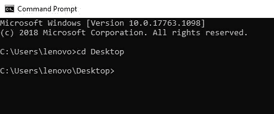

# NPM 之旅

> 原文：<https://medium.com/analytics-vidhya/a-trip-around-node-package-manager-3574710deb31?source=collection_archive---------28----------------------->


-个人资料图片-

女士们，先生们，请就座，让我们开始环游 NPM 世界的旅程。但是首先，我们要具体去哪里？

嗯，这次旅行包括三个主要的地方。哎呀，我是说 3 个话题；) :

1.  什么是 NPM，为什么要使用它？
2.  **如何安装 NPM？**
3.  **一些基本的命令。**

好的...我们走吧

# **1。什么是 NPM，为什么要使用它？**

NPM 是节点包管理器的缩写。这是一种处理项目软件需求的方式，例如，更新、共享、安装和删除包或库，甚至是能够控制其版本的框架。Npm 是每个开发人员都应该使用的重要工具，有几个原因，通过使用它，您可以避免一个费力的过程，例如，不用搜索和安装您的项目需要的东西，只需使用命令“npm install PackageName”，简单吗？它节省时间和精力，并为您提供额外的功能，如管理版本。

# 2.**如何安装 NPM？**

首先，在 Windows 中:

一、从 node 官网安装 node.js。

二。一旦你安装并设置它，打开终端，然后输入“node -v ”,之后，它将显示你已经安装的节点版本。*看图-1-。*


*图-1-*

三。在命令行中写下“npm -v”。*看图-2-*


*图-2-*

祝贺您，您已经成功安装了 npm。

> 注意:一旦安装了 node.js，npm 就会自动安装。

# **3。一些基本命令**

这里我将展示 NPM 附带的有用命令，

**a .【NPM 帮】*看图-3-*-**


*图-3-*

在这里你会发现一堆东西会告诉你它是如何工作的，所以你写“npm help <commandname>”然后它会在你的浏览器上显示更多关于它的信息，或者写“npm <commandname>-h”然后它会在命令行中显示更多信息。</commandname></commandname>

**b .“NPM 初始化”**

*init 是“初始化”一词的缩写。因此，要初始化一个项目，你需要一个地方。那个地方叫做“目录”。所以，让我们简单地回顾一下你要做的事情。*

***转到您的工作区>在其中创建一个目录>转到您创建的新目录>使用初始化命令***

首先，使用“光盘桌面”进入您的桌面。这意味着无论何时你都要把你的目录改成桌面。请看图-4-



*图-4-*

*其次，使用“mkdir directoryName”创建一个目录，然后使用“cd directoryName”进入该目录。请看图-5-*


*图-5-*

> **注意:“mkdir”是“制作目录”的缩写。**

第三，使用命令“npm init ”,然后它会问你一些问题，尝试回答这些问题，然后会创建 package.json 文件。*看图-6-*


*图-6—*

恭喜，你做到了:)

> **注:**
> *1。如果您想避免这些问题，请使用“npm init -y”。
> 2。完成这些步骤后，您可以在桌面上看到您创建的目录。打开它，看看里面。*

**c. npm 安装&NPM 卸载**

按照我在注释 2 中说的那样打开目录，但是在代码编辑器中打开代码。在这里，我打开我们用 Visual studio 代码创建的项目，然后在其中打开终端。*看图-7-*

```
*Help Note: open the VS terminal by clicking “ Ctrl + `“*
```


*图-7-*

但是在我们继续之前，让我们来谈谈 package.json. Package.json 是一个 **JSON 文本文件**，它描述了一系列重要的事情，如图 7 所示。例如，关于项目的特定元数据，如名称、版本和作者姓名，也包含依赖项、devDependencies 和脚本。

简单地说，package.json 就像您的项目需要的成分列表。然而，package-lock.json 包含了越来越多关于这些成分的细节，这就是它看起来更长的原因。

> ***注意****:*依赖关系“会在你安装了生产阶段的项目需求后看到，例如 redux。另一方面,“devDependencus”也会在你安装后出现，但不同的是它是在开发阶段。

让我们使用“npm install redux”安装 redux 库，然后它将显示减少的依赖项。*看图-8-*


*看图-8-*

在同一个示例中，让我们使用“npm uninstall redux”卸载 redux。*看图-9-*


*图-9-*

让我们尝试安装 devDependencies，例如，使用“npm install mocha - -save-dev”安装 mocha。*看图-10-*


*图-10-*

简单地说，如果您需要卸载它，请使用我们在上面使用的相同命令来卸载它。

***重要提示:*** *我们使用的所有命令都处于本地状态，这是什么意思？这意味着我们在项目中安装了一个特定的东西。同样，这意味着你可以“在你电脑的根目录下”全局安装你需要的东西，只需要在我们使用的每个命令后面加上****"-g "****。*

就这样，我们结束了。感谢阅读，我希望它是有用的。如果你有任何问题，请毫不犹豫地问我。

**我推荐阅读这些链接，这对每个初学者真的很有帮助:**

1.  [https://docs.npmjs.com/](https://docs.npmjs.com/)

官方文件展示了许多真正有用的观点，选择你想从中阅读的内容，或者简单地使用谷歌搜索**“你想在 npm 文件中使用的术语”**。

[](https://nodesource.com/blog/an-absolute-beginners-guide-to-using-npm/) [## 2.使用 npm 的绝对初学者指南

### 有效地使用 npm 是现代 web 开发的一个基石，不管它是否只与 Node.js 一起使用，作为一个…

nodesource.com](https://nodesource.com/blog/an-absolute-beginners-guide-to-using-npm/)