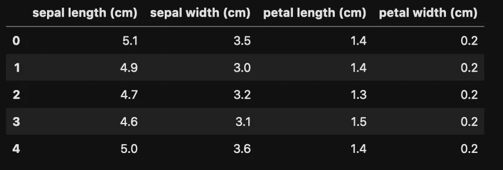
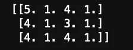
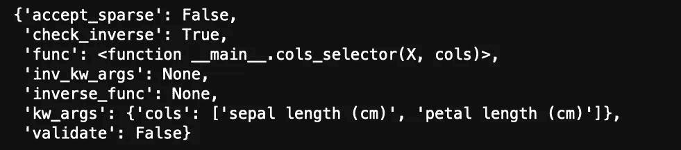
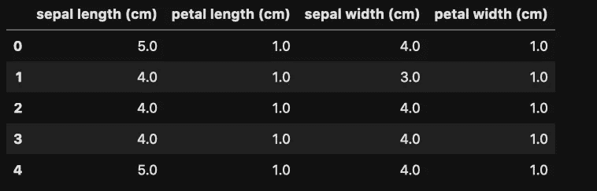

# 这是一个非常简短的介绍，介绍如何在功能联合中处理管道中的特定列

> 原文：<https://medium.com/analytics-vidhya/a-very-short-intro-to-treating-specific-columns-in-a-pipeline-in-a-feature-union-ffd33178ffec?source=collection_archive---------30----------------------->


维克多·加西亚在 [Unsplash](https://unsplash.com/s/photos/pipeline?utm_source=unsplash&utm_medium=referral&utm_content=creditCopyText) 上拍摄的照片

一个数据帧包含许多列。不同的列需要不同的预处理。管道、特征接头有助于形成一口井..管道，以便对训练和测试数据应用相同的转换。

因此，让我们来学习如何在特性联合中预处理管道中的特定列！！！

我们将使用虹膜数据集。所以让我们开始吧！！！

先是一些进口货…

```
import pandas as pd
import numpy as np
from sklearn.datasets import load_iris
from sklearn.pipeline import Pipeline, FeatureUnionfrom sklearn.preprocessing import FunctionTransformer
from sklearn.base import BaseEstimator, TransformerMixin
```

为什么这些进口？

1.  load_iris 将为我们提供虹膜数据集
2.  管线和特征联合，用于创建管线和特征联合
3.  函数变形金刚给我们的自定义函数变形金刚的力量！
4.  基础评估和变压器混合创建我们自己的复杂变压器。

让我们简短地看一下我们的数据

```
data = load_iris()
df = pd.DataFrame(data[“data”],columns=data.feature_names)
df.head()
```



我们的数据由鸢尾属植物的萼片和花瓣的尺寸组成。

让我们做一个假设的场景，其中我们想要确定长度(萼片长度，花瓣长度)和宽度(萼片宽度，花瓣宽度)。

```
class LenFloor(BaseEstimator,TransformerMixin):
    def __init__(self):
        pass

    def fit(self,X):
        return self

    def transform(self,X):
        X = np.floor(X)
        return X

class WidthCeil(BaseEstimator,TransformerMixin):
    def __init__(self):
        pass

    def fit(self,X):
        return self

    def transform(self,X):
        X = np.ceil(X)     
        return X
```

怎么回事！

1.  LenFloor 和 WidthCeil 类可以充当转换器和估计器。
2.  __init__ 函数在初始化时被调用。
3.  调用拟合函数来拟合数据。在这种情况下，因为我们只想将它们用作转换器，所以 fit 不会从传递的数据中获得任何东西。
4.  transform 函数将对 LenFloor 和 WidthCeil 中的数据帧值分别进行 floor 和 ceil 处理。
5.  继承 TransformerMixin 自动为我们提供了函数 fit_transform，它首先调用 fit()，然后调用 transform()

现在，我们想给一些柱子铺地板，给一些柱子装天花板。因此，我们需要一种方法来选择指定的列，并只从我们传递的数据帧中返回它们。是时候调用函数转换器了！

```
def cols_selector(X,cols):
    return X[cols]
```

该函数接受两个参数:

*   x:数据帧
*   cols:要选择的列名列表

让我们制作管道来预处理长度。

```
len_pipe = Pipeline([
    ("col_selector",FunctionTransformer(cols_selector,kw_args={"cols":["sepal length (cm)","petal length (cm)"]})),
    ("subtractor",LenFloor())
])
```

管道是一系列命名的步骤。每一步都有一个名称和一个转换器/估算器。一个步骤的输出是下一个步骤的输入。细节

> 名为 col_selector 的步骤是一个函数转换器，它将把数据帧传递给我们的函数 cols_selector
> 
> 列的列表，即萼片长度(cm)和花瓣长度(cm)被指定为关键字参数。具有以下格式:

```
kw_args = {key word argument name: value to be passed
```

> 我们的函数转换器将选择传递的列并返回它们，这些列将被馈送给 LenFloor()

LenFloor 的 fit_transform 将被调用(fit()然后 transform())，我们将得到已被 Floor 化的长度。

天花板宽度也是如此:

```
width_pipe = Pipeline([
    ("col_selector",FunctionTransformer(cols_selector,kw_args={"cols":["sepal width (cm)","petal width (cm)"]})),
    ("square",WidthCeil())
])
```

现在我们有了自己的管道，是时候并行执行它们并连接各个管道的结果了。输入 FeatureUnion！

```
fu = FeatureUnion([
    ("len",len_pipe),
    ("width",width_pipe)
])
```

这个特征联合又是一系列命名的步骤。每个步骤的输出将被连接起来以产生最终输出。

```
a=fu.fit_transform(df)
print(a[:3,:])
```

在我们的特征联合上调用 fit_transform 将在我们的每个管道上调用 fit_transform，这将在那些管道中的步骤上调用 fit_transform。



输出

如你所见，工作已经完成了！但是很难验证，因为我们已经丢失了列名。在一小段代码的帮助下，我们可以取回我们的列名。

```
cols = []
for i in range(len(fu.transformer_list)):
    cols.extend(fu.transformer_list[i][1].named_steps["col_selector"].get_params()["kw_args"]["cols"])
```

基本上，

*   fu.transformer_list 返回管道列表
*   fu.transformer_list[i]是第 I 个命名的步骤。
*   fu.transformer_list[i][1]是第 I 个命名步骤中的管道。
*   fu.transformer_list[i][1]。named_steps["col_selector"]是我们的特征联合中所选管道中的步骤，该特征联合是函数转换器
*   fu.transformer_list[i][1]。命名步骤["列选择器"]。get_params()返回其参数的字典



函数转换器的参数

*   fu.transformer_list[i][1]。命名步骤["列选择器"]。get_params()["cols"]返回键 *kw_args* 的值

我们转换后的数据框架…

```
pd.DataFrame(a,columns=cols).head()
```



你可以看到长度已被地板覆盖，宽度已被天花板覆盖。

任务完成！