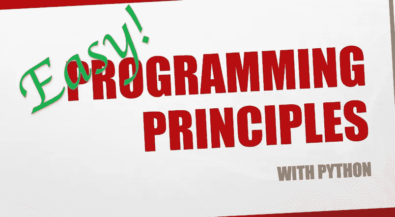

# Python 编程入门，第 4 课

> 原文：<https://medium.com/analytics-vidhya/a-very-slow-introduction-to-programming-with-python-lesson-4-3c6a5f16a238?source=collection_archive---------32----------------------->

循环、列表和条件



从第二课，我们已经知道什么是列表。让我们再看一看。

```
devices = ["Monitor", "Keyboard", "Mouse", "Hard Disk Drive"]
print("Here are my devices:")
print("I have a", devices[0])
print("I have a", devices[1])
print("I have a", devices[2])
print("I have a", devices[3])
```