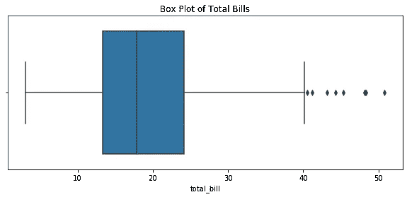
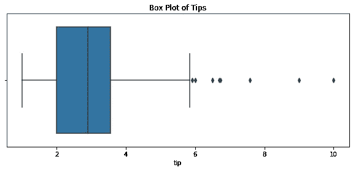
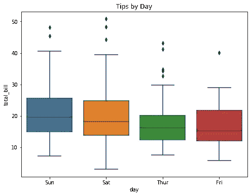
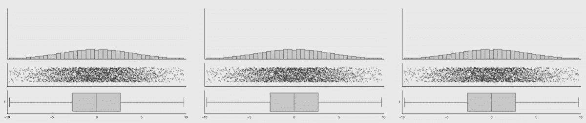
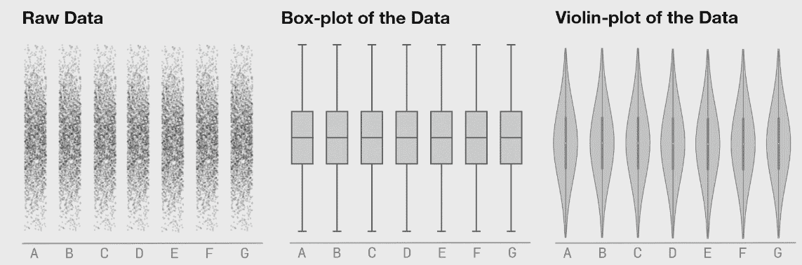
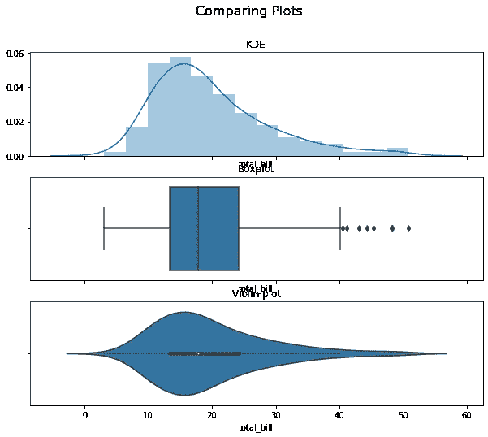
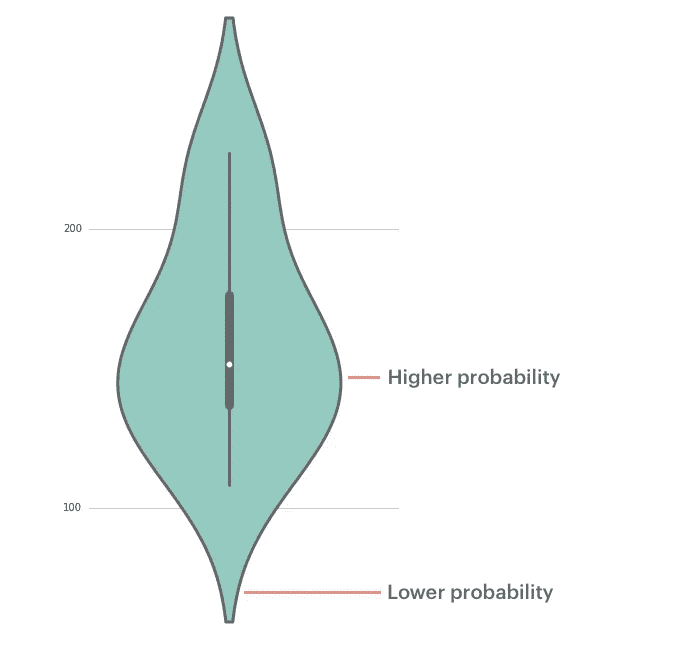
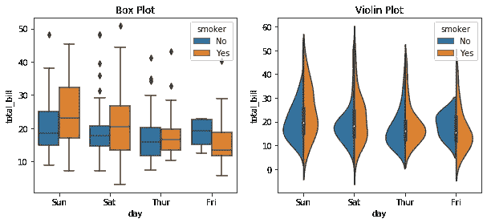

# 一把小提琴比一个盒子讲述更多的故事

> 原文：<https://medium.com/analytics-vidhya/a-violin-is-better-f7068129a14?source=collection_archive---------20----------------------->


照片由[丹金](https://unsplash.com/@danielcgold?utm_source=medium&utm_medium=referral)在 [Unsplash](https://unsplash.com?utm_source=medium&utm_medium=referral) 上拍摄

**在某些时候，大多数数据科学家都使用过或熟悉箱形图。这是一个简单的图表，直观地突出了数据清理和 EDA 的异常值。然而；有时，您可能想要一个信息量更大的图表，而又不牺牲箱线图的简单性。**

别担心，有个解决办法。

# 首先我们来谈谈盒图及其局限性。

箱型剧情插画在一定程度上是很棒的。如前所述，如果您想要快速查看异常值的数量，那么盒状图很容易实现。

在本文中，我将使用来自 Kaggle.com 的 [Tips 数据集](https://www.kaggle.com/jsphyg/tipping?select=tips.csv)。

以下是一些箱线图:

```
df = pd.read_csv("tips.csv")data = df["total_bill"]
data1 = df["tip"]fig, ax = plt.subplots(figsize = (10,4))
ax.set_title('Box Plot of Total Bills')
sns.boxplot(data);fig, ax = plt.subplots(figsize = (10,4))
ax.set_title('Box Plot of Tips')
sns.boxplot(data1);
```



图 1



图 2

```
fig, ax = plt.subplots(figsize = (8,6))
sns.boxplot(x="day", y="total_bill", data=df)
ax.set_title('Tips by Day');
```



图 3

然而，箱线图并不能说明数据的分布。这类似于安斯科姆的四重奏 视觉辅助演示数字说谎*，*，而在这种情况下，方框图说谎。



[来源](https://www.autodesk.com/research/publications/same-stats-different-graphs)

即使数据在变化，盒图也不会改变，因为从技术上讲，盒子反映了数据的变化，只是我们看不到而已。

## 解决这个问题的方法是用小提琴情节。



[来源](https://www.autodesk.com/research/publications/same-stats-different-graphs)

# 什么是小提琴情节？

小提琴图就像是盒子图和密度图的混合体。它展示了内核密度估计的形状，以捕捉数据的分布，以及来自箱线图的重要视觉描述。



# 如何读懂一个小提琴的剧情？


小提琴剧情的演绎和盒子剧情很像。它使用相同的汇总统计数据来解释图表中发生的情况。然而，主要的区别是将 KDE 纳入箱线图，其解释如下:



[来源](https://mode.com/blog/violin-plot-examples/)

另一个展示小提琴情节力量的例子是:

```
fig, ax = plt.subplots(1,2,figsize = (10,4))
ax[0].set_title("Box Plot")
sns.boxplot(x="day", y="total_bill", hue="smoker",
                    data=df, ax=ax[0]);ax[1].set_title("Violin Plot")
sns.violinplot(x="day", y="total_bill", hue="smoker",
                    data=df, split=True, ax=ax[1]);
```



在上面的例子中，violin plot 允许你分割 violin 和取消图表的混乱。所以，读起来很轻松，不会过度刺激。

我希望到现在为止，我已经让你重新思考盒状图。还是那句话，方框图有一个时间和地点，但是使用它是正确的吗？

Seaborn [文档](https://seaborn.pydata.org/index.html)很神奇，非常容易理解。小提琴图有很多参数可以使用，并且可以提供比我上面提到的更多的信息。